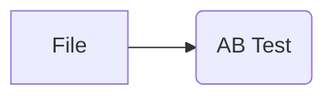

# AB Test Widget

## Overview
The AB Test widget is a tool for statistically analyzing and visualizing the results of A/B tests (or multivariate tests). It helps evaluate the differences in key target variables (KPIs) between different groups (e.g., control group vs. treatment group) and determine if these differences are statistically significant.

## Inputs
*   **Data**:
    *   Required: A dataset in `Orange.data.Table` format.
    *   Specifications:
        *   Must contain at least one **DiscreteVariable**. This will be used as the "Treatment Variable" to define the experimental groups (e.g., "Plan A", "Plan B", "Control").
        *   Must contain **Target Variables** to be analyzed. These must be one of the following types:
            *   **Binary DiscreteVariable (DiscreteVariable with 2 values)**: e.g., converted/not converted (`["no", "yes"]`), clicked/not clicked.
            *   **ContinuousVariable**: e.g., purchase amount, session duration.
    *   Example:
        ```
        | experiment_group | converted (0/1) | revenue |
        |------------------|-----------------|---------|
        | A                | 1               | 15.50   |
        | B                | 0               | 0.00    |
        | Control          | 1               | 12.00   |
        | A                | 0               | 0.00    |
        ...
        ```
        (In the table above, `converted` is a binary discrete variable, `revenue` is a continuous variable, and `experiment_group` is the treatment variable.)

## Outputs
*   **Selected Data**: `Orange.data.Table`
    *   Currently, there is no active data output from this widget. This is reserved for future enhancements.

## Function Description

The AB Test widget interface is primarily divided into a control area (left side) and a main area (right side).


*Figure 1: Overview of the AB Test widget. The settings area is on the left, and analysis results are displayed on the right.*

### 1. Control Area

In the control area, you configure various settings for the A/B test analysis.


*Figure 2: Setting items in the control area.*

*   **Data Settings**
    *   **Treatment Variable**: Select a discrete variable from the dataset that defines the experimental groups (e.g., "which ad was seen", "which UI design").
    *   **Control Group**: Select the value within the "Treatment Variable" that represents the baseline control group.

*   **Target Variables**
    *   Select the target variables you want to analyze from the list (multiple selections possible). Eligible variables are binary discrete variables or continuous variables.
    *   Examples: "Conversion Rate", "Average Purchase Value", "Click-Through Rate".

*   **Statistical Test Settings**
    *   **Test Type**:
        *   **Auto (based on variable type)** (default): Automatically selects the test method based on the target variable type.
            *   Binary discrete variable: Chi-Square test (or Fisher's exact test if expected frequencies are small).
            *   Continuous variable: t-test (Welch's t-test).
        *   **T-Test**: Tests the difference between the means of two groups. Primarily used for continuous variables.
        *   **Chi-Square**: Tests the difference in proportions of categorical data between two groups. Primarily used for binary discrete variables.
        *   **Mann-Whitney U**: A non-parametric test for the difference in central tendency (e.g., median) between two groups. Used for continuous variables when data does not follow a normal distribution.
    *   **Confidence Level**: Select the confidence level for statistical tests' confidence intervals and significance level criteria (90%, 95%, 99%). Default is 95%. This implies an alpha error (Type I error) tolerance of (1 - confidence level).
    *   **Multiple Comparison Correction**: Select a method to control the increase in Type I errors when comparing multiple target variables or multiple treatment groups simultaneously.
        *   Bonferroni (default)
        *   Holm
        *   Benjamini-Hochberg
        *   This correction is applied when there are three or more treatment groups (i.e., total number of groups including the control group is three or more).

*   **Advanced Analysis**
    *   **Uplift Modeling → [TBU]**: Placeholder for future implementation of advanced analysis features like CUPED or uplift modeling.

### 2. Main Area (Analysis Results)

The main area displays the analysis results for each selected target variable from the A/B test.


*Figure 3: Example of analysis results display. Results for target variables `int_rate` and `loan_status` are shown.*

For each target variable, the following information is displayed in a table and a graph:

*   **Title**: Displayed in the format `Target Variable Name (Test Type Used)`. For example, if the target variable `int_rate` is continuous and Test Type is "Auto", it will display `(T-test)`.
*   **Results Table**:
    *   **Group**: Each value of the treatment variable (group name). The control group is indicated with `(Control)`.
    *   **Sample**: The sample size (number of data points) for each group.
    *   **Rate (%) / Average**:
        *   If the target variable is discrete: "Rate (%)" shows the percentage of positive outcomes (e.g., "yes", "true", "1", or other affirmative values determined by internal logic).
        *   If the target variable is continuous: "Average" shows the mean value.
    *   **Lift**: The percentage change in the target variable for a treatment group compared to the control group. Calculated as `((Treatment Group Value - Control Group Value) / abs(Control Group Value)) * 100`. The lift for the control group itself is displayed as `-`.
    *   **p-value**: The p-value from the statistical test comparing the treatment group to the control group. A small p-value suggests that the observed difference is unlikely to be due to chance (i.e., statistically significant). The p-value for the control group itself is displayed as `-`.
    *   **Confidence Interval**: The confidence interval for the **difference** between the treatment group and the control group. For example, a 95% confidence interval means that if the experiment were repeated 100 times, the true difference would fall within this interval in 95 of those repetitions. The confidence interval for the control group itself is displayed as `-`.
    *   **Significant**: `✓` (significant difference) if the p-value is less than the set significance level (1 - confidence level), `✗` (no significant difference) otherwise. Displayed as `-` for the control group itself.

*   **Results Graph (Bar Chart)**:
    *   Displays the Rate (%) or Average for each group as a bar chart.
    *   Each bar is colored differently per group.
    *   Error bars are displayed on the bars for treatment groups. These error bars represent the range derived by adding the confidence interval of the **difference from the control group** to the **control group's mean/rate**.
        *   `Error Bar Lower Bound = Control Group Value + Lower Bound of CI for Difference`
        *   `Error Bar Upper Bound = Control Group Value + Upper Bound of CI for Difference`
        This allows for a visual assessment of whether the treatment group's value is significantly different from the control group's value by observing if the control value falls outside this shifted CI.
    *   The Y-axis label is "Rate (%)" if the target variable is discrete, or "Value" if it is continuous.
    *   The graph title is the target variable name (may be `Target Variable Name (%)` for discrete variables).

## Usage Example

The following is a basic workflow for loading data from a CSV file and analyzing it with the AB Test widget.

1.  Add a **File widget** to the workflow and load a CSV file containing A/B test data.
2.  Add an **AB Test widget** to the workflow.
3.  Connect the output of the File widget to the `Data` input of the AB Test widget.


*Figure 4: Basic connection from a File widget to the AB Test widget.*

Once the AB Test widget window opens, configure it as follows (refer to Figure 1):

1.  **Data Settings**:
    *   Select the variable defining the experimental groups from the "Treatment Variable" dropdown (e.g., `term`).
    *   Select the baseline control group from the "Control Group" dropdown (e.g., `36 months`).
2.  **Target Variables**:
    *   Check the boxes for the target variables you want to analyze (e.g., `int_rate`, `loan_status`).
3.  **Statistical Test Settings**:
    *   If necessary, change "Test Type", "Confidence Level", and "Multiple Comparison Correction". Default settings are often appropriate.

Once configured, the analysis results will automatically appear in the main area.

In the example in Figure 3, `int_rate` (continuous) and `loan_status` (discrete) are analyzed.
*   For `int_rate`, the `60 months` group has an average of `16.52`, which is `+37.6%` higher than the control group's (`36 months`) average of `12.00`. The p-value is `0.00e+00` (very small), so this difference is statistically significant (✓). The confidence interval for the difference is `[4.36, 4.66]`, suggesting with 95% confidence that the average `int_rate` for the `60 months` group is between 4.36 and 4.66 points higher than for the `36 months` group.
*   For `loan_status`, the positive rate for the `60 months` group (e.g., "Fully Paid" or "Current") is `83.3%`, which is `10.5%` lower than the control group's rate of `93.1%`. The p-value is also very small (7.64e-99), so this difference is statistically significant (✓). The confidence interval for the difference is `[-10.9%, -8.7%]`, suggesting with 95% confidence that the positive rate for the `60 months` group is between 8.7% and 10.9% lower than for the `36 months` group.

## Detailed Logic

### Data Processing and Selection
*   **Treatment Variable**: Each value of the user-selected discrete variable is treated as an experimental group.
*   **Control Group**: The value specified by the user serves as the control group, and all other groups (treatment groups) are compared against it.
*   **Target Variables**:
    *   Selectable variables are binary discrete variables (e.g., `conversion` ["no", "yes"]) or continuous variables (e.g., `purchase_amount`) from the domain.
    *   Analysis is performed individually for each selected target variable.

### Statistical Testing
A statistical test is performed between each treatment group and the control group for each selected target variable.

*   **Automatic Test Selection (`Test Type: Auto`)**:
    *   If the target variable is a **binary discrete variable**: A **Chi-Square Test** is used. If expected frequencies are small (any cell's expected frequency < 5), **Fisher's Exact Test** is used instead.
    *   If the target variable is a **continuous variable**: **Welch's t-test** is used (a t-test that does not assume equal variances).
*   **User-Specified Test Method**:
    *   **T-Test**: Performs Welch's t-test.
    *   **Chi-Square**: Performs Chi-Square test (or Fisher's exact test).
    *   **Mann-Whitney U**: Performs Mann-Whitney U test.
*   **p-value**: The p-value obtained from each test indicates the probability of observing the current difference (or a larger one) if the null hypothesis (no actual difference) were true.
*   **Lift**: Calculated as `((Treatment Group Value - Control Group Value) / abs(Control Group Value)) * 100 (%)`. If the control group value is 0, lift is treated as 0.
*   **Confidence Interval** (calculated for the difference):
    *   **Discrete Variable (Difference in Proportions)**: The CI for `(Treatment Group Proportion - Control Group Proportion)` is calculated. The standard error is computed using `sqrt(p1(1-p1)/n1 + p2(1-p2)/n2)`, and the CI is constructed based on a normal approximation. Results are displayed as percentages.
    *   **Continuous Variable (Difference in Means)**: The CI for `(Treatment Group Mean - Control Group Mean)` is calculated. The standard error is computed based on Welch's t-test, and the CI is constructed using the t-distribution.
*   **Multiple Comparison Correction**:
    *   When performing multiple comparisons (e.g., multiple treatment groups vs. control, or multiple target variables), the overall probability of a false positive (Type I error) increases. To adjust for this, p-values are corrected using the selected method (Bonferroni, Holm, Benjamini-Hochberg).
    *   This correction is applied to the p-values of each treatment group (other than the control group) when there are three or more types of values (groups) in the treatment variable.

### Results Display (`ResultSection`)
The analysis results for each target variable are displayed by a dedicated `ResultSection` widget.

*   **Table Display**:
    *   Numeric values are formatted with an adjusted number of decimal places depending on their magnitude, or scientific notation (e.g., `1.23e-05`) for very small/large values.
    *   Very small p-values are also displayed in scientific notation. A p-value of `1.0` might be shown as `> 0.999`.
    *   In the row for the control group, columns for lift, p-value, confidence interval, and significance are displayed as `-`.
*   **Graph Display (`ABTestBarGraph`)**:
    *   A bar chart displays the mean or proportion for each group.
    *   Error bars on the treatment group bars show a range calculated by adding the confidence interval of the difference from the control to the control group's mean/rate.
        *   `Error Bar Lower Bound = Control Group Value + Lower Bound of CI for Difference`
        *   `Error Bar Upper Bound = Control Group Value + Upper Bound of CI for Difference`
    *   If data is invalid (NaN, etc.), a message to that effect is displayed in the graph area.

### Reporting Function (`send_report`)
Using the widget's report function adds the analysis settings and results for each target variable (including tables and graphs) to Orange's report.

*   **Included Information**:
    *   Analysis Settings: Treatment Variable, Control Group, Test Type, Confidence Level, Multiple Comparison Correction.
    *   Results for each target variable:
        *   Information displayed in the results table.
        *   Image of the results graph.