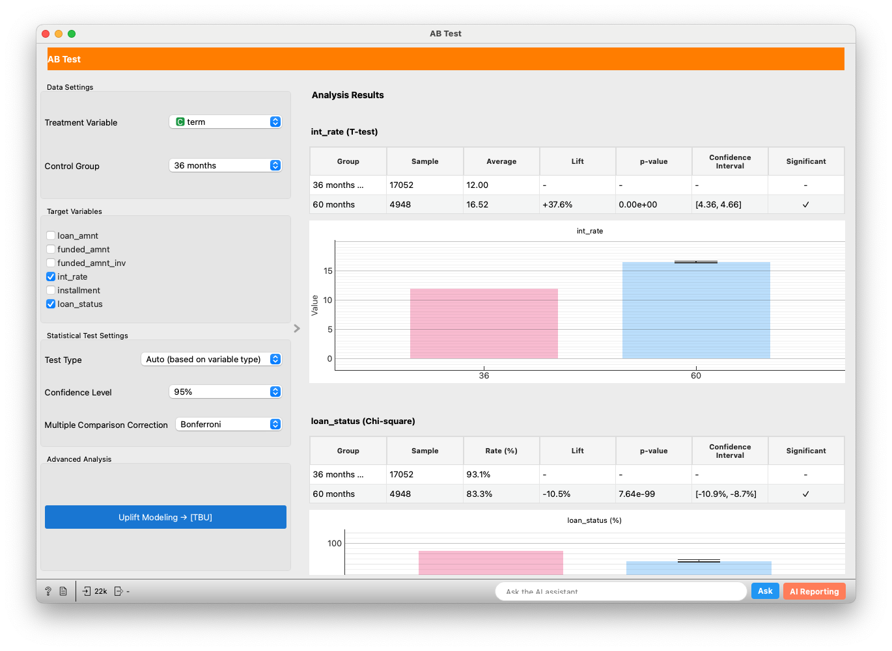
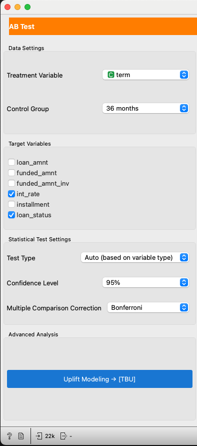
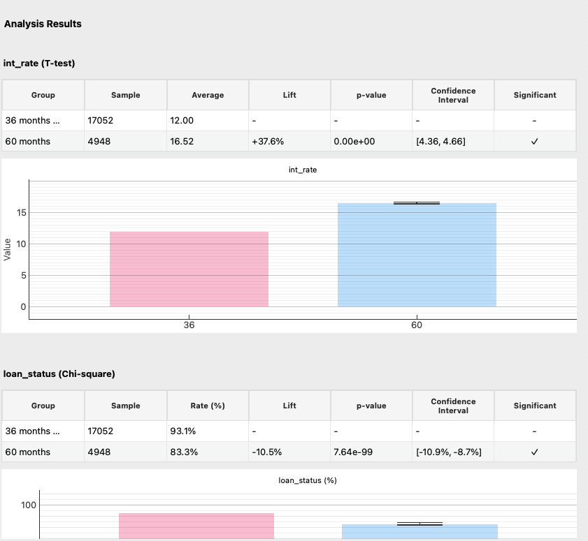
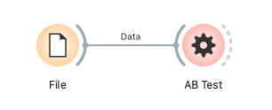

# AB Test Widget

## Overview
The AB Test widget is a tool for statistically analyzing and visualizing the results of A/B tests (or multivariate tests). It helps evaluate the difference in key outcome variables (KPIs) between different groups (e.g., control group vs. treatment group) and determine if this difference is statistically significant.

## Input
*   **Data**:
    *   Required: A dataset in `Orange.data.Table` format.
    *   Specifications:
        *   Must contain at least one **DiscreteVariable**. This will be used as the "Treatment Variable" to define experimental groups (e.g., "Plan A", "Plan B", "Control").
        *   Must contain **Target Variables** for analysis. These must be of one of the following types:
            *   **Binary DiscreteVariable (DiscreteVariable with 2 values)**: e.g., converted/not converted (`["no", "yes"]`), clicked/not clicked.
            *   **ContinuousVariable**: e.g., purchase amount, time spent.
    *   Example:
        ```
        | experiment_group | converted (0/1) | revenue |
        |------------------|-----------------|---------|
        | A                | 1               | 15.50   |
        | B                | 0               | 0.00    |
        | Control          | 1               | 12.00   |
        | A                | 0               | 0.00    |
        ...
        ```
        (In the table above, `converted` is a binary discrete variable, `revenue` is a continuous variable, and `experiment_group` is the treatment variable.)

## Output
*   This widget does not actively output data. This functionality is reserved for future enhancements.

## Feature Description

The AB Test widget interface is primarily divided into a control area (left) and a main area (right).


*Figure 1: Overview of the AB Test widget. The settings area is on the left, and analysis results are displayed on the right.*

### 1. Control Area

In the control area, you configure various settings for the A/B test analysis.



*Figure 2: Settings items in the control area.*

*   **Data Settings**
    *   **Treatment Variable**: Select a discrete variable from the dataset that defines the experimental groups (e.g., "which ad was seen", "which UI design").
    *   **Control Group**: Select the value within the chosen "Treatment Variable" that will serve as the baseline control group.

*   **Target Variables**
    *   Select the target variables you want to analyze from the list (multiple selections allowed). Selectable variables are binary discrete variables or continuous variables.
    *   e.g., "Conversion Rate", "Average Purchase Value", "Click-Through Rate".

*   **Statistical Test Settings**
    *   **Test Type**:
        *   **Auto (based on variable type)** (default): Automatically selects the test method based on the target variable type.
            *   Binary Discrete Variable: Chi-square test (or Fisher's exact test if expected frequencies are small).
            *   Continuous Variable: t-test (Welch's t-test).
        *   **T-Test**: Tests the difference in means between two groups. Primarily used for continuous variables.
        *   **Chi-Square**: Tests the difference in proportions of categorical data between two groups. Primarily used for binary discrete variables.
        *   **Mann-Whitney U**: A non-parametric test to compare differences between two independent groups on a representative value (e.g., median). Used for continuous variables when data does not follow a normal distribution.
    *   **Confidence Level**: Select the confidence level for confidence intervals and the significance level criterion for statistical tests (90%, 95%, 99%). Default is 95%. This implies the tolerance for alpha error (Type I error), calculated as (1 - confidence level).
    *   **Multiple Comparison Correction**: Select a correction method to control the increase in Type I error when comparing multiple target variables or multiple treatment groups simultaneously.
        *   Bonferroni (default)
        *   Holm
        *   Benjamini-Hochberg
        *   This correction is applied when there are three or more treatment groups (i.e., a total of three or more groups including the control group).

*   **Advanced Analysis**
    *   **Uplift Modeling → [TBU]**: Placeholder for future implementation of advanced analysis features like CUPED or uplift modeling.

### 2. Main Area (Analysis Results)

The main area displays the A/B test analysis results for each selected target variable.


*Figure 3: Example of analysis results display. Results for target variables `int_rate` and `loan_status` are shown.*

For each target variable, the following information is displayed in a table and a graph:

*   **Title**: Displayed in the format `Target Variable Name (Test Type Used)`. For example, if the target variable `int_rate` is continuous and Test Type is 'Auto', it will display `(T-test)`.
*   **Results Table (per target)**:
    *   Columns:
        *   Group, Sample, Value (`Rate (%)` for discrete or `Average` for continuous)
        *   Abs CI: Absolute confidence interval for each group's value (discrete: binomial CI via normal approximation; continuous: t-CI)
        *   Effect Δ: Absolute difference vs control (pp for discrete, original units for continuous)
        *   Lift (%): Relative lift vs control. If control=0 then +∞/−∞ (NA when both 0)
        *   p-value, Significant
    *   The control group row shows `Effect Δ = -`, `Lift = -`, `p-value = -`, `Significant = -`.

*   **Results Graph (Bar Chart)**:
    *   Displays the Rate (%) or Average for each group as a bar chart.
    *   Error bars show the Abs CI for each group.
    *   The color of each bar differs by group.
    *   Error bars are displayed on the bars for treatment groups. These error bars represent the **range derived by adding the confidence interval of the difference from the control group to the control group's mean/rate**.
        *   `Error Bar Lower Bound = Control Group Value + Lower Bound of Difference CI`
        *   `Error Bar Upper Bound = Control Group Value + Upper Bound of Difference CI`
        This allows for a visual understanding of the potential range of variation of the treatment group's value compared to the control group's value.
    *   The Y-axis label of the graph will be 'Rate (%)' if the target variable is discrete, or 'Value' if it is continuous.
    *   The graph title is the target variable name (it may be `Target Variable Name (%)` for discrete variables).

## Usage Example

The following is a basic workflow for loading data from a CSV file and analyzing it with the AB Test widget.

1.  Add a **File widget** to the workflow and load a CSV file containing A/B test data.
2.  Add an **AB Test widget** to the workflow.
3.  Connect the output terminal of the File widget to the `Data` input terminal of the AB Test widget.



*Figure 4: Basic connection from the File widget to the AB Test widget.*

Once the AB Test widget window opens, configure the settings as follows (refer to Figure 1):

1.  **Data Settings**:
    *   From the "Treatment Variable" dropdown, select the variable defining the experimental groups (e.g., `term`).
    *   From the "Control Group" dropdown, select the baseline control group (e.g., `36 months`).
2.  **Target Variables**:
    *   Check the boxes for the target variables you want to analyze (e.g., `int_rate`, `loan_status`).
3.  **Statistical Test Settings**:
    *   If necessary, change the "Test Type", "Confidence Level", and "Multiple Comparison Correction". The default settings are appropriate in most cases.

Once the settings are complete, the analysis results will automatically appear in the main area.

In the example in Figure 3, `int_rate` (continuous variable) and `loan_status` (discrete variable) are analyzed as target variables.
*   In the results for `int_rate`, the `60 months` group has an average of `16.52`, which is `+37.6%` higher than the control group's (`36 months`) average of `12.00`. The p-value is `0.00e+00` (very small), so this difference is statistically significant (✓). The confidence interval for the difference is `[4.36, 4.66]`, suggesting with 95% confidence that the average `int_rate` for the `60 months` group is 4.36 to 4.66 points higher than that of the `36 months` group.
*   In the results for `loan_status`, the positive rate for the `60 months` group (e.g., indicating "Fully Paid" or "Current") is `83.3%`, which is `10.5%` lower than the control group's `93.1%`. The p-value is also very small (7.64e-99), so this difference is statistically significant (✓). The confidence interval for the difference is `[-10.9%, -8.7%]`, suggesting with 95% confidence that the positive rate for the `60 months` group is 8.7% to 10.9% lower than that of the `36 months` group.

## Detailed Logic

### Data Processing and Selection
*   **Treatment Variable**: Each value of the user-selected discrete variable is treated as an experimental group.
*   **Control Group**: The user-specified value becomes the control group, and all other groups (treatment groups) are compared against this control group.
*   **Target Variables**:
    *   Selectable variables are binary discrete variables (e.g., `conversion` ["no", "yes"]) or continuous variables (e.g., `purchase_amount`) within the domain.
    *   A separate analysis is performed for each selected target variable.

### Statistical Tests
Statistical tests are performed between each treatment group and the control group for each selected target variable.

*   **Automatic Test Selection (`Test Type: Auto`)**:
    *   If the target variable is a **binary discrete variable**: A **Chi-Square Test** is used. If expected frequencies are small (any cell's expected frequency is less than 5), **Fisher's Exact Test** is used instead.
    *   If the target variable is a **continuous variable**: **Welch's t-test** (a t-test that does not assume equal variances) is used.
*   **User-Specified Test Methods**:
    *   **T-Test**: Performs Welch's t-test.
    *   **Chi-Square**: Performs Chi-square test (or Fisher's exact test). Only for binary discrete targets (2×2). Multi-level discrete targets are not supported.
    *   **Mann-Whitney U**: Performs Mann-Whitney U test. CI is not displayed.
*   **p-value**: The p-value obtained from each test indicates the probability that the observed difference (or a larger difference) would occur by chance under the null hypothesis (that there is no actual difference).
*   **Lift**: Calculated as `((Treatment − Control) / Control) * 100 (%)`. If control=0 then +∞/−∞ (NA when both are 0).
*   **Effect (Δ) and Confidence**:
    *   Effect Δ shows `(Treatment − Control)` (pp or units). Its CI is not displayed in the table to avoid confusion.
    *   The table shows Abs CI per group (binomial/t-CI). The plot also uses Abs CI per group.
*   **Multiple Comparison Correction**:
    *   When performing multiple comparisons (e.g., multiple treatment groups vs control and/or multiple target variables), p-values are corrected using the selected method (Bonferroni, Holm, Benjamini-Hochberg).
    *   Correction is applied once across the family of tests comprised of all selected targets × non-control groups.

### Result Display (`ResultSection`)
The analysis results for each target variable are displayed by a dedicated `ResultSection` widget.

*   **Table Display**:
    *   Numerical values may have their decimal places adjusted based on magnitude, or scientific notation (e.g., `1.23e-05`) may be used for very small/large values.
    *   Very small p-values are also displayed in scientific notation. If a p-value is `1.0`, it might be displayed as `> 0.999`.
    *   In the control group row, the Lift, p-value, Confidence Interval, and Significant columns are displayed as `-`.
*   **Graph Display (`ABTestBarGraph`)**:
    *   Displays the mean or proportion for each group in a bar chart.
    *   For treatment group bars, error bars are displayed representing the range obtained by adding the confidence interval of the difference to the control group's value, using the control group's value as the baseline.
        *   `Error Bar Lower Bound = Control Group Value + Lower Bound of Difference CI`
        *   `Error Bar Upper Bound = Control Group Value + Upper Bound of Difference CI`
    *   If data is invalid (e.g., NaN), a message indicating this will be displayed in the graph area.
