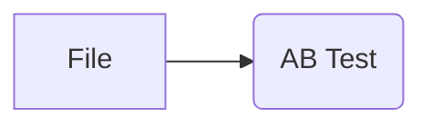

# AB Test ウィジェット

## 概要
AB Testウィジェットは、A/Bテスト（または多変量テスト）の結果を統計的に分析し、視覚化するためのツールです。異なるグループ（例：コントロール群 vs トリートメント群）間での主要な目的変数（KPI）の差を評価し、その差が統計的に有意であるかどうかを判断するのに役立ちます。

## 入力
*   **Data (データ)**:
    *   必須: `Orange.data.Table` 形式のデータセット。
    *   仕様:
        *   少なくとも1つの**質的変数 (DiscreteVariable)** を含んでいる必要があります。これは「Treatment Variable（処置変数）」として使用され、実験のグループ（例: "A案", "B案", "コントロール"）を定義します。
        *   分析対象となる**目的変数 (Target Variables)** を含んでいる必要があります。これらは以下のいずれかの型である必要があります。
            *   **2値の質的変数 (DiscreteVariable with 2 values)**: 例: コンバージョンした/しない (`["no", "yes"]`)、クリックした/しない。
            *   **量的変数 (ContinuousVariable)**: 例: 購入金額、滞在時間。
    *   例:
        ```
        | experiment_group | converted (0/1) | revenue |
        |------------------|-----------------|---------|
        | A                | 1               | 15.50   |
        | B                | 0               | 0.00    |
        | Control          | 1               | 12.00   |
        | A                | 0               | 0.00    |
        ...
        ```
        (上記テーブルで `converted` は2値の質的変数、`revenue` は量的変数、`experiment_group` が処置変数です。)

## 出力
*   **Selected Data (選択されたデータ)**: `Orange.data.Table`
    *   現在、このウィジェットからアクティブにデータが出力される機能はありません。将来的な機能拡張のために予約されています。

## 機能の説明

AB Testウィジェットのインターフェースは、主にコントロールエリア（左側）とメインエリア（右側）に分かれています。


*図1: AB Testウィジェットの全体像。左に設定エリア、右に分析結果が表示される。*

### 1. コントロールエリア

コントロールエリアでは、A/Bテスト分析のための各種設定を行います。


*図2: コントロールエリアの各設定項目。*

*   **Data Settings (データ設定)**
    *   **Treatment Variable (処置変数)**: データセット内の質的変数から、実験群を定義する変数（例: "どの広告を見たか", "どのUIデザインか"）を選択します。
    *   **Control Group (コントロール群)**: 「Treatment Variable」で選択した変数の中で、基準となるコントロール群（対照群）の値を選択します。

*   **Target Variables (目的変数)**
    *   分析したい目的変数をリストから選択します（複数選択可）。選択可能な変数は、2値の質的変数または量的変数です。
    *   例: "コンバージョン率", "平均購入単価", "クリック率"など。

*   **Statistical Test Settings (統計的検定設定)**
    *   **Test Type (検定タイプ)**:
        *   **Auto (based on variable type)** (デフォルト): 目的変数の型に応じて自動的に検定方法を選択します。
            *   2値の質的変数: カイ二乗検定 (または期待度数が小さい場合はフィッシャーの正確確率検定)
            *   量的変数: t検定 (ウェルチのt検定)
        *   **T-Test (t検定)**: 2群の平均値の差を検定します。主に量的変数に使用します。
        *   **Chi-Square (カイ二乗検定)**: 2群のカテゴリカルデータの比率の差を検定します。主に2値の質的変数に使用します。
        *   **Mann-Whitney U (マン・ホイットニーのU検定)**: 2群の代表値（中央値など）の差を検定するノンパラメトリック検定。データが正規分布に従わない量的変数に使用します。
    *   **Confidence Level (信頼水準)**: 統計的検定の信頼区間や有意水準の基準となる信頼度を選択します（90%, 95%, 99%）。デフォルトは95%です。これはαエラー（第一種の過誤）の許容度 (1 - 信頼水準) を意味します。
    *   **Multiple Comparison Correction (多重比較の補正)**: 複数の目的変数や複数のトリートメント群を同時に比較する際に、第一種の過誤が増加するのを抑制するための補正方法を選択します。
        *   Bonferroni (デフォルト)
        *   Holm
        *   Benjamini-Hochberg
        *   この補正は、トリートメント群が3つ以上（コントロール群を含む合計のグループ数が3つ以上）の場合に適用されます。

*   **Advanced Analysis (高度な分析)**
    *   **Uplift Modeling → [TBU]**: 将来的にCUPEDやアップリフトモデリングなどの高度な分析機能を実装するためのプレースホルダーです。

### 2. メインエリア (Analysis Results - 分析結果)

メインエリアには、選択された各目的変数に対するA/Bテストの分析結果が表示されます。


*図3: 分析結果の表示例。目的変数 `int_rate` と `loan_status` の結果が示されている。*

各目的変数ごとに、以下の情報が表とグラフで表示されます。

*   **タイトル**: `目的変数名 (使用された検定タイプ)` の形式で表示されます。例えば、目的変数 `int_rate` が量的変数でTest Typeが "Auto" の場合、`(T-test)` と表示されます。
*   **結果テーブル**:
    *   **Group (グループ)**: トリートメント変数の各値（グループ名）。コントロール群には `(Control)` と表示されます。
    *   **Sample (サンプル数)**: 各グループのサンプルサイズ（データ数）。
    *   **Rate (%) / Average (比率/平均値)**:
        *   目的変数が質的変数の場合: 「Rate (%)」として、肯定的な結果（例: "yes", "true", "1"など、内部ロジックで判断される肯定的な値）の割合が表示されます。
        *   目的変数が量的変数の場合: 「Average」として、平均値が表示されます。
    *   **Lift (リフト値)**: コントロール群と比較した際の目的変数の変化率 (%)。 `((トリートメント群の値 - コントロール群の値) / abs(コントロール群の値)) * 100` で計算されます。コントロール群自身のリフト値は `-` と表示されます。
    *   **p-value (p値)**: コントロール群と比較した際の統計的検定の結果のp値。p値が小さいほど、観測された差が偶然によるものではない（統計的に有意である）ことを示唆します。コントロール群自身のp値は `-` と表示されます。
    *   **Confidence Interval (信頼区間)**: コントロール群との**差分**の信頼区間。例えば95%信頼区間は、「もし同じ実験を100回繰り返したら、そのうち95回はこの区間内に真の差が含まれる」と解釈されます。コントロール群自身の信頼区間は `-` と表示されます。
    *   **Significant (有意差)**: p値が設定した有意水準（1 - 信頼水準）よりも小さい場合に `✓` (有意差あり)、そうでない場合は `✗` (有意差なし) と表示されます。コントロール群自身は `-` と表示されます。

*   **結果グラフ (バーチャート)**:
    *   各グループの Rate (%) または Average を棒グラフで表示します。
    *   各棒の色はグループごとに異なります。
    *   トリートメント群の棒には、エラーバーが表示されます。このエラーバーは、**コントロール群の平均値/比率を基準として、コントロール群との差分の信頼区間を加えた範囲**を示します。
        *   `エラーバー下限 = コントロール群の値 + 差分の信頼区間下限`
        *   `エラーバー上限 = コントロール群の値 + 差分の信頼区間上限`
        これにより、トリートメント群の値がコントロール群の値と比較して、どの程度の範囲で変動しうるかを視覚的に把握できます。
    *   グラフのY軸ラベルは、目的変数が質的なら "Rate (%)"、量的なら "Value" となります。
    *   グラフタイトルは目的変数名です（質的変数の場合は `目的変数名 (%)` となることがあります）。

## 使用例

以下は、CSVファイルからデータを読み込み、AB Testウィジェットで分析する基本的なワークフローです。

1.  **File ウィジェット** をワークフローに追加し、A/Bテストデータが含まれるCSVファイルを読み込みます。
2.  **AB Test ウィジェット** をワークフローに追加します。
3.  File ウィジェットの出力端子を AB Test ウィジェットの入力端子 `Data` に接続します。


*図4: FileウィジェットからAB Testウィジェットへの基本的な接続。*

AB Testウィジェットのウィンドウが開いたら、以下の手順で設定を行います（図1参照）。

1.  **Data Settings**:
    *   「Treatment Variable」ドロップダウンから、実験群を定義する変数を選択します（例: `term`）。
    *   「Control Group」ドロップダウンから、基準となるコントロール群を選択します（例: `36 months`）。
2.  **Target Variables**:
    *   分析したい目的変数のチェックボックスをオンにします（例: `int_rate`, `loan_status`）。
3.  **Statistical Test Settings**:
    *   必要に応じて「Test Type」、「Confidence Level」、「Multiple Comparison Correction」を変更します。デフォルト設定でも多くの場合適切です。

設定が完了すると、メインエリアに分析結果が自動的に表示されます。

図3の例では、`int_rate` (量的変数) と `loan_status` (質的変数) を目的変数として分析しています。
*   `int_rate` の結果では、`60 months` 群はコントロール群 (`36 months`) と比較して平均値が `16.52` であり、コントロール群の `12.00` より `+37.6%` 高いです。p値は `0.00e+00` (非常に小さい) であるため、この差は統計的に有意です (✓)。差分の信頼区間は `[4.36, 4.66]` であり、これは `60 months` 群の平均 `int_rate` が `36 months` 群よりも 4.36 から 4.66 ポイント高いことを95%の信頼度で示唆しています。
*   `loan_status` の結果では、`60 months` 群の肯定的な割合（仮に "Fully Paid" や "Current" を示す）は `83.3%` であり、コントロール群の `93.1%` よりも `10.5%` 低いです。p値も非常に小さいため (7.64e-99)、この差も統計的に有意です (✓)。差分の信頼区間は `[-10.9%, -8.7%]` であり、これは `60 months` 群の肯定的な割合が `36 months` 群よりも 8.7% から 10.9% 低いことを95%の信頼度で示唆しています。

## 詳細なロジック

### データ処理と選択
*   **Treatment Variable**: ユーザーが選択した質的変数の各値が、実験グループとして扱われます。
*   **Control Group**: ユーザーが指定した値がコントロール群となり、他の全てのグループ（トリートメント群）はこのコントロール群と比較されます。
*   **Target Variables**:
    *   選択可能なのは、ドメイン内の2値の質的変数 (例: `conversion` ["no", "yes"]) または量的変数 (例: `purchase_amount`) です。
    *   選択された各目的変数について、個別に分析が行われます。

### 統計的検定
各トリートメント群とコントロール群の間で、選択された各目的変数について統計的検定が実行されます。

*   **検定方法の自動選択 (`Test Type: Auto`)**:
    *   目的変数が**2値の質的変数**の場合: **カイ二乗検定 (Chi-Square Test)** が使用されます。期待度数が小さい場合（いずれかのセルの期待度数が5未満）、**フィッシャーの正確確率検定 (Fisher's Exact Test)** が代わりに用いられます。
    *   目的変数が**量的変数**の場合: **ウェルチのt検定 (Welch's t-test)** が使用されます（等分散性を仮定しないt検定）。
*   **ユーザー指定の検定方法**:
    *   **T-Test**: ウェルチのt検定を実行します。
    *   **Chi-Square**: カイ二乗検定（またはフィッシャーの正確確率検定）を実行します。
    *   **Mann-Whitney U**: マン・ホイットニーのU検定を実行します。
*   **p値**: 各検定から得られるp値は、観測された差（またはそれ以上の差）が、実際には差がないという帰無仮説のもとで偶然に生じる確率を示します。
*   **リフト値 (Lift)**: `((トリートメント群の値 - コントロール群の値) / abs(コントロール群の値)) * 100 (%)` で計算されます。コントロール群の値が0の場合はリフト値も0として扱われます。
*   **信頼区間 (Confidence Interval)** (差分に対して計算):
    *   **質的変数 (比率の差)**: `(トリートメント群の比率 - コントロール群の比率)` の信頼区間が計算されます。標準誤差は `sqrt(p1(1-p1)/n1 + p2(1-p2)/n2)` を用いて計算され、正規分布近似に基づき信頼区間が構築されます。結果はパーセンテージで表示されます。
    *   **量的変数 (平均値の差)**: `(トリートメント群の平均値 - コントロール群の平均値)` の信頼区間が計算されます。標準誤差はウェルチのt検定に基づき計算され、t分布を用いて信頼区間が構築されます。
*   **多重比較補正**:
    *   複数の比較（例: 複数のトリートメント群 vs コントロール群、または複数の目的変数）を行うと、全体として偽陽性（実際には差がないのに差があると判断してしまうこと）の確率が上昇します。これを調整するために、選択された方法（Bonferroni, Holm, Benjamini-Hochberg）でp値が補正されます。
    *   この補正は、トリートメント変数の値の種類（グループ数）が3つ以上の場合に、コントロール群以外の各トリートメント群のp値に対して適用されます。

### 結果の表示 (`ResultSection`)
各目的変数の分析結果は、専用の `ResultSection` ウィジェットによって表示されます。

*   **テーブル表示**:
    *   数値は、値の大きさに応じて小数点以下の桁数が調整されたり、非常に小さい/大きい場合には科学的表記法 (例: `1.23e-05`) が用いられたりします。
    *   p値が非常に小さい場合も科学的表記法で表示されます。p値が `1.0` の場合は `> 0.999` と表示されることがあります。
    *   コントロール群の行では、リフト値、p値、信頼区間、有意差の列は `-` と表示されます。
*   **グラフ表示 (`ABTestBarGraph`)**:
    *   棒グラフで各グループの平均値または比率を表示します。
    *   トリートメント群の棒には、コントロール群の平均値/比率を基準として、差分の信頼区間をコントロール群の値に加えた範囲がエラーバーとして表示されます。
        *   `エラーバー下限 = コントロール群の値 + 差分の信頼区間下限`
        *   `エラーバー上限 = コントロール群の値 + 差分の信頼区間上限`
    *   データが無効（NaNなど）な場合は、グラフエリアにその旨のメッセージが表示されます。
