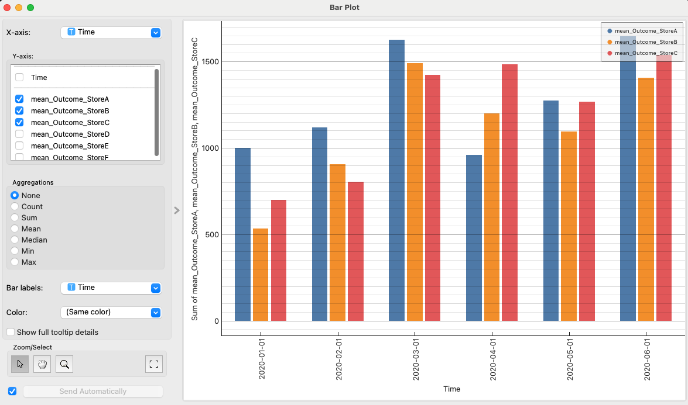
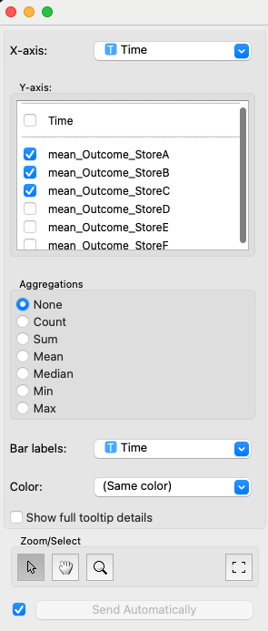
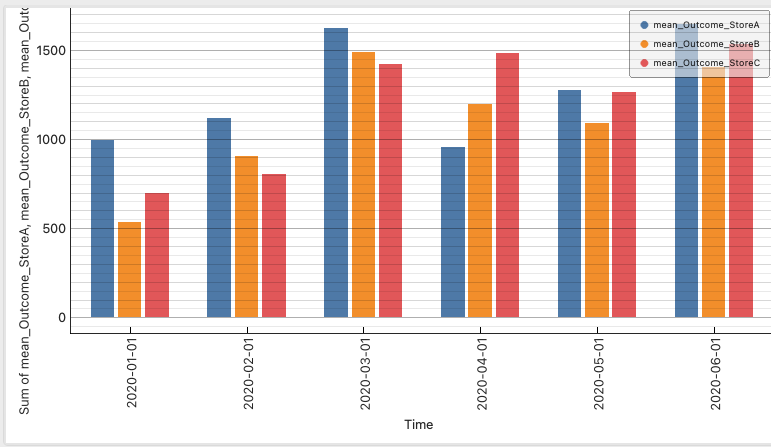

# Bar Plot (Allye)

The Bar Plot widget is a tool for visualizing variables within a dataset as a bar chart. By specifying multiple variables for the Y-axis, they can be displayed as a grouped bar chart. Furthermore, it offers features to customize bar labels and display detailed tooltip information. It also includes interactive selection capabilities.

## Inputs

*   **Data**:
    *   Data type: `Orange.data.Table`
    *   Description: The dataset to be analyzed. It must contain columns to be used as the X-axis variable, Y-axis variable (optional), color variable (optional), and bar label variable (optional).
*   **Data Subset**:
    *   Data type: `Orange.data.Table`
    *   Description: A subset of the main dataset. Bars included in the subset will be visually distinguished on the main plot (usually by transparency).

### Input Data Specifications

The input data is expected to contain the following information:

*   **X-axis Variable**:
    *   The variable that defines the categories of the bar chart.
    *   Must be a Discrete Variable, String Variable, or Time Variable.
*   **Y-axis Variable**:
    *   One or more variables used to determine the height of the bars. If multiple variables are specified, a grouped bar chart is created.
    *   With aggregation: Continuous Variable or Time Variable is recommended.
    *   Without aggregation: Continuous Variable or Time Variable is recommended.
*   **Color Variable** (optional):
    *   The variable used to group the colors of the bars.
    *   Must be a Discrete Variable.
    *   **Note**: When multiple Y-axis variables are specified, this setting is ignored, and the Y-axis variables themselves serve as the basis for color coding.
*   **Annotation Variable** (optional):
    *   The variable that defines the labels displayed above each bar.
    *   Can be a Discrete Variable, String Variable, or Time Variable.
*   **Other Variables (Meta Variables, etc.)**:
    *   Variables to be kept in the data for tooltip display or other analyses.

### Input Data Example

The following is an example of data for analyzing sales and profits for each product category.

| Category (X-axis) | Sales (Y-axis) | Profit (Y-axis) | Region (Meta) | Rep (Annotation/Meta) |
| :---------------- | :------------------- | :-------------------- | :------------------ | :-------------------- |
| Electronics       | 1500                 | 300                   | East                | Alice                 |
| Clothing          | 800                  | 150                   | West                | Bob                   |
| Electronics       | 1200                 | 250                   | West                | Carol                 |
| Home Goods        | 1000                 | 200                   | East                | David                 |
| Clothing          | 950                  | 180                   | East                | Alice                 |
| ...               | ...                  | ...                   | ...                 | ...                   |

In this example, "Category" can be used as the X-axis variable, selecting both "Sales" and "Profit" as Y-axis variables, and "Rep" as the bar label variable.

## Outputs

*   **Selected Data**:
    *   Data type: `Orange.data.Table`
    *   Description: The original data instances corresponding to the bars selected by the user on the plot.
*   **Annotated Data**:
    *   Data type: `Orange.data.Table`
    *   Description: The original data with an additional column (usually a meta attribute named `Selected`) indicating the selection status. It will be "Yes" if selected, "No" otherwise, and unselected data points will have an empty value.

## Feature Description

*(Figure: Placeholder for the overall interface of the Custom Bar Plot widget)*

### Control Area (Left Panel)

In the control panel, you can assign variables to be displayed in the graph, select the aggregation method, set bar labels and colors, and configure how tooltips are displayed.

*(Figure: Placeholder for the variable selection, aggregation, and display options sections in the control area)*

*   **X-axis**:
    *   Select the variable (categorical, string, time) to be used for the X-axis from the dropdown list.
*   **Y-axis**:
    *   Select one or more variables (numerical, time) to be used for the Y-axis from the checkbox list.
*   **Aggregations**:
    *   Select how the Y-axis variable should be aggregated to determine the height of the bars.
        *   `None`: No aggregation is performed, and each row of the data table (or up to `MAX_BARS`) is displayed as an individual bar (if a Y-axis variable is selected).
        *   `count`: The number of occurrences (instances) of each category on the X-axis becomes the height of the bar (selection of a Y-axis variable is unnecessary).
        *   `sum`, `mean`, `median`, `min`, `max`: For the selected Y-axis variable, the sum, average, median, minimum, or maximum is calculated for each category on the X-axis, and this becomes the height of the bar.
*   **Bar labels**:
    *   Select the variable (categorical, string, time) from which the labels displayed above each bar will originate from the dropdown list.
    *   Selecting the special option `Enumeration (1, 2, ...)` will number the bars sequentially.
    *   If nothing is selected, the X-axis category names may be the default labels (depending on implementation).
*   **Color**:
    *   Select the discrete variable to be used for coloring the bars from the dropdown list. A different color will be assigned for each value of the selected variable. This setting is ignored when multiple variables are selected for the Y-axis.
*   **Show full tooltip details**:
    *   If checked, the tooltip displayed when hovering over a bar will show all attribute information of the
        associated data instance (excluding major axis variables, color variables, etc.). If unchecked, a concise tooltip with only major information will be displayed.

### Main Area (Right Panel)

The main area displays the generated bar graph.

*(Figure: Placeholder for the bar graph display area in the main area)*

*   **Bar Graph Display**:
    *   The bar graph is drawn based on the settings.
    *   The X-axis displays the categories of the selected variable, and the Y-axis displays the values or aggregated values.
    *   If multiple Y-axis variables are specified, a grouped bar chart is drawn for each X-axis category. The bars within each group correspond to each Y-axis variable and are displayed in different colors.
    *   If a bar label variable is specified, labels will be displayed above each bar.
    *   **Legend**: If multiple Y-axis variables are used, or if a single Y-axis and a color variable are used, a legend showing which color corresponds to which value will be displayed.
    *   **Tooltip**: When the mouse cursor hovers over a bar, information related to that bar (X-axis value, corresponding Y-axis variable name and value, etc.) is displayed. The amount of information displayed changes according to the `Show full tooltip details` setting.
*   **Interactions**:
    *   **Selection**:
        *   Clicking on a bar selects that bar (single selection).
        *   Clicking while holding the Ctrl (or Cmd) key toggles the selection state (multiple selection/deselection).
        *   Clicking while holding the Shift key adds to the current selection.
        *   Clicking while holding the Alt key removes from the current selection.
        *   Dragging to specify a rectangular area selects all bars within the area.
    *   **Zooming**: After selecting the zoom button on the toolbar, drag to specify an area to zoom in.
    *   **Panning**: After selecting the pan button on the toolbar, drag to move the display area.
    *   **Reset View**: The reset button on the toolbar returns the plot's display range to its initial state.

### Button Area (Usually at the bottom or right)

This area contains options for switching plot interaction modes and for automatic submission of settings.

*   **Toolbar (Plot GUI)**:
    *   Buttons to switch between selection mode, zoom mode, and pan mode.
    *   A button to reset the view.
*   **Auto-commit**:
    *   If checked, changes to widget settings or selections are immediately sent to `Outputs`. If unchecked, they are not sent until a send button is manually pressed (usually not displayed, but a "Commit" button may be provided externally in some workflows).

## Example Usage

The following is a basic workflow for loading data from a file, visualizing it with the Bar Plot widget, and examining the selected data in other widgets.

*(Figure: Placeholder for a basic workflow of the Custom Bar Plot widget. E.g., File -> Custom Bar Plot -> Data Table / Scatter Plot)*

1.  Load the dataset to be analyzed using the **File** widget.
2.  Connect the output of the **File** widget to the `Data` input of the **Bar Plot** widget.
3.  Open the **Bar Plot** widget and configure the following in the control panel:
    *   Select the `X-axis` variable.
    *   If necessary, select the `Y-axis` variables and specify the `Aggregations` method.
    *   Optionally, set the `Bar labels` and `Color` variables.
    *   Set the `Show full tooltip details` on/off.
4.  Examine the generated bar graph in the main area.
    *   If necessary, use the toolbar buttons to switch between zoom, pan, and selection modes.
    *   Select data by clicking or dragging on the bars.
5.  Connect the `Selected Data` output of the **Bar Plot** widget to a **Data Table** widget to examine the details of the selected data instances. Similarly, you can connect `Annotated Data` to other visualization widgets (e.g., Scatter Plot) to view the selection status from a different perspective.

## Detailed Logic

### 1. Data Processing (`_process_data_and_update_plot`)

1.  **Input Check**: Checks if `Data` input and `X-axis` variable are selected. If the aggregation method is not "None" or "count", it also checks if at least one `Y-axis` variable is selected.
2.  **DataFrame Conversion**: Converts the Orange Table to a Pandas DataFrame and extracts the necessary columns (X-axis, Y-axis (one or more), original index, ID).
3.  **No Aggregation (`Aggregation_method == "None"`)**:
    *   Data may be sorted by the X-axis variable values (for visual grouping).
    *   If the number of bars to display exceeds `MAX_BARS`, a warning is displayed, and the data is truncated to the first `MAX_BARS` items.
    *   Generates plot data (`_processed_plot_data`) where each entry corresponds to an X-axis category and contains the values for each Y-axis variable.
4.  **With Aggregation (`Aggregation_method != "None"`)**:
    *   Groups the DataFrame by the X-axis variable values (`groupby(x_col_name)`).
    *   For each group, applies the specified aggregation method. For "count", it's the number of instances in the group; otherwise, it's aggregation (sum, mean, etc.) for each Y-axis variable.
    *   Adds each aggregation result (X-axis value, aggregated value for each Y-axis variable, list of original data indices included in the group, etc.) to `_processed_plot_data`.
    *   If the number of generated bars exceeds `MAX_BARS`, a warning is displayed, and the data is truncated to the first `MAX_BARS` items.
5.  **Graph Update**: Calls `self.graph.reset_graph()` to trigger a redraw of the graph.
6.  **Selection State Restoration**: `handleNewSignals()` is called, and if there was a previous selection state (bar indices) in `_pending_selection_bar_indices` when the widget is redisplayed or after a data update, it attempts to apply it to the graph.

### 2. Graph Drawing and Updating (`CustomBarPlotGraph`)

*   **Drawing Bars (`update_bars`)**:
    *   Based on the processed data (`_processed_plot_data`) and the list of Y-axis variables, it calculates the position, height, and width for each bar.
    *   It determines a color palette based on the list of Y-axis variables and assigns a color to each bar, creating a grouped bar chart colored by Y-axis variable.
    *   Draws the bars using `pyqtgraph.BarGraphItem`.
*   **Updating Axes (`update_axes`)**:
    *   Gets X-axis and Y-axis labels from `OWCustomBarPlot.get_axis_labels_for_plot()` and sets them. The Y-axis label may include multiple variable names.
    *   Gets X-axis tick labels (reflecting bar label variable settings) from `OWCustomBarPlot.get_x_tick_labels_for_plot()` and sets them.
*   **Updating Legend (`update_legend`)**:
    *   Creates a legend based on the list of Y-axis variables. Each legend item shows a color and its corresponding Y-axis variable name.
*   **Applying Selection (`apply_selection_to_bars`)**:
    *   Highlights the border of currently selected bars (`self.selection_indices`) (thick black line). Non-selected bars have a normal border (white line).

### 3. Interaction Handling (`CustomBarPlotViewBox`, `CustomBarPlotGraph`)

*   **Rectangle Selection (`mouseDragEvent` in `CustomBarPlotViewBox`)**:
    *   Compares the rectangle created by the user's drag with the geometry (position and size) of each bar and considers overlapping bars as selection targets.
    *   Adds, removes, or toggles the selection based on the state of modifier keys (Ctrl, Alt, Shift).
*   **Click Selection (`mouseClickEvent` in `CustomBarPlotViewBox`, `__get_bar_index_at` in `CustomBarPlotGraph`)**:
    *   Determines which bar exists at the clicked coordinates. This works for individual bars even when they are grouped.
    *   If a bar is found, it becomes the selection target. Handling of modifier keys is the same as for rectangle selection.
*   **Selection Change Notification (`update_selection_from_bar_indices`, `selection_changed` signal)**:
    *   When the indices of selected bars are updated, it gets the list of original data indices via `OWCustomBarPlot.get_original_indices_for_selected_bars()` and emits the `selection_changed` signal.
    *   `OWCustomBarPlot` receives this signal, updates `_active_selection_orig_indices`, and defers `commit()` to send `Outputs`.

### 4. Tooltip Display (`help_event` in `CustomBarPlotGraph`)

*   Identifies the bar under the mouse cursor.
*   Calls `OWCustomBarPlot.get_tooltip_for_bar()` to get the tooltip text corresponding to that bar (including X-axis value, corresponding Y-axis variable name and value).
*   Displays the tooltip using `QToolTip.showText()`.