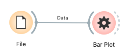

# Bar Plot (Allye)

Bar Plot ウィジェットは、データセット内の変数を棒グラフとして視覚化するためのツールです。カテゴリカル変数の各値に対する頻度や、別の数値変数の集計値（合計、平均など）を棒の高さで表現します。さらに、棒の色を他のカテゴリカル変数に基づいてグループ化したり、バーラベルをカスタマイズしたり、詳細なツールチップ情報を表示したりする機能を提供します。インタラクティブな選択機能も備えています。

## 入力 (Inputs)

*   **Data (データ)**:
    *   データ型: `Orange.data.Table`
    *   説明: 分析対象のデータセット。X軸変数、Y軸変数（オプション）、色分け変数（オプション）、バーラベル変数（オプション）として使用する列を含む必要があります。
*   **Data Subset (データサブセット)**:
    *   データ型: `Orange.data.Table`
    *   説明: メインのデータセットのサブセット。サブセットに含まれるバーは、メインプロット上で視覚的に区別されます（通常は透明度で）。

### 入力データの仕様

入力データには以下の情報が含まれていることが期待されます。

*   **X軸変数 (X-axis Variable)**:
    *   棒グラフのカテゴリを定義する変数。
    *   離散変数 (Discrete Variable)、文字列変数 (String Variable)、または時間変数 (Time Variable) である必要があります。
*   **Y軸変数 (Y-axis Variable)** (任意):
    *   棒の高さを決定するために集計される変数（集計方法が "None" 以外の場合）、または集計なしで直接プロットされる変数（集計方法が "None" の場合）。
    *   集計ありの場合: 数値変数 (Continuous Variable) または時間変数 (Time Variable) を推奨。
    *   集計なしの場合: 数値変数 (Continuous Variable) または時間変数 (Time Variable) を推奨。
    *   Y軸変数がない場合、集計方法が "count" であればX軸カテゴリの出現頻度がプロットされます。
*   **色分け変数 (Color Variable)** (任意):
    *   バーの色をグループ化するために使用する変数。
    *   離散変数 (Discrete Variable) である必要があります。
*   **バーラベル変数 (Annotation Variable)** (任意):
    *   各バーの上に表示されるラベルを定義する変数。
    *   離散変数 (Discrete Variable)、文字列変数 (String Variable)、または時間変数 (Time Variable) を使用できます。
*   **その他の変数 (Meta Variables, etc.)**:
    *   ツールチップ表示や他の分析のためにデータ内に保持しておきたい変数。

### 入力データ例

以下は、製品カテゴリごとの売上と利益を分析するデータの例です。

| カテゴリ (X-axis) | 売上 (Y-axis/Color) | 利益 (Y-axis/Color) | 地域 (Color/Meta) | 担当者 (Annotation/Meta) |
| :---------------- | :------------------ | :------------------ | :---------------- | :----------------------- |
| Electronics       | 1500                | 300                 | East              | Alice                    |
| Clothing          | 800                 | 150                 | West              | Bob                      |
| Electronics       | 1200                | 250                 | West              | Carol                    |
| Home Goods        | 1000                | 200                 | East              | David                    |
| Clothing          | 950                 | 180                 | East              | Alice                    |
| ...               | ...                 | ...                 | ...               | ...                      |

この例では、「カテゴリ」をX軸変数、「売上」または「利益」をY軸変数（または集計対象）、「地域」を色分け変数、「担当者」をバーラベル変数として使用できます。

## 出力 (Outputs)

*   **Selected Data (選択されたデータ)**:
    *   データ型: `Orange.data.Table`
    *   説明: プロット上でユーザーが選択したバーに対応する元のデータインスタンス。
*   **Annotated Data (注釈付きデータ)**:
    *   データ型: `Orange.data.Table`
    *   説明: 元のデータに選択状態を示す追加の列（通常は `Selected` という名前のメタ属性）が付与されたデータ。選択されていれば "Yes"、そうでなければ "No"、未選択のデータポイントは空の値になります。

## 機能の説明

*(図: Custom Bar Plot ウィジェットの全体的なインターフェースのプレースホルダ)*

### コントロールエリア (左パネル)

コントロールパネルでは、グラフに表示する変数の割り当て、集計方法の選択、バーラベルや色の設定、ツールチップの表示方法などを設定します。

*(図: コントロールエリアの変数選択、集計、表示オプションセクションのプレースホルダ)*

*   **X-axis (X軸)**:
    *   ドロップダウンリストからX軸に使用する変数（カテゴリカル、文字列、時間）を選択します。
*   **Y-axis (Y軸)**:
    *   ドロップダウンリストからY軸に使用する変数（数値、時間）を選択します。集計方法が "count" の場合や、集計なしでX軸の各インスタンスを個別のバーとして表示する場合は、Y軸変数の選択は任意または不要です。
*   **Aggregations (集計)**:
    *   Y軸変数をどのように集計してバーの高さを決定するかを選択します。
        *   `None`: 集計を行わず、データテーブルの各行（または最大 `MAX_BARS` まで）を個別のバーとして表示します（Y軸変数が選択されている場合）。
        *   `count`: X軸の各カテゴリの出現回数（インスタンス数）をバーの高さとします（Y軸変数の選択は不要）。
        *   `sum`, `mean`, `median`, `min`, `max`: 選択されたY軸変数に対して、X軸の各カテゴリごとに合計、平均、中央値、最小値、最大値を計算し、バーの高さとします。
*   **Bar labels (バーラベル)**:
    *   ドロップダウンリストから、各バーの上に表示するラベルの元となる変数（カテゴリカル、文字列、時間）を選択します。
    *   特別なオプションとして `Enumeration (1, 2, ...)` を選択すると、バーに連番が振られます。
    *   何も選択しない場合、X軸のカテゴリ名がデフォルトのラベルとなることがあります（実装による）。
*   **Color (色)**:
    *   ドロップダウンリストから、バーの色分けに使用する離散変数を選択します。選択された変数の値ごとに異なる色が割り当てられます。
*   **Show full tooltip details (ツールチップ詳細表示)**:
    *   チェックを入れると、バーにマウスオーバーした際に表示されるツールチップに、関連するデータインスタンスの全属性情報（主要な軸変数や色変数などを除く）が表示されます。チェックを外すと、主要な情報のみの簡潔なツールチップになります。

### メインエリア (右パネル)

メインエリアには、生成された棒グラフが表示されます。

*(図: メインエリアの棒グラフ表示エリアのプレースホルダ)*

*   **Bar Graph Display (棒グラフ表示)**:
    *   設定に基づいて棒グラフが描画されます。
    *   X軸には選択された変数のカテゴリが、Y軸には値または集計値が表示されます。
    *   色分け変数が指定されていれば、バーはそれに応じて色分けされます。
    *   バーラベル変数が指定されていれば、各バーの上にラベルが表示されます。
    *   **凡例 (Legend)**: 色分け変数が使用されている場合、各色がどの値に対応するかの凡例が表示されます。
    *   **ツールチップ (Tooltip)**: バーにマウスカーソルを合わせると、そのバーに関連する情報（X軸の値、Y軸の値、色分け変数の値など）が表示されます。`Show full tooltip details` の設定に応じて、表示される情報量が変わります。
*   **Interactions (インタラクション)**:
    *   **選択 (Selection)**:
        *   バーをクリックすると、そのバーが選択されます（単一選択）。
        *   Ctrl（またはCmd）キーを押しながらクリックすると、選択状態がトグルされます（複数選択/解除）。
        *   Shiftキーを押しながらクリックすると、現在の選択に追加されます。
        *   Altキーを押しながらクリックすると、現在の選択から除外されます。
        *   ドラッグして矩形範囲を指定することで、範囲内のバーをまとめて選択できます。
    *   **ズーム (Zooming)**: ツールバーのズームボタンを選択後、ドラッグして範囲を指定すると拡大表示されます。
    *   **パン (Panning)**: ツールバーのパンボタンを選択後、ドラッグして表示範囲を移動できます。
    *   **リセットビュー (Reset View)**: ツールバーのリセットボタンで、プロットの表示範囲を初期状態に戻します。

### ボタンエリア (通常は下部または右部)

プロットのインタラクションモードの切り替えや、設定の自動送信オプションなどがあります。

*   **ツールバー (Plot GUI)**:
    *   選択モード、ズームモード、パンモードを切り替えるボタン。
    *   ビューをリセットするボタン。
*   **Auto-commit (自動送信)**:
    *   チェックを入れると、ウィジェットの設定変更や選択の変更が即座に `Outputs` に送信されます。チェックを外すと、手動で送信ボタン（通常は表示されないが、ワークフローによっては「Commit」ボタンが外部から提供される）を押すまで送信されません。

## 使用例

以下は、ファイルからデータを読み込み、Bar Plot ウィジェットで可視化し、選択したデータを他のウィジェットで確認する基本的なワークフローです。

1.  **File (ファイル)** ウィジェットで分析対象のデータセットを読み込みます。
2.  **File** ウィジェットの出力を **Bar Plot** ウィジェットの `Data` 入力に接続します。
3.  **Bar Plot** ウィジェットを開き、コントロールパネルで以下を設定します。
    *   `X-axis` 変数を選択します。
    *   必要に応じて `Y-axis` 変数を選択し、`Aggregations` 方法を指定します。
    *   オプションで `Bar labels` や `Color` 変数を設定します。
    *   `Show full tooltip details` のオン/オフを設定します。
4.  メインエリアで生成された棒グラフを確認します。
    *   必要に応じて、ツールバーのボタンを使用してズーム、パン、選択モードを切り替えます。
    *   バーをクリックまたはドラッグしてデータを選択します。

## 詳細なロジック

### 1. データ処理 (`_process_data_and_update_plot`)

1.  **入力チェック**: `Data` 入力と `X-axis` 変数が選択されているかを確認します。集計方法によっては `Y-axis` 変数の存在も確認します。
2.  **データフレーム変換**: Orange TableをPandas DataFrameに変換し、分析に必要な列（X軸、Y軸、色、オリジナルインデックス、ID）を抽出します。
3.  **集計なし (`Aggregation_method == "None"`)**:
    *   データはX軸変数の値でソートされることがあります（視覚的なグルーピングのため）。
    *   表示するバーの数が `MAX_BARS` を超える場合は、警告が表示され、データが先頭から `MAX_BARS` 件に切り詰められます。
    *   各行が1つのバーに対応するプロット用データ (`_processed_plot_data`) を生成します。各要素には、X軸の値、Y軸の値（あれば）、色分け変数の値（あれば）、元のデータインデックス、サブセットに含まれるかどうかの情報が含まれます。
4.  **集計あり (`Aggregation_method != "None"`)**:
    *   DataFrameをX軸変数の値でグループ化します (`groupby(x_col_name)`）。
    *   各グループに対して、指定された集計方法（count, sum, mean, median, min, max）をY軸変数（またはカウントの場合はグループサイズ）に適用します。
    *   色分け変数が指定されている場合、各X軸グループ内で最も頻出する色分け変数の値をそのグループの色として採用します（モード）。
    *   各集計結果（X軸の値、集計されたY軸の値、集計された色分け変数の値、グループに含まれる元のデータインデックスのリスト、サブセットに含まれるかどうかの情報）を `_processed_plot_data` に追加します。
    *   生成されたバーの数が `MAX_BARS` を超える場合は、警告が表示され、データが先頭から `MAX_BARS` 件に切り詰められます。
5.  **グラフ更新**: `self.graph.reset_graph()` を呼び出し、グラフの再描画をトリガーします。これにより、`get_bar_heights`, `get_bar_colors`, `get_x_tick_labels_for_plot` などが呼び出され、新しいデータに基づいてバー、軸、凡例が更新されます。
6.  **選択状態の復元**: `handleNewSignals()` が呼ばれ、ウィジェットが再表示された際やデータ更新後に、以前の選択状態（バーのインデックス）が `_pending_selection_bar_indices` にあれば、それをグラフに適用しようとします。

### 2. グラフ描画と更新 (`CustomBarPlotGraph`)

*   **バーの描画 (`update_bars`)**:
    *   `OWCustomBarPlot.get_bar_heights()` からバーの高さを取得します。
    *   `OWCustomBarPlot.get_bar_colors()` から各バーの色（サブセットデータによる透明度調整を含む）を取得します。
    *   `pyqtgraph.BarGraphItem` を使用してバーを描画します。
*   **軸の更新 (`update_axes`)**:
    *   `OWCustomBarPlot.get_axis_labels_for_plot()` からX軸とY軸のラベルを取得し設定します。
    *   `OWCustomBarPlot.get_x_tick_labels_for_plot()` からX軸の目盛りラベル（バーラベル変数の設定を反映）を取得し設定します。
*   **凡例の更新 (`update_legend`)**:
    *   `OWCustomBarPlot.get_legend_data_for_plot()` から色分け変数の凡例情報を取得し、`LegendItem` を更新します。
*   **選択の適用 (`apply_selection_to_bars`)**:
    *   現在選択されているバー (`self.selection_indices`) の枠線を強調表示（太く黒い線）します。非選択バーは通常の枠線（白い線）です。

### 3. インタラクション処理 (`CustomBarPlotViewBox`, `CustomBarPlotGraph`)

*   **矩形選択 (`mouseDragEvent` in `CustomBarPlotViewBox`)**:
    *   ユーザーがドラッグして作成した矩形と各バーのジオメトリ（位置とサイズ）を比較し、重なっているバーを選択対象とします。
    *   修飾キー（Ctrl, Alt, Shift）の状態に応じて、選択を追加、削除、またはトグルします。
*   **クリック選択 (`mouseClickEvent` in `CustomBarPlotViewBox`, `__get_bar_index_at` in `CustomBarPlotGraph`)**:
    *   クリックされた座標にどのバーが存在するかを判定します。
    *   該当するバーがあれば、それを選択対象とします。修飾キーの扱いは矩形選択と同様です。
*   **選択変更通知 (`update_selection_from_bar_indices`, `selection_changed` signal)**:
    *   選択されたバーのインデックスが更新されると、`OWCustomBarPlot.get_original_indices_for_selected_bars()` を介して元のデータインデックスのリストを取得し、`selection_changed` シグナルを発行します。
    *   `OWCustomBarPlot` はこのシグナルを受けて、`_active_selection_orig_indices` を更新し、`commit()` を遅延実行して `Outputs` を送信します。

### 4. ツールチップ表示 (`help_event` in `CustomBarPlotGraph`)

*   マウスカーソル下のバーを特定します。
*   `OWCustomBarPlot.get_tooltip_for_bar()` を呼び出し、そのバーに対応するツールチップテキスト（`Show full tooltip details` の設定を反映）を取得します。
*   `QToolTip.showText()` を使用してツールチップを表示します。