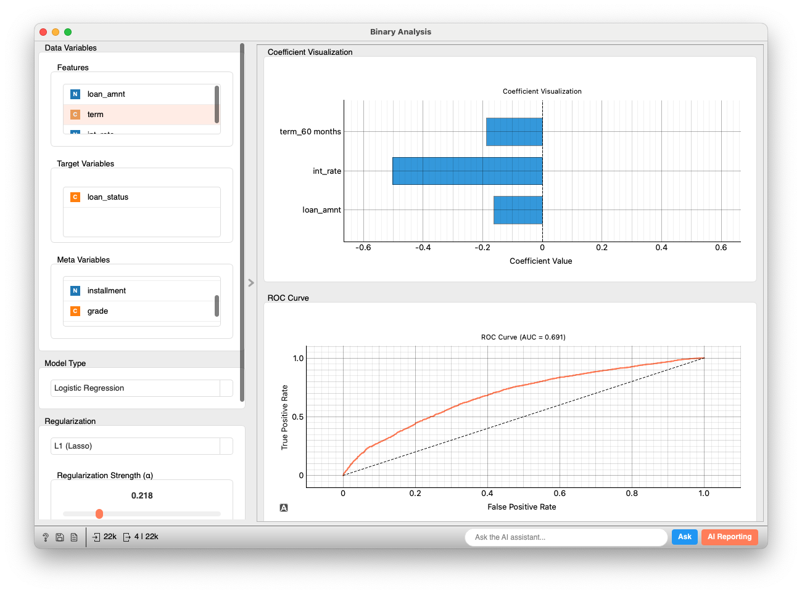

# Binary Analysis

This widget performs binary classification analysis using logistic regression. It allows interactive setting of features and model parameters, model performance evaluation, visualization of coefficients, and display of ROC curves.

## Inputs

*   **Data**: `Orange.data.Table`
    *   The dataset for analysis.
    *   **Specifications**:
        *   The target variable must be a binary discrete variable (e.g., 0/1, Yes/No, having two distinct values).
        *   Continuous and discrete variables can be used as features. Discrete features are internally one-hot encoded (with the `drop_first=True` option).
        *   Rows containing missing values (NaN) in either features or the target variable are excluded before analysis.
    *   **Example**: `heart_disease` dataset, Titanic survival prediction data, etc.

### Example Input Data

Below is a conceptual example of input data that can be used with this widget (e.g., loan approval data).

| loan\_amnt (Feature) | term (Feature) | int\_rate (Feature) | grade (Feature) | installment (Meta) | loan\_status (Target Variable) |
| :------------------- | :------------- | :------------------ | :-------------- | :----------------- | :----------------------------- |
| 10000                | 36 months      | 0.07                | B               | 308.91             | Default                        |
| 2500                 | 60 months      | 0.15                | D               | 59.83              | Fully Paid                     |
| 5000                 | 36 months      | 0.11                | A               | 163.49             | Default                        |
| ...                  | ...            | ...                 | ...             | ...                | ...                            |

*   `loan_amnt`, `int_rate`: Continuous features
*   `term`, `grade`: Discrete features (will be one-hot encoded internally. For example, if `grade` has values A, B, C, dummy variables like `grade_B`, `grade_C` will be generated).
*   `installment`: Meta information (not used for model training).
*   `loan_status`: Binary target variable (e.g., two values like "Default" and "Fully Paid").

## Outputs

*   **Coefficients**: `Orange.data.Table`
    *   A table containing detailed information about each feature (and intercept) of the model.
    *   Columns: `variable` (Meta, feature name), `coefficient` (coefficient value), `p_value` (p-value, only if no regularization), `odds_ratio` (odds ratio), `importance` (importance, absolute value of coefficient), `VIF` (Variance Inflation Factor, NaN for intercept).
*   **Predictions**: `Orange.data.Table`
    *   The original input data (after handling missing values) with added columns for the model's predicted class (`predicted_<target_name>`) and predicted probabilities for each class (e.g., `prob_ClassA`, `prob_ClassB`).

## Feature Description

This widget allows setting model configurations in the control area (left panel) and displays the analysis results in the main area (right panel) after pressing the "Apply" button.

*Figure 1: Overview of the Binary Analysis widget. The settings area is on the left, and analysis results are displayed on the right.*

### Control Area (Left Panel)

1.  **Data Variables**
    *   **Features**: Select explanatory variables to be used for model training from the list (drag & drop enabled).
    *   **Target Variables**: Select one target variable for classification. Must be a binary discrete variable.
    *   **Meta Variables**: Select variables not used for model training but to be included in the output data from the list.

2.  **Model Type**
    *   **Model Type Selection**: Currently fixed to "Logistic Regression".

3.  **Regularization**
    *   **Regularization Type**:
        *   `None`: No regularization (uses `statsmodels` library internally). In this case, p-values, etc., are calculated.
        *   `L1 (Lasso)`: L1 regularization. Tends to make coefficients of unnecessary features zero (uses `scikit-learn` internally).
        *   `L2 (Ridge)`: L2 regularization. Prevents coefficients from becoming too large (uses `scikit-learn` internally).
        *   `Elastic Net`: Regularization that combines both L1 and L2 penalties (uses `scikit-learn` internally).
    *   **Regularization Strength (α)**: Slider to adjust the strength of regularization (from 0.001 to 1.000). Active when regularization type is not `None`. `1/α` is used as the `C` parameter for `scikit-learn`.

4.  **Advanced Options**
    *   **Fit intercept**: Specifies whether to include an intercept (constant term) in the model.
    *   **Normalize features**: Specifies whether to standardize features (scale to mean 0, variance 1) before training. `sklearn.preprocessing.StandardScaler` is used internally.
    *   **Class weights**: Option to address class imbalance in sample sizes.
        *   `None`: No weighting.
        *   `Balanced`: Adjusts weights to give more importance to the minority class.
        *   **Calculate VIF (on sampled data)**: Calculates Variance Inflation Factors for the explanatory variables. For large datasets, VIF is computed on a random sample (default 10,000 rows) to keep computation fast.
    *   **Apply**
    *   Retrains the model and updates the results with the current settings. May also be applied automatically when the widget starts or when data changes, if data is already input.

### Main Area (Right Panel)

The main area is scrollable and displays the following analysis results:

1.  **Model Performance**
    *   Displays key evaluation metrics of the model on the training data.
        *   `Accuracy`
        *   `Precision`
        *   `Recall`
        *   `F1 Score`
        *   `AUC` (Area Under ROC Curve)
        *   `Log Loss`

2.  **Confusion Matrix**
    *   A cross-tabulation of actual classes and predicted classes by the model. Each cell value shows the number of samples and its percentage of the total. Diagonal elements (correctly classified samples) are highlighted in light green, and off-diagonal elements (misclassified samples) are highlighted in light orange.

    |                 | Predicted: Negative | Predicted: Positive |
    | :-------------- | :------------------ | :------------------ |
    | **Actual: Negative** | TN (count, %)       | FP (count, %)       |
    | **Actual: Positive** | FN (count, %)       | TP (count, %)       |

3.  **Coefficients & Variable Importance**
    *   Detailed information about each feature (and intercept) of the model is displayed in a table format.
        *   `VARIABLE`: Feature name or intercept. One-hot encoded variables are displayed with their original variable name and value (e.g., `grade_B`).
        *   `COEFFICIENT`: Learned coefficient value.
        *   `P-Value`: p-value of the coefficient (displayed only if regularization type is `None`). When the dataset contains more than 100,000 rows the widget randomly samples 100,000 rows to approximate p-values; therefore the values are approximate and a warning banner is shown. Blue text if ≤ 0.05, red text otherwise.
        *   `ODDS RATIO`: Odds ratio (`exp(coefficient)`).
        *   `IMPORTANCE`: Variable importance (absolute value of coefficient).
        *   `VIF`: Variance Inflation Factor. Calculation is optional (enable **Calculate VIF** in Advanced Options). The widget computes VIF on a random sample (default 10,000 rows) to accelerate processing on large datasets. Displayed as `-` (or NaN) for the intercept. Orange text if VIF ≥ 5 and < 10, red text if VIF ≥ 10.

4.  **Coefficient Visualization**
    *   Displays the coefficient values of each feature (excluding the intercept) as a bar plot.
    *   Positive coefficients are shown with orange bars, and negative coefficients with blue bars.
    *   The length of the bar represents the absolute magnitude of the coefficient.
    *   The plot height and bar thickness are dynamically adjusted according to the number of variables, maintaining readability even with many variables.

5.  **ROC Curve**
    *   Displays the ROC curve to visually assess the model's discrimination ability.
    *   The horizontal axis is the False Positive Rate (FPR), and the vertical axis is the True Positive Rate (TPR).
    *   A curve closer to the top-left indicates better model performance.
    *   The diagonal line (black dashed line) represents a random prediction.
    *   The plot title displays the AUC (Area Under the Curve) value rounded to three decimal places (e.g., `ROC Curve (AUC = 0.709)`).

## Example

The following example demonstrates the basic usage of the `Binary Analysis` widget using a loan dataset.

1.  **Data Load**: First, use the `File` widget to load the dataset you want to analyze (e.g., loan approval data) into Allye. Assume this data includes features like loan amount (`loan_amnt`), term (`term`), interest rate (`int_rate`), loan grade (`grade`), and a target variable indicating the loan outcome (`loan_status`).

2.  **Widget Connection**: Connect the output of the `File` widget to the `Data` input of the `Binary Analysis` widget.

3.  **Variable Settings**:
    *   Open the `Binary Analysis` widget and set the variables in the left control panel.
    *   **Features**: Move `loan_amnt`, `term`, `int_rate`, etc., to the features list. In the image, dummy variables generated from the categorical variable `grade` (e.g., `grade_B`) are also used as features.
    *   **Target Variables**: Set `loan_status` to the target variable list. This must be binary (e.g., 0 = Fully Paid, 1 = Default).
    *   **Meta Variables**: Move variables like `installment` or `sub_grade`, which are not directly used in the analysis but are to be kept as supplementary information, to the meta variables list.

4.  **Model Parameter Settings**:
    *   **Model Type**: `Logistic Regression` is selected.
    *   **Regularization**: In the example, `L1 (Lasso)` is selected, and the regularization strength (α) is set to `0.218`. This may cause some feature coefficients to become zero, performing variable selection.
    *   **Advanced Options**: `Fit intercept` and `Normalize features` are checked. Since `L1 (Lasso)` is used, class weights can be `None` or `Balanced`. `Balanced` might be selected in the example (not directly readable from the UI, but it's a valid option when using L1).

5.  **Analysis Execution and Result Confirmation**:
    *   Click the "Apply" button (or it's automatically applied), and the logistic regression model will be trained, displaying results in the right main panel.
    *   **Model Performance**: You can check metrics like Accuracy (0.909), F1 Score (0.952), and AUC (0.709).
    *   **Confusion Matrix**: Understand the model's misclassification tendencies through the cross-tabulation of actual and predicted classes.
    *   **Coefficients & Variable Importance**: The table displays coefficient values, P-values (not shown due to L1 regularization), odds ratios, importance, and VIF values for each feature. `const` indicates the intercept.
    *   **Coefficient Visualization**: The magnitude and direction (positive or negative) of coefficients are visually shown in a bar plot.
    *   **ROC Curve**: The ROC curve and AUC value (AUC = 0.709) allow assessment of the model's discrimination ability.

6.  **Utilizing Outputs**:
    *   Connect the **Predictions** output of the `Binary Analysis` widget to a `Data Table` widget to see the original data with added predicted classes and class membership probabilities.
    *   Connect the **Coefficients** output to another `Data Table` to analyze coefficient details (including VIF values) more thoroughly.

## Detailed Logic

1.  **Data Preprocessing (`preprocess_data` method)**:
    *   The input `Orange.data.Table` to the widget is internally converted to a pandas DataFrame.
    *   Data is reconstructed based on the features, target variable, and meta variables selected by the user in the control area.
    *   **Categorical Variable Encoding**: Discrete features are one-hot encoded with scikit-learn’s `OneHotEncoder` (`drop='first'`, `handle_unknown='ignore'`). The first category of each variable is removed as a reference to avoid multicollinearity, and a dense/sparse matrix is produced for efficient computation. Encoded variable names combine the original variable name and the category value (e.g., `grade_B`). The encoded feature names (`self.feature_names`) and a mapping of original variable names to generated dummy variable names (`self.dummy_feature_mapping`) are stored.
    *   **Missing Value Handling**: Rows containing at least one missing value (NaN) in either the features (X) or the target variable (y) are excluded from the analysis.
    *   Finally, a numerical feature matrix `self.X` and a target variable vector `self.y` are prepared for model training.

2.  **Model Building (`build_model` method)**:
    *   An instance of the `glm_utils.logistic_model.LogisticRegressionModel` class is created based on user settings (intercept, normalization, regularization type, regularization strength, class weights).
    *   **VIF Calculation**: At this stage, within the `fit` method of `LogisticRegressionModel`, VIF (Variance Inflation Factor) is calculated using the feature data after one-hot encoding but before scaling (`X_df_for_vif`) and stored in `self.vif_series`. This is to assess multicollinearity among the original features.
    *   **No Regularization (`regularization="None"`)**:
        *   `statsmodels.Logit` is used internally to train the model.
        *   In this case, statistical information such as p-values and standard errors of coefficients are calculated.
        *   The "Class weights (`class_weight`)" option is inactive.
    *   **With Regularization (L1, L2, Elastic Net)**:
        *   `sklearn.linear_model.LogisticRegression` is used internally.
        *   The regularization strength `alpha` is converted to `scikit-learn`'s `C` parameter (`C = 1/alpha`) and passed to the model.
        *   The "Class weights (`class_weight`)" option becomes active.
        *   **Very Large Datasets**:
            *   If `regularization="None"` and the dataset exceeds **500,000** rows, the widget trains the `statsmodels` logistic model on a random sample of **100,000** rows to obtain coefficients and p-values quickly. A warning banner indicates that sampling was used and the statistics are approximate.
            *   When using scikit-learn logistic regression (`regularization` ≠ `None`) and the dataset exceeds **1,000,000** rows (or if *Incremental learning* is explicitly enabled), the widget automatically switches to `SGDClassifier` with incremental learning. This keeps memory usage low but means that coefficients and metrics are approximate; a corresponding warning is displayed in the footer.
    *   If "Normalize features (`normalize_features=True`)" is selected, features are standardized using `sklearn.preprocessing.StandardScaler` before model training. This scaler is `fit_transform`ed on the training data and only `transform`ed for subsequent predictions.
    *   The model is trained (`model.fit()`) using the prepared `self.X` and `self.y`, and the list of encoded feature names (`self.feature_names` or `model.input_feature_names_for_vif`).

3.  **Model Evaluation (`evaluate_model` method)**:
    *   Using the trained model (`self.model`), predicted class labels (`y_pred`) and class membership probabilities (`y_proba`) are obtained for the training data (`self.X`, `self.y`). Data is passed through `_prepare_data` (scaling, etc.) as needed.
    *   The following evaluation metrics are calculated using functions from the `sklearn.metrics` module:
        *   `accuracy_score`
        *   `precision_score` (`zero_division=0` setting)
        *   `recall_score` (`zero_division=0` setting)
        *   `f1_score` (`zero_division=0` setting)
        *   `roc_auc_score` (AUC)
        *   `log_loss`
        *   `confusion_matrix`
        *   `roc_curve` (False Positive Rate FPR and True Positive Rate TPR for ROC curve plotting)
    *   These evaluation results are stored in a dictionary object `self.evaluation_results`.

4.  **Result Display (`display_results` method)**:
    *   Information stored in `self.evaluation_results` and retrieved from the model (coefficients, VIF, etc.) is formatted and displayed in the various GUI components (labels, tables, plots) in the main area.
    *   The coefficients table displays all coefficients including the intercept, p-values (only when using `statsmodels`), odds ratios (`exp(coefficient)`), importance (absolute value of coefficient), and VIF values. VIF values are obtained from the model's `get_vif_values()` method and matched with the respective variable names in the coefficients table.
    *   The coefficient visualization plot displays coefficients of features (excluding the intercept) as a bar plot.
    *   The ROC curve plot displays FPR, TPR, and the calculated AUC value.

5.  **Output Data Generation**:
    *   **Coefficients (`create_coefficients_table` method)**: A new `Orange.data.Table` is generated and outputted based on coefficient names, values, p-values, odds ratios, importance, and VIF values obtained from the model. The domain has `ContinuousVariable("coefficient")`, `ContinuousVariable("p_value")`, `ContinuousVariable("odds_ratio")`, `ContinuousVariable("importance")`, `ContinuousVariable("VIF")` as attributes, and `StringVariable("variable")` as meta information.
    *   **Predictions (`create_predictions_table` method)**: Based on the preprocessed input data (`self.preprocessed_data`), an `Orange.data.Table` is generated and outputted with new columns for the model's predicted class labels (e.g., `predicted_target`) and predicted probabilities for each class (e.g., `prob_0`, `prob_1`).