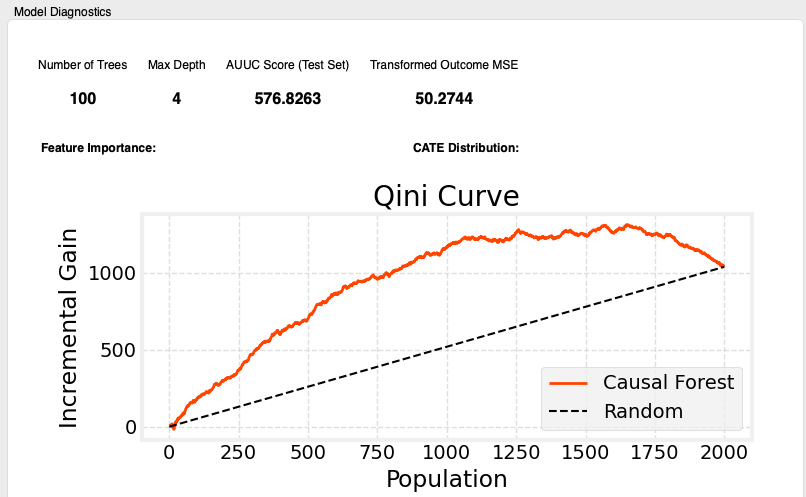
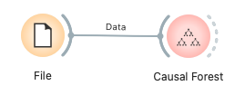

# Causal Forest

Causal Forest is a machine learning method that uses an ensemble of decision trees to estimate heterogeneous treatment effects. By having each tree partition the samples in different ways and estimate individual treatment effects (CATE: Conditional Average Treatment Effect), the overall model achieves high generalization performance and stability. This widget allows you to easily build, evaluate, and visualize Causal Forest models within Orange.

---

## Inputs

*   **Data**:
    *   Data type: `Orange.data.Table`
    *   Description: The dataset for analysis. It must include a treatment variable, an outcome variable, covariates (features), and optionally, metadata.

### Input Data Specifications

The input data is expected to contain the following information:

*   **Treatment Variable**:
    *   A variable indicating which samples were assigned to the treatment group and which to the control group.
    *   **Must be a binary (two-category) Discrete Variable.** Within the widget, you will select which value represents the control group (encoded as 0 for analysis).
*   **Outcome Variable**:
    *   The variable for which you want to evaluate the effect of the intervention (e.g., sales, conversion rate, customer satisfaction).
    *   Can be a numerical (Continuous Variable) or discrete (Discrete Variable).
*   **Covariates**:
    *   Variables that may affect the outcome variable and potentially explain the heterogeneity of the treatment effect (features).
    *   Can be a numerical (Continuous Variable) or discrete (Discrete Variable).
*   **Meta Variables** (Optional):
    *   Identifiers or additional information not directly used in the analysis but to be retained in the data.

### Input Data Example

| User ID (Meta) | Age (Covariate) | Gender (Covariate) | Plan (Covariate) | New UI (Treatment) | CV (Outcome) |
| :------------- | :-------------- | :----------------- | :--------------- | :----------------- | :----------- |
| user001        | 35              | Male               | Premium          | Treatment          | 1            |
| user002        | 22              | Female             | Free             | Control            | 0            |
| user003        | 45              | Male               | Free             | Treatment          | 0            |
| user004        | 28              | Female             | Premium          | Control            | 1            |
| ...            | ...             | ...                | ...              | ...                | ...          |

---

## Outputs

*   **Enhanced Data**:
    *   Data type: `Orange.data.Table`
    *   Description: The original data with three meta columns added: `CATE` (Conditional Average Treatment Effect), `y_hat_control` (predicted outcome if in the control group), and `y_hat_treatment` (predicted outcome if in the treatment group). This allows for subsequent analysis not only of the estimated treatment effect for each sample but also the predicted outcomes for both treatment scenarios.

---

## Feature Description

*(Figure: Placeholder for the overall interface of the Causal Forest widget)*

### Control Area (Left Panel)

*   **Data Variables**
    *   **Treatment Variable**: Select the binary treatment variable and specify the Control Group Value, which will be encoded as 0.　Other wise it will be encoded as 1.
    *   **Outcome Variable**: Select the outcome variable.
    *   **Covariates**: Drag and drop variables to be used in the analysis into this list.
    *   **Meta Variables**: Move variables not used in the analysis but to be kept in the data to this list.
*   **Forest Hyperparameters**
    *   **Max Depth**: Sets the maximum depth of each decision tree in the forest.
    *   **Number of Trees**: Sets the number of decision trees to build in the forest.
    *   **Sample Rate (%)**: Percentage of rows to subsample from the training set before fitting the forest. Note: The actual number of training records is capped at 50,000 for performance.
    *   **Feature Importance Method**: Select the method for calculating feature importance.
        *   `Impurity`: Impurity-based (fast, can be biased).
        *   `Permutation`: Permutation-based (more reliable but computationally expensive).
*   **Evaluation Settings**
    *   **Test Set Size (%)**: The percentage of data (0–99) to be held out as a test set for model evaluation and feature importance calculation. If set to 0, the entire dataset is used for training. When `Test Set Size` > 0, metrics like AUUC Score and Transformed Outcome MSE are calculated on this held-out test set.
*   **Apply Button**
    *   Executes the Causal Forest analysis based on the set parameters. Becomes active when all required variables are selected.

### Main Area (Right Panel)

*   **Model Diagnostics**
    *   **Metrics**:
        *   `Number of Trees`: The actual number of trees used in the trained forest.
        *   `Max Depth`: The maximum depth among all trees in the forest.
        *   `AUUC Score (Test Set)`: Area Under the Uplift Curve (evaluated only when a test set is provided). When no test set is used, this field shows “-”.
        *   `Transformed Outcome MSE`: The Mean Squared Error between the Transformed Outcome and the predicted CATE on the test set (available only when a test set is provided).
    *   **Feature Importance**: A horizontal bar chart visualizing the importance of the covariates. The chart title indicates whether importance was computed on the `Test Set` or on the `Training Data` when no test set is used.
    *   **CATE Distribution**: A histogram showing the distribution of the predicted CATE.
    *   **SHAP Summary Plot**: A summary plot highlighting feature impact on predicted CATE (computed on a random subsample of the training data, up to 1,000 rows). If the `shap` library is not installed or SHAP computation fails, this plot will be omitted.
    *   **Qini Curve**: A plot of the Qini Curve (or Uplift Curve) to visualize the model's ranking performance.

---

## Usage Example

*(Figure: Placeholder for a basic workflow of the Causal Forest widget, e.g., File -> Causal Forest -> Data Table)*

1.  Load the dataset for analysis using the **File** widget.
2.  Connect the output of the **File** widget to the `Data` input of the **Causal Forest** widget.
3.  Open the **Causal Forest** widget and configure the following in the control panel:
    *   Select `Treatment Variable`, `Control group value`, and `Outcome Variable`.
    *   Assign variables to the `Covariates` and `Meta Variables` lists.
    *   In `Forest Hyperparameters`, set `Max Depth`, `Number of Trees`, `Sample Rate (%)`, and `Feature Importance Method`.
    *   In `Evaluation Settings`, set `Test Set Size (%)` when you want to compute evaluation metrics on a held-out test set.
    *   Click the `Apply` button.
4.  Examine the results in the main area:
    *   Check Feature Importance, CATE distribution, SHAP Summary (when available), AUUC/Qini Curve, etc., in `Model Diagnostics`.
    *   Visualize the model's ranking performance with the `Qini Curve`.
5.  Connect the `Enhanced Data` output of the **Causal Forest** widget to a **Data Table** widget to view the data with added CATE and predicted outcome columns.

---

## Reporting Feature

This widget supports Orange's standard reporting functionality. By right-clicking on the widget and selecting "Send Report," or by calling it from the report viewer, a report containing the following information can be generated:

*   Basic information about the input data (number of instances, number of attributes)
*   Selected main variables (treatment variable, control group, outcome variable)
*   Key model settings (maximum depth, number of trees, feature importance method, test set size)
*   The number and list of selected covariates (up to the first 10)
*   Plots, when available: Feature Importance, CATE Distribution, SHAP Summary, and Qini Curve

---

## Detailed Logic

### 1. Data Preparation (`CausalForestLogic._prepare_data`)

1.  **Data Conversion**: Converts the Orange Table format to the Numpy array format (X, y, treatment) required by the analysis library.
2.  **Variable Selection**: Slices the data based on the covariates, outcome variable, and treatment variable specified in the UI.
3.  **Control Group Encoding**: Ensures that the specified control group value is treated as the numerical value 0 in the model; the other value is treated as 1.
4.  **Categorical Handling**: Categorical covariates are one-hot encoded automatically (column names become `variable=value`).

### 2. Causal Forest Model Estimation (`CausalForestLogic.run_analysis`)

*   Uses `causalml.inference.tree.CausalRandomForestRegressor` to build the model. Unlike a standard Random Forest, a Causal Forest searches for splits that maximize the difference in treatment effects between the child nodes.
*   Training is performed on a subsample of the training data according to the configured `Sample Rate (%)`, with an upper cap of 50,000 rows. Additionally, each tree uses at most 10,000 rows (`max_samples`) for fitting to improve performance.
*   Calls `model.fit(X_train, y_train, treatment)` to train the model.
*   After training, uses `model.predict(X, with_outcomes=True)` to obtain not only the CATE but also `y_hat_control` and `y_hat_treatment`.

### 3. Model Evaluation and Metrics

*   When `Test Set Size (%)` > 0, the widget performs evaluation on the held-out test set; otherwise, evaluation metrics dependent on a test set are omitted.
*   **AUUC Score (`_calculate_auuc`)**: Samples are sorted in descending order of their predicted CATE on the test set, an Uplift/Qini curve is created, and the area under this curve is calculated. This evaluates the model's ranking performance.
*   **Feature Importance (`_calculate_feature_importance`)**:
    *   **Impurity-based**: Mean decrease in impurity aggregated over all trees.
    *   **Permutation-based**: Uses `sklearn.inspection.permutation_importance` on the model's own CATE predictions as the baseline target. Computed on the test set when available; otherwise on the training data.
*   **Transformed Outcome MSE (`_calculate_transformed_outcome_mse`)**:
    *   Calculates the Mean Squared Error (MSE) between the predicted CATE and a "Transformed Outcome," which is derived using a propensity score model (Logistic Regression), evaluated on the test set.
*   **SHAP Values**: When the `shap` library is available, SHAP values are computed with `shap.TreeExplainer` on a random subsample of up to 1,000 training rows and visualized as a summary plot in the diagnostics.

### 4. Visualization (`OWCausalForest.display_results`)

*   **Feature Importance**: Plotted as a horizontal bar chart.
*   **CATE Distribution**: Plotted as a histogram.
*   **SHAP Summary Plot**: Visualizes feature impact on predicted CATE (when available).
*   **Qini Curve**: The Uplift Curve is plotted.

---

> **Note**: By integrating multiple trees, Causal Forest achieves higher predictive performance and robustness than a single Causal Tree, though at the cost of some interpretability. This widget facilitates model insight through metrics like Feature Importance, SHAP Summary, and the Qini Curve.

---

## Performance Notes

* Training rows used are limited by the configured `Sample Rate (%)` and are additionally capped at 50,000 rows for performance.
* Each tree is fitted on at most 10,000 rows (`max_samples`), which can improve speed and memory usage on large datasets.
* SHAP computation is performed on up to 1,000 randomly sampled training rows to keep runtime reasonable. If `shap` is not installed, the SHAP plot is skipped gracefully.