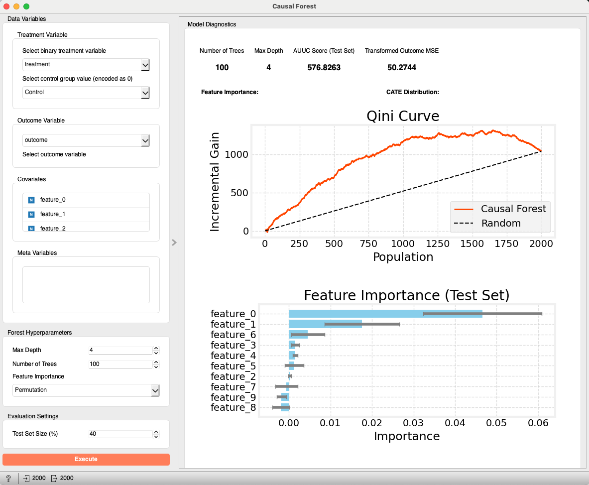
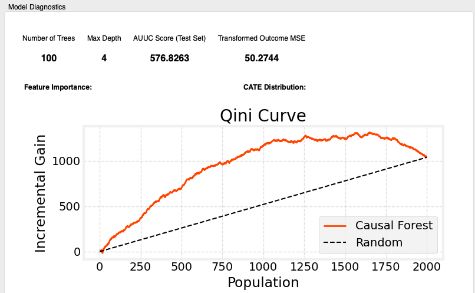
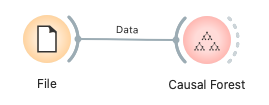

# Causal Forest

Causal Forest（因果ランダムフォレスト）は、複数の決定木をアンサンブルして、サンプルごとの処置効果（CATE: Conditional Average Treatment Effect）の異質性を推定する手法です。各木がサンプルを異なる方法で分割してCATEを推定することで、汎化性能と安定性を高めます。本ウィジェットを使うと、Orange上でCausal Forestを簡単に構築・評価・可視化できます。

---

## 入力

* **Data**
  * データ型: `Orange.data.Table`
  * 説明: 分析対象のデータセット。処置変数、結果変数、共変量（特徴量）、およびオプションでメタデータを含む必要があります。

### 入力データの仕様

入力データには以下の情報が含まれている必要があります。

* **処置変数 (Treatment Variable)**
  * どのサンプルが処置群（Treatment Group）に割り当てられ、どのサンプルが対照群（Control Group）に割り当てられたかを示す変数。
  * 推奨は二値（2カテゴリ）の離散変数です。ウィジェットで対照群（0として扱う）を選択します。多値（3カテゴリ以上）の場合は、対照以外の全カテゴリをまとめて「処置(1)」として扱います。処置/結果に欠損がある行は学習・評価の前に除外します。
* **結果変数 (Outcome Variable)**
  * 処置の効果を評価したい変数（例: 売上、コンバージョン率、顧客満足度）。
  * 数値（Continuous）または二値離散（2カテゴリ）のみ対応します。多クラス離散は非対応です。二値離散の場合は「Positive Outcome Class（陽性クラス）」を選択でき、陽性=1、陰性=0にエンコードします。連続はそのまま使用します。
* **共変量 (Covariates)**
  * 処置効果の異質性を説明する可能性のある変数（特徴量）。
  * 数値（Continuous Variable）または離散（Discrete Variable）が使用可能です。
* **メタ変数 (Meta Variables)** *(任意)*
  * 分析には直接使用しないが、データに保持しておきたい識別子や追加情報。

### 入力データ例

| User ID (Meta) | Age (Covariate) | Gender (Covariate) | Plan (Covariate) | New UI (Treatment) | CV (Outcome) |
| :------------- | :-------------- | :----------------- | :--------------- | :----------------- | :----------- |
| user001        | 35              | Male               | Premium          | Treatment          | 1            |
| user002        | 22              | Female             | Free             | Control            | 0            |
| user003        | 45              | Male               | Free             | Treatment          | 0            |
| user004        | 28              | Female             | Premium          | Control            | 1            |
| ...            | ...             | ...                | ...              | ...                | ...          |

---

## 出力

* **Enhanced Data**
  * データ型: `Orange.data.Table`
  * 説明: 元データに `CATE`（条件付き平均処置効果）、`y_hat_control`（対照群だった場合の予測結果）、`y_hat_treatment`（処置群だった場合の予測結果）の3列をメタ列として追加したデータ。これにより、各サンプルの推定処置効果だけでなく、処置の有無両方の場合の予測結果を後続解析に利用できます。

---

## 機能説明

*(図: Causal Forest ウィジェットのインターフェース全体のプレースホルダー)*

### コントロールエリア（左パネル）

* **Data Variables**
  * **Treatment Variable**
    * 処置変数を選択し、Control Group Value を指定します（0 としてエンコード）。多値の場合は対照以外を 1（処置）に集約し、ウィジェットに警告が表示されます。
  * **Outcome Variable**
    * 結果変数を選択します。二値離散の場合は「Positive Outcome Class（陽性クラス）」の選択が表示されます。多クラス離散は選択するとエラーになります。
  * **Covariates**
    * 解析に使用する共変量をドラッグ＆ドロップでリストに追加します。
  * **Meta Variables**
    * 解析に使用しないが保持したい変数を移動します。
* **Forest Hyperparameters**
  * **Maximum Depth**: 各決定木の最大深さ。
  * **Number of Trees**: 森を構成する決定木の本数。
  * **Sample Rate (%)**: 学習前にトレーニングデータからサブサンプリングする割合。パフォーマンス上、実際に学習に使われる行数は最大 50,000 行に制限されます。
  * **Random State**: 再現性を制御します（データ分割、サブサンプル、モデル初期化、Permutation 重要度、傾向スコア推定に影響）。−1 で無効化。
  * **Feature Importance Method**
    * `Impurity`: 不純度減少ベース（高速、バイアスあり）。
    * `Permutation`: 置換インポータンス（信頼性は高いが計算コストが大きい）。
  * **Permutation Repeats**: Permutation 重要度の繰り返し回数。`Permutation` 選択時のみ有効。特徴量数×繰り返しが大きい場合は警告を表示します（おおまかなヒューリスティクス）。
* **Evaluation Settings**
  * **Test Set Size (%)**: テストデータに取り分ける割合（0–99）。0 の場合は全データで学習し、テストセット依存の指標は表示されません。0 より大きい場合、AUUC や Transformed Outcome MSE などは、このテストデータで評価されます。
* **Apply Button**
  * すべての必須変数が設定されると有効になり、クリックで学習・評価を実行します。

### メインエリア（右パネル）

* **Model Diagnostics**
  * **Metrics**
    * `Number of Trees`: 実際に学習に使用された木の本数。
    * `Max Depth`: 森に含まれる木の最大深さ。
    * `AUUC Score (Test Set)`: Uplift（Qini）曲線下の面積。テストセットを設定した場合のみ表示され、設定しない場合は「-」となります。
    * `Transformed Outcome MSE`: テストデータにおける Transformed Outcome と CATE 予測の MSE（テストセット設定時のみ）。
  * **Feature Importance**: 共変量の重要度を水平棒グラフで表示。グラフのタイトルには、`Test Set` で計算されたのか、テストセット未使用時の `Training Data` なのかが明示されます。
  * **CATE Distribution**: 予測 CATE の分布をヒストグラムで表示。
  * **SHAP Summary Plot**: 予測されたCATEに対する特徴量影響の要約図。学習データから最大 1,000 行をランダムサンプルして計算します。`shap` ライブラリが未導入の場合や計算に失敗した場合は省略されます。
  * **Qini Curve**: Qini Curve（Uplift Curve）を描画し、モデルのランキング性能を可視化。

---

## 使用例

*(図: File → Causal Forest → Data Table の基本ワークフロー例)*

1. **File** ウィジェットでデータを読み込みます。
2. **File** の出力を **Causal Forest** ウィジェットの `Data` 入力に接続します。
3. **Causal Forest** を開き、左パネルで以下を設定します。
   * `Treatment Variable`, `Control group value`, `Outcome Variable` を選択。
   * `Covariates` と `Meta Variables` に変数を割り当て。
   * `Forest Hyperparameters` で `Maximum Depth`, `Number of Trees`, `Sample Rate (%)`, `Feature Importance Method` を設定。
   * `Evaluation Settings` で必要に応じて `Test Set Size (%)` を設定。
   * **Apply** をクリック。
4. 右パネルで結果を確認します。
   * **Model Diagnostics** で Feature Importance、CATE 分布、SHAP サマリー（利用可能な場合）、AUUC/Qini などを確認。
   * **Qini Curve** でモデルのランキング性能を可視化。
5. `Enhanced Data` 出力を **Data Table** などに接続し、CATE や予測アウトカム列を確認します。

---

## レポート機能

ウィジェットを右クリックして **Send Report** を選択するか、レポートビューアから呼び出すことで、以下の情報を含むレポートを生成できます。

* 入力データの基本情報（インスタンス数、属性数）
* 選択された主要変数（処置変数、対照群、結果変数）
* モデル設定（最大深さ、木の本数、特徴量重要度の計算方法、テストセットサイズ）
* 選択された共変量の数とリスト（最初の 10 個まで）
* プロット（利用可能な場合）：Feature Importance、CATE 分布、SHAP サマリー、Qini 曲線

---

## 詳細ロジック

### 1. データ準備 (`CausalForestLogic._prepare_data`)

1. **データ変換**: Orange Table から Numpy 配列（X, y, treatment）に変換します。
2. **変数選択**: 共変量、結果変数、処置変数に基づいてデータをスライスします。
3. **対照群のエンコーディング**: 指定された対照群の値を数値 0 とし、それ以外は 1（処置）として扱います。処置/結果の欠損行は学習・評価前に除外します。
4. **結果変数のマッピング**: 結果が二値離散のとき、選択した陽性クラスを 1、もう一方を 0 にマッピングします。多クラス離散は非対応。連続はそのまま使用します。
5. **カテゴリ変数の処理**: 共変量のカテゴリ変数は自動でワンホットエンコードされ、列名は `変数=値` 形式になります。

### 2. モデル学習 (`CausalForestLogic.run_analysis`)

* `causalml.inference.tree.CausalRandomForestRegressor` を使用して Causal Forest を構築します。通常のランダムフォレストとは異なり、Causal Forest は子ノード間の処置効果差が最大化されるように分岐を探索します。
* 学習は `Sample Rate (%)` に基づいてトレーニングデータをサブサンプリングして実行され、さらにパフォーマンスのため学習に用いる行数は最大 50,000 行に制限されます。各木は最大 10,000 行（`max_samples`）でフィットします。
* `model.fit(X_train, y_train, treatment)` で学習します。
* 学習後、`model.predict(X, with_outcomes=True)` により CATE だけでなく `y_hat_control` と `y_hat_treatment` も取得します。
* **SHAP 値**: `shap.TreeExplainer` を用いて、学習データから最大 1,000 行をランダムサンプルして SHAP 値を計算し、可視化に利用します（`shap` 未導入時はスキップ）。

### 3. モデル評価と指標

* `Test Set Size (%)` を設定した場合にテストデータで評価が行われます（未設定の場合、テストセット依存の指標は省略）。
* **AUUC スコア（`_calculate_auuc`）**: テストデータ上で `causalml.metrics.auuc_score` により算出します。結果がバイナリ（0/1）の場合のみ計算され、それ以外では省略（UI は「-」表示）。
* **特徴量重要度（`_calculate_feature_importance`）**:
  * `Impurity`: モデル内の `feature_importances_`（各木の不純度減少の平均）。
  * `Permutation`: `sklearn.inspection.permutation_importance` を使用し、モデル自身の CATE 予測をベースライン目標として `neg_mean_squared_error` で評価。テストセットがある場合はテストデータ、ない場合は学習データで計算します。繰り返し回数は UI で設定可能です。
* **Transformed Outcome MSE（`_calculate_transformed_outcome_mse`）**: 傾向スコア（ロジスティック回帰、`solver='sag'`, `max_iter=200`, `random_state=42`）を用いて Transformed Outcome を算出し、予測CATEとの MSE をテストデータで評価します。数値の不安定性を避けるため、傾向スコアは `[0.01, 0.99]` にクリップされます。
* **SHAP 値**: `shap` が利用可能な場合、テストセット（存在する場合）または学習データから最大 1,000 行をランダムサンプルして `shap.TreeExplainer` で計算し、サマリー図を表示します。プロットタイトルにどちらのスライスかを明記します。

### 4. 可視化 (`OWCausalForest.display_results`)

* **Feature Importance**: 水平棒グラフ。
* **CATE Distribution**: ヒストグラム。
* **SHAP Summary Plot**: 特徴量影響の要約図（利用可能な場合）。
* **Qini Curve**: Uplift/Qini 曲線。

---

> **補足**: Causal Forest は多数の木を統合することで、Causal Tree よりも高い予測性能とロバスト性を実現しますが、解釈性はやや下がります。本ウィジェットは、Feature Importance、SHAP サマリー、Qini 曲線といった可視化を通じて、モデルの洞察を得やすくしています。

---

## パフォーマンス/再現性に関する注意

* 学習に使用する行数は `Sample Rate (%)` に基づくサブサンプルのうち最大 50,000 行に制限されます。
* 各決定木は最大 10,000 行（`max_samples`）で学習されます。大規模データにおける速度とメモリ使用量の改善を目的としています。
* SHAP の計算は、テストセット（あれば）または学習データから最大 1,000 行をランダム抽出して実行します。`shap` が未導入の場合は自動的にスキップされます。
* `Random State` 設定により、分割・サブサンプリング・モデル初期化・Permutation 重要度・傾向スコア推定が再現可能になります（−1 で無効化）。

## キャンセルについて

* Cancel ボタンは、データ分割・サブサンプル・学習・SHAP・予測・評価といったフェーズ間の安全地点で停止します。学習処理の真っ最中には割り込めないため、現在のフェーズが完了した後に中断が反映されます。
