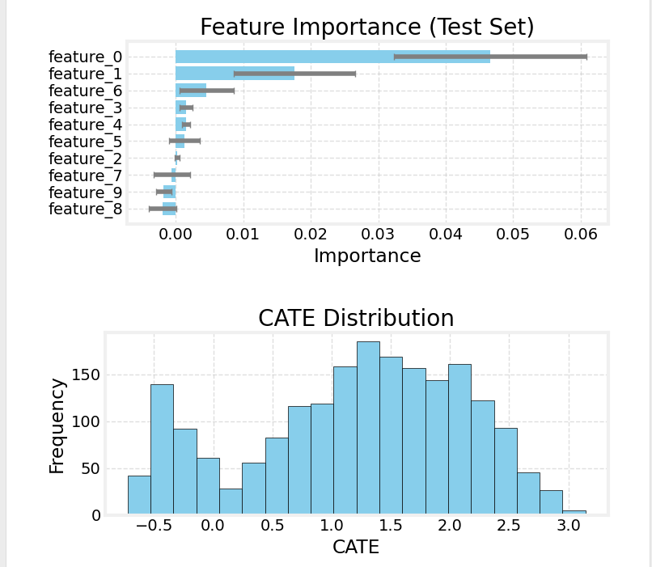

# Causal Forest

Causal Forest（因果ランダムフォレスト）は、複数の決定木をアンサンブル学習させて処置効果（Treatment Effect）の異質性を推定する機械学習手法です。各木がサンプルを異なる方法で分割し、個別の処置効果（CATE: Conditional Average Treatment Allye 上で Causal Forest を簡単に構築・評価し、結果を可視化できます。

---

## 入力

* **Data**
  * データ型: `Orange.data.Table`
  * 説明: 分析対象のデータセット。処置変数、結果変数、共変量（特徴量）、およびオプションでメタデータを含む必要があります。

### 入力データの仕様

入力データには以下の情報が含まれている必要があります。

* **処置変数 (Treatment Variable)**
  * どのサンプルが処置群（Treatment Group）に割り当てられ、どのサンプルが対照群（Control Group）に割り当てられたかを示す変数。
  * **必ず二値（2 カテゴリ）の離散変数（Discrete Variable）である必要があります。** ウィジェット内で、どちらの値を対照群（0 としてエンコード）とするかを選択します。
* **結果変数 (Outcome Variable)**
  * 処置の効果を評価したい変数（例: 売上、コンバージョン率、顧客満足度）。
  * 数値（Continuous Variable）または離散（Discrete Variable）が使用可能です。
* **共変量 (Covariates)**
  * 処置効果の異質性を説明する可能性のある変数（特徴量）。
  * 数値（Continuous Variable）または離散（Discrete Variable）が使用可能です。
* **メタ変数 (Meta Variables)** *(任意)*
  * 分析には直接使用しないが、データに保持しておきたい識別子や追加情報。

### 入力データ例

| User ID (Meta) | Age (Covariate) | Gender (Covariate) | Plan (Covariate) | New UI (Treatment) | CV (Outcome) |
| :------------- | :-------------- | :----------------- | :--------------- | :----------------- | :----------- |
| user001        | 35              | Male               | Premium          | Treatment          | 1            |
| user002        | 22              | Female             | Free             | Control            | 0            |
| user003        | 45              | Male               | Free             | Treatment          | 0            |
| user004        | 28              | Female             | Premium          | Control            | 1            |
| ...            | ...             | ...                | ...              | ...                | ...          |

---

## 出力

* **Enhanced Data**
  * データ型: `Orange.data.Table`
  * 説明: 元データに Causal Forest が予測した CATE (条件付き平均処置効果)、`y_hat_control` (対照群だった場合の予測結果)、`y_hat_treatment` (処置群だった場合の予測結果) の3列をメタ列として追加したデータ。これにより、各サンプルの推定処置効果だけでなく、処置の有無両方の場合の予測結果を後続解析に利用できます。

---

## 機能説明

*(図: Causal Forest ウィジェットのインターフェース全体のプレースホルダー)*

### コントロールエリア（左パネル）

* **Data Variables**
  * **Treatment Variable**
    * 二値処置変数を選択します。
    * Control Group Value を指定し、0 としてエンコードします。それ以外は1としてエンコードされ、Treatment Groupとして扱われます。
  * **Outcome Variable**
    * 結果変数を選択します。
  * **Covariates**
    * 解析に使用する共変量をドラッグ＆ドロップでリストに追加します。
  * **Meta Variables**
    * 解析に使用しないが保持したい変数を移動します。
* **Forest Hyperparameters**
  * **Maximum Depth**: 各決定木の最大深さ。
  * **Number of Trees**: 森を構成する決定木の本数。
  * **Feature Importance Method**
    * `Impurity`: 不純度減少ベース（高速、バイアスあり）。
    * `Permutation`: 置換インポータンス（信頼性高いが計算コスト大）。
  * **Test Set Size (%)**: モデル評価と特徴量重要度の計算に使用するテストデータの割合 (0–99)。0 を指定した場合、全データで学習し、各種指標は学習データに基づいて計算されます。0より大きい値を指定すると、その割合のデータをテスト用に取り分け、AUUC ScoreやTransformed Outcome MSEなどの評価指標は、このテストデータで計算されます。
* **Apply Button**
  * すべての必須変数が設定されると有効になり、クリックで学習・評価を実行します。

### メインエリア（右パネル）

* **Model Diagnostics**
  * **Metrics**
    * `Number of Trees`: 実際に学習に使用された木の本数。
    * `Max Depth`: 森に含まれる木の最大深さ。
    * `AUUC Score (Test Set)`: Uplift Curve 下の面積。高いほど良いランキング性能を示します。
    * `Transformed Outcome MSE`: テストデータにおける Transformed Outcome と CATE 予測の MSE。
  * **Feature Importance**: 共変量の重要度を棒グラフで表示。
  * **CATE Distribution**: 予測 CATE の分布をヒストグラムで表示。
  * **Qini Curve**: Qini Curve (Uplift Curve) を描画し、モデルのランキング性能を可視化。

---

## 使用例

*(図: File → Causal Forest → Data Table の基本ワークフロー例)*

1. **File** ウィジェットでデータを読み込みます。
2. **File** の出力を **Causal Forest** ウィジェットの `Data` 入力に接続します。
3. **Causal Forest** を開き、左パネルで以下を設定します。
   * `Treatment Variable`, `Control group value`, `Outcome Variable` を選択。
   * `Covariates` と `Meta Variables` に変数を割り当て。
   * `Forest Hyperparameters` で `Maximum Depth`, `Number of Trees`, `Feature Importance Method`, `Test Set Size` を設定。
   * **Apply** をクリック。
4. 右パネルで結果を確認します。
   * **Model Diagnostics** で AUUC, Feature Importance, CATE 分布などを確認。
   * **Qini Curve** でモデルのランキング性能を可視化。
5. `Enhanced Data` 出力を **Data Table** などに接続し、CATE や予測アウトカム列を確認します。

---

## レポート機能

ウィジェットを右クリックして **Send Report** を選択するか、レポートビューアから呼び出すことで、以下の情報を含むレポートを生成できます。

* 入力データの基本情報（インスタンス数、属性数）
* 選択された主要変数（処置変数、対照群、結果変数）
* モデル設定（最大深さ、木の本数、特徴量重要度の計算方法、テストセットサイズ）
* 選択された共変量の数とリスト（最初の 10 個まで）

---

## 詳細ロジック

### 1. データ準備 (`CausalForestLogic._prepare_data`)

1. **データ変換**: Orange Table から Numpy 配列 (X, y, treatment) に変換します。
2. **変数選択**: 共変量、結果変数、処置変数に基づいてデータをスライスします。
3. **対照群のエンコーディング**: 指定された対照群の値を数値 0 として扱います。

### 2. モデル学習 (`CausalForestLogic.run_analysis`)

* `causalml.inference.tree.CausalRandomForestRegressor` を使用して Causal Forest を構築します。通常のランダムフォレストとは異なり、Causal Forestは処置効果の差が最大になるように分岐を探索します。
* `model.fit(X_train, y_train, treatment)` で学習します。
* 学習後、`model.predict(X, with_outcomes=True)` により CATE だけでなく `y_hat_control`, `y_hat_treatment` も取得します。

### 3. モデル評価と指標

* **AUUC Score (`_calculate_auuc`)**: サンプルを予測されたCATEの降順で並べ、Uplift Curve（横軸：対象者数、縦軸：累積処置効果）を作成し、その曲線下の面積を計算します。これにより、モデルのランキング性能を評価します。
* **Feature Importance (`_calculate_feature_importance`)**
  * `Impurity`: 各木の不純度減少を平均化。
  * `Permutation`: `sklearn.inspection.permutation_importance` を用いて特徴量をシャッフルし性能低下を測定。
* **Transformed Outcome MSE (`_calculate_transformed_outcome_mse`)**
  * ロジスティック回帰で傾向スコアを推定し、それを用いて Transformed Outcome を計算後、CATE予測値とのMSE（平均二乗誤差）を算出します。

### 4. 可視化 (`OWCausalForest.display_results`)

* **Feature Importance**: 棒グラフ。
* **CATE Distribution**: ヒストグラム。
* **Qini Curve**: Qini Curve (Uplift Curve)。

---

> **補足**: Causal Forest は多数の木を統合することで、Causal Tree よりも高い予測性能とロバスト性を実現しますが、解釈性がやや下がります。本ウィジェットは、Feature Importance や Qini Curve などの指標を通じて、モデルの洞察を得やすくしています。 