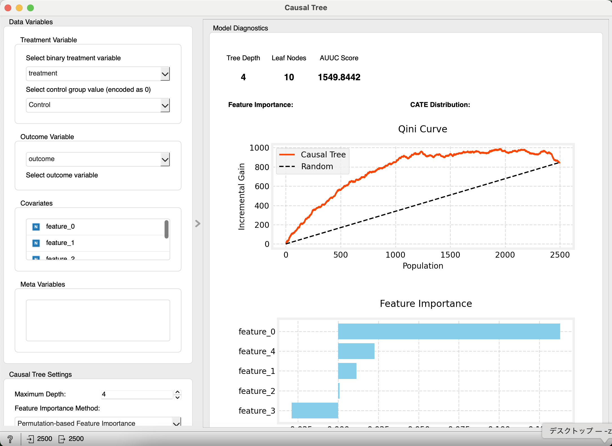
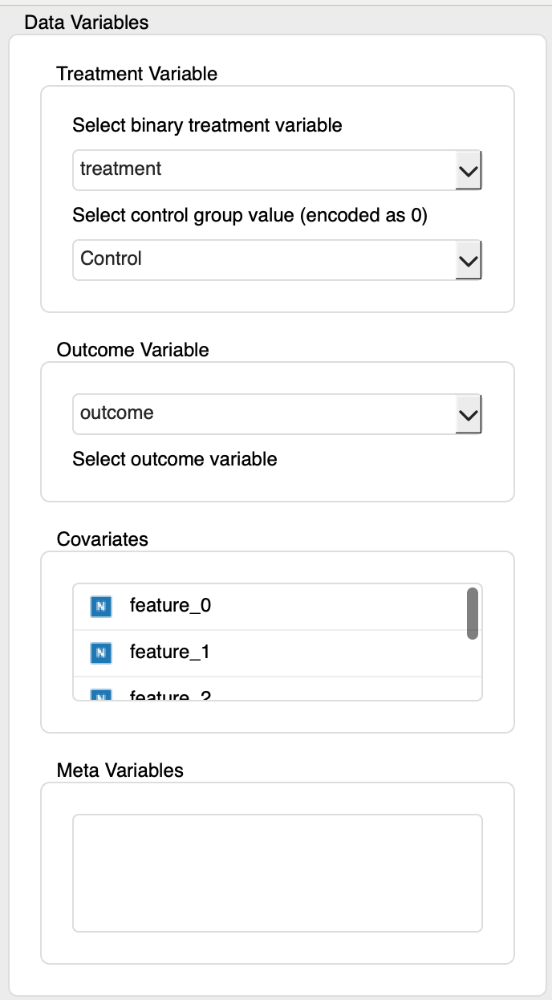
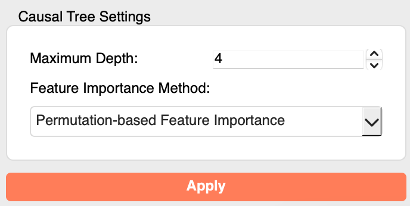
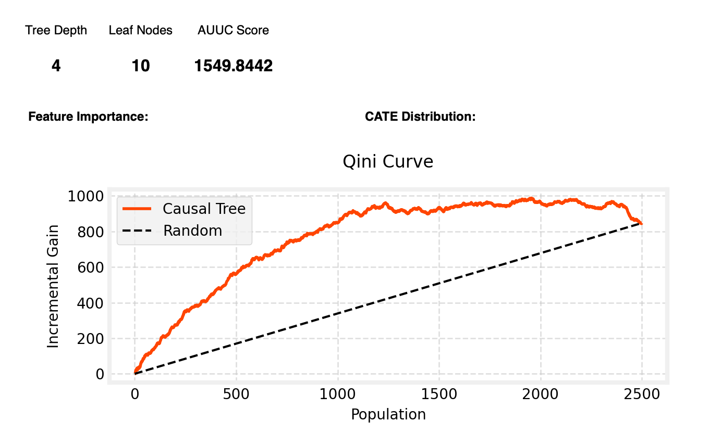
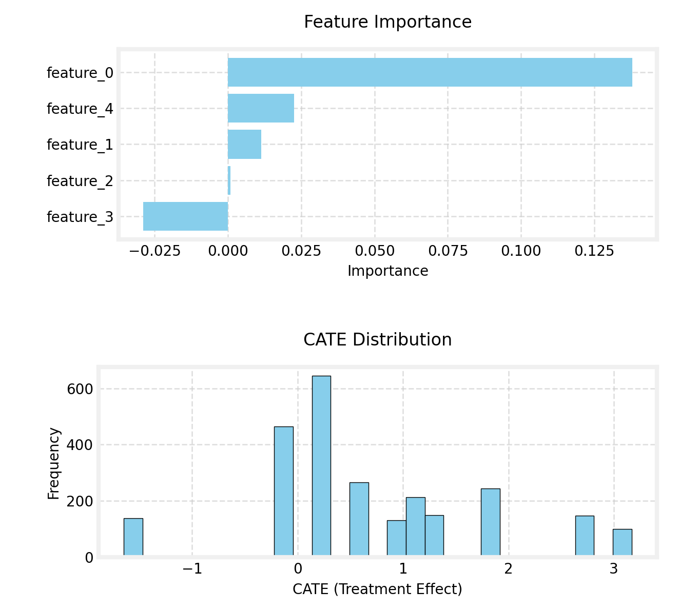
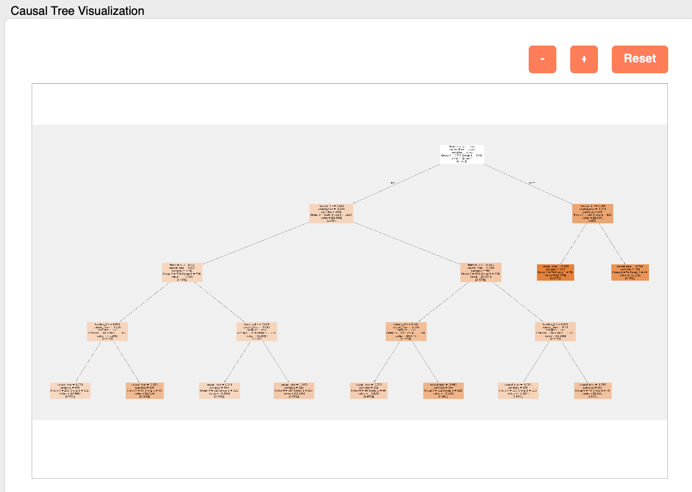
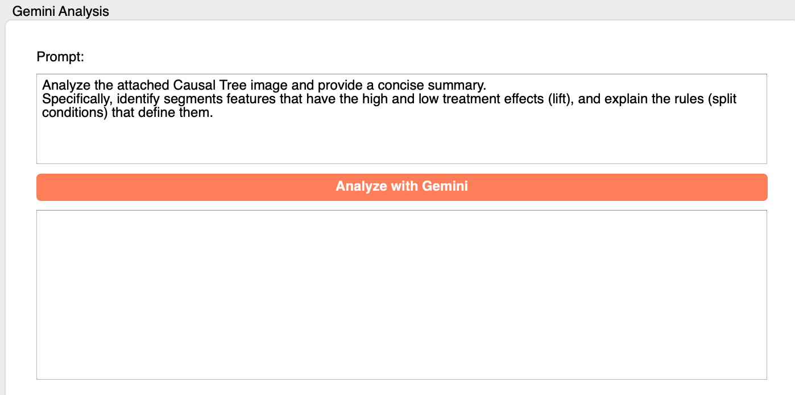
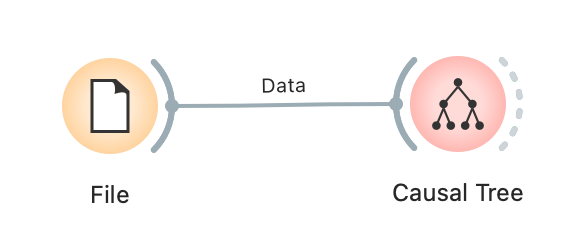

# Causal Tree

A Causal Tree is a machine learning method for exploratory analysis of how the effect of an intervention (treatment) on individual samples varies depending on the characteristics of those samples (heterogeneity). The results are visualized in a tree-like structure, allowing for an intuitive understanding of which groups of features exhibit a larger (or smaller) treatment effect. This widget provides functionalities for building, evaluating, and visualizing Causal Tree models.

## Inputs

*   **Data**:
    *   Data type: `Orange.data.Table`
    *   Description: The dataset for analysis. It must include a treatment variable, an outcome variable, covariates (features), and optionally, metadata.

### Input Data Specifications

The input data is expected to contain the following information:

*   **Treatment Variable**:
    *   A Discrete variable indicating assignment to treatment/control.
    *   The selected control value is encoded as 0; all other categories are aggregated and encoded as 1 (treated). While multi-category variables are accepted, a truly binary treatment is recommended for clarity.
*   **Outcome Variable**:
    *   The variable for which you want to evaluate the effect of the intervention (e.g., sales, conversion rate, customer satisfaction).
    *   Must be numerical (Continuous Variable) or binary Discrete. For binary outcomes, select the positive class in the UI. Multi-class discrete outcomes are not supported.
*   **Covariates**:
    *   Variables that may affect the outcome variable and potentially explain the heterogeneity of the treatment effect (features). The data is split based on these variables.
    *   Can be numerical (Continuous Variable) or discrete (Discrete Variable).
*   **Meta Variables** (Optional):
    *   Identifiers or additional information not directly used in the analysis but to be retained in the data.

### Input Data Example

The following is an example of data for analyzing the effect of a new UI design on a website.

| User ID (Meta) | Age (Covariate) | Gender (Covariate) | Plan (Covariate) | New UI (Treatment) | CV (Outcome) |
| :------------- | :-------------- | :----------------- | :--------------- | :----------------- | :----------- |
| user001        | 35              | Male               | Premium          | Treatment          | 1            |
| user002        | 22              | Female             | Free             | Control            | 0            |
| user003        | 45              | Male               | Free             | Treatment          | 0            |
| user004        | 28              | Female             | Premium          | Control            | 1            |
| ...            | ...             | ...                | ...              | ...                | ...          |

In this example, "User ID" is a meta variable, "Age", "Gender", and "Plan" are covariates, "New UI" is the treatment variable, and "CV" (Conversion) is the outcome variable.

## Outputs

*   **Enhanced Data**:
    *   Data type: `Orange.data.Table`
    *   Description: The input data with added meta columns for the Conditional Average Treatment Effect (CATE) predicted by the Causal Tree, and the ID of the leaf node each sample belongs to. This allows for further analysis of which segments have what kind of treatment effect.

## Feature Description

*(Figure: Placeholder for the overall interface of the Causal Tree widget)*

### Control Area (Left Panel)

The control panel is used to assign data variables and set model parameters.

*(Figure: Placeholder for "Data Variables" and "Causal Tree Settings" sections)*

*   **Data Variables**
    *   **Treatment Variable**:
        *   **Select treatment variable**: Select the column to be used as the treatment variable. The selected control value is encoded as 0; all other categories are aggregated as treated (=1).
        *   **Select control group value (encoded as 0)**: Select the value within the treatment variable that represents the control group (others become 1).
    *   **Outcome Variable**:
        *   **Select outcome variable**: Select the column to be used as the outcome variable. If a binary Discrete outcome is selected, also choose the positive class to map y into 0/1.
    *   **Covariates**:
        *   Drag and drop variables to be used in the analysis into this list. The variables listed here will be used as splitting conditions for the tree.
    *   **Meta Variables**:
        *   Move variables not used in the analysis but to be kept in the data to this list.
*   **Causal Tree Settings**
    *   **Maximum Depth**: Sets the maximum depth of the tree.
    *   **Min Samples per Leaf**: Minimum number of samples required at a leaf node.
    *   **Random State**: Seed for reproducible results (set -1/None for non-deterministic).
    *   **Evaluation Method**: Choose between `In-sample (all data)` and `Cross-validated (OOF)`. When CV is selected, AUUC/Qini and related plots are computed from out-of-fold predictions. You can configure the number of folds.
    *   **Feature Importance Method**: Select the method for calculating feature importance.
        *   `Impurity-based Feature Importance`: Uses the tree's internal split-based importance.
        *   `Permutation-based Feature Importance`: Uses `sklearn.inspection.permutation_importance` on the model’s CATE predictions (measures prediction sensitivity). More reliable but computationally expensive.
*   **Apply Button**
    *   Executes the Causal Tree analysis based on the set parameters. Becomes active when all required variables are selected.

### Main Area (Right Panel)

The main area displays model diagnostics, the visualized Causal Tree, and AI-powered analysis results.

*(Figure: Placeholder for model diagnostics and Causal Tree visualization in the main area)*

*   **Model Diagnostics**
    *   **Metrics**:
        *   `Tree Depth`: The actual depth of the created tree.
        *   `Leaf Nodes`: The number of terminal nodes (segments) in the tree.
        *   `AUUC Score`: Stands for Area Under the Uplift Curve. It's a metric indicating how well the model ranks samples in descending order of their treatment effects. A higher value indicates better performance.
    *   **Feature Importance**: A bar chart visualizing which covariates were important in explaining the heterogeneity of the treatment effect.
    *   **CATE Distribution**: A histogram showing the distribution of the predicted CATE (treatment effect).
    *   **Qini Curve**: A curve for evaluating the model's performance. It shows how effectively the model identifies the population with an intervention effect compared to a random case.
*   **Causal Tree Visualization**
    *   The constructed Causal Tree is displayed graphically. Each node shows the splitting condition, the treatment effect (Effect) for the samples in that node, and the number of samples.
    *   **Zoom Controls**: The `+`, `-`, and `Reset` buttons allow you to zoom in, zoom out, and reset the tree view.
*   **Gemini Analysis**
    *   **Prompt**: Enter a prompt (instruction) to request an analysis of the Causal Tree image. A default prompt is provided.
    *   **Analyze with Gemini**: Uses the entered prompt and the Causal Tree image to request an analysis from Google's generative AI model, "Gemini".
    *   **Result Browser**: The analysis results (summary, insights, etc.) from Gemini are displayed in Markdown format.

## Reporting Feature

This widget supports Orange's standard reporting functionality. By right-clicking on the widget and selecting "Send Report," or by calling it from the report viewer, a report containing the following information can be generated:

*   Basic information about the input data (number of instances, number of attributes)
*   Selected main variables (treatment variable, control group, outcome variable)
*   Key model settings (maximum depth, min samples per leaf, random state, evaluation method/folds, feature importance method)
*   The number and list of selected covariates (up to the first 10)

## Usage Example

The following is a basic workflow for loading data from a file, performing Causal Tree analysis, and evaluating the results.

*(Figure: Placeholder for a basic workflow of the Causal Tree widget. E.g., File -> Causal Tree -> Data Table)*

1.  Load the dataset for analysis using the **File** widget.
2.  Connect the output of the **File** widget to the `Data` input of the **Causal Tree** widget.
3.  Open the **Causal Tree** widget and configure the following in the control panel:
    *   Select `Treatment Variable`, `Control group value`, and `Outcome Variable`.
    *   Assign variables to the `Covariates` and `Meta Variables` lists.
    *   Set `Maximum Depth` etc. in `Causal Tree Settings`.
    *   Click the `Apply` button.
4.  Examine the results in the main area:
    *   Check the AUUC score and feature importance in `Model Diagnostics`.
    *   Visually understand which segments have a high (or low) treatment effect in `Causal Tree Visualization`.
    *   Optionally, get AI-driven insights using the `Gemini Analysis` feature.
5.  Connect the `Enhanced Data` output of the **Causal Tree** widget to a **Data Table** widget to view the data with added CATE and Leaf ID.

## Detailed Logic

### 1. Data Preparation (`CausalTreeLogic._prepare_data`)

1.  **Data Conversion**: Converts the Orange Table format to the Numpy array format (X, y, treatment) required by the analysis library (`causalml`).
2.  **Variable Selection**: Slices the data based on the covariates, outcome variable, and treatment variable specified in the UI.
3.  **Treatment Encoding**: The selected control value is encoded as 0; all other treatment categories are aggregated and encoded as 1.
4.  **Categorical Encoding**: Discrete covariates are one-hot encoded with an explicit missing category (`=__MISSING__`) so that missingness can be modeled instead of collapsing to all-zeros.

### 2. Causal Tree Model Estimation (`CausalTreeLogic.run_analysis`)

*   **Model Library**: Uses `causalml.inference.tree.CausalTreeRegressor` to build the model.
*   **Fitting**: Calls `model.fit(X, y, treatment)` to train the model. Unlike a regular decision tree, a Causal Tree searches for splits that maximize the difference in treatment effects between the child nodes.
*   **Prediction**: Uses the trained model to predict the CATE (ITE) for each sample (`model.predict(X)`).

### 3. Model Evaluation and Metrics

*   **AUUC Score (`_calculate_auuc`)**: Samples are sorted in descending order of predicted CATE and an uplift (Qini) curve is formed. The area under this curve is computed as AUUC. When Evaluation Method = CV, AUUC is based on out-of-fold predictions.
*   **Feature Importance (`_calculate_feature_importance`)**:
    *   **Impurity-based**: Uses the importance scores (`feature_importances_`) that the `CausalTreeRegressor` model internally holds, based on how much each feature contributed to the splits.
    *   **Permutation-based**: Uses `sklearn.inspection.permutation_importance`. It measures the importance of a feature by randomly shuffling its values and measuring how much the model's performance (in this case, AUUC score, etc.) degrades.

### 4. Visualization (`OWCausalTree.display_results`)

*   **Causal Tree Plot**: Uses `causalml.inference.tree.plot.plot_causal_tree` to visualize the trained model.
*   **Feature Importance Plot**: The calculated importances are plotted as a horizontal bar chart using `matplotlib`.
*   **CATE Distribution Plot**: The predicted CATE values are plotted as a histogram using `matplotlib`.
*   **Qini Curve Plot**: The uplift (Qini) curve used for AUUC is plotted using `matplotlib`.

### 5. Gemini Analysis Integration (`OWCausalTree.analyze_with_gemini`)

*   **API Integration**: The visualized Causal Tree image is converted into image data in memory using the `PIL` library and sent to Google's Gemini API along with the prompt entered by the user.
*   **Result Display**: The Markdown-formatted text returned from the API is displayed in the UI's text browser. This allows users to receive AI assistance in interpreting the model results. 
