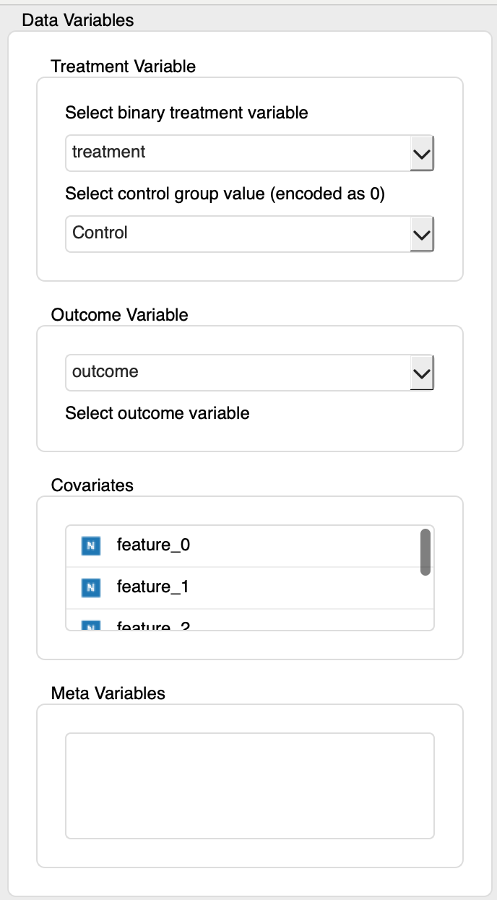
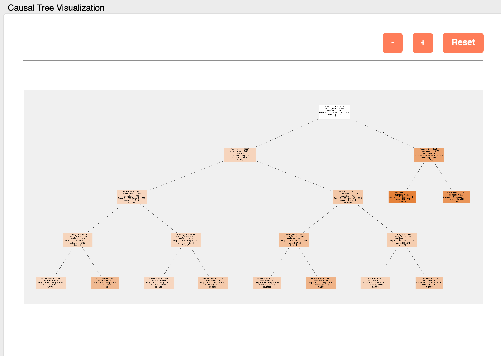
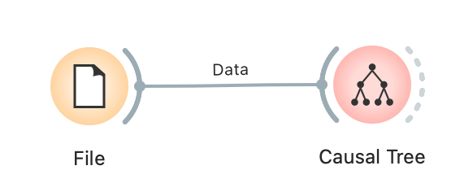

# Causal Tree (因果木)

Causal Tree（因果木）は、処置（介入）が個々のサンプルに対して与える影響（処置効果）が、そのサンプルの持つどのような特徴によって異なるのか（異質性）を探索的に分析するための機械学習手法です。結果は決定木のようなツリー構造で可視化され、どのような特徴を持つグループに処置効果が大きく（または小さく）現れるのかを直感的に理解することができます。このウィジェットは、Causal Treeモデルの構築、評価、および可視化機能を提供します。

## 入力

*   **Data**:
    *   データ型: `Orange.data.Table`
    *   説明: 分析対象のデータセット。処置変数、結果変数、共変量（特徴量）、およびオプションでメタデータを含む必要があります。

### 入力データの仕様

入力データには以下の情報が含まれている必要があります。

*   **処置変数 (Treatment Variable)**:
    *   どのサンプルが処置群（Treatment Group）に割り当てられ、どのサンプルが対照群（Control Group）に割り当てられたかを示す変数。
    *   **必ず二値（2カテゴリ）の離散変数（Discrete Variable）である必要があります。** ウィジェット内で、どちらの値を対照群（分析上は0として扱われる）とするかを選択します。
*   **結果変数 (Outcome Variable)**:
    *   処置の効果を評価したい変数（例：売上、コンバージョン率、顧客満足度）。
    *   数値（Continuous Variable）または離散（Discrete Variable）が使用可能です。
*   **共変量 (Covariates)**:
    *   結果変数に影響を与え、処置効果の異質性を説明する可能性のある変数（特徴量）。これらの変数に基づいて、データが分割されます。
    *   数値（Continuous Variable）または離散（Discrete Variable）が使用可能です。
*   **メタ変数 (Meta Variables)** (任意):
    *   分析には直接使用されないが、データ内に保持しておきたい識別子や追加情報。

### 入力データ例

以下は、あるWebサイトの新しいUIデザインの効果を分析するためのデータ例です。

| User ID (Meta) | Age (Covariate) | Gender (Covariate) | Plan (Covariate) | New UI (Treatment) | CV (Outcome) |
| :------------- | :-------------- | :----------------- | :--------------- | :----------------- | :----------- |
| user001        | 35              | Male               | Premium          | Treatment          | 1            |
| user002        | 22              | Female             | Free             | Control            | 0            |
| user003        | 45              | Male               | Free             | Treatment          | 0            |
| user004        | 28              | Female             | Premium          | Control            | 1            |
| ...            | ...             | ...                | ...              | ...                | ...          |

この例では、「User ID」はメタ変数、「Age」「Gender」「Plan」は共変量、「New UI」は処置変数、「CV」（コンバージョン）は結果変数です。

## 出力

*   **Enhanced Data**:
    *   データ型: `Orange.data.Table`
    *   説明: 入力データに、Causal Treeによって予測されたCATE（Conditional Average Treatment Effect, 条件付き平均処置効果）と、各サンプルが属する木の葉（Leaf）のIDがメタ列として追加されたデータ。これにより、どのセグメントにどのような処置効果があるかをさらに分析できます。

## 機能説明

*(図：Causal Treeウィジェットの全体的なインターフェースのプレースホルダー)*

### コントロールエリア（左パネル）

コントロールパネルでは、データ変数の割り当て、モデルのパラメータ設定を行います。

*(図：「Data Variables」および「Causal Tree Settings」セクションのプレースホルダー)*

*   **Data Variables**
    *   **Treatment Variable**:
        *   **Select binary treatment variable**: 処置変数として使用する列を選択します。二値の離散変数のみがリストされます。
        *   **Select control group value (encoded as 0)**: 処置変数内で、対照群を表す値を選択します。
    *   **Outcome Variable**:
        *   **Select outcome variable**: 結果変数として使用する列を選択します。
    *   **Covariates**:
        *   分析に使用する共変量をこのリストにドラッグ＆ドロップします。ここにリストされた変数が、ツリーの分岐条件として使用されます。
    *   **Meta Variables**:
        *   分析には使用しないが、データに残しておきたい変数をこのリストに移動します。
*   **Causal Tree Settings**
    *   **Maximum Depth**: 作成される木の最大の深さを設定します。値が大きいほど複雑なモデルになりますが、過学習のリスクも高まります。
    *   **Feature Importance Method**: 特徴量の重要度を計算する方法を選択します。
        *   `Impurity-based Feature Importance`: ツリーの分岐がどれだけ結果変数の不純度（ジニ不純度など）を減少させたかに基づいて計算します。高速ですが、バイアスがかかることがあります。
        *   `Permutation-based Feature Importance`: 特定の特徴量の値をシャッフルし、モデルの性能がどれだけ低下するかを測定して重要度を評価します。より信頼性が高いですが、計算に時間がかかります。
*   **Apply Button**
    *   設定されたパラメータに基づいてCausal Tree分析を実行します。必要な変数がすべて選択されるとアクティブになります。

### メインエリア（右パネル）

メインエリアには、モデルの診断情報、可視化されたCausal Tree、およびAIによる分析結果が表示されます。

*(図：メインエリアのモデル診断とCausal Tree可視化のプレースホルダー)*

*   **Model Diagnostics**
    *   **評価指標 (Metrics)**:
        *   `Tree Depth`: 実際に作成された木の深さ。
        *   `Leaf Nodes`: 木の末端ノード（セグメント）の数。
        *   `AUUC Score`: Area Under the Uplift Curveの略。モデルが処置効果の高い順にサンプルをどれだけうまく順序付けできているかを示す指標です。値が大きいほど性能が良いことを示します。
    *   **Feature Importance**: どの共変量が処置効果の異質性を説明する上で重要であったかを可視化した棒グラフ。
    *   **CATE Distribution**: 予測されたCATE（処置効果）の分布を示すヒストグラム。
    *   **Qini Curve**: モデルの性能を評価するための曲線。ランダムな場合に比べて、モデルがどれだけ効果的に介入効果のある集団を特定できているかを示します。
*   **Causal Tree Visualization**
    *   構築されたCausal Treeがグラフィカルに表示されます。各ノードには、分岐条件、そのノードに属するサンプルの処置効果（Effect）、サンプル数が表示されます。
    *   **Zoom Controls**: `+`, `-`, `Reset`ボタンで、ツリー表示の拡大・縮小・リセットが可能です。
*   **Gemini Analysis**
    *   **Prompt**: Causal Treeの画像分析を依頼するためのプロンプト（指示文）を入力します。デフォルトのプロンプトが用意されています。
    *   **Analyze with Gemini**: 入力されたプロンプトとCausal Treeの画像を使って、Googleの生成AIモデル「Gemini」に分析を依頼します。
    *   **Result Browser**: Geminiからの分析結果（サマリー、示唆など）がマークダウン形式で表示されます。

## レポート機能

このウィジェットはOrangeの標準的なレポート機能をサポートしています。ウィジェットを右クリックして「Send Report」を選択するか、レポートビューアから呼び出すことで、以下の情報を含むレポートを生成できます。

*   入力データの基本情報（インスタンス数、属性数）
*   選択された主要変数（処置変数、対照群、結果変数）
*   主要なモデル設定（木の最大深度、特徴量重要度の計算方法）
*   選択された共変量の数とリスト（最初の10個まで）

## 使用例

以下は、ファイルからデータを読み込み、Causal Tree分析を実行し、結果を評価する基本的なワークフローです。

*(図：Causal Treeウィジェットの基本的なワークフロー例. 例: File -> Causal Tree -> Data Table)*

1.  **File**ウィジェットを使用して、分析用のデータセットを読み込みます。
2.  **File**ウィジェットの出力を**Causal Tree**ウィジェットの`Data`入力に接続します。
3.  **Causal Tree**ウィジェットを開き、コントロールパネルで以下を設定します:
    *   `Treatment Variable`、`Control group value`、`Outcome Variable`を選択します。
    *   `Covariates`リストと`Meta Variables`リストに変数を割り当てます。
    *   `Causal Tree Settings`で`Maximum Depth`などを設定します。
    *   `Apply`ボタンをクリックします。
4.  メインエリアで結果を確認します:
    *   `Model Diagnostics`でAUUCスコアや特徴量の重要度を確認します。
    *   `Causal Tree Visualization`で、どのようなセグメントに処置効果が高いか（または低いか）を視覚的に理解します。
    *   必要に応じて`Gemini Analysis`機能で、AIによる洞察を得ます。
5.  **Causal Tree**ウィジェットの`Enhanced Data`出力を**Data Table**ウィジェットに接続し、CATEやLeaf IDが追加されたデータを確認します。

## 詳細ロジック

### 1. データ準備 (`CausalTreeLogic._prepare_data`)

1.  **データ変換**: Orange Table形式から、分析ライブラリ（`causalml`）が要求するNumpy配列形式（X, y, treatment）に変換します。
2.  **変数選択**: UIで指定された共変量、結果変数、処置変数に基づいてデータをスライスします。
3.  **対照群のエンコーディング**: 指定された対照群の値が、モデル内で数値の0として扱われるようにします。

### 2. Causal Treeモデルの推定 (`CausalTreeLogic.run_analysis`)

*   **モデルライブラリ**: `causalml.inference.tree.CausalTreeRegressor` を使用してモデルを構築します。
*   **フィッティング**: `model.fit(X, y, treatment)`を呼び出し、モデルを学習させます。Causal Treeは、通常の決定木とは異なり、分割後の子ノード間での処置効果の差が最大になるように分岐を探索します。
*   **予測**: 学習済みモデルを使って、各サンプルに対するCATE（ITE）を予測します (`model.predict(X)`)。

### 3. モデル評価とメトリクス

*   **AUUCスコア (`_calculate_auuc`)**: 予測されたCATEが高い順にサンプルを並べ替え、Uplift Curve（横軸：対象者数、縦軸：累積処置効果）を作成し、その曲線下の面積を計算します。これにより、モデルのランキング性能を評価します。
*   **特徴量の重要度 (`_calculate_feature_importance`)**:
    *   **Impurity-based**: `CausalTreeRegressor`モデルが内部に保持している、各特徴量が分岐にどれだけ貢献したかに基づく重要度 (`feature_importances_`) を使用します。
    *   **Permutation-based**: `sklearn.inspection.permutation_importance` を使用します。各特徴量の値をランダムにシャッフルし、モデルの性能（この場合はAUUCスコアなど）がどれだけ低下するかを測定することで、その特徴量の重要度を評価します。

### 4. 可視化 (`OWCausalTree.display_results`)

*   **Causal Treeプロット**: `causalml.inference.tree.plot.plot_causal_tree` を使用して、学習済みモデルを可視化します。
*   **特徴量重要度プロット**: 計算された重要度を`matplotlib`を用いて水平棒グラフとして描画します。
*   **CATE分布プロット**: 予測されたCATEの値を`matplotlib`を用いてヒストグラムとして描画します。
*   **Qini Curveプロット**: AUUCスコアの計算過程で得られるUplift Curve（ここではQini Curveと呼称）を`matplotlib`でプロットします。

### 5. Gemini Analysis連携 (`OWCausalTree.analyze_with_gemini`)

*   **API連携**: 可視化されたCausal Treeの画像を`PIL`ライブラリを使ってメモリ上で画像データに変換し、ユーザーが入力したプロンプトと共にGoogleのGemini APIに送信します。
*   **結果表示**: APIから返されたマークダウン形式のテキストを、UI上のテキストブラウザに表示します。これにより、ユーザーはモデルの結果解釈に関するAIの支援を受けることができます。 