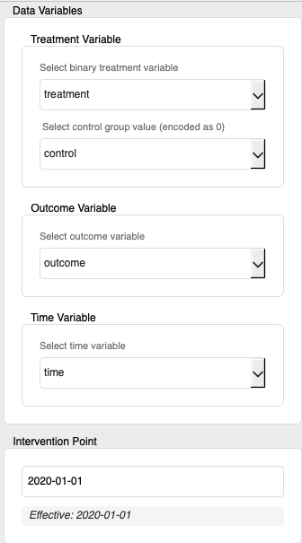
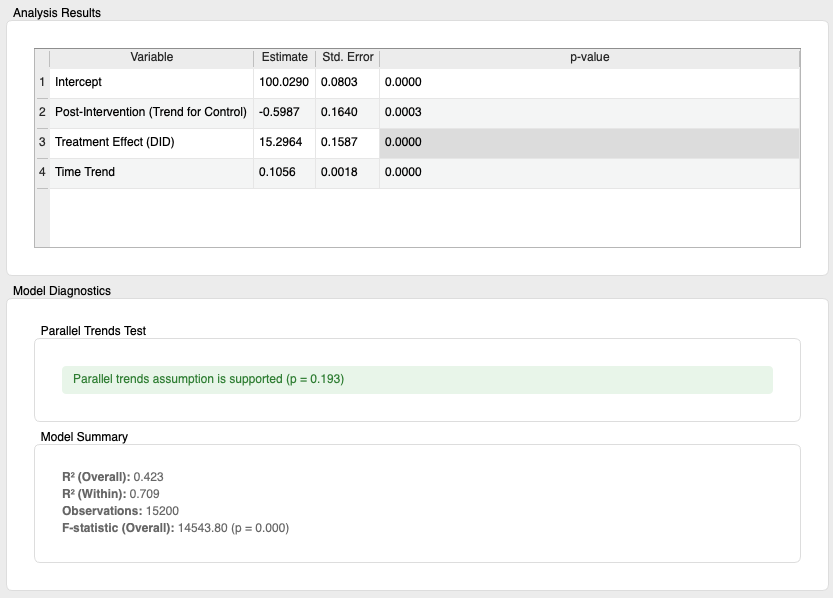
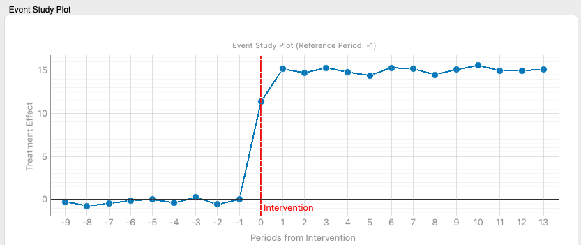

# DID (Difference-in-Differences)

The Difference-in-Differences (DID) method is a statistical technique used in observational studies and quasi-experimental settings to estimate the causal effect of an intervention (treatment). By comparing the changes in the outcome variable before and after the intervention between the treated group and the control group, it aims to remove the influence of other factors that change over time and capture the net effect of the intervention. This widget provides functionalities for performing DID analysis, testing the parallel trends assumption, and dynamically evaluating effects through event study analysis.

## Inputs

*   **Data**:
    *   Data type: `Orange.data.Table`
    *   Description: The dataset for analysis. It must include a treatment variable, an outcome variable, a time variable, a unit ID variable (for fixed-effects models), covariates, and optionally, metadata. The data is expected to be in panel data format (observing the same individuals at multiple time points) or repeated cross-sectional data (observing different individuals at multiple time points, though individual fixed effects are not possible in this case).

### Input Data Specifications

The input data is expected to contain the following information:

*   **Treatment Variable**:
    *   A variable indicating which individuals assigned to the treatment group and which did not (control group).
    *   **Must be a binary (two-category) Discrete Variable.** Within the widget, you will select which value represents the control group (encoded as 0 for analysis).
*   **Outcome Variable**:
    *   The variable for which you want to evaluate the effect of the intervention (e.g., sales, scores, symptom severity).
    *   Can be a numerical (Continuous Variable) or discrete (Discrete Variable).
*   **Time Variable**:
    *   A variable indicating when each observation was made.
    *   Can be Orange's `TimeVariable`, or a numerical (Continuous Variable) or discrete (Discrete Variable) in a format convertible to `datetime` objects (e.g., "2023-01-01", "2023/01/01", timestamp values). Internally, it's converted to `datetime` type for analysis. At least two distinct time points are required.
*   **Unit ID Variable** (Optional, required for fixed-effects models):
    *   A variable that uniquely identifies each individual or unit (e.g., company, region).
    *   Required when using an individual fixed-effects model (when the `Fixed Effects` option is enabled). Can be a Discrete Variable, String Variable, or a Continuous Variable that effectively functions as a categorical ID.
*   **Covariates** (Optional):
    *   Time-varying or time-invariant variables that may affect the outcome variable and whose distribution might differ between the treated and control groups. Including these in the model can improve the precision of estimates and reduce bias (when the `Covariate Adjustment` option is enabled).
    *   Can be numerical (Continuous Variable) or discrete (Discrete Variable).
*   **Meta Variables** (Optional):
    *   Identifiers or additional information not directly used in the analysis but to be retained in the data.

### Input Data Example

The following is an example of panel data for analyzing the effect of introducing a new store format.

| Store ID (Unit ID) | Year-Month (Time) | New Format Intro Group (Treatment) | Sales (Outcome) | Customer Count (Covariate) | Region (Meta) |
| :----------------- | :---------------- | :--------------------------- | :-------------- | :------------------------- | :------------ |
| StoreA             | 2020-01           | 1 (Treatment grp)           | 1000            | 500                        | East          |
| StoreA             | 2020-02           | 1 (Treatment grp)           | 1100            | 550                        | East          |
| StoreA             | 2020-03           | 1 (Treatment grp)               | 1500            | 700                        | East          |
| StoreB             | 2020-01           | 0 (Control grp)           | 800             | 400                        | West          |
| StoreB             | 2020-02           | 0 (Control grp)           | 850             | 420                        | West          |
| StoreB             | 2020-03           | 0 (Control grp)           | 900             | 450                        | West          |
| ...                | ...               | ...                          | ...             | ...                        | ...           |

In this example, "Store ID" is the Unit ID variable, "Year-Month" is the Time variable, "New Format Intro" is the Treatment variable (0 for control, 1 for treated), "Sales" is the Outcome variable, "Customer Count" is a Covariate, and "Region" is a Meta variable. The Intervention Point would be set within the widget, for example, to "2020-03-01".

## Outputs

*   **Results Table**:
    *   Data type: `Orange.data.Table`
    *   Description: Estimation results of the DID model. Typically includes:
        *   `Variable` (meta): Variable name (e.g., "Treatment Effect (DID)", "Treatment Group (Pre-diff)", "Post-Intervention (Trend for Control)", covariate names, "Intercept").
        *   `Estimate`: Estimated coefficient for each variable.
        *   `StdError`: Standard error for each coefficient.
        *   `PValue`: p-value for each coefficient.
*   **Model Diagnostics**:
    *   Data type: `Orange.data.Table`
    *   Description: This output port is defined, but in the current version, data output in Table format is not implemented. Diagnostic information such as the model's R-squared value and number of observations is displayed in the widget's main area UI.
*   **Treated Data**:
    *   Data type: `Orange.data.Table`
    *   Description: This output port is defined, but in the current version, data output is not implemented. The prepared data used for analysis is not output.

## Feature Description

*(Figure: Placeholder for the overall interface of the DID widget)*

### Control Area (Left Panel)

The control panel is used to assign data variables, set the intervention point, specify the model, and configure event study settings.

*(Figure: Placeholder for "Data Variables" and "Intervention Point" sections)*

*   **Data Variables**
    *   **Treatment Variable**:
        *   **Select binary treatment variable**: Select the column from the input data to be used as the treatment variable. Only binary discrete variables are listed.
        *   **Select control group value (encoded as 0)**: Select the value within the treatment variable that represents the control group. This will be treated as "0" in the analysis.
    *   **Outcome Variable**:
        *   **Select outcome variable**: Select the column to be used as the outcome variable.
    *   **Time Variable**:
        *   **Select time variable**: Select the variable that indicates the passage of time.
*   **Intervention Point**
    *   **Intervention Date Input Field**: Enter the date the intervention started in "YYYY-MM-DD" or "YYYY-MM" format (e.g., "2020-01-15" or "2020-01"). "YYYY-MM" is interpreted as the first day of that month. This date is used to distinguish between pre-intervention and post-intervention periods.
    *   **Effective Intervention Date Label**: Displays the effective intervention date interpreted based on the input.

*(Figure: Placeholder for "Model Settings" section)*

*   **Model Settings**
    *   **Fixed Effects**: If checked, a unit fixed-effects model is used to control for time-invariant unobserved heterogeneity specific to units (individuals). If unchecked, it approximates a Pooled OLS model without fixed effects.
        *   **Select Unit ID variable for Fixed Effects**: Appears if `Fixed Effects` is enabled. Select the variable that uniquely identifies units.
    *   **Covariate Adjustment**: If checked, covariates are included in the model for adjustment.
        *   **Covariates List**: Appears if `Covariate Adjustment` is enabled. Drag and drop variables from the list below to the "Covariates" list to use them as covariates.
        *   **Meta Variables List**: Move variables not used in the analysis but to be kept in the data to the "Meta Variables" list.
    *   **Parallel Trends Test**: If checked, tests the crucial DID assumption that the outcome variable trends for the treated and control groups would have been parallel in the absence of the intervention, using pre-treatment data. Results are displayed in the "Model Diagnostics" section of the main area.

*(Figure: Placeholder for "Event Study Plot" options section)*

*   **Event Study Plot**
    *   **Enable Event Study Plot**: If checked, an event study analysis is performed, and its results are plotted in the main area.
    *   **Event Study Options**: Appears if the above checkbox is enabled.
        *   **Reference Period**: Select the relative period to be used as the baseline for comparison in the event study. If the intervention point is 0, typically the period immediately preceding the intervention (e.g., -1) is chosen. Options are dynamically generated based on the data and time aggregation settings.
        *   **Confidence Interval Level**: Select the confidence interval level to display on the plot (e.g., "95%", "90%", "None").
        *   **Time Aggregation**: Select the time aggregation method for the event study analysis.
            *   `Original`: Uses the original time variable's unit (e.g., daily if the data is daily).
            *   `Daily`: Aggregates and analyzes data on a daily basis.
            *   `Weekly`: Aggregates and analyzes data on a weekly basis.
            *   `Monthly`: Aggregates and analyzes data on a monthly basis.
*   **Buttons**
    *   **Run**: Executes the DID analysis (and event study analysis if enabled) based on the set parameters. Becomes active when all required variables are selected.
    *   **Reset**: Resets the widget's settings to their default values.

### Main Area (Right Panel)

The main area displays data visualization, analysis results, model diagnostics, and the event study plot.

*(Figure: Placeholder for time series plot, results table, and model diagnostics in the main area)*

*   **Time Series Visualization**
    *   Plots the average values of the selected outcome variable over time for the treated and control groups.
    *   **Intervention Line**: A red vertical line is displayed at the set intervention point.
    *   **Interaction**: The intervention point can be changed interactively by double-clicking on the plot. Moving the mouse cursor displays a preview line, suggesting clickable dates.
*   **Analysis Results**
    *   **Results Table Display**: Shows the DID model estimation results (variable name, coefficient, standard error, p-value) in a table format.
*   **Model Diagnostics**
    *   **Parallel Trends Test Result Label**: Displays the p-value of the parallel trends test and an interpretation of whether the assumption is supported (e.g., "Parallel trends assumption is supported (p = 0.150)").
    *   **Model Summary Labels**:
        *   `R² (Overall)`: The overall coefficient of determination for the model.
        *   `R² (Within)` / `Adj. R²`: Within R-squared for fixed-effects models, or adjusted R-squared otherwise, depending on the model.
        *   `Observations`: The number of observations used in the analysis.
        *   `F-statistic (Overall)`: The F-test statistic for the overall significance of the model and its p-value.

*(Figure: Placeholder for the event study plot in the main area)*

*   **Event Study Plot** (When `Event Study Plot` option is enabled)
    *   Plots the estimated treatment effects (points) and their confidence intervals (shaded areas) for each period relative to the intervention point.
    *   The horizontal axis represents the relative period from the intervention (e.g., -2, -1, 0, 1, 2), and the vertical axis shows the magnitude of the treatment effect.
    *   A red dashed vertical line is displayed at the intervention point (relative period 0).
    *   A horizontal line indicating zero effect is also shown.
    *   **Interpretation Label**: Provides a basic explanation of how to interpret the plot.
        *   If the coefficients for pre-intervention periods are close to zero (confidence intervals include zero), it provides indirect evidence supporting the parallel trends assumption.
        *   Coefficients for post-intervention periods show the dynamic effects of the intervention.

## Reporting Feature

This widget supports Orange's standard reporting functionality. By right-clicking on the widget and selecting "Send Report," or by calling it from the report viewer, a report containing the following information can be generated:

*   Basic information about the input data (number of instances, number of attributes)
*   Selected main variables (treatment variable, control group, outcome variable, time variable)
*   Key model settings (whether fixed effects, covariate adjustment, parallel trends test are enabled)
*   If covariate adjustment is enabled, the number and list of selected covariates (up to the first 10)

## Usage Example

The following is a basic workflow for loading data from a file, performing DID analysis, and evaluating the results.

*(Figure: Placeholder for a basic workflow of the DID widget. E.g., File -> DID -> Data Table / Scatter Plot)*

1.  Load the panel dataset for analysis using the **File** widget.
2.  Connect the output of the **File** widget to the `Data` input of the **DID (Difference-in-Differences)** widget.
3.  Open the **DID** widget and configure the following in the control panel:
    *   Select `Treatment Variable`, `Control group value`, `Outcome Variable`, and `Time Variable`.
    *   Set the `Intervention Point`.
    *   Optionally, enable/configure `Fixed Effects` (and `Unit ID Variable`), `Covariate Adjustment` (and `Covariates`), and `Parallel Trends Test`.
    *   If event study analysis is desired, enable `Event Study Plot` and configure its options.
    *   Click the `Run` button.
4.  Examine the results in the main area:
    *   Visually understand data trends with `Time Series Visualization`.
    *   Check DID estimates and other coefficients in `Analysis Results`.
    *   Assess the parallel trends test result and model fit in `Model Diagnostics`.
    *   If event study was enabled, examine dynamic treatment effects in the `Event Study Plot`.
5.  Connect the `Results Table` output of the **DID** widget to a **Data Table** widget to view the estimation results in detail or use them with other tools.

## Detailed Logic

### 1. Data Preparation (`_prepare_data_for_analysis`)

1.  **Data Conversion**: Converts Orange Table format to Pandas DataFrame.
2.  **Variable Name Cleaning**: Replaces special characters (e.g., `[`, `]`, `.`) in variable names with underscores (`_`) for compatibility with formula APIs.
3.  **Time Variable Processing**: Converts the selected time variable to Pandas `datetime` type. An error occurs if conversion fails. Data is sorted by the time variable (and unit ID variable, if present).
4.  **Post-Intervention Flag (`post`) Creation**: Creates a `post` variable (1 if post-intervention, 0 if pre-intervention) based on the set `intervention_point_str` (intervention date).
5.  **Treatment Group Flag (`treatment_group`) Creation**: Creates a `treatment_group` variable (1 if treated group, 0 if control group) based on the selected treatment variable and control group value.
6.  **DID Interaction Term (`did_interaction`) Creation**: Creates the key DID interaction term as `did_interaction = treatment_group * post`. The coefficient of this term represents the average treatment effect.
7.  **Index Setting**: If `Fixed Effects` is enabled, sets the DataFrame's index to a MultiIndex of the unit ID variable and time variable. This is for `linearmodels.PanelOLS` to recognize the panel data structure.
8.  **Missing Value Handling**: Rows with missing values in the outcome variable, `treatment_group`, `post`, `did_interaction`, or selected covariates are excluded from the analysis (listwise deletion).
9.  **Metadata Storage**: Cleaned variable names (outcome, time, unit ID, etc.) are stored in the DataFrame's `attrs` attribute for use in subsequent analysis steps.

### 2. DID Model Estimation (`_run_did_analysis`)

A basic DID model can be expressed as follows (for Pooled OLS):
`Y = β0 + β1 * treatment_group + β2 * post + β3 * did_interaction + Controls + ε`
Here, `β3` is the DID estimator (treatment effect).

For a fixed-effects model (`Fixed Effects` enabled), unit fixed effects `α_i` are added:
`Y_it = α_i + β1 * treatment_group_i + β2 * post_t + β3 * did_interaction_it + Controls_it + ε_it`
(In `linearmodels`, `treatment_group` might be absorbed if time-invariant, or represented by `EntityEffects`. The exact formulation depends on the library, but the `did_interaction` term is always included.)

*   **Model Selection**:
    *   If `Fixed Effects` is enabled and `Unit ID Variable` is selected: `linearmodels.panel.PanelOLS` is used with `entity_effects=True`. Standard errors are clustered at the unit level.
    *   Otherwise: `statsmodels.api.OLS` is used (effectively Pooled OLS).
*   **Covariates**: If `Covariate Adjustment` is enabled, selected covariates are added as explanatory variables to the model.
*   **Time Trend**: A variable named `time_numeric_trend`, representing the elapsed time (e.g., days) from the beginning of the dataset, may be automatically generated and included in the model to control for overall time trends.
*   **Result Display**: Estimated coefficients, standard errors, and p-values are displayed in the UI table and summary labels, and output as a Table from `Outputs.results_table`.

### 3. Parallel Trends Test (within `_run_did_analysis`)

A key assumption for the validity of DID analysis is that, in the absence of the intervention, the outcome trends for the treated and control groups would have been parallel. This test uses only pre-intervention data.

1.  **Data Filtering**: Uses only data from the pre-intervention period (`post == 0`).
2.  **Relative Time Variable Creation (`time_numeric_for_pt`)**: Creates a variable quantifying elapsed time (e.g., days) from the start of the pre-intervention period.
3.  **Interaction Term Creation (`pt_interaction`)**: Creates an interaction term `treatment_group * time_numeric_for_pt`.
4.  **Model Estimation**: Regresses the outcome variable on `treatment_group`, `time_numeric_for_pt`, `pt_interaction` (and covariates, fixed effects).
5.  **Hypothesis Testing**: Tests if the coefficient of `pt_interaction` is statistically significantly different from 0. If this coefficient is 0, it suggests no difference in pre-intervention trends (parallel trends assumption supported). A larger p-value (e.g., >0.05) supports the parallel trends assumption.

### 4. Event Study Analysis (`EventStudyManager`)

Event study analysis assesses how the treatment effect changes over multiple periods before and after the intervention (dynamic effects).

1.  **Relative Period Calculation (`_get_relative_periods`)**:
    *   Converts each observation time point to a relative period with the intervention time as 0 (e.g., one period before intervention is -1, one period after is 1).
    *   The original time variable is aggregated according to the `Time Aggregation` setting (Original, Daily, Weekly, Monthly), and relative periods are calculated.
        *   `Original`: Relative periods based on the original data's time unit (e.g., daily if data is daily).
        *   `Daily/Weekly/Monthly`: Relative periods in days/weeks/months, respectively.
2.  **Model Estimation (`run_event_study_analysis`)**:
    A common event study equation is:
    `Y_it = α_i + Σ_k δ_k * D_it^k + Σ_k β_k * (treatment_group_i * D_it^k) + Controls_it + ε_it`
    Where:
    *   `D_it^k` is a dummy variable indicating if observation `i` at time `t` is in relative period `k`.
    *   `β_k` is the estimated treatment effect for relative period `k`.
    *   `α_i` are unit fixed effects (if enabled).
    *   One relative period (usually -1, just before intervention) is chosen as the reference period, and its `β_k` is constrained to 0. Other `β_k`'s are interpreted relative to this reference.
    *   Uses `linearmodels.PanelOLS.from_formula`, creating dummy variables like `I(relative_period == k)` and including their interactions with `treatment_group` in the model. Fixed effects and covariates are also incorporated.
3.  **Plotting (`plot_event_study`)**:
    *   Plots the estimated treatment effect `β_k` and its confidence interval for each relative period `k`.
    *   This visually shows how the treatment effect evolves from pre-intervention to post-intervention. If `β_k` is close to 0 for pre-intervention periods, it reinforces the parallel trends assumption.

### 5. Time Series Plot (`update_graph`)

The main time series plot visualizes the trend of the average outcome variable for the treated and control groups.

1.  **Data Extraction and Aggregation**: Extracts data based on the selected time and outcome variables. Calculates the average outcome for each time point, separately for the treated and control groups.
2.  **Plotting**: Plots these average values over time. Treated and control groups are shown in different colors.
3.  **Intervention Line Display and Interaction**:
    *   A vertical line is displayed at the intervention point set by the user or interactively on the plot.
    *   Double-clicking on the plot sets that point as the new intervention point. Moving the mouse shows a preview line and the date. This allows for exploratory analysis of different intervention timings (however, a "Run" is needed to re-analyze after changes).