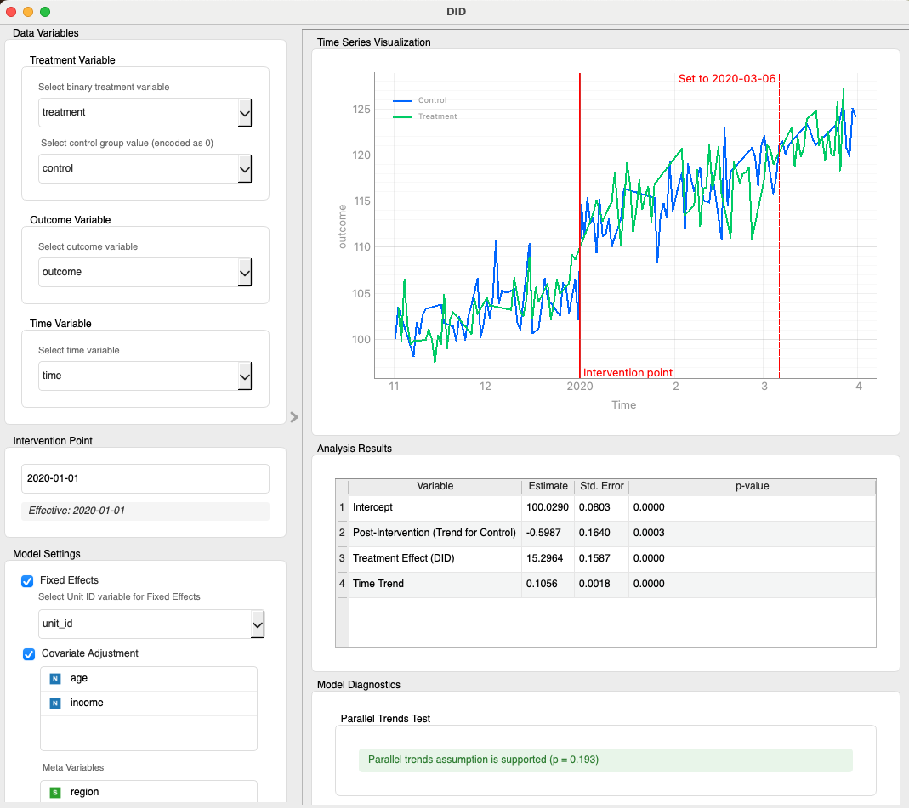
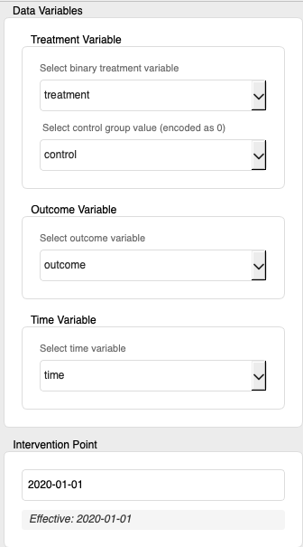
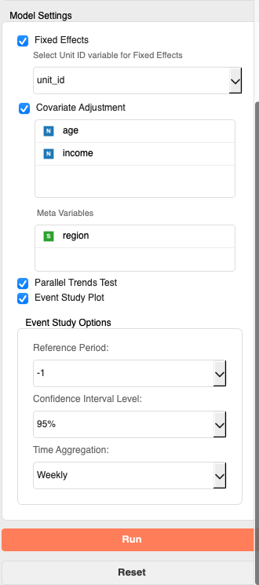
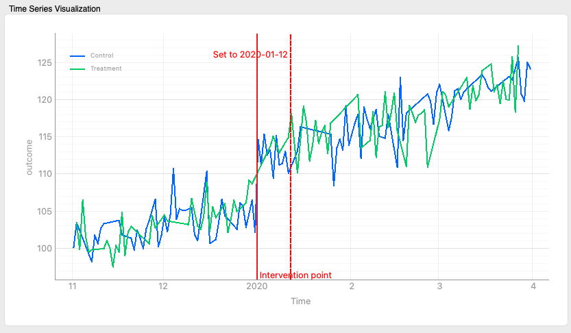
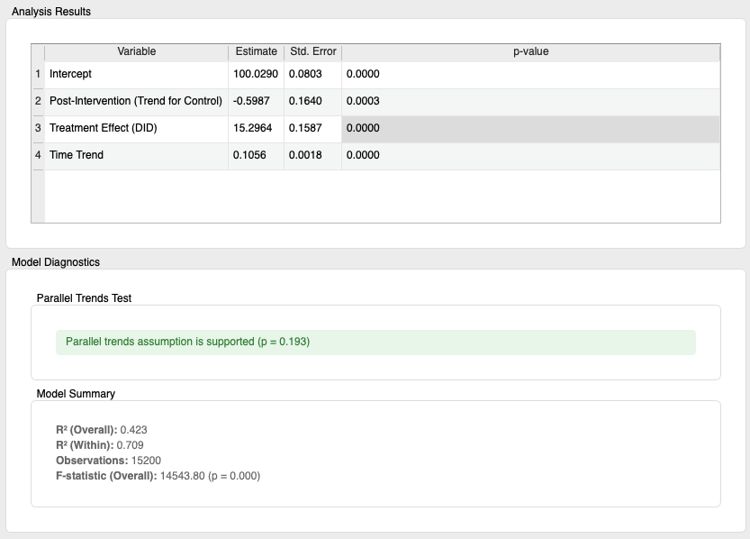
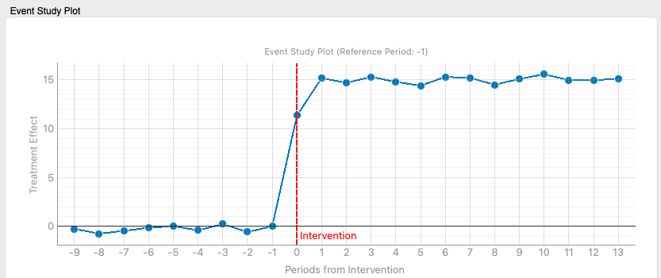
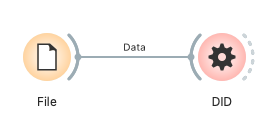

# DID (Difference-in-Differences)

差分の差分法 (Difference-in-Differences, DID) は、観察研究や準実験的状況において、介入（処置）の因果効果を推定するための統計的手法です。介入群と対照群における介入前後の結果変数の変化を比較することで、時間経過に伴う他の要因の影響を除去し、介入の純粋な効果を捉えようとします。このウィジェットは、DID分析の実行、平行トレンドの仮定の検証、およびイベントスタディ分析による効果の動的な評価機能を提供します。

## 入力 (Inputs)

*   **Data (データ)**:
    *   データ型: `Orange.data.Table`
    *   説明: 分析対象のデータセット。処置変数、結果変数、時間変数、ユニットID変数（固定効果モデルの場合）、共変量、そして任意でメタデータを含む必要があります。データはパネルデータ（同一の個体を複数時点で観察したデータ）または反復横断データ（異なる個体を複数時点で観察したデータ、ただし個体固定効果は不可）の形式であることが期待されます。

### 入力データの仕様

入力データには以下の情報が含まれていることが期待されます。

*   **処置変数 (Treatment Variable)**:
    *   どの観測が処置群/対照群に属するかを示す離散変数。
    *   離散変数であれば多カテゴリでも可。ウィジェットで「対照群の値」を選び、それ以外は処置（1）として扱います。厳密な二値である必要はありません。
*   **結果変数 (Outcome Variable)**:
    *   介入の効果を評価したい変数。売上、スコア、症状の度合いなど。
    *   数値（Continuous Variable）または離散変数（Discrete Variable）が使用可能です。
*   **時間変数 (Time Variable)**:
    *   各観測がいつ行われたかを示す変数。
    *   Orangeの `TimeVariable`、または `datetime` オブジェクトに変換可能な形式の数値（Continuous Variable）や離散変数（Discrete Variable）（例: "2023-01-01", "2023/01/01", タイムスタンプ値など）を使用できます。分析内部では `datetime` 型に変換されます。少なくとも2つの異なる時点が必要です。
*   **ユニットID変数 (Unit ID Variable)** (任意、固定効果モデル使用時に必須):
    *   各個体やユニット（企業、地域など）を一意に識別する変数。
    *   個体固定効果モデル（`Fixed Effects`オプション有効時）を使用する場合に必須です。離散変数（Discrete Variable）、文字列変数（String Variable）、または連続変数（Continuous Variableだが実質カテゴリカルなIDとして機能するもの）を指定できます。
*   **共変量 (Covariates)** (任意):
    *   結果に影響し得る変数。`Covariates` リストに入れた変数は常にモデルに投入されます（チェックボックスはありません）。
    *   数値（Continuous Variable）または離散変数（Discrete Variable）が使用できます。
*   **メタ変数 (Meta Variables)** (任意):
    *   分析には直接使用しないが、データに保持しておきたい識別子や追加情報。

### 入力データ例

以下は、新店舗導入の効果分析を想定したパネルデータの例です。

| 店舗ID (Unit ID) | 年月 (Time) | 新店舗フォーマット導入対象グループ | 売上 (Outcome) | 来客数 (Covariate) | 地域 (Meta) |
| :--------------- | :-------- | :------------------------------- | :----------- | :------------- | :-------- |
| StoreA           | 2020-01   | Treatment (対象)                       | 1000         | 500            | East      |
| StoreA           | 2020-02   | Treatment (対象)                      | 1100         | 550            | East      |
| StoreA           | 2020-03   | Treatment (対象)                         | 1500         | 700            | East      |
| StoreB           | 2020-01   | Control (非対象)                       | 800          | 400            | West      |
| StoreB           | 2020-02   | Control (非対象)                       | 850          | 420            | West      |
| StoreB           | 2020-03   | Control (非対象)                       | 900          | 450            | West      |
| ...              | ...       | ...                              | ...          | ...            | ...       |

この例では、「店舗ID」がユニットID変数、「年月」が時間変数、「新店舗フォーマット導入」が処置変数（0が対照群、1が処置群）、「売上」が結果変数、「来客数」が共変量、「地域」がメタ変数となります。介入時点（Intervention Point）は、例えば「2020-03-01」などとウィジェット内で設定します。

## 出力 (Outputs)

- **Results Table (結果テーブル)**:
  - データ型: `Orange.data.Table`
  - 内容: UIの表と同一。列は `Variable`(メタ), `Estimate`, `StdError`, `PValue`, `95% CI`(メタ)。Event Study 有効時は `period (-4)` などの行が後段に追加されます。
- **Model Diagnostics (モデル診断)**:
  - データ型: `Orange.data.Table`
  - 内容: `Parallel Trends p-value`, `R² (Overall)`, `R² (Within)` または `Adj. R²`, `Observations`, `F-statistic (Overall)` などの診断指標。
- **Event Study Results (イベントスタディ結果)**:
  - データ型: `Orange.data.Table`
  - 内容: 相対期間ごと1行。`Period`, `Estimate`, `StdError`, `PValue`, `ConfLower`, `ConfUpper`（利用可能な場合）。
- **Treated Data (処置済みデータ)**:
  - データ型: `Orange.data.Table`
  - 備考: 予約済み。現バージョンでは出力しません。

## 機能の説明

*(図: DIDウィジェットの全体的なインターフェースのプレースホルダ)*

### コントロールエリア (左パネル)

コントロールパネルでは、データ変数の割り当て、介入時点の設定、モデルの仕様、イベントスタディの設定などを行います。

*(図: 「Data Variables」および「Intervention Point」セクションのプレースホルダ)*

*   **Data Variables (データ変数)**
    *   **Treatment Variable (処置変数)**:
        *   **Select binary treatment variable (二値の処置変数を選択)**: 入力データから処置変数として使用する列を選択します。二値の離散変数のみがリストされます。
        *   **Select control group value (encoded as 0) (対照群の値を選択 (0としてエンコード))**: 処置変数内で対照群となる値を選択します。これが分析上「0」として扱われます。
    *   **Outcome Variable (結果変数)**:
        *   **Select outcome variable (結果変数を選択)**: 結果変数として使用する列を選択します。
    *   **Time Variable (時間変数)**:
        *   **Select time variable (時間変数を選択)**: 時間の経過を示す変数を選択します。
*   **Intervention Point (介入時点)**
    *   **Intervention Date Input (介入日入力フィールド)**: 介入が開始された日付を "YYYY-MM-DD" または "YYYY-MM" の形式で入力します（例: "2020-01-15" や "2020-01"）。"YYYY-MM" はその月の1日として解釈されます。この日付は、時間軸上で介入前 (pre) と介入後 (post) を区別するために使用されます。
    *   **Effective Intervention Date Label (有効介入日ラベル)**: 入力に基づいて解釈された有効な介入日が表示されます。

*(図: 「Model Settings」セクションのプレースホルダ)*

*   **Model Settings (モデル設定)**
    *   **Fixed Effects (固定効果)**: 有効時はユニット固定効果＋時間固定効果（PanelOLS）。無効時は時間固定効果つきのPooled OLS。
        *   **Unit ID (ユニットID)**: `Fixed Effects` 有効時に表示。ユニット識別子を選択します。
    *   **Covariates / Meta (共変量 / メタ)**: 常に表示。`Covariates` に入れた変数はモデルに投入、`Meta Variables` は保持用。
    *   **Standard Errors (標準誤差)**: 種別（`Auto`, `Clustered by Unit`, `HAC (Newey–West)`）と **HAC lag**。固定効果ON時はユニットでクラスタ、OFF時はHAC（ラグは自動）。
    *   **Parallel Trends Test (平行トレンド検定)**: 介入前データで仮定を検定し、p値を表示します。

*   **Event Study Plot (イベントスタディプロット)**
    *   **Enable Event Study Plot (イベントスタディプロットを有効化)**: チェックを入れると、イベントスタディ分析を実行し、その結果をメインエリアにプロットします。
    *   **Event Study Options (イベントスタディオプション)**: 上記チェックボックスが有効な場合に表示されます。
        *   **Reference Period (参照期間)**: イベントスタディにおける効果の比較基準となる相対期間を選択します。介入時点を0とした場合、通常は介入直前の期間（例: -1）が選択されます。選択肢はデータと時間集約設定に基づいて動的に生成されます。
        *   **Confidence Interval Level (信頼区間レベル)**: プロットに表示する信頼区間のレベルを選択します（例: "95%", "90%", "None"）。
        *   **Time Aggregation (時間集約)**: `Auto`, `As‑is`, `Weekly`, `Monthly`, `Daily`。
            *   `Auto`: データから適切な粒度を自動選択。
            *   `As‑is`: 元の時刻（必要に応じて日付正規化）を使用。
            *   `Weekly`/`Monthly`/`Daily`: 指定単位に集約後に相対期間を計算。
*   **Buttons (ボタン)**
    *   **Run (実行)**: 設定したパラメータに基づいてDID分析（および有効ならイベントスタディ分析）を実行します。必要な変数が選択されると有効になります。
    *   **Reset (リセット)**: ウィジェットの設定をデフォルト値に戻します。

### メインエリア (右パネル)

メインエリアには、データの視覚化、分析結果、モデル診断、イベントスタディプロットが表示されます。

*(図: メインエリアの時系列プロット、結果テーブル、モデル診断のプレースホルダ)*

*   **Time Series Visualization (時系列視覚化)**
    *   選択された結果変数について、処置群と対照群の平均値を時間経過とともにプロットします。
    *   **介入線 (Intervention Lines)**: 「プレ期間の終了」と「介入開始（ポスト開始）」の縦線を表示。日付の変更は入力欄で行い、プロット上では変更しません。
*   **Analysis Results (分析結果)**
    *   **Results Table (結果テーブル表示)**: DIDモデルの推定結果（変数名、係数、標準誤差、p値）が表形式で表示されます。
*   **Model Diagnostics (モデル診断)**
    *   **Parallel Trends Test (平行トレンド検定結果ラベル)**: 平行トレンド検定のp値と、仮定が支持されるかどうかの解釈が表示されます（例: "Parallel trends assumption is supported (p = 0.150)"）。
    *   **Model Summary (モデルサマリーラベル群)**:
        *   `R² (Overall)`: モデル全体の決定係数。
        *   `R² (Within)` / `Adj. R²`: 固定効果モデルの場合はWithin R2乗、そうでない場合は調整済みR2乗など、モデルに応じたフィット指標。
        *   `Observations`: 分析に使用された観測数。
        *   `F-statistic (Overall)`: モデル全体の有意性を示すF検定統計量とそのp値。

*(図: メインエリアのイベントスタディプロットのプレースホルダ)*

*   **Event Study Plot (イベントスタディプロット)** (`Event Study Plot`オプション有効時)
    *   介入時点を基準とした相対的な各期間における処置効果の推定値（点）とその信頼区間（シェードエリア）をプロットします。
    *   横軸は介入からの相対期間（例: -2, -1, 0, 1, 2）、縦軸は処置効果の大きさを示します。
    *   介入時点 (相対期間0) には赤い破線が表示されます。
    *   効果が0であることを示す水平線も表示されます。
    *   **Interpretation (解釈ラベル)**: プロットの基本的な解釈方法に関する説明が表示されます。
        *   介入前の期間の係数が0に近い（信頼区間が0を跨ぐ）場合、平行トレンドの仮定を支持する間接的な証拠となります。
        *   介入後の期間の係数は、介入による動的な効果を示します。

## 使用例

以下は、ファイルからデータを読み込み、DID分析を行い、その結果を評価する基本的なワークフローです。

*(図: DIDウィジェットの基本的なワークフローのプレースホルダ。例: File -> DID -> Data Table / Scatter Plot)*

1.  **File (ファイル)** ウィジェットで分析対象のパネルデータセットを読み込みます。
2.  **File** ウィジェットの出力を **DID (差分の差分法)** ウィジェットの `Data` 入力に接続します。
3.  **DID** ウィジェットを開き、コントロールパネルで以下を設定します。
    *   `Treatment Variable`, `Control group value`, `Outcome Variable`, `Time Variable` を選択します。
    *   `Intervention Point` を設定します。
    *   必要に応じて `Fixed Effects` (および `Unit ID Variable`)、`Covariate Adjustment` (および `Covariates`)、`Parallel Trends Test` を有効化/設定します。
    *   イベントスタディ分析を行いたい場合は `Event Study Plot` を有効化し、関連オプションを設定します。
    *   `Run` ボタンをクリックします。
4.  メインエリアで結果を確認します。
    *   `Time Series Visualization` でデータの傾向を視覚的に把握します。
    *   `Analysis Results` でDID推定値やその他の係数を確認します。
    *   `Model Diagnostics` で平行トレンド検定の結果やモデルのフィット感を確認します。
    *   イベントスタディを有効にした場合は、`Event Study Plot` で動的な処置効果を確認します。
5.  **DID** ウィジェットの `Results Table` 出力を **Data Table (データテーブル)** ウィジェットに接続して、推定結果を詳細に確認したり、他のツールで利用したりします。

## 詳細なロジック

### 1. データ準備 (`_prepare_data_for_analysis`)

1.  **データ変換**: OrangeのTable形式からPandas DataFrameに変換します。
2.  **変数名クリーニング**: Formula APIで使用できるように、変数名に含まれる特殊文字（`[`, `]`, `.`など）をアンダースコア `_` に置換します。
3.  **時間変数処理**: 選択された時間変数をPandasの `datetime` 型に変換します。変換できない場合はエラーとなります。データは時間変数（およびユニットID変数があればそれも）でソートされます。
4.  **介入後フラグ (`post`) の作成**: 設定された `intervention_point_str`（介入日）に基づき、各観測が介入後（1）か介入前（0）かを示す `post` 変数を作成します。
5.  **処置グループフラグ (`treatment_group`) の作成**: 選択された処置変数と対照群の値に基づき、各観測が処置群（1）か対照群（0）かを示す `treatment_group` 変数を作成します。
6.  **DID交互作用項 (`did_interaction`) の作成**: `did_interaction = treatment_group * post` として、DIDのキーとなる交互作用項を作成します。この項の係数が平均的な処置効果を示します。
7.  **インデックス設定**: `Fixed Effects` が有効な場合、DataFrameのインデックスをユニットID変数と時間変数によるMultiIndexに設定します。これは `linearmodels.PanelOLS` でパネルデータ構造を認識させるためです。
8.  **欠損値処理**: 結果変数、`treatment_group`、`post`、`did_interaction`、および選択された共変量に欠損値がある行は分析から除外されます（リストワイズ削除）。
9.  **メタデータ保存**: クリーニングされた変数名（結果変数、時間変数、ユニットID変数など）をDataFrameの `attrs` 属性に保存し、後続の分析ステップで利用できるようにします。

### 2. DIDモデル推定 (`_run_did_analysis`)

基本的なDIDモデルは以下のように表現できます（Pooled OLSの場合）。
`Y = β0 + β1 * treatment_group + β2 * post + β3 * did_interaction + Controls + ε`
ここで、`β3` がDID推定値（処置効果）です。

固定効果モデル（`Fixed Effects`有効時）の場合、ユニット固定効果 `α_i` が加わります。
`Y_it = α_i + β1 * treatment_group_i + β2 * post_t + β3 * did_interaction_it + Controls_it + ε_it`
（`linearmodels` では `treatment_group` は時間不変なため吸収されるか、`EntityEffects` のみで表現されることが多い。モデルの具体的な定式化はライブラリの実装に依存するが、交互作用項 `did_interaction` は常に含まれる）

*   **モデル選択**:
    *   `Fixed Effects` が有効で、かつ `Unit ID Variable` が選択されている場合: `linearmodels.panel.PanelOLS` を使用し、`entity_effects=True` とします。標準誤差はユニットレベルでクラスター化されます。
    *   上記以外の場合: `statsmodels.api.OLS` を使用します（実質的なPooled OLS）。
*   **共変量**: `Covariate Adjustment` が有効な場合、選択された共変量がモデルの説明変数に追加されます。
*   **時間トレンド**: `time_numeric_trend` という、データ全体の最初からの経過日数（または相対的な時間単位）を表す変数が自動的に生成され、モデルに投入されることがあります。これは全体的な時間トレンドをコントロールするためです。
*   **結果表示**: 推定された係数、標準誤差、p値などがUIのテーブルとサマリーラベルに表示され、`Outputs.results_table` からTableとして出力されます。

### 3. 平行トレンド検定 (`_run_did_analysis` 内)

DID分析の妥当性のための重要な仮定は、介入がなければ処置群と対照群の結果変数のトレンドが平行であった、というものです。この検定は介入前のデータのみを用いて行われます。

1.  **データフィルタリング**: 介入前の期間 (`post == 0`) のデータのみを使用します。
2.  **相対時間変数の作成 (`time_numeric_for_pt`)**: 介入前期間の最初からの経過時間（例: 日数）を数値化した変数を作成します。
3.  **交互作用項の作成 (`pt_interaction`)**: `treatment_group * time_numeric_for_pt` という交互作用項を作成します。
4.  **モデル推定**: 結果変数を、`treatment_group`、`time_numeric_for_pt`、`pt_interaction`（および共変量、固定効果）で回帰します。
5.  **仮説検定**: `pt_interaction` の係数が統計的に有意に0と異なるかを検定します。この係数が0であれば、介入前のトレンドに差がない（平行トレンドが支持される）ことを示唆します。p値が大きいほど（例: >0.05）、平行トレンドの仮定が支持されます。

### 4. イベントスタディ分析 (`EventStudyManager`)

イベントスタディ分析は、介入の前後複数の期間にわたって処置効果がどのように変化するか（動的な効果）を評価します。

1.  **相対期間の計算 (`_get_relative_periods`)**:
    *   各観測時点を、介入時点を0とした相対的な期間（例: 介入1期前は-1、介入1期後は1）に変換します。
    *   `Time Aggregation` 設定（Original, Daily, Weekly, Monthly）に応じて、元の時間変数が集約され、相対期間が計算されます。
        *   `Original`: 元のデータが日次なら日単位の相対期間。
        *   `Daily/Weekly/Monthly`: それぞれ日/週/月単位での相対期間。
2.  **モデル推定 (`run_event_study_analysis`)**:
    一般的なイベントスタディの式は以下のようになります。
    `Y_it = α_i + Σ_k δ_k * D_it^k + Σ_k β_k * (treatment_group_i * D_it^k) + Controls_it + ε_it`
    ここで、
    *   `D_it^k` は、観測 `i` が時点 `t` において相対期間 `k` にあることを示すダミー変数です。
    *   `β_k` が相対期間 `k` における処置効果の推定値です。
    *   `α_i` はユニット固定効果（有効な場合）。
    *   一つの相対期間（通常は介入直前の-1）を参照期間とし、その期間の `β_k` は0と制約されます。他の `β_k` はこの参照期間との比較で解釈されます。
    *   `linearmodels.PanelOLS.from_formula` を使用し、`I(relative_period == k)` のような形でダミー変数を生成し、それらと `treatment_group` との交互作用項をモデルに含めます。固定効果や共変量も同様にモデルに組み込まれます。
3.  **プロット (`plot_event_study`)**:
    *   各相対期間 `k` における処置効果の推定値 `β_k` とその信頼区間をプロットします。
    *   これにより、介入前から介入後にかけて処置効果がどのように時間発展しているかを視覚的に確認できます。介入前の期間で `β_k` が0に近ければ、平行トレンド仮定を補強する証拠となります。

### 5. 時系列プロット (`update_graph`)

メインの時系列プロットは、処置群と対照群の結果変数の平均値の推移を視覚化します。

1.  **データ抽出と集計**: 選択された時間変数と結果変数に基づき、データを抽出します。処置群と対照群それぞれについて、各時点での結果変数の平均値を計算します。
2.  **プロット**: 計算された平均値を時系列でプロットします。処置群と対照群は異なる色で表示されます。
3.  **介入線**:
    *   「プレ期間の終了」と「介入開始（ポスト開始）」の垂直線を表示します。日付の変更は入力欄で行います（プロット上では変更しません）。
