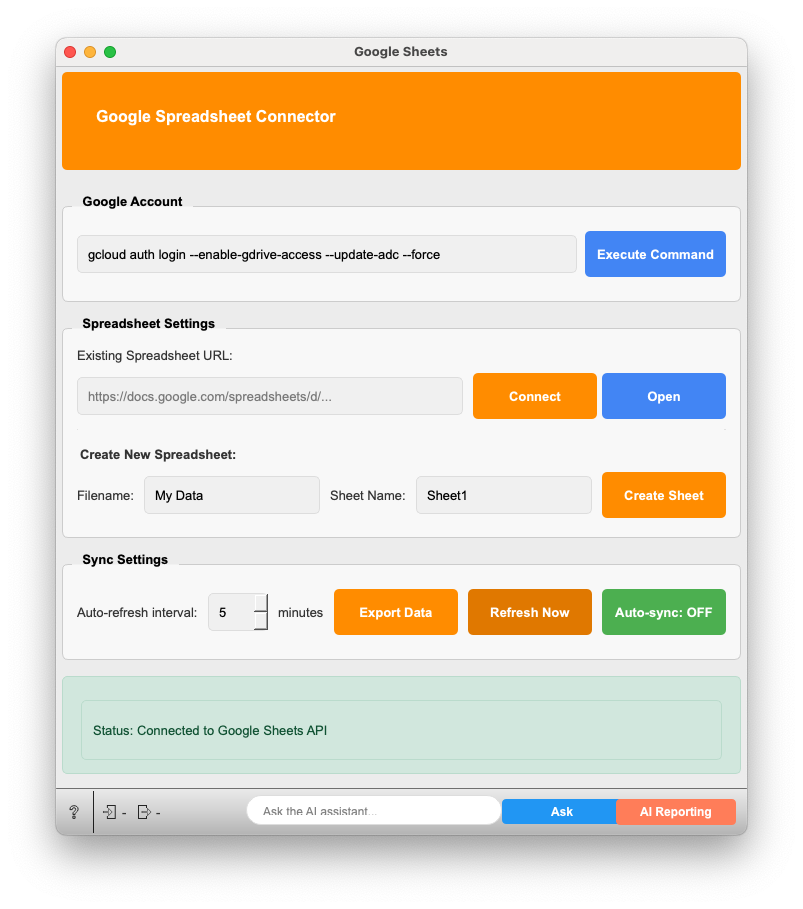

# Google Sheets (Googleスプレッドシート)

Google スプレッドシートに接続し、データのインポートおよびエクスポートを行うためのウィジェットです。

## 前提条件

**重要:** このウィジェットを使用するには、**Google Cloud SDK (gcloud CLI) がお使いのコンピュータにインストールされ、PATH環境変数にgcloudコマンドへのパスが設定されている必要があります。**
Google Cloud SDKのインストールについては、[公式ドキュメント](https://cloud.google.com/sdk/docs/install)を参照してください。

認証プロセスでは、`gcloud auth login` コマンドが実行され、ブラウザ経由でのGoogleアカウント認証が求められます。

## 入力 (Inputs)

*   **Data**
    *   **型:** `Orange.data.Table`
    *   **説明:** Googleスプレッドシートにエクスポートするデータセット。
    *   **入力データ例:**
        Orangeの `File` ウィジェットや他のデータ処理ウィジェットから出力されるテーブルデータ。
        例えば、Irisデータセットのような形式です。

        | sepal length | sepal width | petal length | petal width | iris  |
        | :----------- | :---------- | :----------- | :---------- | :---- |
        | 5.1          | 3.5         | 1.4          | 0.2         | Iris-setosa |
        | 4.9          | 3.0         | 1.4          | 0.2         | Iris-setosa |
        | ...          | ...         | ...          | ...         | ...   |

## 出力 (Outputs)

*   **Data**
    *   **型:** `Orange.data.Table`
    *   **説明:** 接続されたGoogleスプレッドシートからインポートされたデータ。スプレッドシートの最初の行がヘッダーとして扱われます。数値データは自動的に数値型として解釈されます。

## UIと機能の説明

このウィジェットは、Googleアカウントの認証、スプレッドシートへの接続・作成、データの同期設定を行うためのUIを提供します。

1.  **Google Spreadsheet Connector (ヘッダー)**
    *   ウィジェットのタイトルが表示されます。オレンジ色の背景です。

2.  **Google Account (Googleアカウント)**
    *   **gcloud auth login ... コマンド表示エリア:** 認証に使用されるgcloud CLIコマンドが表示されます (編集不可)。
        デフォルトコマンド: `gcloud auth login --enable-gdrive-access --update-adc --force`
    *   **Execute Command (コマンド実行) ボタン:** このボタンをクリックすると、表示されているgcloud CLIコマンドが実行されます。
        *   ターミナルまたはコマンドプロンプトが（バックグラウンドで）起動し、ブラウザが開いてGoogleアカウントへのログインと権限の許可を求められます。
        *   認証が成功すると、ウィジェットはGoogle Sheets APIおよびGoogle Drive APIへのアクセス権を取得します。
        *   認証中はボタンが無効化され、「Executing...」と表示されます。
        *   認証プロセス中にキャンセルボタン付きのプログレスダイアログが表示されます。

3.  **Spreadsheet Settings (スプレッドシート設定)**
    *   **Existing Spreadsheet URL (既存スプレッドシートURL):**
        *   **URL入力欄:** 接続したい既存のGoogleスプレッドシートのURLを入力します。 (例: `https://docs.google.com/spreadsheets/d/SPREADSHEET_ID/edit#gid=SHEET_ID`)
        *   **Connect (接続) ボタン:** 入力されたURLのスプレッドシートに接続します。URLに `gid` パラメータが含まれている場合、そのシートに接続します。含まれていない場合は、最初のシートに接続します。
        *   **Open (開く) ボタン:** 現在接続されているスプレッドシートをデフォルトのウェブブラウザで開きます。
    *   **Create New Spreadsheet (新規スプレッドシート作成):**
        *   **Filename (ファイル名) 入力欄:** 新規に作成するスプレッドシートのファイル名を入力します。(デフォルト: `My Orange3 Data`)
        *   **Sheet Name (シート名) 入力欄:** 新規ファイル内の最初のシート名を入力します。(デフォルト: `Sheet1`)
        *   **Create Sheet (シート作成) ボタン:**
            *   指定されたファイル名のスプレッドシートがGoogle Drive上に既に存在する場合:
                *   そのスプレッドシートに接続します。
                *   指定されたシート名が既に存在すれば、そのシートの全データがクリアされます。
                *   指定されたシート名が存在しなければ、新しいシートとして作成されます。
            *   指定されたファイル名のスプレッドシートが存在しない場合:
                *   新しいスプレッドシートを指定のファイル名とシート名で作成します。
            *   作成または接続後、入力 (Inputs) にデータが接続されていれば、そのデータがエクスポートされます。

4.  **Sync Settings (同期設定)**
    *   **Auto-refresh interval (自動更新間隔):** スプレッドシートからデータを自動的に再読み込みする間隔を分単位で設定します。(1〜60分)
    *   **Export Data (データエクスポート) ボタン:** 現在ウィジェットの入力 (Inputs) に接続されているデータを、接続中のスプレッドシートの指定シートにエクスポートします。エクスポート前にシートの既存データはクリアされます。
    *   **Refresh Now (今すぐ更新) ボタン:** 接続中のスプレッドシートから手動でデータを再読み込みし、出力 (Outputs) に送ります。
    *   **Auto-sync: OFF/ON (自動同期: オフ/オン) ボタン:** 自動更新機能のオン/オフを切り替えます。オンにすると、設定された間隔で `Refresh Now` が自動的に実行されます。

5.  **Status (ステータス)**
    *   ウィジェットの現在の状態（例: "Status: Connected to Google Sheets API"、"Status: Authentication failed" など）や操作結果が表示されます。
    *   ステータスの種類に応じて背景色が変わります:
        *   緑系: 成功 (例: 接続成功、データ同期完了)
        *   赤系: エラー (例: 認証失敗、接続失敗)
        *   黄系: 警告 (例: シートにデータなし)
        *   青系: 実行中 (例: gcloudコマンド実行中)
        *   グレー系: 情報 (例: 未接続)

## 主な操作フロー

### 1. Googleアカウント認証
1.  「Google Account」セクションの **Execute Command** ボタンをクリックします。
2.  ブラウザが起動し、Googleアカウントへのログインと、Google DriveおよびGoogle Sheetsへのアクセス許可を求められます。画面の指示に従って認証を完了してください。
3.  認証が成功すると、ステータスが "Authentication successful" や "Connected to Google Sheets API" と表示されます。

### 2. 既存スプレッドシートへの接続とデータ取得
1.  認証後、「Spreadsheet Settings」セクションの「Existing Spreadsheet URL」に接続したいスプレッドシートのURLを貼り付けます。
2.  **Connect** ボタンをクリックします。
3.  接続に成功すると、スプレッドシートのデータが読み込まれ、ウィジェットの出力 (Outputs) から利用可能になります。ステータスに接続情報と同期時刻が表示されます。
4.  必要に応じて **Refresh Now** ボタンで手動更新、または自動同期を有効にします。

### 3. 新規スプレッドシートの作成とデータエクスポート
1.  認証後、「Spreadsheet Settings」セクションの「Create New Spreadsheet」で「Filename」と「Sheet Name」を入力します。
2.  **Create Sheet** ボタンをクリックします。
3.  Google Drive上に新しいスプレッドシートが作成（または既存のものが利用）されます。
4.  ウィジェットの入力 (Inputs) にデータが接続されていれば、そのデータが自動的に新しいシートにエクスポートされます。ステータスに作成/エクスポート結果が表示されます。
5.  作成されたスプレッドシートは、以後「Existing Spreadsheet URL」にURLが自動入力され、接続状態になります。

### 4. データのエクスポート (手動)
1.  ウィジェットの入力 (Inputs) にOrangeのテーブルデータを接続します。
2.  スプレッドシートに接続済み（または新規作成済み）であることを確認します。
3.  「Sync Settings」セクションの **Export Data** ボタンをクリックします。
4.  接続中のシートの既存データがクリアされ、入力データがスプレッドシートに書き込まれます。

## 詳細なロジック

*   **認証 (`execute_gcloud_command`)**:
    *   `gcloud auth login --enable-gdrive-access --update-adc --force` コマンドをサブプロセスとして実行します。これにより、ユーザーのローカル環境に保存されているApplication Default Credentials (ADC) が更新され、Google APIへのアクセスに必要な認証情報が取得されます。
    *   プロセスは非同期で実行され、完了（成功または失敗）するとステータスが更新されます。タイムアウト（30秒）も設定されています。
    *   認証成功後、`google.auth.default()` を使用して認証情報を取得し、Google Sheets API (`build('sheets', 'v4', ...)`）およびGoogle Drive API (`build('drive', 'v3', ...)`) のサービスクライアントを初期化します。

*   **既存シート接続 (`connect_to_spreadsheet`)**:
    *   入力されたURLから正規表現 (`/d/([a-zA-Z0-9-_]+)`) を用いてスプレッドシートIDを抽出します。また、`gid=(\d+)` からシートID (gid) を抽出し、対象のシートを特定します。
    *   Google Sheets APIの `spreadsheets().get()` メソッドでスプレッドシートのメタデータ（シート名など）を取得し、接続状態を更新します。
    *   その後、`refresh_data()` を呼び出してシートのデータを読み込みます。

*   **新規シート作成 (`create_new_spreadsheet`)**:
    *   まず、Google Drive APIの `files().list()` メソッドを使い、指定されたファイル名で既存のスプレッドシートを検索します。
    *   **既存ファイルが見つかった場合**: そのスプレッドシートIDを使用します。Google Sheets APIでシートのリストを取得し、指定されたシート名が存在するか確認します。存在すれば `_clear_sheet_data()` でデータをクリアし、存在しなければ `spreadsheets().batchUpdate()` で新しいシートを追加します。
    *   **既存ファイルが見つからない場合**: Google Sheets APIの `spreadsheets().create()` メソッドで新しいスプレッドシートを指定のファイル名とシート名で作成します。
    *   作成後、入力データがあれば `_write_data_to_sheet()` を呼び出してデータを書き込みます。最後に `connect_to_spreadsheet()` を呼び出して、作成したシートに正式に接続しデータを読み込みます。

*   **データ取得 (`refresh_data`)**:
    *   Google Sheets APIの `spreadsheets().values().get()` メソッドを使用して、接続中のスプレッドシートIDとシート名からセルデータを取得します。
    *   取得したデータ（値のリストのリスト）をPandas DataFrameに変換します。最初の行をヘッダーとして使用します。
    *   各列のデータ型をチェックし、数値に変換可能な列は `pd.to_numeric` で数値型に変換します。
    *   最終的にDataFrameを `Orange.data.pandas_compat.table_from_frame()` を使用してOrange Tableに変換し、ウィジェットの出力に送信します。

*   **データエクスポート (`_export_data`, `_write_data_to_sheet`)**:
    *   まず `_clear_sheet_data()` を呼び出し、Google Sheets APIの `spreadsheets().values().clear()` を使用して対象シートの全データをクリアします。
    *   入力されたOrange Tableを `Orange.data.pandas_compat.table_to_frame()` でPandas DataFrameに変換します。カテゴリカルデータは文字列に、NaN値は空文字列に変換されます。
    *   DataFrameのヘッダーとデータ行をリスト形式に整形し、Google Sheets APIの `spreadsheets().values().update()` メソッドを使用して、シートのA1セルからデータを書き込みます (`valueInputOption='RAW'`)。

*   **自動同期 (`_toggle_auto_sync`, `_start_sync_timer`)**:
    *   `QTimer` を使用して実装されています。`Auto-sync` ボタンがONになると、指定された「Auto-refresh interval」ミリ秒間隔でタイマーが開始され、タイムアウトごとに `refresh_data()` メソッドが呼び出されます。

## 使用例

1.  Allyeのワークフローに `File` ウィジェットを追加し、分析したいデータファイル（例: iris.tab）を読み込みます。
2.  `Google Sheets` ウィジェットをワークフローに追加し、`File` ウィジェットの出力（Data）を `Google Sheets` ウィジェットの入力（Data）に接続します。
3.  `Google Sheets` ウィジェットを開き、「Google Account」セクションの **Execute Command** ボタンでGoogleアカウント認証を行います。
4.  認証後、「Spreadsheet Settings」セクションで「Filename」に「MyIrisData」、「Sheet Name」に「IrisSheet1」と入力し、**Create Sheet** ボタンをクリックします。
    *   これにより、ご自身のGoogle Driveに "MyIrisData" という名前のスプレッドシートが作成され、その中に "IrisSheet1" というシートが作られ、Irisデータがエクスポートされます。
    *   ステータスに成功メッセージが表示されます。
5.  **Open** ボタンをクリックして、作成されたスプレッドシートをブラウザで確認します。
6.  ブラウザでスプレッドシートの値をいくつか編集します。
7.  Orangeの `Google Sheets` ウィジェットに戻り、**Refresh Now** ボタンをクリックします。
8.  `Google Sheets` ウィジェットの出力に `Data Table` ウィジェットなどを接続すると、スプレッドシートでの変更がOrange側に反映されていることを確認できます。
9.  または、「Auto-sync」をONにしておけば、指定間隔で自動的に変更が反映されます。