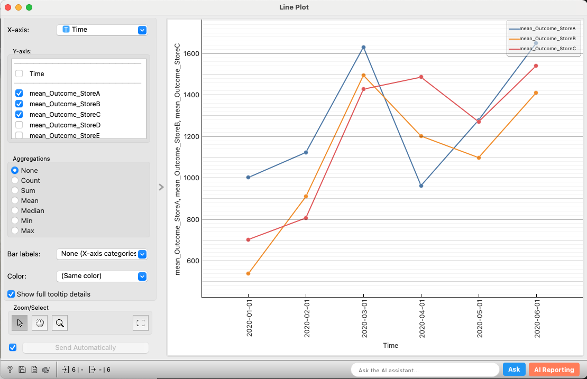
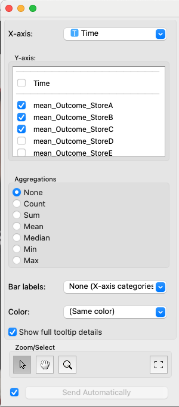

# Line Plot (Allye)

The Line Plot widget is a tool for visualizing variables in a dataset as a line chart, suitable for analyzing trends or time-series patterns along the X-axis. It can display multiple variables on the Y-axis simultaneously as separate lines. Furthermore, it provides features to group the color of data points based on another categorical variable and to display detailed tooltip information. It also includes interactive selection capabilities.

## Inputs

*   **Data**:
    *   Data type: `Orange.data.Table`
    *   Description: The dataset to be analyzed. It must contain columns to be used as the X-axis variable, Y-axis variables, and color variable (optional).
*   **Data Subset**:
    *   Data type: `Orange.data.Table`
    *   Description: A subset of the main dataset. Data points included in the subset will be visually distinguished on the main plot (usually by transparency).

### Input Data Specifications

The input data is expected to contain the following information:

*   **X-axis Variable**:
    *   The variable that defines the categories or time-series for the line chart.
    *   Must be a Discrete Variable, String Variable, or Time Variable.
*   **Y-axis Variables**:
    *   One or more variables used to determine the height of the lines. If multiple variables are specified, a separate line is drawn for each variable.
    *   With aggregation: A Continuous Variable or Time Variable is recommended.
    *   Without aggregation: A Continuous Variable or Time Variable is recommended.
*   **Color Variable** (optional):
    *   The variable used to group the colors of the data points.
    *   Must be a Discrete Variable.
    *   On top of the lines drawn for each Y-axis variable, points will be displayed colored according to the values of this variable.
*   **Other Variables (Meta Variables, etc.)**:
    *   Variables to be kept in the data for tooltip display or other analyses.

### Input Data Example

The following is an example of data for analyzing monthly sales of product A and product B by region.

| Month (X-axis) | Product A Sales (Y-axis) | Product B Sales (Y-axis) | Region (Color) |
| :------------- | :----------------------- | :----------------------- | :------------- |
| 2023-01        | 1500                     | 2200                     | East           |
| 2023-02        | 1600                     | 2300                     | West           |
| 2023-03        | 1550                     | 2250                     | East           |
| 2023-04        | 1700                     | 2400                     | West           |
| 2023-05        | 1800                     | 2500                     | East           |
| ...            | ...                      | ...                      | ...            |

In this example, "Month" can be used as the X-axis variable, "Product A Sales" and "Product B Sales" can be multi-selected as Y-axis variables, and "Region" can be used as the point color variable.

## Outputs

*   **Selected Data**:
    *   Data type: `Orange.data.Table`
    *   Description: The original data instances corresponding to the points selected by the user on the plot.
*   **Annotated Data**:
    *   Data type: `Orange.data.Table`
    *   Description: The original data with an additional column (usually a meta attribute named `Selected`) indicating the selection status. It will be "Yes" if selected, "No" otherwise, and unselected data points will have an empty value.

## Feature Description

*(Figure: Placeholder for the overall interface of the Custom Line Plot widget)*

### Control Area (Left Panel)

In the control panel, you can assign variables to be displayed in the graph, select the aggregation method, set point coloring, and configure how tooltips are displayed.

*(Figure: Placeholder for the variable selection, aggregation, and display options sections in the control area)*

*   **X-axis**:
    *   Select the variable (categorical, string, time) to be used for the X-axis from the dropdown list.
*   **Y-axis**:
    *   Select one or more variables (numerical, time) to be used for the Y-axis from the checkbox list.
*   **Aggregations**:
    *   Select how the Y-axis variable should be aggregated to determine the position of the points.
        *   `None`: No aggregation is performed, and each row of the data table (or up to `MAX_POINTS`) is displayed as an individual point (if a Y-axis variable is selected).
        *   `count`: The number of occurrences (instances) of each category on the X-axis becomes the Y-coordinate of the point (selection of a Y-axis variable is unnecessary).
        *   `sum`, `mean`, `median`, `min`, `max`: For the selected Y-axis variable, the sum, average, median, minimum, or maximum is calculated for each category on the X-axis, and this becomes the Y-coordinate of the point.
*   **Color**:
    *   Select the discrete variable to be used for coloring the data points from the dropdown list. A different color will be assigned for each value of the selected variable.
*   **Show full tooltip details**:
    *   If checked, the tooltip displayed when hovering over a point will show all attribute information of the associated data instance. If unchecked, a concise tooltip with only major information will be displayed.

### Main Area (Right Panel)

The main area displays the generated line chart.

*(Figure: Placeholder for the line chart display area in the main area)*

*   **Line Plot Display**:
    *   The line chart is drawn based on the settings.
    *   The X-axis displays the categories of the selected variable, and the Y-axis displays the values or aggregated values.
    *   If multiple Y-axis variables are specified, a line with a different color is drawn for each variable.
    *   If a color variable is specified, the data points on the lines will be colored accordingly.
    *   **Legend**: If Y-axis variables or a color variable are used, a legend showing which color corresponds to which value will be displayed.
    *   **Tooltip**: When the mouse cursor hovers over a data point, information related to that point (X-axis value, corresponding Y-axis variable name and value, color variable value, etc.) is displayed. The amount of information displayed changes according to the `Show full tooltip details` setting.
*   **Interactions**:
    *   **Selection**:
        *   Clicking on a point selects that point (single selection).
        *   Clicking while holding the Ctrl (or Cmd) key toggles the selection state (multiple selection/deselection).
        *   Clicking while holding the Shift key adds to the current selection.
        *   Clicking while holding the Alt key removes from the current selection.
        *   Dragging to specify a rectangular area selects all points within the area.
    *   **Zooming**: After selecting the zoom button on the toolbar, drag to specify an area to zoom in.
    *   **Panning**: After selecting the pan button on the toolbar, drag to move the display area.
    *   **Reset View**: The reset button on the toolbar returns the plot's display range to its initial state.

### Button Area (Usually at the bottom or right)

This area contains options for switching plot interaction modes and for automatic submission of settings.

*   **Toolbar (Plot GUI)**:
    *   Buttons to switch between selection mode, zoom mode, and pan mode.
    *   A button to reset the view.
*   **Auto-commit**:
    *   If checked, changes to widget settings or selections are immediately sent to `Outputs`. If unchecked, they are not sent until a "Commit" button is manually pressed.

## Example Usage

1.  Load the dataset to be analyzed using the **File** widget.
2.  Connect the output of the **File** widget to the `Data` input of the **Line Plot** widget.
3.  Open the **Line Plot** widget and configure the following in the control panel:
    *   Select the `X-axis` variable.
    *   Select the `Y-axis` variable(s).
    *   If necessary, specify the `Aggregations` method.
    *   Optionally, set the `Color` variable.
4.  Examine the generated line chart in the main area.
    *   If necessary, use the toolbar buttons to switch between zoom, pan, and selection modes.
    *   Select data by clicking or dragging on the points.
5.  Connect the `Selected Data` output of the **Line Plot** to a **Data Table** widget to examine the details of the selected data instances.

## Detailed Logic

### 1. Data Processing (`_process_data_and_update_plot`)

1.  **Input Check**: Checks if `Data` input and `X-axis` variable are selected. If the aggregation method is not "None" or "count", it checks if at least one `Y-axis` variable is selected.
2.  **DataFrame Conversion**: Converts the Orange Table to a Pandas DataFrame and extracts the necessary columns (X-axis, Y-axis (one or more), color variable, original index, ID).
3.  **Data Processing**: According to the aggregation method (`Aggregation_method`), groups the data and calculates the Y-value for each X-axis value (no aggregation, or count, sum, mean, etc.).
4.  **Plot Data Generation**: Stores the processed data in an internal data structure (`_processed_plot_data`) in a format that pyqtgraph can draw.
5.  **Graph Update**: Calls `self.graph.reset_graph()` to trigger a redraw of the graph.
6.  **Selection State Restoration**: `handleNewSignals()` is called to apply any previous selection state to the graph.

### 2. Graph Drawing and Updating (`CustomLinePlotGraph`)

*   **Drawing Lines (`update_lines`)**:
    *   Based on the processed data (`_processed_plot_data`) and the list of Y-axis variables, prepares the coordinate data for each line.
    *   Creates a `pyqtgraph.PlotDataItem` for each Y-axis variable and draws lines with different colors.
    *   If a color variable is specified, determines the color of each data point and sets it as the symbol color (`symbolBrush`).
*   **Updating Axes (`update_axes`)**:
    *   Sets the X-axis and Y-axis labels. If the X-axis is categorical, sets the category names as the X-axis tick labels.
*   **Updating Legend (`update_legend`)**:
    *   Creates a legend based on the list of Y-axis variables and the values of the color variable.
*   **Applying Selection (`apply_selection_to_points`)**:
    *   Creates a separate `pyqtgraph.ScatterPlotItem` to highlight the currently selected points (`self.selection_indices`) and adds it to the graph.

### 3. Interaction Handling (`CustomLinePlotViewBox`, `CustomLinePlotGraph`)

*   **Rectangle Selection (`mouseDragEvent`)**:
    *   Compares the rectangle created by the user's drag with the coordinates of each point and considers the contained points as selection targets.
*   **Click Selection (`mouseClickEvent`, `__get_point_at`)**:
    *   Identifies the closest point to the clicked coordinates and considers it the selection target.
*   **Selection Change Notification (`update_selection_from_point_indices`, `selection_changed` signal)**:
    *   When the indices of selected points are updated, gets the list of original data indices and emits the `selection_changed` signal.
*   **Tooltip Display (`help_event`)**:
    *   Identifies the point under the mouse cursor, calls `OWCustomLinePlot.get_tooltip_for_point()` to get the tooltip text, and displays it. 