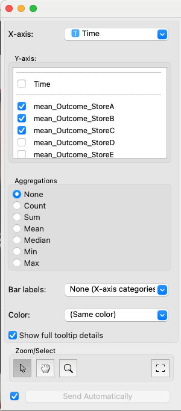

# Line Plot (Allye)

Line Plot ウィジェットは、データセット内の変数を折れ線グラフとして視覚化するためのツールです。X軸に沿ったデータのトレンドや時系列パターンを分析するのに適しています。Y軸に複数の変数を指定することで、それらを個別の線として同時に表示できます。さらに、データポイントの色を他のカテゴリカル変数に基づいてグループ化したり、詳細なツールチップ情報を表示したりする機能を提供します。インタラクティブな選択機能も備えています。

## 入力 (Inputs)

*   **Data (データ)**:
    *   データ型: `Orange.data.Table`
    *   説明: 分析対象のデータセット。X軸変数、Y軸変数、色分け変数（オプション）として使用する列を含む必要があります。
*   **Data Subset (データサブセット)**:
    *   データ型: `Orange.data.Table`
    *   説明: メインのデータセットのサブセット。サブセットに含まれるデータポイントは、メインプロット上で視覚的に区別されます（通常は透明度で）。

### 入力データの仕様

入力データには以下の情報が含まれていることが期待されます。

*   **X軸変数 (X-axis Variable)**:
    *   折れ線グラフのカテゴリまたは時系列を定義する変数。
    *   離散変数 (Discrete Variable)、文字列変数 (String Variable)、または時間変数 (Time Variable) である必要があります。
*   **Y軸変数 (Y-axis Variable)**:
    *   線の高さを決定するために使用される1つまたは複数の変数。複数の変数を指定すると、変数ごとに個別の線が描画されます。
    *   集計ありの場合: 数値変数 (Continuous Variable) または時間変数 (Time Variable) を推奨。
    *   集計なしの場合: 数値変数 (Continuous Variable) または時間変数 (Time Variable) を推奨。
*   **色分け変数 (Color Variable)** (任意):
    *   データポイントの色をグループ化するために使用する変数。
    *   離散変数 (Discrete Variable) である必要があります。
    *   Y軸変数ごとに描画される線の上に、この変数の値に応じて色分けされた点が表示されます。
*   **その他の変数 (Meta Variables, etc.)**:
    *   ツールチップ表示や他の分析のためにデータ内に保持しておきたい変数。

### 入力データ例

以下は、月ごとの製品Aと製品Bの売上を地域別に分析するデータの例です。

| 月 (X-axis) | 製品A売上 (Y-axis) | 製品B売上 (Y-axis) | 地域 (Color) |
| :---------- | :----------------- | :----------------- | :----------- |
| 2023-01     | 1500               | 2200               | East         |
| 2023-02     | 1600               | 2300               | West         |
| 2023-03     | 1550               | 2250               | East         |
| 2023-04     | 1700               | 2400               | West         |
| 2023-05     | 1800               | 2500               | East         |
| ...         | ...                | ...                | ...          |

この例では、「月」をX軸変数、「製品A売上」と「製品B売上」をY軸変数として複数選択し、「地域」をポイントの色分け変数として使用できます。

## 出力 (Outputs)

*   **Selected Data (選択されたデータ)**:
    *   データ型: `Orange.data.Table`
    *   説明: プロット上でユーザーが選択した点に対応する元のデータインスタンス。
*   **Annotated Data (注釈付きデータ)**:
    *   データ型: `Orange.data.Table`
    *   説明: 元のデータに選択状態を示す追加の列（通常は `Selected` という名前のメタ属性）が付与されたデータ。選択されていれば "Yes"、そうでなければ "No"、未選択のデータポイントは空の値になります。

## 機能の説明

*(図: Custom Line Plot ウィジェットの全体的なインターフェースのプレースホルダ)*

### コントロールエリア (左パネル)

コントロールパネルでは、グラフに表示する変数の割り当て、集計方法の選択、ポイントの色分け設定、ツールチップの表示方法などを設定します。

*(図: コントロールエリアの変数選択、集計、表示オプションセクションのプレースホルダ)*

*   **X-axis (X軸)**:
    *   ドロップダウンリストからX軸に使用する変数（カテゴリカル、文字列、時間）を選択します。
*   **Y-axis (Y軸)**:
    *   チェックボックスリストからY軸に使用する1つ以上の変数（数値、時間）を選択します。
*   **Aggregations (集計)**:
    *   Y軸変数をどのように集計して点の位置を決定するかを選択します。
        *   `None`: 集計を行わず、データテーブルの各行（または最大 `MAX_POINTS` まで）を個別の点として表示します（Y軸変数が選択されている場合）。
        *   `count`: X軸の各カテゴリの出現回数（インスタンス数）を点のY座標とします（Y軸変数の選択は不要）。
        *   `sum`, `mean`, `median`, `min`, `max`: 選択されたY軸変数に対して、X軸の各カテゴリごとに合計、平均、中央値、最小値、最大値を計算し、点のY座標とします。
*   **Color (色)**:
    *   ドロップダウンリストから、データポイントの色分けに使用する離散変数を選択します。選択された変数の値ごとに異なる色が割り当てられます。
*   **Show full tooltip details (ツールチップ詳細表示)**:
    *   チェックを入れると、点にマウスオーバーした際に表示されるツールチップに、関連するデータインスタンスの全属性情報が表示されます。チェックを外すと、主要な情報のみの簡潔なツールチップになります。

### メインエリア (右パネル)

メインエリアには、生成された折れ線グラフが表示されます。

*(図: メインエリアの折れ線グラフ表示エリアのプレースホルダ)*

*   **Line Plot Display (折れ線グラフ表示)**:
    *   設定に基づいて折れ線グラフが描画されます。
    *   X軸には選択された変数のカテゴリが、Y軸には値または集計値が表示されます。
    *   Y軸に複数の変数が指定された場合、変数ごとに異なる色の線が描画されます。
    *   色分け変数が指定されていれば、線上のデータポイントがそれに応じて色分けされます。
    *   **凡例 (Legend)**: Y軸変数や色分け変数が使用されている場合、各色がどの値に対応するかの凡例が表示されます。
    *   **ツールチップ (Tooltip)**: データポイントにマウスカーソルを合わせると、その点に関連する情報（X軸の値、対応するY軸変数の名前と値、色分け変数の値など）が表示されます。`Show full tooltip details` の設定に応じて、表示される情報量が変わります。
*   **Interactions (インタラクション)**:
    *   **選択 (Selection)**:
        *   点をクリックすると、その点が選択されます（単一選択）。
        *   Ctrl（またはCmd）キーを押しながらクリックすると、選択状態がトグルされます（複数選択/解除）。
        *   Shiftキーを押しながらクリックすると、現在の選択に追加されます。
        *   Altキーを押しながらクリックすると、現在の選択から除外されます。
        *   ドラッグして矩形範囲を指定することで、範囲内の点をまとめて選択できます。
    *   **ズーム (Zooming)**: ツールバーのズームボタンを選択後、ドラッグして範囲を指定すると拡大表示されます。
    *   **パン (Panning)**: ツールバーのパンボタンを選択後、ドラッグして表示範囲を移動できます。
    *   **リセットビュー (Reset View)**: ツールバーのリセットボタンで、プロットの表示範囲を初期状態に戻します。

### ボタンエリア (通常は下部または右部)

プロットのインタラクションモードの切り替えや、設定の自動送信オプションなどがあります。

*   **ツールバー (Plot GUI)**:
    *   選択モード、ズームモード、パンモードを切り替えるボタン。
    *   ビューをリセットするボタン。
*   **Auto-commit (自動送信)**:
    *   チェックを入れると、ウィジェットの設定変更や選択の変更が即座に `Outputs` に送信されます。チェックを外すと、手動で送信ボタンを押すまで送信されません。

## 使用例

1.  **File (ファイル)** ウィジェットで分析対象のデータセットを読み込みます。
2.  **File** ウィジェットの出力を **Line Plot** ウィジェットの `Data` 入力に接続します。
3.  **Line Plot** ウィジェットを開き、コントロールパネルで以下を設定します。
    *   `X-axis` 変数を選択します。
    *   `Y-axis` 変数（複数可）を選択します。
    *   必要に応じて `Aggregations` 方法を指定します。
    *   オプションで `Color` 変数を設定します。
4.  メインエリアで生成された折れ線グラフを確認します。
    *   必要に応じて、ツールバーのボタンを使用してズーム、パン、選択モードを切り替えます。
    *   点をクリックまたはドラッグしてデータを選択します。
5.  **Line Plot** の `Selected Data` 出力を **Data Table** ウィジェットに接続し、選択したデータの詳細を確認します。

## 詳細なロジック

### 1. データ処理 (`_process_data_and_update_plot`)

1.  **入力チェック**: `Data` 入力と `X-axis` 変数が選択されているかを確認します。集計方法が "None" や "count" 以外の場合、`Y-axis` 変数が1つ以上選択されているかを確認します。
2.  **データフレーム変換**: Orange TableをPandas DataFrameに変換し、分析に必要な列（X軸、Y軸（複数可）、色分け変数、オリジナルインデックス、ID）を抽出します。
3.  **データ処理**: 集計方法（`Aggregation_method`）に応じて、データをグループ化し、各X軸の値に対するY軸の値を計算します（集計なし、またはcount, sum, meanなど）。
4.  **プロットデータ生成**: 処理されたデータを、pyqtgraphが描画できる形式の内部データ構造 (`_processed_plot_data`) に格納します。
5.  **グラフ更新**: `self.graph.reset_graph()` を呼び出し、グラフの再描画をトリガーします。
6.  **選択状態の復元**: `handleNewSignals()` が呼ばれ、以前の選択状態があればグラフに適用します。

### 2. グラフ描画と更新 (`CustomLinePlotGraph`)

*   **線の描画 (`update_lines`)**:
    *   処理済みデータ (`_processed_plot_data`) とY軸変数のリストに基づいて、各線の座標データを準備します。
    *   Y軸変数ごとに `pyqtgraph.PlotDataItem` を作成し、異なる色の線を描画します。
    *   色分け変数が指定されている場合、各データポイントの色を決定し、シンボルの色 (`symbolBrush`) として設定します。
*   **軸の更新 (`update_axes`)**:
    *   X軸とY軸のラベルを設定します。X軸がカテゴリカルな場合は、カテゴリ名をX軸の目盛りラベルとして設定します。
*   **凡例の更新 (`update_legend`)**:
    *   Y軸変数のリストと色分け変数の値に基づいて凡例を作成します。
*   **選択の適用 (`apply_selection_to_points`)**:
    *   現在選択されている点 (`self.selection_indices`) を強調表示するための `pyqtgraph.ScatterPlotItem` を別途作成し、グラフ上に追加します。

### 3. インタラクション処理 (`CustomLinePlotViewBox`, `CustomLinePlotGraph`)

*   **矩形選択 (`mouseDragEvent`)**:
    *   ユーザーがドラッグして作成した矩形と各点の座標を比較し、含まれる点を選択対象とします。
*   **クリック選択 (`mouseClickEvent`, `__get_point_at`)**:
    *   クリックされた座標に最も近い点を特定し、選択対象とします。
*   **選択変更通知 (`update_selection_from_point_indices`, `selection_changed` signal)**:
    *   選択された点のインデックスが更新されると、元のデータインデックスのリストを取得し、`selection_changed` シグナルを発行します。
*   **ツールチップ表示 (`help_event`)**:
    *   マウスカーソル下の点を特定し、`OWCustomLinePlot.get_tooltip_for_point()` を呼び出してツールチップテキストを取得し、表示します。 