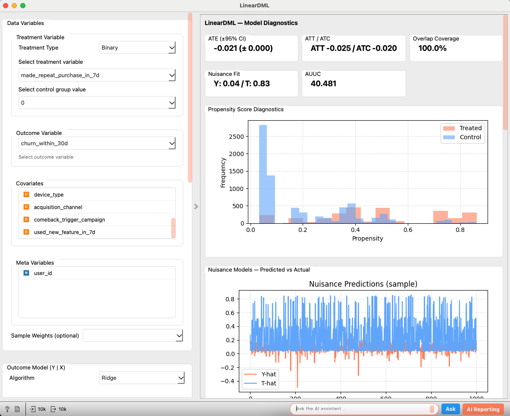
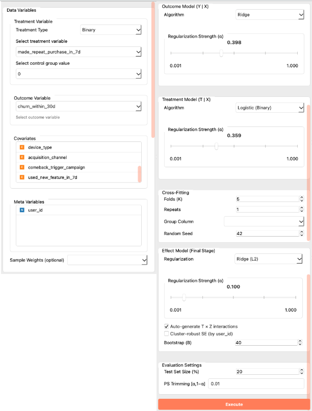
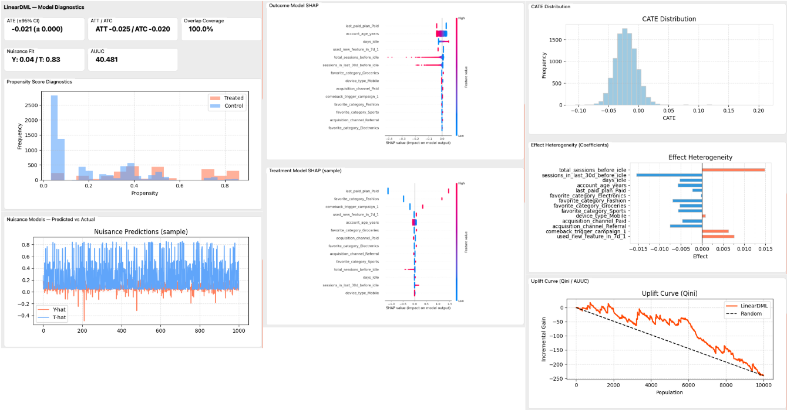
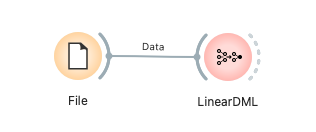

# LinearDML

LinearDML is a Double Machine Learning (DML) widget powered by econML that estimates heterogeneous treatment effects (CATE). It supports binary treatments, exposes the key building blocks (nuisance models Y|X and T|X, cross-fitting, final effect model), and provides rich diagnostics including SHAP summaries for nuisance models, propensity score analyses, and uplift (Qini/AUUC) curves.

---

## Inputs

* **Data**
  * Type: `Orange.data.Table`
  * Description: The analysis dataset. It should contain a binary treatment variable, an outcome variable (numeric), covariates (features), and optionally meta variables, sample weights, and group identifiers.

### Input Data Specifications

* **Treatment Variable**
  * Binary: Use a Discrete Variable. Select the control group value in the UI; it will be encoded as 0 (the other value is encoded as 1).
* **Outcome Variable**
  * Numeric variable to evaluate the effect (e.g., sales, conversion rate). Internally treated as float.
* **Covariates**
  * Numeric and/or categorical features. Categorical covariates are one-hot encoded (column names like `feature=value`, using `drop_first=True`).
* **Meta Variables (optional)**
  * Extra identifiers or information to be kept in the data.
* **Sample Weights (optional)**
  * Numeric weights applied throughout the estimation.
* **Group Column (optional)**
  * Group IDs used for GroupKFold cross-fitting (prevents leakage across folds for repeated entities).

### Example Input Table

| User ID (Meta) | Z1 (Cov) | Z2 (Cov) | cat1 (Cov) | T (Treatment) | Y (Outcome) |
| :------------- | :------- | :------- | :--------- | :------------ | :---------- |
| user001        | 0.21     | -1.20    | A          | Treatment     | 2.34        |
| user002        | -0.85    | 0.33     | B          | Control       | 0.90        |
| ...            | ...      | ...      | ...        | ...           | ...         |

---

## Outputs

* **Enhanced Data**
  * Type: `Orange.data.Table`
  * Description: Original data with one meta column added: `CATE` (per-row conditional average treatment effect).
* **Predictions**
  * Type: `Orange.data.Table`
  * Description: Row-aligned table (meta-only) containing diagnostics-ready columns: `CATE`, `Diag Y True`, `Diag T True`, `Diag Y Pred`, `Diag T Pred`, `Diag Propensity`. Non-diagnostic rows are NaN; when a test split is set, only the holdout subset is filled.
* **Diagnostics**
  * Type: `Orange.data.Table`
  * Description: Key–value style table with two meta columns (`Metric`, `Value` as JSON). Includes settings snapshot, summary metrics (ATE/ATT/ATC/Overlap/AUUC), per-row mapping helpers (`row_mask`, `diag_indices`), histogram bin edges, calibration points, Qini curve arrays, effect coefficients, and SHAP array shapes.

---

## Feature Description

  

*(Figure: Placeholder for the overall interface of the LinearDML widget)*

### Control Area (Left Panel)

  

* **Data Variables**
  * **Treatment Type**: Fixed to `Binary` (display-only indicator for legacy layouts).
  * **Treatment Variable**: Select the treatment column. For binary treatment, also select the `Control group value` (encoded as 0; the other value is 1).
  * **Outcome Variable**: Select the numeric outcome column.
  * **Covariates**: Drag and drop variables used as features.
  * **Meta Variables**: Variables to keep but not use for modeling.
  * **Sample Weights (optional)**: Select a weight column if available.

* **Outcome Model (Y | X)**
  * Algorithm: `Ridge`, `Lasso`, `RandomForest`, `LightGBM` (falls back to RF if LightGBM is not available).
  * For linear models: Regularization strength slider (α = 0.001..1.000).
  * For tree models: `n_estimators`, `max_depth` controls.

* **Treatment Model (T | X)**
  * Algorithms: `Logistic (Binary)`, `RandomForest`, `LightGBM`.
  * Regularization/Tree settings similar to the outcome model.

* **Cross-Fitting**
  * `Folds (K)`, `Repeats` (UI-only), `Group Column`, `Random Seed`.

* **Effect Model (Final Stage)**
  * Regularization: `Ridge (L2)`, `Lasso (L1)`, or `None` with an α slider for Ridge/Lasso.
  * `Auto-generate T × Z interactions` (PolynomialFeatures degree=2, interaction-only).
  * `Bootstrap (B)` for ATE confidence intervals (standard, non-clustered bootstrap).

* **Evaluation Settings**
  * `Test Set Size (%)`: If > 0, a holdout split is used for diagnostics; otherwise, diagnostics use the full data.
  * `PS Trimming [α, 1−α]`: Propensity trimming threshold used for overlap coverage and IPS-based diagnostics (binary treatment).
  * `Histogram Bins`: Rule for propensity/CATE histograms — `Auto`, `Sturges`, `FD`, `Scott`, `Rice` (default), `Sqrt`, `Doane`, or `Manual` count (default 60). Propensity histograms for treated/control share common bin edges in [0,1] for fair overlays.

* **Execute**
  * Runs the analysis. The button is enabled once the required fields are set.

### Main Area (Right Panel)

  

* **Model Diagnostics**
  * **Metrics**:
    * `ATE (±95% CI)`: Average Treatment Effect and optional bootstrap CI.
    * `ATT / ATC`: Effects on treated/control (binary treatment only).
    * `Overlap Coverage`: Share of observations with trimmed propensity inside [α, 1−α].
    * `Nuisance Fit`: R² for Y|X and T|X OOF predictions.
    * `AUUC`: Area under uplift curve (binary treatment only).
  * **Propensity Score Diagnostics**: Histograms for treated vs control propensities (binary).
  * **Treatment Calibration (Binary)**: Calibration plot of predicted propensity vs. observed rate (binned).
  * **Nuisance Models — Predicted vs Actual**: Sample plot of Y-hat and T-hat series.
  * **SHAP Summaries**: SHAP summary plots for the outcome and treatment nuisance models.
  * **CATE Distribution**: Histogram of predicted CATE.
  * **Effect Heterogeneity (Coefficients)**: Bar plot of the final effect model coefficients.
  * **Uplift Curve (Qini / AUUC)**: Uplift curve and random baseline for binary treatments.

---

## Usage Example

  

*(Figure: File → LinearDML → Data Table)*

1. Load the dataset with the **File** widget.
2. Connect it to the `Data` input of the **LinearDML** widget.
3. In the control area, set:
   * `Treatment Type`, `Treatment Variable` (and `Control group value` when binary), and `Outcome Variable`.
   * Assign variables to `Covariates`, `Meta Variables`, and optionally select `Sample Weights` and `Group Column`.
   * Configure `Outcome/Treatment` models, `Cross-Fitting`, and the `Effect Model`.
   * Optionally adjust `PS Trimming` in `Evaluation Settings`.
   * Click `Execute`.
4. Inspect metrics and plots in the main area.
5. Connect outputs:
   * `Enhanced Data` → view CATE per row.
   * `Predictions` → inspect per-row diagnostics (e.g., OOF predictions, propensities).
   * `Diagnostics` → key–value table for arrays/curves/bin edges (JSON in `Value`).

---

## Reporting Feature

The widget supports Orange’s standard reporting. The report contains:

* Model settings (treatment/outcome variables, covariates, effect regularization, cross-fitting, test size as displayed).
* Diagnostics (ATE, ATT/ATC, overlap coverage, AUUC when applicable).
* Embedded plots: Propensity diagnostics, nuisance predictions, SHAP (Y and T), CATE distribution, effect coefficients, and uplift curve.

---

## Detailed Logic

1. **Data Preparation**
   * Outcome is cast to float.
   * Binary treatment is encoded with the chosen control value as 0 (other value as 1).
   * Categorical covariates are one-hot encoded (`drop_first=True`) with readable names (e.g., `cat1_A`).
   * Optional sample weights and group IDs are passed through.
2. **Estimation (econML DML)**
   * Builds Y|X and T|X nuisance models and the final effect model.
   * Uses K-fold cross-fitting (GroupKFold when a group column is provided).
   * Computes per-sample CATE and summary effects (ATE, ATT/ATC for binary treatment).
   * Optional bootstrap provides ATE confidence intervals (standard, non-clustered bootstrap).
3. **Diagnostics**
   * OOF predictions assess nuisance fits (R² or AUC/logistic fit proxy for T when binary).
   * For binary treatments: compute propensities, overlay histograms with shared bin edges, overlap coverage via PS trimming α, and Qini/AUUC uplift diagnostics.
   * CATE is regressed on standardized X to provide effect coefficients.
4. **SHAP**
   * SHAP summaries are computed for both nuisance models (Y and T) on a random subsample (up to ~2000 rows) for performance, falling back among generic/linear/tree explainers as needed.
5. **Enhanced Data**
   * Adds `CATE` as a meta column to the input table for downstream use.

---

## Performance Notes

* SHAP is computed on a random subsample (up to ~2000 rows) to control cost on large datasets.
* LightGBM is optional; if unavailable, the widget falls back to RandomForest.
* Cross-validation and permutation-style operations use parallelism where available (`n_jobs=-1`).
