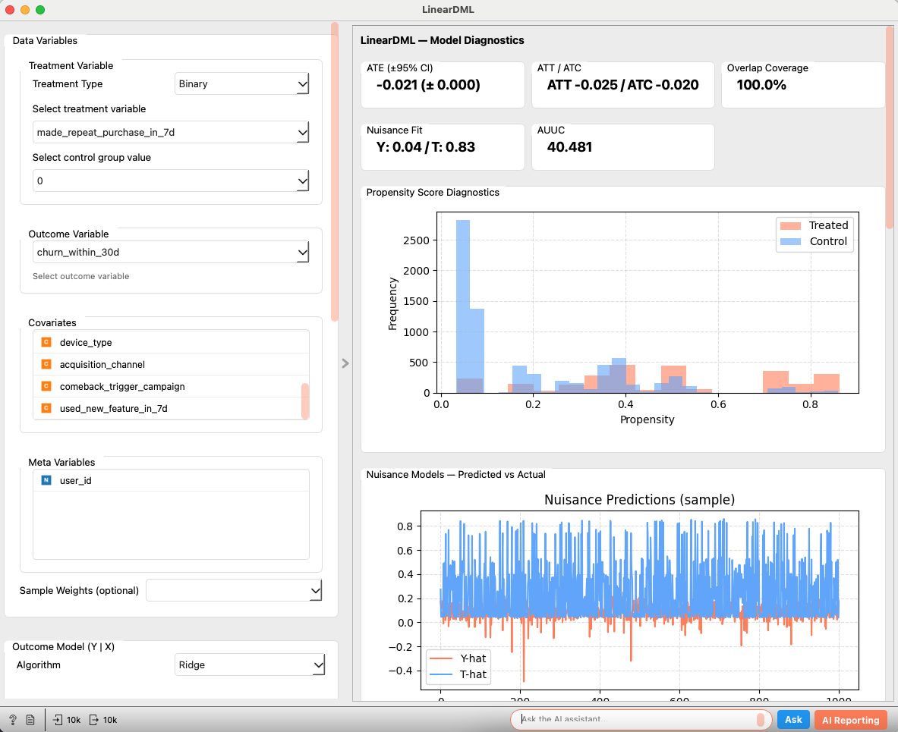

# LinearDML（ダブルマシンラーニング）

LinearDML は econML による Double Machine Learning (DML) を用いて、処置効果の異質性（CATE: Conditional Average Treatment Effect）を推定するウィジェットです。二値・連続いずれの処置変数にも対応し、Y|X / T|X のナイーブンスモデル、クロスフィッティング、最終効果モデルなど主要構成要素を明示しつつ、SHAP サマリーや傾向スコア（Propensity）診断、Uplift（Qini/AUUC）曲線などの診断を提供します。

---

## 入力

* **Data**
  * データ型: `Orange.data.Table`
  * 説明: 分析対象のデータセット。処置変数（Binary/Continuous）、結果変数（数値）、共変量（特徴量）、任意でメタ変数、サンプル重み、グループIDを含みます。

### 入力データの仕様

* **処置変数 (Treatment Variable)**
  * **Binary**: 離散変数（Discrete Variable）を使用。UI で Control group value（0 としてエンコード）を選択します（もう一方は 1）。
  * **Continuous**: 連続変数（Continuous Variable）を使用。
* **結果変数 (Outcome Variable)**
  * 評価対象の数値変数（例: 売上、CV）。内部では float として扱います。
* **共変量 (Covariates)**
  * 数値・カテゴリの特徴量。カテゴリはワンホットエンコード（`変数=値` の列名、`drop_first=True`）。
* **メタ変数 (Meta Variables)**（任意）
  * 分析には使わないが保持したい識別子等。
* **サンプル重み (Sample Weights)**（任意）
  * 学習全体で使用する重み列。
* **グループ列 (Group Column)**（任意）
  * GroupKFold 用のグループID（同一エンティティが学習/検証に跨らないよう分割。リーケージ防止）。

### 入力データ例

| User ID (Meta) | Z1 (Cov) | Z2 (Cov) | cat1 (Cov) | T (Treatment) | Y (Outcome) |
| :------------- | :------- | :------- | :--------- | :------------ | :---------- |
| user001        | 0.21     | -1.20    | A          | Treatment     | 2.34        |
| user002        | -0.85    | 0.33     | B          | Control       | 0.90        |
| ...            | ...      | ...      | ...        | ...           | ...         |

---

## 出力

* **Enhanced Data**
  * データ型: `Orange.data.Table`
  * 説明: 元データに `CATE`（各行の条件付き平均処置効果）をメタ列として追加。
* **Predictions**
  * データ型: `Orange.data.Table`
  * 説明: 行整合（メタ列のみ）の診断用テーブル。`CATE`, `Diag Y True`, `Diag T True`, `Diag Y Pred`, `Diag T Pred`, `Diag Propensity` を含みます。診断対象外の行は NaN。テスト分割を設定した場合はホールドアウト行のみが埋まります。
* **Diagnostics**
  * データ型: `Orange.data.Table`
  * 説明: 2メタ列（`Metric`, `Value`=JSON）のキー・バリューテーブル。設定スナップショット、要約メトリクス（ATE/ATT/ATC/Overlap/AUUC）、行対応用マスク（`row_mask`, `diag_indices`）、ヒストのビン境界、較正カーブ点、Qini 曲線、効果係数、SHAP 配列の形状などを含みます。

---

## 機能説明

  

*(図: LinearDML ウィジェットの全体インターフェースのプレースホルダー)*

### コントロールエリア（左パネル）

  

* **Data Variables**
  * **Treatment Type**: `Binary` または `Continuous` を選択。
  * **Treatment Variable**: 処置列を選択。Binary の場合は `Control group value` も選択（0 としてエンコード、もう一方は 1）。
  * **Outcome Variable**: 数値の結果変数を選択。
  * **Covariates**: 分析に用いる共変量をドラッグ＆ドロップで追加。
  * **Meta Variables**: 保持したいが分析には使わない変数を移動。
  * **Sample Weights (optional)**: 重み列を任意で指定。

* **Outcome Model (Y | X)**
  * アルゴリズム: `Ridge`, `Lasso`, `RandomForest`, `LightGBM`（LightGBM 非導入時は RF にフォールバック）。
  * 線形モデル: 正則化強度スライダー（α=0.001..1.000）。
  * ツリーモデル: `n_estimators`, `max_depth` を指定。

* **Treatment Model (T | X)**
  * Binary: `Logistic (Binary)`, `RandomForest`, `LightGBM`。
  * Continuous: `Ridge (Continuous)`, `RandomForest`, `LightGBM`。
  * 正則化やツリー設定は Outcome と同様。

* **Cross-Fitting**
  * `Folds (K)`, `Repeats`（UI 表示のみ）、`Group Column`, `Random Seed`。

* **Effect Model (Final Stage)**
  * 正則化: `Ridge (L2)`, `Lasso (L1)`, `None`。Ridge/Lasso 選択時は α スライダーが表示。
  * `Auto-generate T × Z interactions`（二次の相互作用のみ、PolynomialFeatures）。
  * `Bootstrap (B)` により ATE の信頼区間（標準ブートストラップ）を計算。

* **Evaluation Settings**
  * `Test Set Size (%)`: 0 より大きい場合はホールドアウト分割を作成し、診断はそのテスト集合で算出。0 の場合は全データで診断を計算。
  * `PS Trimming [α,1−α]`: 傾向スコアのトリミング閾値（Binary）。オーバーラップ率や IPS ベースの診断に使用。
  * `Histogram Bins`: ヒストグラムのビン設定（Propensity/CATE に適用）。`Auto`, `Sturges`, `FD`, `Scott`, `Rice`（既定）, `Sqrt`, `Doane`, `Manual`（既定60）。Propensity ヒストは Treated/Control で共通のビン境界（0..1）を使用します。

* **Execute**
  * 必須項目が満たされると実行可。

### メインエリア（右パネル）

  

* **Model Diagnostics**
  * **Metrics**:
    * `ATE (±95% CI)`: 平均処置効果とブートストラップによる信頼区間（設定時）。
    * `ATT / ATC`: 処置群/対照群に対する効果（Binary のみ）。
    * `Overlap Coverage`: 傾向スコアのトリミング範囲 [α,1−α] 内に入る観測の割合。
    * `Nuisance Fit`: Y|X / T|X の OOF 予測 R²。
    * `AUUC`: Uplift 曲線下面積（Binary のみ）。
  * **Propensity Score Diagnostics**: 処置群/対照群の傾向スコア分布（ヒストグラム、Binary）。共通のビン境界でオーバーレイ。
  * **Treatment Calibration (Binary)**: 予測 Propensity と観測発生率の較正プロット（ビン集計）。
  * **Nuisance Models — Predicted vs Actual**: Y-hat / T-hat のサンプル系列プロット。
  * **SHAP Summaries**: 結果モデル（Y）と処置モデル（T）の SHAP サマリー。
  * **CATE Distribution**: 予測 CATE のヒストグラム。
  * **Effect Heterogeneity (Coefficients)**: 最終効果モデルの係数の棒グラフ。
  * **Uplift Curve (Qini / AUUC)**: Uplift 曲線とランダムベースライン（Binary）。

---

## 使用例

  

*(図: File → LinearDML → Data Table)*

1. **File** ウィジェットでデータを読み込みます。
2. **LinearDML** の `Data` 入力に接続します。
3. 左パネルで以下を設定します。
   * `Treatment Type`、`Treatment Variable`（Binary のとき `Control group value` も）、`Outcome Variable`。
   * `Covariates`、`Meta Variables`、任意で `Sample Weights` と `Group Column`。
   * `Outcome/Treatment` モデル、`Cross-Fitting`、`Effect Model` を構成。
   * `Evaluation Settings` で必要に応じて `PS Trimming` を調整。
   * **Execute** をクリック。
4. 右パネルのメトリクス/プロットを確認します。
5. 出力の活用:
   * `Enhanced Data` → 各行の CATE を参照。
   * `Predictions` → OOF 予測や Propensity など診断列を参照。
   * `Diagnostics` → 配列/曲線/ビン境界などを JSON 文字列として取得。

---

## レポート機能

Orange のレポート機能に対応。レポートには以下が含まれます。

* モデル設定（処置/結果変数、共変量、効果モデルの正則化、クロスフィッティング、UI 表示上のテストサイズ等）
* 診断（ATE、ATT/ATC、Overlap、AUUC 等）
* プロットの埋め込み：Propensity 診断、Nuisance 予測、SHAP（Y/T）、CATE 分布、Effect 係数、Uplift 曲線

---

## 詳細ロジック

1. **データ準備**
   * 結果変数は float 化。
   * Binary 処置は、選択した Control 値を 0（その他を 1）としてエンコード。Continuous はそのまま使用。
   * カテゴリ共変量はワンホット（`drop_first=True`）かつ読みやすい列名（例: `cat1_A`）。
   * サンプル重みとグループ ID（任意）を保持。
2. **推定（econML DML）**
   * Y|X / T|X のナイーブンスモデルと最終効果モデルを構築。
   * K 分割のクロスフィッティング（Group 列があれば GroupKFold）。
   * サンプルごとの CATE と ATE（Binary では ATT/ATC も）を算出。
   * ブートストラップで ATE の信頼区間（標準・非クラスタ）。
3. **診断**
   * OOF 予測でナイーブンスの当てはまり（R² など）を評価。
   * Binary では Propensity を推定し、共通のビン境界で分布を重ね合わせ。PS トリミング α で Overlap を計算し、Qini/AUUC を算出。
   * CATE を標準化した X に回帰して効果係数を可視化。
4. **SHAP**
   * Y/T の各ナイーブンスモデルに対して SHAP を計算（最大約2,000行のランダムサブサンプル）。一般形→線形→木ベースの順にロバストにフォールバック。
5. **Enhanced Data**
   * 入力テーブルに `CATE` をメタ列として追加。

---

## パフォーマンスに関する注意

* SHAP は計算コストを抑えるため、最大約2,000行のランダムサブサンプルで計算します。
* LightGBM は任意依存で、未導入時は RandomForest にフォールバックします。
* クロスバリデーションや一部計算は並列化（`n_jobs=-1`）を利用します。
