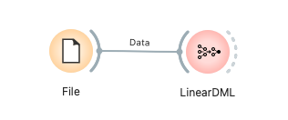

# LinearDML（ダブルマシンラーニング）

LinearDML は econML による Double Machine Learning (DML) を用いて、処置効果の異質性（CATE: Conditional Average Treatment Effect）を推定するウィジェットです。二値・連続いずれの処置変数にも対応し、Y|X / T|X のナイーブンスモデル、クロスフィッティング、最終効果モデルなど主要構成要素を明示しつつ、SHAP サマリーや傾向スコア（Propensity）診断、Uplift（Qini/AUUC）曲線などの診断を提供します。

---

## 入力

* **Data**
  * データ型: `Orange.data.Table`
  * 説明: 分析対象のデータセット。処置変数（Binary/Continuous）、結果変数（数値）、共変量（特徴量）、任意でメタ変数、サンプル重み、グループIDを含みます。

### 入力データの仕様

* **処置変数 (Treatment Variable)**
  * **Binary**: 離散変数（Discrete Variable）を使用。UI で Control group value（0 としてエンコード）を選択します（もう一方は 1）。
  * **Continuous**: 連続変数（Continuous Variable）を使用。
* **結果変数 (Outcome Variable)**
  * 評価対象の数値変数（例: 売上、CV）。内部では float として扱います。
* **共変量 (Covariates)**
  * 数値・カテゴリの特徴量。カテゴリはワンホットエンコード（`変数=値` の列名、`drop_first=True`）。
* **メタ変数 (Meta Variables)**（任意）
  * 分析には使わないが保持したい識別子等。
* **サンプル重み (Sample Weights)**（任意）
  * 学習全体で使用する重み列。
* **グループ列 (Group Column)**（任意）
  * GroupKFold やクラスタブートストラップ用のグループID。

### 入力データ例

| User ID (Meta) | Z1 (Cov) | Z2 (Cov) | cat1 (Cov) | T (Treatment) | Y (Outcome) |
| :------------- | :------- | :------- | :--------- | :------------ | :---------- |
| user001        | 0.21     | -1.20    | A          | Treatment     | 2.34        |
| user002        | -0.85    | 0.33     | B          | Control       | 0.90        |
| ...            | ...      | ...      | ...        | ...           | ...         |

---

## 出力

* **Enhanced Data**
  * データ型: `Orange.data.Table`
  * 説明: 元データに `CATE` 列（各サンプルの条件付き平均処置効果）をメタ列として追加。推定された個別効果を後続解析に活用できます。

---

## 機能説明

*(図: LinearDML ウィジェットの全体インターフェースのプレースホルダー)*

### コントロールエリア（左パネル）

* **Data Variables**
  * **Treatment Type**: `Binary` または `Continuous` を選択。
  * **Treatment Variable**: 処置列を選択。Binary の場合は `Control group value` も選択（0 としてエンコード、もう一方は 1）。
  * **Outcome Variable**: 数値の結果変数を選択。
  * **Covariates**: 分析に用いる共変量をドラッグ＆ドロップで追加。
  * **Meta Variables**: 保持したいが分析には使わない変数を移動。
  * **Sample Weights (optional)**: 重み列を任意で指定。

* **Outcome Model (Y | X)**
  * アルゴリズム: `Ridge`, `Lasso`, `RandomForest`, `LightGBM`（LightGBM 非導入時は RF にフォールバック）。
  * 線形モデル: 正則化強度スライダー（α=0.001..1.000）。
  * ツリーモデル: `n_estimators`, `max_depth` を指定。

* **Treatment Model (T | X)**
  * Binary: `Logistic (Binary)`, `RandomForest`, `LightGBM`。
  * Continuous: `Ridge (Continuous)`, `RandomForest`, `LightGBM`。
  * 正則化やツリー設定は Outcome と同様。

* **Cross-Fitting**
  * `Folds (K)`, `Repeats`（UI 表示のみ）、`Group Column`, `Random Seed`。

* **Effect Model (Final Stage)**
  * 正則化: `Ridge (L2)`, `Lasso (L1)`, `None`。Ridge/Lasso 選択時は α スライダーが表示。
  * `Auto-generate T × Z interactions`（二次の相互作用のみ、PolynomialFeatures）。
  * `Cluster-robust SE (by user_id)` と `Bootstrap (B)` により ATE の区間推定に対応。

* **Evaluation Settings**
  * `Test Set Size (%)`: UI 整合のために表示（現実装ではホールドアウト分割を用いずに診断を計算）。
  * `PS Trimming [α,1−α]`: 傾向スコアのトリミング閾値。オーバーラップ率や IPS ベースの診断に使用。

* **Execute**
  * 必須項目が満たされると実行可。

### メインエリア（右パネル）

* **Model Diagnostics**
  * **Metrics**:
    * `ATE (±95% CI)`: 平均処置効果とブートストラップによる信頼区間（設定時）。
    * `ATT / ATC`: 処置群/対照群に対する効果（Binary のみ）。
    * `Overlap Coverage`: 傾向スコアのトリミング範囲 [α,1−α] 内に入る観測の割合。
    * `Nuisance Fit`: Y|X / T|X の OOF 予測 R²。
    * `AUUC`: Uplift 曲線下面積（Binary のみ）。
  * **Propensity Score Diagnostics**: 処置群/対照群の傾向スコア分布（ヒストグラム、Binary）。
  * **Nuisance Models — Predicted vs Actual**: Y-hat / T-hat のサンプル系列プロット。
  * **SHAP Summaries**: 結果モデル（Y）と処置モデル（T）の SHAP サマリー。
  * **CATE Distribution**: 予測 CATE のヒストグラム。
  * **Effect Heterogeneity (Coefficients)**: 最終効果モデルの係数の棒グラフ。
  * **Uplift Curve (Qini / AUUC)**: Uplift 曲線とランダムベースライン（Binary）。

---

## 使用例

*(図: File → LinearDML → Data Table)*

1. **File** ウィジェットでデータを読み込みます。
2. **LinearDML** の `Data` 入力に接続します。
3. 左パネルで以下を設定します。
   * `Treatment Type`、`Treatment Variable`（Binary のとき `Control group value` も）、`Outcome Variable`。
   * `Covariates`、`Meta Variables`、任意で `Sample Weights` と `Group Column`。
   * `Outcome/Treatment` モデル、`Cross-Fitting`、`Effect Model` を構成。
   * `Evaluation Settings` で必要に応じて `PS Trimming` を調整。
   * **Execute** をクリック。
4. 右パネルのメトリクス/プロットを確認します。
5. `Enhanced Data` 出力を **Data Table** に接続し、CATE 列を確認します。

---

## レポート機能

Orange のレポート機能に対応。レポートには以下が含まれます。

* モデル設定（処置/結果変数、共変量、効果モデルの正則化、クロスフィッティング、UI 表示上のテストサイズ等）
* 診断（ATE、ATT/ATC、Overlap、AUUC 等）
* プロットの埋め込み：Propensity 診断、Nuisance 予測、SHAP（Y/T）、CATE 分布、Effect 係数、Uplift 曲線

---

## 詳細ロジック

1. **データ準備**
   * 結果変数は float 化。
   * Binary 処置は、選択した Control 値を 0（その他を 1）としてエンコード。Continuous はそのまま使用。
   * カテゴリ共変量はワンホット（`drop_first=True`）かつ読みやすい列名（例: `cat1_A`）。
   * サンプル重みとグループ ID（任意）を保持。
2. **推定（econML DML）**
   * Y|X / T|X のナイーブンスモデルと最終効果モデルを構築。
   * K 分割のクロスフィッティング（Group 列があれば GroupKFold）。
   * サンプルごとの CATE と ATE（Binary では ATT/ATC も）を算出。
   * ブートストラップで ATE の信頼区間（クラスタ対応可）。
3. **診断**
   * OOF 予測でナイーブンスの当てはまり（R²）を評価。
   * Binary では Propensity と IPS を用いた Uplift 診断（Qini/AUUC）。オーバーラップ率は PS トリミング α を使用。
   * CATE を X に回帰して効果係数を可視化（標準化後）。
4. **SHAP**
   * Y/T の各ナイーブンスモデルに対して SHAP を計算。一般形→線形→木ベースの順にロバストにフォールバック。
5. **Enhanced Data**
   * 入力テーブルに `CATE` をメタ列として追加。

---

## パフォーマンスに関する注意

* SHAP の計算はデータサイズに比例して負荷が大きくなります。大規模データではモデルを単純化するか、特徴量次元を削減してください。
* LightGBM は任意依存で、未導入時は RandomForest にフォールバックします。
* クロスバリデーションや一部計算は並列化（`n_jobs=-1`）を利用します。
