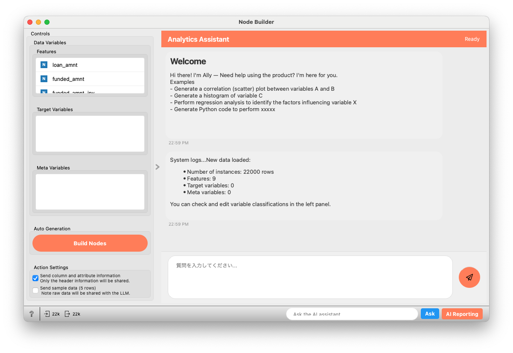
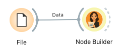

# Node Builder

Node Builderは、AIアシスタント「Allye」と対話することで、Allyeのワークフローを自動的に生成および実行するウィジェットです。

## 入力

- **Data**: (Orange.data.Table, オプショナル)
  - 分析対象のデータセット。接続されていない場合、Allyeはファイル読み込みウィジェットを含むワークフローを提案することがあります。

## 出力

- **out_data**: (Orange.data.Table)
  - 入力された `Data` をそのまま出力します。このウィジェット自体はデータを加工しません。

## 機能

Node Builderウィジェットは、主に以下の機能を提供します。



1.  **AIアシスタントとの対話**:
    *   チャットインターフェースを通じて、自然言語で分析タスクを指示できます。
    *   Allyeが指示を解釈し、応答します。
2.  **ワークフロー自動生成**:
    *   「Build Nodes」ボタン、またはチャットでの指示により、Allyeが分析目的に合ったAllyeのワークフローを提案します。
    *   提案されたワークフローは、自動的にキャンバス上にノードとして配置・接続されます。
3.  **データ連携**:
    *   入力データセットのカラム情報（変数名、型、役割）や、少量のサンプルデータをAllyeに送信することで、よりデータに適したワークフローの生成を支援します。
    *   これらの情報の送信は、ユーザーがコントロールパネルで制御できます。
4.  **変数管理**:
    *   コントロールパネルで、データセット内の変数を「特徴量(Features)」「ターゲット変数(Target Variables)」「メタ変数(Meta Variables)」に分類できます。この分類情報はAllyeに提供されます。
5.  **Pythonコード実行と検証**:
    *   Allyeが生成するPythonコード（特にNotebookウィジェット内で実行されるデータ処理コード）に対して、基本的な検証と自動修正を試みます。

## UI説明

Node Builderウィジェットのインターフェースは、主にチャットエリアとコントロールエリアで構成されます。

### メインエリア (チャット)

1.  **ヘッダー**:
    *   **タイトル (A)**: 「Analytics Assistant」
    *   **ステータスラベル (B)**: Allyeの状態（例: Ready, Thinking..., Error occurred）を表示します。
2.  **チャットエリア (C)**:
    *   Allyeからのメッセージ（ウェルカムメッセージ、応答、システムログなど）と、ユーザーが送信したメッセージが表示されます。
    *   Allyeが生成したコードやワークフローの計画もここに表示されます。
3.  **入力エリア (D)**:
    *   **テキスト入力ボックス**: Allyeへの指示や質問をここに入力します。「Cmd+Enter」または「Ctrl+Enter」でも送信可能です。
    *   **送信ボタン (紙飛行機アイコン)**: 入力したメッセージをAllyeに送信します。

### コントロールエリア (サイドパネル)

1.  **Data Variables (E)**:
    入力データセットの変数を管理します。変数をドラッグ＆ドロップして役割を変更できます。
    *   **Features**: 分析に使用する特徴量。
    *   **Target Variables**: 予測対象などのターゲット変数。
    *   **Meta Variables**: 分析には直接使用しないが、参照情報として保持するメタ変数。
2.  **Auto Generation (F)**:
    *   **Build Nodes ボタン**: 入力データと現在の会話コンテキストに基づいて、Allyeにワークフロー全体の自動生成を指示します。データが接続されていない場合は、データソースの作成から提案されることがあります。
3.  **Action Settings (G)**:
    Allyeに送信するデータ情報を制御します。
    *   **Send column and attribute information**: チェックすると、データセットのカラム名、型、役割（Features/Target/Meta）、カテゴリ変数の場合はユニークな値の数などのヘッダー情報をAllyeに送信します。
    *   **Send sample data (5 rows)**: チェックすると、データセットからランダムに5行のサンプルデータをAllyeに送信します。**注意: 生データがLLMと共有されます。**

## 使用例




### 例1: チャットによる指示でのノード生成

1.  FileウィジェットなどからNode Builderウィジェットにデータセット (例: `iris.tab`) を接続します。
2.  Node Builderのチャット入力ボックスに「petal lengthとpetal widthで散布図を作成して」と入力し、送信します。
3.  Allyeが指示を解釈し、Scatter Plotウィジェットを生成して入力データに接続し、指定された変数を設定します。

### 例2: 「Build Nodes」ボタンによる自動ワークフロー生成

1.  FileウィジェットなどからNode Builderウィジェットにデータセット (例: `housing.tab`) を接続します。
2.  コントロールエリアの「Build Nodes」ボタンをクリックします。
3.  Allyeがデータセットの内容（カラム情報やサンプルデータ、変数の役割設定に基づく）と一般的な分析フローを考慮して、データの前処理、可視化、モデル構築などを含むワークフローを提案・生成します。


# 例3: Notebookウィジェット内のPythonコード生成

1.  FileウィジェットからNode Builderにデータを接続します。
2.  チャットで「ageが30以上のデータのみを抽出するPythonコードをNotebookで生成して」と指示します。
3.  AllyeはNotebookウィジェットを生成し、その中に以下のようなPythonコードを記述します。
    ```python
    # dfは入力データフレームとします
    df_filtered = df[df['age'] >= 30]
    ```
    Node Builderは生成されたコードを解釈し、Notebookウィジェットが `df` を出力するように設定します。


## 設定とAPIキー


    *   APIキーは、User Settingsで正しく設定されている必要があります。このファイルが存在しないか、APIキーが設定されていない場合、ウィジェットはチャットエリアに警告を表示し、API通信機能は利用できません。

