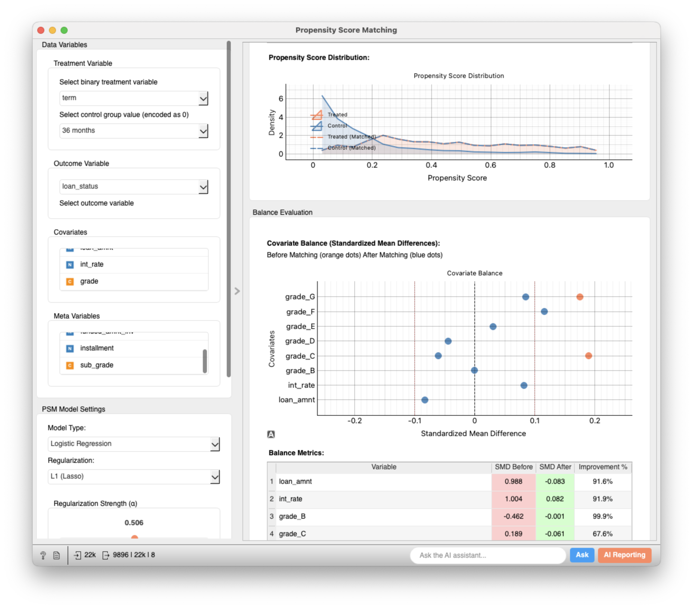
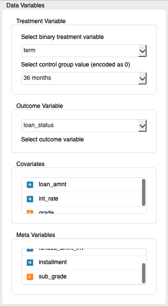
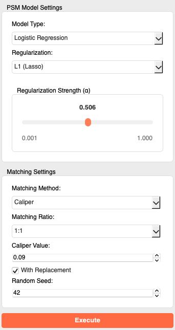
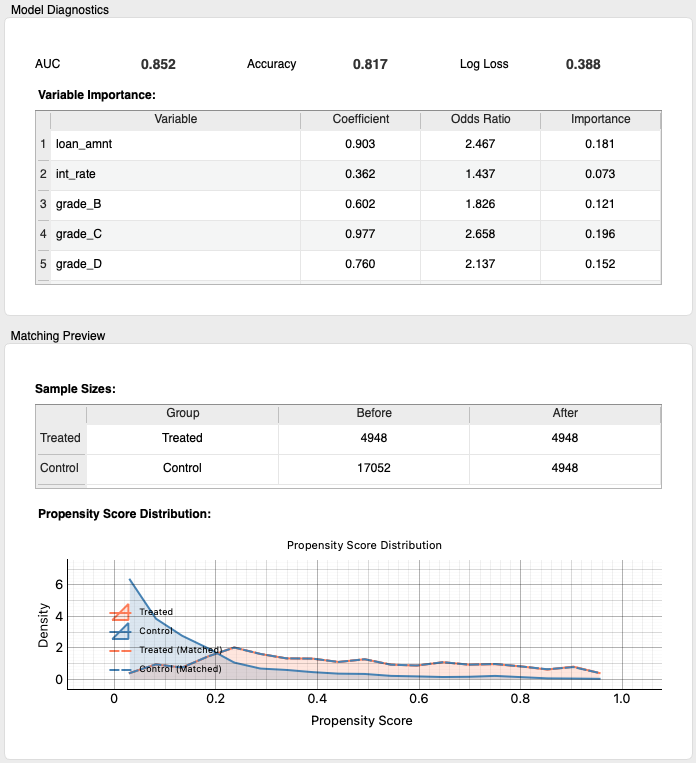
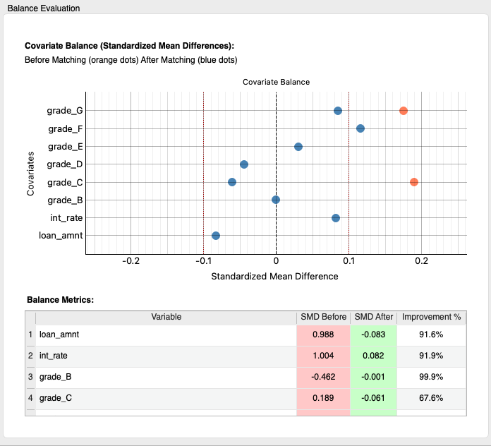
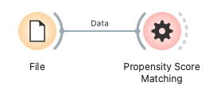
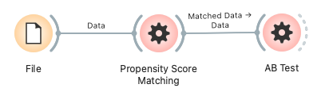

# Propensity Score Matching

Propensity Score Matching (PSM) is a statistical method used in observational studies to estimate the causal effect of a treatment (intervention). It aims for a more reliable effect estimation by balancing the distribution of covariates (background factors) between the treatment group and the control group. This widget provides functionality for calculating propensity scores, performing matching using various methods, and evaluating covariate balance before and after matching.

## Inputs

*   **Data**:
    *   Data type: `Orange.data.Table`
    *   Description: The dataset for analysis. It must contain a treatment variable, covariates, and optionally, an outcome variable and metadata.

### Input Data Specifications

The input data is expected to contain the following information:

*   **Treatment Variable**:
    *   A variable indicating which individuals received the treatment (treatment group) and which did not (control group).
    *   **Must be a binary (having two categories) discrete variable (Categorical Variable).** For example, "Administered Drug A" vs. "Administered Placebo", or "Program Participant" vs. "Non-participant". The user selects which value represents the control group within the widget.
*   **Covariates**:
    *   Variables that may affect both treatment assignment and the outcome. Examples include age, gender, disease severity, etc.
    *   Can be numerical (Continuous) or discrete (Categorical) variables. Categorical variables are internally converted to dummy variables during propensity score model construction.
*   **Outcome Variable (Optional)**:
    *   The variable on which the effect of the treatment is to be evaluated. Examples include symptom improvement, test scores, etc.
    *   This widget itself does not directly estimate the effect size using the outcome variable, but it can be specified for users to analyze in the matched data. Can be numerical or discrete.
*   **Meta Variables (Optional)**:
    *   Identifiers or additional information not directly used in the analysis but to be retained in the data. Examples include patient ID.

### Example Input Data

The following is an example assuming a dataset for heart disease risk analysis.

| Patient ID (Meta) | Age (Covariate) | Gender (Covariate) | Smoking History (Covariate) | Exercise Habit (Treatment) | Heart Disease Risk Score (Outcome) |
| :---------------- | :-------------- | :----------------- | :-------------------------- | :------------------------- | :------------------------------- |
| P001              | 55              | Male               | Yes                         | Yes (1)                    | 0.8                              |
| P002              | 62              | Female             | No                          | No (0)                     | 0.5                              |
| P003              | 48              | Male               | Yes                         | No (0)                     | 0.7                              |
| ...               | ...             | ...                | ...                         | ...                        | ...                              |

In this example, "Exercise Habit" is the treatment variable ("No" is the control group, "Yes" is the treatment group), "Age", "Gender", and "Smoking History" are covariates, "Heart Disease Risk Score" is the outcome variable, and "Patient ID" is a meta variable.

## Outputs

*   **Matched Data**:
    *   Data type: `Orange.data.Table`
    *   Description: A dataset containing only the samples from the treatment and control groups selected by propensity score matching. The original variable structure (covariates, outcome variable, meta variables) is maintained. This data can be used in subsequent steps for estimating treatment effects, etc.
*   **Propensity Scores**:
    *   Data type: `Orange.data.Table`
    *   Description: The calculated propensity score for each sample in the original dataset. Typically includes the following meta information:
        *   `Group`: "Treated" or "Control"
        *   `Propensity Score`: The propensity score for each sample (a numerical value between 0 and 1)
    *   This output can be used to check the distribution of propensity scores or evaluate the common support region.
*   **Balance Report**:
    *   Data type: `Orange.data.Table`
    *   Description: Metrics evaluating the balance of each covariate before and after matching. Typically includes the following information:
        *   `Variable` (Meta): Covariate name
        *   `SMD Before`: Standardized Mean Difference before matching
        *   `SMD After`: Standardized Mean Difference after matching
        *   `Improvement %`: Percentage improvement in balance
    *   This output helps to quantitatively assess how much the balance of covariates has improved due to matching. An absolute SMD value of 0.1 or less is generally considered a good benchmark for balance.

## Feature Description

### Control Area (Left Panel)

The control panel allows for assigning data variables, setting up the propensity score model, and adjusting matching method parameters.

*   **Data Variables**
    *   **Treatment Variable**:
        *   **Select binary treatment variable**: Select the column to be used as the treatment variable from the input data. Only binary discrete variables are listed.
        *   **Select control group value (encoded as 0)**: Select the value within the treatment variable that represents the control group (treated as 0 in the propensity score model's target variable).
    *   **Outcome Variable**:
        *   **Select outcome variable**: Select the column to be used as the outcome variable. This widget does not directly estimate effects, but it will be included in the matched data.
    *   **Covariates**:
        *   Select covariates to be used for propensity score calculation from the list and assign them via drag & drop.
    *   **Meta Variables**:
        *   Select variables not used in the analysis but to be kept in the data from the list.
*   **PSM Model Settings**
    *   **Model Type**: Select the model for calculating propensity scores. Currently, only "Logistic Regression" is supported.
    *   **Regularization**: Select the type of regularization to apply to the logistic regression model.
        *   `None`: No regularization
        *   `L1 (Lasso)`: L1 regularization. Tends to shrink coefficients of unnecessary covariates towards zero.
        *   `L2 (Ridge)`: L2 regularization. Suppresses the magnitude of coefficients.
        *   `Elastic Net`: A combination of L1 and L2.
    *   **Regularization Strength (α)**: Adjusts the strength of regularization (from 0.001 to 1.000). Smaller values mean weaker regularization, larger values mean stronger. Active when a regularization type other than "None" is selected.
*   **Matching Settings**
    *   **Matching Method**:
        *   `Nearest Neighbor`: For each treated sample, matches the control sample(s) with the closest propensity score.
        *   `Caliper`: In addition to nearest neighbor, only matches samples whose propensity score difference is within a certain range (caliper value).
    *   **Matching Ratio**: Select the number of control samples to match to one treated sample (`1:1`, `1:2`, `1:3`).
    *   **Caliper Value**: The maximum allowable difference in propensity scores when Caliper matching is selected. Typically, about 0.2 times the standard deviation of the propensity scores is recommended.
    *   **With Replacement**: If checked, allows the same control sample to be matched with multiple treated samples (sampling with replacement). Useful when the number of control samples is small, but can lead to information duplication. For Nearest Neighbor, it's always treated as with replacement.
    *   **Random Seed**: Random seed to ensure reproducibility of the matching process.

*   **Positivity & Trimming**
    *   **Enforce trimming before matching**: When enabled, samples outside selected bounds are excluded before matching.
    *   **Trimming mode**:
        *   `None`: Do not trim (default).
        *   `Percentile`: Exclude lower/upper percentiles of overall propensity scores (e.g., 1%).
        *   `Overlap`: Exclude samples outside the estimated common support between treated and control.
        *   `Fixed bounds`: Keep only samples with propensity scores within a fixed interval (e.g., [0.05, 0.95]).
    *   **Percentile (0–0.1)**: Percentile value for `Percentile` trimming (default `0.01`).
    *   **Fixed bounds [min, max]**: Lower and upper bounds for `Fixed bounds` trimming (default `[0.05, 0.95]`).
    *   **IPW trim percentile (0–0.1)**: Percentile used to clip propensity scores when computing IPW weights (default `0.01`).
*   **Execute (Button)**
    *   Executes propensity score matching based on the configured parameters.

### Main Area (Right Panel)

The main area displays model diagnostic results, a matching preview, and covariate balance evaluation after execution.

*   **Model Diagnostics**
    *   **AUC, Accuracy, Log Loss**: Performance metrics of the constructed propensity score model. AUC indicates the model's discriminative ability, Accuracy is the correct classification rate, and Log Loss shows the logarithmic loss of predictions.
    *   **Variable Importance**:
        *   `Variable`: Covariate name.
        *   `Coefficient`: Coefficient of each covariate in the logistic regression model.
        *   `Odds Ratio`: Odds ratio for each covariate, which is the exponentiated coefficient.
        *   `Importance`: Relative importance based on the absolute value of the coefficient.
*   **Matching Preview**
    *   **Sample Sizes**: Displays the sample sizes of the treatment and control groups before and after matching.
        *   `Group`: Treated, Control
        *   `Before`: Sample size before matching
        *   `After`: Sample size after matching
    *   **Propensity Score Distribution**: Displays the distribution of propensity scores for the treatment and control groups before and after matching using kernel density estimate plots. Ideally, the distributions of both groups should become closer after matching.
        *   Orange line/area: Treatment group (before matching)
        *   Blue line/area: Control group (before matching)
        *   Orange dotted line: Treatment group (after matching)
        *   Blue dotted line: Control group (after matching)
*   **Balance Evaluation**
    *   **Covariate Balance (Standardized Mean Differences)**:
        *   Displays the Standardized Mean Difference (SMD) for each covariate before and after matching in a plot. SMD is the difference in means between the treatment and control groups, divided by the pooled standard deviation of both groups. An absolute value within 0.1 is generally considered well-balanced.
        *   Orange dot: SMD before matching
        *   Blue dot: SMD after matching
        *   Vertical dashed line (black): SMD=0 reference line
        *   Vertical dotted line (red): SMD=±0.1 guideline for acceptable range
    *   **Balance Metrics**: Displays the SMD and improvement percentage for each covariate in a table.
        *   `Variable`: Covariate name
        *   `SMD Before`: SMD before matching
        *   `SMD After`: SMD after matching (background color green if absolute SMD <= 0.1, red if > 0.1)
        *   `Improvement %`: Shows the percentage decrease in the absolute value of SMD due to matching.

*   **Status Bar Diagnostics**
    *   After execution, the status bar displays overlap diagnostics (e.g., fraction of treated/control outside the estimated common support). Use this as a quick quantitative check alongside the PS distributions.

## Usage Example

The following is a basic workflow for loading data from a file, performing propensity score matching, and evaluating the results.

1.  Load the dataset for analysis (e.g., `titanic` or `heart_disease`) using the **File** widget.
2.  Connect the output of the **File** widget to the `Data` input of the **Propensity Score Matching** widget.
3.  Open the **Propensity Score Matching** widget and configure the following in the control panel:
    *   Select the `Treatment Variable` and specify the appropriate `Control group value`.
    *   Assign the necessary covariates to the `Covariates` list.
    *   Set `Outcome Variable` or `Meta Variables` if needed.
    *   Adjust `PSM Model Settings` and `Matching Settings` according to your objectives.
    *   Click the `Execute` button.
4.  Review the results in the main area:
    *   Check the propensity score model's performance in `Model Diagnostics`.
    *   Observe changes in sample size and improvement in propensity score distribution in `Matching Preview`.
    *   Verify if covariate balance has improved (SMD has decreased) in `Balance Evaluation`.
5.  Connect the outputs of the **Propensity Score Matching** widget to other widgets for further analysis:
    *   Connect `Matched Data` to an **AB test** widget to check the lift after matching, or to **Scatter Plot** or **Box Plot** widgets to explore the relationship between the outcome variable and the treatment group.

    

    *   Connect `Propensity Scores` to a **Distribution** widget to examine the detailed distribution of propensity scores.
    *   Connect `Balance Report` to a **Data Table** widget to view SMD values in detail.

## Detailed Logic

### Propensity Score Model Construction

1.  **Data Preparation**:
    *   Data for model training is prepared based on the covariates and treatment variable selected by the user.
    *   Categorical variables among the covariates are **dummy-coded** using **One-Hot Encoding** (implemented with scikit-learn’s `OneHotEncoder(drop='first', handle_unknown='ignore')`). This produces a sparse/dense matrix efficiently and avoids multicollinearity by dropping the first category.
    *   Numerical covariates are **standardized** (scaled to mean 0, standard deviation 1). This equalizes the influence of variables with different scales on model training.
2.  **Model Training**:
    *   A **logistic regression model** is trained with the treatment variable as the target variable (control group=0, treatment group=1) and the preprocessed covariates as explanatory variables.
    *   The regularization (None, L1, L2, Elastic Net) and regularization strength (α) selected by the user are applied to the model. Regularization helps prevent model overfitting and provides stable estimation when there are many covariates.
3.  **Propensity Score Calculation**:
    *   The trained logistic regression model is used to predict the probability (propensity score) that each sample is assigned to the treatment group.

### Matching Algorithm

Using the calculated propensity scores, control group samples with similar propensity scores are found for each sample in the treatment group.

*   **Nearest Neighbor**:
    *   For each treated sample, control samples with the closest propensity scores are selected according to the specified matching ratio (e.g., one for 1:1, two for 1:2).
    *   Matching with replacement is always enabled, meaning the same control sample can be matched multiple times.
*   **Caliper**:
    *   Similar to nearest neighbor, it finds samples with close propensity scores, but additionally, the absolute difference in propensity scores between the treated and control samples must be less than or equal to a pre-set "caliper value".
    *   This prevents matching between samples with vastly different propensity scores, thereby improving the quality of the match.
    *   The user can choose whether to match with or without replacement.
*   **Performance optimisation (FAISS)**: When the Caliper method is selected and Facebook’s FAISS library is available, the widget uses FAISS for fast nearest-neighbour search on the propensity scores. If FAISS is not installed the code transparently falls back to a highly-optimised Python/NumPy implementation. The matching logic and results are identical; only speed differs.

### Balance Evaluation

Checks whether the balance of covariates between the treatment and control groups has improved after matching. The primary metric used is the Standardized Mean Difference (SMD).

*   **Standardized Mean Difference (SMD)**:
    *   SMD = (Mean of covariate in treatment group - Mean of covariate in control group) / sqrt((Variance of covariate in treatment group + Variance of covariate in control group) / 2)
    *   A smaller absolute value of SMD indicates better balance for that covariate. Generally, SMD < 0.1 is considered well-balanced.
    *   The widget calculates and visually displays the SMD for each covariate before and after matching.
    *   Note: When trimming is enabled, SMDs are computed on the trimmed dataset. “Before” refers to pre-matching values after optional trimming.

This widget automates these steps and presents the results in an easy-to-understand manner, enabling users to perform propensity score matching and evaluate its results conveniently.

### Additional Notes

* **IPW trimming**: When Inverse Propensity Weighting (IPW) is enabled, extreme propensity scores are trimmed at the 1 % and 99 % percentiles before computing weights to improve stability.
* **Pre-matching trimming**: Optional pre-matching trimming (Percentile/Overlap/Fixed bounds) can be applied to mitigate positivity violations and improve match quality. When enabled, all diagnostics and SMDs refer to the trimmed dataset.
* **No-regularisation mode**: Selecting *None* for regularisation uses a logistic model with an extremely large `C` (≈ 1 e12) under L2 penalty to emulate an unregularised fit because recent scikit-learn versions deprecate the explicit `penalty='none'`, ensuring consistent behaviour.
* **Large dataset sampling**: When the input table exceeds **300 000 rows**, the widget automatically draws a random sample of 300 000 rows before running the PSM pipeline to keep computation responsive. A status-bar warning indicates that sampling was applied and all reported statistics are approximate.