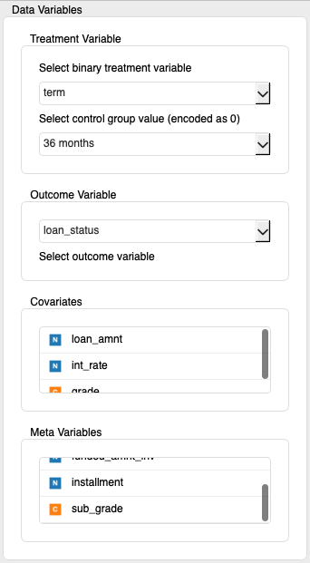
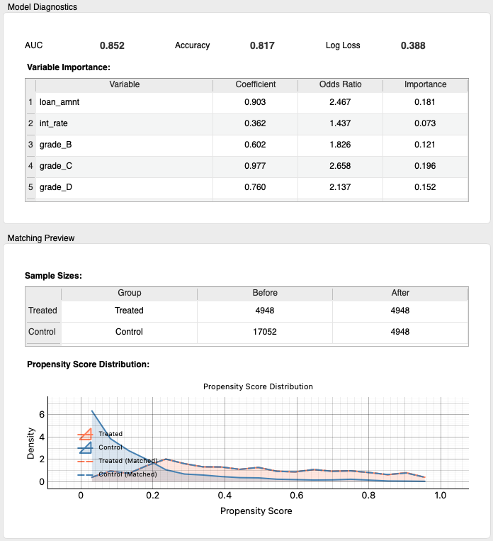
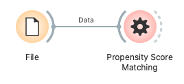

# 傾向スコアマッチング (Propensity Score Matching)

傾向スコアマッチング（Propensity Score Matching, PSM）は、観察研究において処置（介入）の因果効果を推定するために用いられる統計的手法です。処置群と対照群の間で共変量（背景因子）の分布を揃えることで、より信頼性の高い効果推定を目指します。このウィジェットは、傾向スコアの計算、様々な方法によるマッチング、そしてマッチング前後の共変量のバランス評価機能を提供します。

## 入力 (Inputs)

*   **Data (データ)**:
    *   データ型: `Orange.data.Table`
    *   説明: 分析対象のデータセット。処置変数、共変量、そして任意で結果変数やメタデータを含む必要があります。

### 入力データの仕様

入力データには以下の情報が含まれていることが期待されます。

*   **処置変数 (Treatment Variable)**:
    *   どの個体が処置を受けたか（処置群）、受けなかったか（対照群）を示す変数。
    *   **必ず二値（2つのカテゴリを持つ）の離散変数（Categorical Variable）である必要があります。** 例えば、「薬Aを投与」「プラセボを投与」や、「プログラム参加」「不参加」など。ウィジェット内で、どちらの値を対照群とするか選択します。
*   **共変量 (Covariates)**:
    *   処置の割り当てと結果の両方に影響を与える可能性のある変数。年齢、性別、病気の重症度など。
    *   数値（Continuous）または離散（Categorical）変数を使用できます。カテゴリカル変数は、傾向スコアモデル構築の際に内部的にダミー変数化されます。
*   **結果変数 (Outcome Variable) (任意)**:
    *   処置の効果を評価したい変数。症状の改善度、テストのスコアなど。
    *   このウィジェット自体は結果変数を用いた効果量の直接推定は行いませんが、マッチング後のデータでユーザーが分析するために指定できます。数値または離散変数。
*   **メタ変数 (Meta Variables) (任意)**:
    *   分析には直接使用しないが、データに保持しておきたい識別子や追加情報。患者IDなど。

### 入力データ例

以下は、心疾患リスク分析のデータセットを想定した例です。

| 患者ID (Meta) | 年齢 (Covariate) | 性別 (Covariate) | 喫煙歴 (Covariate) | 運動習慣 (Treatment) | 心疾患リスクスコア (Outcome) |
| :------------ | :------------- | :------------- | :--------------- | :------------------- | :------------------------- |
| P001          | 55             | 男性           | あり             | あり (1)             | 0.8                        |
| P002          | 62             | 女性           | なし             | なし (0)             | 0.5                        |
| P003          | 48             | 男性           | あり             | なし (0)             | 0.7                        |
| ...           | ...            | ...            | ...              | ...                  | ...                        |

この例では、「運動習慣」が処置変数（"なし" が対照群、"あり" が処置群）、「年齢」「性別」「喫煙歴」が共変量、「心疾患リスクスコア」が結果変数、「患者ID」がメタ変数となります。

## 出力 (Outputs)

*   **Matched Data (マッチング済みデータ)**:
    *   データ型: `Orange.data.Table`
    *   説明: 傾向スコアマッチングによって選択された処置群と対照群のサンプルのみを含むデータセット。元の変数構造（共変量、結果変数、メタ変数）は維持されます。このデータを用いて、次のステップで処置効果の推定などを行います。
*   **Propensity Scores (傾向スコア)**:
    *   データ型: `Orange.data.Table`
    *   説明: 元のデータセットの各サンプルに対する計算された傾向スコア。通常、以下のメタ情報を含みます。
        *   `Group`: "Treated" (処置群) または "Control" (対照群)
        *   `Propensity Score`: 各サンプルの傾向スコア（0から1の数値）
    *   この出力は、傾向スコアの分布確認や共通サポート領域の評価などに利用できます。
*   **Balance Report (バランスレポート)**:
    *   データ型: `Orange.data.Table`
    *   説明: 各共変量について、マッチング前後のバランスを評価する指標。通常、以下の情報を含みます。
        *   `Variable` (メタ): 共変量名
        *   `SMD Before`: マッチング前の標準化平均差 (Standardized Mean Difference)
        *   `SMD After`: マッチング後の標準化平均差
        *   `Improvement %`: バランスの改善率
    *   この出力は、マッチングによって共変量のバランスがどの程度改善されたかを定量的に確認するのに役立ちます。SMDの絶対値が0.1以下になることが、一般的に良好なバランスの一つの目安とされます。

## 機能の説明

### コントロールエリア (左パネル)

コントロールパネルでは、データ変数の割り当て、傾向スコアモデルの設定、マッチング方法のパラメータ調整を行います。

*   **Data Variables (データ変数)**
    *   **Treatment Variable (処置変数)**:
        *   **Select binary treatment variable (二値の処置変数を選択)**: 入力データから処置変数として使用する列を選択します。二値の離散変数のみがリストされます。
        *   **Select control group value (encoded as 0) (対照群の値を選択 (0としてエンコード))**: 処置変数内で対照群（傾向スコアモデルの目的変数において0として扱われる値）となる値を選択します。
    *   **Outcome Variable (結果変数)**:
        *   **Select outcome variable (結果変数を選択)**: 結果変数として使用する列を選択します。このウィジェットでは直接効果推定は行いませんが、マッチング後のデータに含まれます。
    *   **Covariates (共変量)**:
        *   傾向スコアの計算に使用する共変量をリストから選択し、ドラッグ＆ドロップで割り当てます。
    *   **Meta Variables (メタ変数)**:
        *   分析には使用しないがデータに残しておきたい変数をリストから選択します。
*   **PSM Model Settings (PSMモデル設定)**
    *   **Model Type (モデルタイプ)**: 傾向スコアを計算するためのモデルを選択します。現在は「Logistic Regression (ロジスティック回帰)」のみサポートされています。
    *   **Regularization (正則化)**: ロジスティック回帰モデルに適用する正則化の種類を選択します。
        *   `None`: 正則化なし
        *   `L1 (Lasso)`: L1正則化。不要な共変量の係数を0に近づける効果があります。
        *   `L2 (Ridge)`: L2正則化。係数の大きさを抑制します。
        *   `Elastic Net`: L1とL2の組み合わせ。
    *   **Regularization Strength (α) (正則化強度)**: 正則化の強さを調整します (0.001から1.000)。値が小さいほど正則化は弱く、大きいほど強くなります。「None」以外を選択した場合に有効です。
*   **Matching Settings (マッチング設定)**
    *   **Matching Method (マッチング方法)**:
        *   `Nearest Neighbor (最近傍法)`: 各処置群サンプルに対し、傾向スコアが最も近い対照群サンプルをマッチングします。
        *   `Caliper (カリパー法)`: 最近傍法に加え、傾向スコアの差が一定の範囲（カリパー値）内にあるサンプルのみをマッチング対象とします。
    *   **Matching Ratio (マッチング比率)**: 処置群サンプル1つに対してマッチングする対照群サンプルの数を選択します (`1:1`, `1:2`, `1:3`)。
    *   **Caliper Value (カリパー値)**: カリパー法を選択した場合の、許容する傾向スコアの最大差。通常、傾向スコアの標準偏差の0.2倍程度が推奨されます。
    *   **With Replacement (復元抽出)**: チェックを入れると、同じ対照群サンプルが複数の処置群サンプルとマッチングされることを許可します（復元抽出）。対照群のサンプル数が少ない場合に有効ですが、情報の重複が生じる可能性があります。最近傍法の場合は常に復元ありとして扱われます。
    *   **Random Seed (乱数シード)**: マッチングプロセスの再現性を確保するための乱数シード。

*   **Positivity & Trimming (Positivity/トリミング)**
    *   **Enforce trimming before matching (マッチング前のトリミングを適用)**: 有効にすると、選択した境界の外側にあるサンプルをマッチング前に除外します。
    *   **Trimming mode (トリミング方式)**:
        *   `None` (なし): トリミングしない（既定）。
        *   `Percentile` (パーセンタイル): 全体の傾向スコアの下位/上位パーセンタイルを除外（例: 1%）。
        *   `Overlap` (共通サポート): 処置群・対照群の推定共通サポート外を除外。
        *   `Fixed bounds` (固定境界): 傾向スコアが指定区間（例: [0.05, 0.95]）にあるサンプルのみを保持。
    *   **Percentile (0–0.1)**: `Percentile` トリミング用の値（既定 `0.01`）。
    *   **Fixed bounds [min, max]**: `Fixed bounds` の下限・上限（既定 `[0.05, 0.95]`）。
    *   **IPW trim percentile (0–0.1)**: IPW重み計算時に傾向スコアをクリップするパーセンタイル（既定 `0.01`）。
*   **Execute (実行ボタン)**
    *   設定したパラメータに基づいて傾向スコアマッチングを実行します。

### メインエリア (右パネル)

メインエリアには、実行後のモデル診断結果、マッチングのプレビュー、共変量のバランス評価が表示されます。

*   **Model Diagnostics (モデル診断)**
    *   **AUC, Accuracy, Log Loss**: 構築された傾向スコアモデルの性能指標。AUCはモデルの識別能力、Accuracyは正分類率、Log Lossは予測の対数損失を示します。
    *   **Variable Importance (変数重要度)**:
        *   `Variable`: 共変量名。
        *   `Coefficient`: ロジスティック回帰モデルにおける各共変量の係数。
        *   `Odds Ratio`: 各共変量のオッズ比。係数を指数変換したもの。
        *   `Importance`: 係数の絶対値に基づく相対的な重要度。
*   **Matching Preview (マッチングプレビュー)**
    *   **Sample Sizes (サンプルサイズ)**: マッチング前後の処置群と対照群のサンプル数を表示します。
        *   `Group`: Treated (処置群), Control (対照群)
        *   `Before`: マッチング前のサンプル数
        *   `After`: マッチング後のサンプル数
    *   **Propensity Score Distribution (傾向スコア分布)**: マッチング前後の処置群と対照群の傾向スコアの分布をカーネル密度推定プロットで表示します。理想的には、マッチング後に両群の分布が近くなることが望ましいです。
        *   橙線/エリア: 処置群 (マッチング前)
        *   青線/エリア: 対照群 (マッチング前)
        *   橙点線: 処置群 (マッチング後)
        *   青点線: 対照群 (マッチング後)
*   **Balance Evaluation (バランス評価)**
    *   **Covariate Balance (Standardized Mean Differences) (共変量バランス: 標準化平均差)**:
        *   各共変量について、マッチング前後の標準化平均差 (SMD) をプロットで表示します。SMDは、処置群と対照群の平均値の差を、両群の標準偏差のプール値で割ったものです。絶対値が0.1以内であれば、一般的にバランスが取れていると見なされます。
        *   橙色の点: マッチング前のSMD
        *   青色の点: マッチング後のSMD
        *   縦の破線 (黒): SMD=0 の基準線
        *   縦の点線 (赤): SMD=±0.1 の許容範囲の目安
    *   **Balance Metrics (バランス指標)**: 各共変量のSMDと改善率を表形式で表示します。
        *   `Variable`: 共変量名
        *   `SMD Before`: マッチング前のSMD
        *   `SMD After`: マッチング後のSMD (背景色が緑ならSMD絶対値0.1以下、赤なら0.1より大きい)
        *   `Improvement %`: SMDの絶対値がマッチングによって何パーセント減少したかを示します。

*   **ステータスバー診断**
    *   実行後、ステータスバーに共通サポート外の割合（treated/control）などの簡易診断が表示されます。PS分布の確認と併せて定量的な目安として活用できます。

## 使用例

以下は、ファイルからデータを読み込み、傾向スコアマッチングを行い、その結果を評価する基本的なワークフローです。

1.  **File (ファイル)** ウィジェットで分析対象のデータセット (例: `titanic` や `heart_disease`) を読み込みます。
2.  **File** ウィジェットの出力を **Propensity Score Matching** ウィジェットの `Data` 入力に接続します。
3.  **Propensity Score Matching** ウィジェットを開き、コントロールパネルで以下を設定します。
    *   `Treatment Variable` を選択し、適切な `Control group value` を指定します。
    *   `Covariates` リストに必要な共変量を割り当てます。
    *   必要に応じて `Outcome Variable` や `Meta Variables` を設定します。
    *   `PSM Model Settings` と `Matching Settings` を目的に応じて調整します。
    *   `Execute` ボタンをクリックします。
4.  メインエリアで結果を確認します。
    *   `Model Diagnostics` で傾向スコアモデルの性能を確認します。
    *   `Matching Preview` でサンプルサイズの変化と傾向スコア分布の改善を確認します。
    *   `Balance Evaluation` で共変量のバランスが改善されたか（SMDが小さくなったか）を確認します。
5.  **Propensity Score Matching** ウィジェットの出力を他のウィジェットに接続して、さらに分析を進めます。
    *   `Matched Data` を **AB test** ウィジェットに接続して、マッチング後のliftを確認したり、**Scatter Plot (散布図)** や **Box Plot (箱ひげ図)** などで結果変数と処置群の関係を探索したりします。

    

    *   `Propensity Scores` を **Distribution (分布)** ウィジェットに接続して、傾向スコアの詳細な分布を確認します。
    *   `Balance Report` を **Data Table** ウィジェットに接続して、SMDの値を詳細に確認します。

## 詳細なロジック

### 傾向スコアモデルの構築

1.  **データ準備**:
    *   ユーザーが選択した共変量と処置変数に基づいて、モデル学習用のデータが準備されます。
    *   共変量に含まれるカテゴリカル変数は、**One-Hotエンコーディング**（scikit-learn の `OneHotEncoder(drop='first', handle_unknown='ignore')` を使用）によってダミー変数化されます。最初のカテゴリを基準カテゴリとして削除することで多重共線性を回避し、疎/密行列を効率的に生成します。
    *   数値型の共変量は、**標準化**（平均0、標準偏差1にスケーリング）されます。これにより、異なるスケールの変数がモデル学習に与える影響を均一化します。
2.  **モデル学習**:
    *   処置変数を目的変数（対照群=0, 処置群=1）、前処理された共変量を説明変数として、**ロジスティック回帰モデル**を学習します。
    *   ユーザーが選択した正則化（なし、L1、L2、Elastic Net）と正則化強度(α)がモデルに適用されます。正則化は、モデルの過学習を防ぎ、共変量が多い場合に安定した推定を行うのに役立ちます。
3.  **傾向スコアの計算**:
    *   学習されたロジスティック回帰モデルを用いて、各サンプルが処置群に割り当てられる確率（傾向スコア）を予測します。

### マッチングアルゴリズム

計算された傾向スコアを用いて、処置群の各サンプルに対して類似した傾向スコアを持つ対照群のサンプルを探します。

*   **最近傍法 (Nearest Neighbor)**:
    *   処置群の各サンプルに対し、傾向スコアが最も近い対照群のサンプルを、指定されたマッチング比率（例: 1:1なら1つ、1:2なら2つ）だけ選び出します。
    *   復元抽出が常に有効となり、同じ対照群サンプルが複数回マッチングされることがあります。
*   **カリパー法 (Caliper)**:
    *   最近傍法と同様に傾向スコアが近いサンプルを探しますが、加えて、処置群サンプルと対照群サンプルの傾向スコアの差の絶対値が、事前に設定した「カリパー値」以下であるという条件を満たす必要があります。
    *   これにより、傾向スコアが大きく異なるサンプル同士がマッチングされるのを防ぎ、マッチングの質を高めます。
    *   復元抽出の有無はユーザーが選択できます。
*   **高速化 (FAISS 利用)**: Caliper 法選択時に Facebook の FAISS ライブラリが利用可能な環境では、傾向スコアの最近傍探索を FAISS により高速に実行します。FAISS が無い場合は最適化された Python/NumPy 実装に自動フォールバックし、結果は同一で速度のみが異なります。

### バランス評価

マッチングによって共変量のバランスが処置群と対照群の間で改善されたかを確認します。主要な指標として標準化平均差 (SMD) を用います。

*   **標準化平均差 (Standardized Mean Difference, SMD)**:
    *   SMD = (処置群の共変量の平均 - 対照群の共変量の平均) / sqrt((処置群の共変量の分散 + 対照群の共変量の分散) / 2)
    *   SMDの絶対値が小さいほど、その共変量のバランスが良いことを示します。一般的に、SMD < 0.1 であれば良好なバランスと見なされます。
    *   ウィジェットでは、各共変量についてマッチング前とマッチング後のSMDを計算し、視覚的に表示します。
    *   注: トリミングが有効な場合、SMDはトリミング後のデータに基づいて計算されます。この場合の「Before」は「マッチング前（任意のトリミング適用後）」を指します。

### 追加の注意点

* **IPW のトリミング**: 逆確率重み付け (IPW) を有効化した場合、Positivity & Trimming の設定で指定したパーセンタイル（既定 1%）で傾向スコアをクリップしてから重みを計算し、安定性を高めます。
* **マッチング前トリミング**: Percentile / Overlap / Fixed bounds による任意のトリミングをマッチング前に適用できます。Positivity の逸脱を緩和し、マッチングの安定性を向上させます。トリミングが有効な場合、診断やSMDはトリミング後のデータに基づきます。
* **正則化なしモード**: Regularization を *None* にすると、scikit-learn の `penalty='none'` の非推奨に対応するため、非常に大きな `C` (≈1e12) を持つ L2 で無正則化を近似しています。
* **大規模データのサンプリング**: 入力テーブルが **300,000 行** を超える場合、計算を高速化するためにランダムに 300,000 行を抽出してから PSM パイプラインを実行します。サンプリングが行われた旨の警告がステータスバーに表示され、出力統計は全データに対する近似値となります。

このウィジェットは、これらのステップを自動化し、結果を分かりやすく表示することで、ユーザーが傾向スコアマッチングを容易に実行し、その結果を評価できるように設計されています。