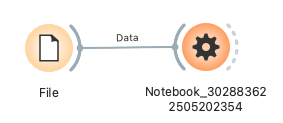

# Python Notebook

This widget provides a Jupyter Notebook environment within Allye, enabling Python code execution and data integration. You can integrate Python's powerful features for data manipulation, analysis, visualization, and more into your Allye workflows. Additionally, the Notebook Assistant feature allows AI to support your coding.

When Allye starts, a Jupyter Notebook server is also launched in the background. The default port number is `8887`, but it can be changed in the "User Settings" dialog (see figures below), accessible via the gear icon in the top-right corner of Allye.


*Allye toolbar settings icon*


*User Settings dialog: Jupyter Port setting*

**Inputs**

*   **Data**: `Orange.data.Table`（複数入力対応）
    *   上流ウィジェットから渡されたデータは到着順に取り込まれ、Notebook 内では `df`, `df2`, `df3`, ... として自動的に参照できます。
    *   **Specifications**: General tabular data that Orange can handle, including numerical, categorical, string, and datetime types.
    *   **Example Input Data**:
        ```
        # Iris dataset (conceptual)
        Feature: sepal length (Continuous)
        Feature: sepal width (Continuous)
        Feature: petal length (Continuous)
        Feature: petal width (Continuous)
        Target: iris (Discrete: Iris-setosa, Iris-versicolor, Iris-virginica)
        ```

**Outputs**

*   **Notebook Data**: `Orange.data.Table`
    *   Data processed within the Notebook and outputted by the `send_data_to_next_widget(df_processed)` function.
    *   **Example Output Data**:
        ```
        # Data filtered by specific conditions and with a new column added (conceptual)
        Feature: sepal length (Continuous)
        Feature: sepal width (Continuous)
        Feature: petal length (Continuous)
        Feature: petal width (Continuous)
        Feature: sepal_area (Continuous) <- Newly added column
        Target: iris (Discrete: Iris-setosa, Iris-versicolor) <- Filtered classes
        ```

**Feature Description**

*   **Jupyter Notebook Environment**:
    *   The main area of the widget displays the Jupyter Notebook interface, allowing for code writing, execution, and documentation creation in Markdown cells.

    

    *Overall view of the Python Notebook widget*
*   **Data Input/Output**:
    *   **Input**: Data passed from upstream widgets is loaded into a manifest-backed bundle by automatically generated code when the Notebook opens. The primary DataFrame is exposed as `df`, and additional inputs become `df2`, `df3`, ... .
        ```python
        # Example of auto-generated input data loading code in the Notebook
        import pandas as pd
        from widget_data_handler import read_multiple_from_shared_memory, store_output_df  # provided internally by Allye

        # ... (shared memory / manifest path settings are injected automatically) ...

        bundle = read_multiple_from_shared_memory(
            manifest_name="nb_<widget_id>",
            manifest_size=<manifest_size>,
            manifest_path="/path/to/in_data_<widget_id>/manifest.json",
        )

        datasets = bundle.get("datasets", [])
        df = pd.DataFrame()

        if len(datasets) >= 1:
            df = datasets[0]["data"]
        if len(datasets) >= 2:
            df2 = datasets[1]["data"]
        # Additional datasets (df3, df4, ...) are defined automatically when available.
        ```
    *   **Output**: To pass the processed DataFrame from the Notebook to the next widget, use the `send_data_to_next_widget()` function.
        ```python
        # Example of output code written in the Notebook
        # df_processed is the processed Pandas DataFrame
        send_data_to_next_widget(df_processed)
        ```
*   **Notebook Assistant (Chat AI)**:
    *   An AI chatbot located in the widget's left control area.
    *   You can ask questions about the Notebook, request Python code generation, or consult on debugging.
    *   **Setting Options**:
        *   `Send column and attribute information`: If checked, sends metadata such as input data column names, types, and roles to the AI, helping to get more contextually relevant answers. Raw data is not sent.
        *   `Send sample data (5 rows)`: If checked, sends 5 random rows of sample data from the input data to the AI. Note that raw data will be shared.
*   **Automatic Notebook Generation and Management**:
    *   Each Python Notebook widget is assigned a unique ID (`widget_id`).
    *   Based on this ID, a Jupyter Notebook file (`notebook_<widget_id>.ipynb`) and temporary files for data transfer (Pickle format: `in_data_<widget_id>.pkl`, `out_data_<widget_id>.pkl`) are created.
    *   Boilerplate code for data input and output is automatically inserted and updated in the Notebook file.

**UI Description** (Refer to the overall Python Notebook widget screenshot above)

*   **Control Area (Left Side)**:
    *   **Notebook Assistant**:
        *   Title "Notebook Assistant" at the top.
        *   Chat messages are displayed in the central area.
        *   Text input box at the bottom (`Enter your question...`) and a send button (paper airplane icon).
        *   Messages can also be sent with `Cmd+Enter` (Mac) or `Ctrl+Enter` (Windows/Linux).
    *   **Action Settings**:
        *   **Send column and attribute information**: Checkbox regarding data information to send to AI.
        *   **Send sample data (5 rows)**: Checkbox regarding sample data to send to AI.
*   **Main Area (Right Side)**:
    *   Displays a standard Jupyter Notebook interface.
    *   The filename (`notebook_<widget_id>.ipynb`) is shown in the tab.
    *   Cell execution (▶︎ Run), saving (💾), kernel operations, etc., are available from the toolbar.
    *   The first cell (Markdown format) contains a guide on data input/output.
    *   The second cell (Code format) contains auto-generated basic Python code for data input/output.

**Usage Example**



1.  **Filtering Data and Adding a New Column**:
    *   Load `iris.csv` using the `File` widget.
    *   Connect the output of the `File` widget to the `Data` input of the `Python Notebook` widget.
    *   Open the `Python Notebook` widget and add or edit the following code in the Notebook in the main area (within the second code cell), then run it:
        ```python
        # df is the Pandas DataFrame with loaded input data

        # Filter data where 'sepal length' is greater than 5.0
        df_filtered = df[df['sepal length'] > 5.0].copy() # Use .copy() to avoid SettingWithCopyWarning

        # Add a new column 'sepal_area' (sepal length * sepal width)
        df_filtered['sepal_area'] = df_filtered['sepal length'] * df_filtered['sepal width']

        # Send the result to the next widget
        # This line replaces the existing send_data_to_next_widget(df) or changes df to df_filtered
        send_data_to_next_widget(df_filtered)

        # Display the first 5 rows of the result (optional, for confirmation in the Notebook)
        df_filtered.head()
        ```
    *   Connect the `Notebook Data` output of the `Python Notebook` widget to a `Data Table` widget.
    *   The `Data Table` widget will display the filtered data with the new `sepal_area` column.

2.  **Code Generation with Notebook Assistant**:
    *   Connect data from a `File` widget to the `Python Notebook` widget as above.
    *   In the Notebook Assistant in the control area, enter, for example: "Write Python code to extract rows from the input data `df` where `petal length` is greater than the median." and send.
    *   Use the code generated by the AI as a reference, run it in the Notebook, and check the results.

**Detailed Logic**

*   **Jupyter Notebook Server**:
    *   It is assumed that a Jupyter Notebook server is started as part of the Allye application's launch process, likely using Python's `subprocess` module. The `jupyter: port` and `jupyter: host` settings from the configuration file (`config_allye.yaml`) would be used for this launch command.
    *   The widget displays a specific Notebook page from this externally running Jupyter server using `QWebEngineView`.

**Notes/Caveats**

*   **`widget_data_handler.py`**: This internal helper supplies `read_multiple_from_shared_memory` and `store_output_df` so the Python Notebook widget can move data between Orange and Jupyter without manual setup. Users do not need to edit this file directly.
*   **Jupyter Notebook Server**: For this widget to function, the Jupyter Notebook server must be running in the background. It is usually started automatically when Allye launches. If port conflicts occur, change the port number in "User Settings".
*   **File Paths**: Temporary files for data transfer and Notebook files are typically saved in the user's home directory. These files are necessary for the widget's operation, and manually deleting them can cause problems. When a widget is deleted, related files are also cleaned up.
