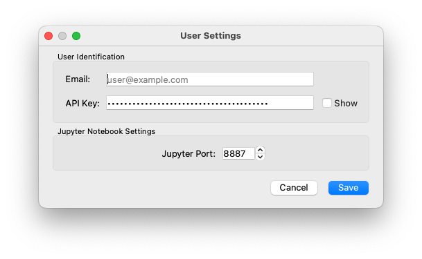
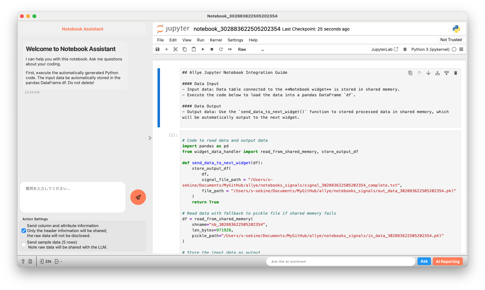
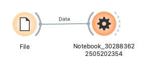

# Python Notebook

Allye内でJupyter Notebook環境を提供し、Pythonコードの実行とデータ連携を可能にするウィジェットです。データの加工、分析、視覚化など、Pythonの強力な機能をAllyeのワークフローに統合できます。Notebookの編集・実行は既定ブラウザのJupyterLab上で行い、ウィジェットはデータ受け渡しとブラウザ起動のブリッジとして動作します。

Allyeの起動と同時に、Jupyter Notebookサーバーもバックグラウンドで起動されます。デフォルトのポート番号は `8887` ですが、Allyeの右上にある歯車アイコン (下図参照) からアクセスできる「User Settings」ダイアログ (下図参照) で変更可能です。


*Allyeツールバーの設定アイコン*



*User Settingsダイアログ: Jupyter Portの設定*

**入力 (Inputs)**

*   **Data**: `Orange.data.Table`
    *   ウィジェットに接続されるデータセット。このデータは、Notebook内でPandas DataFrame `df` として自動的に利用可能になります。
    *   **仕様**: 数値、カテゴリ、文字列、日時型など、Orangeが扱える一般的な表形式データ。
    *   **入力データ例**:
        ```
        # Irisデータセットの場合 (イメージ)
        Feature: sepal length (Continuous)
        Feature: sepal width (Continuous)
        Feature: petal length (Continuous)
        Feature: petal width (Continuous)
        Target: iris (Discrete: Iris-setosa, Iris-versicolor, Iris-virginica)
        ```

**出力 (Outputs)**

*   **Notebook Data**: `Orange.data.Table`
    *   Notebook内で処理され、`send_data_to_next_widget(df_processed)` 関数によって出力されたデータ。
    *   **出力データ例**:
        ```
        # 入力データから特定の条件でフィルタリングされ、新しい列が追加されたデータ (イメージ)
        Feature: sepal length (Continuous)
        Feature: sepal width (Continuous)
        Feature: petal length (Continuous)
        Feature: petal width (Continuous)
        Feature: sepal_area (Continuous) <- 新しく追加された列
        Target: iris (Discrete: Iris-setosa, Iris-versicolor) <- フィルタリングされたクラス
        ```

**機能の説明**

*   **Jupyter Notebook環境**:
    *   ウィジェットのメインエリアにJupyter Notebookインターフェースが表示され、コードの記述、実行、Markdownセルでのドキュメンテーション作成が可能です。

    

    *Python Notebookウィジェットの全体像*
*   **データ入出力**:
    *   **入力**: 上流のウィジェットから渡されたデータは、Notebook起動時に自動生成されるコードによってPandas DataFrame `df` に読み込まれます。
        ```python
        # Notebook内で自動生成される入力データ読み込みコードの例
        import pandas as pd
        from widget_data_handler import read_from_shared_memory, store_output_df # widget_data_handler.py はAllye内部で提供

        # ... (共有メモリ/Pickleパス設定) ...

        df = read_from_shared_memory(
            shname="nb_<widget_id>", # <widget_id>はウィジェット毎のユニークID
            len_bytes=<size>, # データサイズ
            pickle_path="/path/to/in_data_<widget_id>.pkl" # Pickleファイルのパス
        )
        ```
    *   **出力**: Notebook内で処理した結果のDataFrameを次のウィジェットに渡すには、`send_data_to_next_widget()` 関数を使用します。
        ```python
        # Notebook内で記述する出力コードの例
        # df_processed は処理済みのPandas DataFrame
        send_data_to_next_widget(df_processed)
        ```
*   **ブラウザ上のJupyterLabで操作（ウィジェット内にチャットUIなし）**:
    *   Notebookノードをダブルクリック（またはコンテキストメニュー）すると、対象の`.ipynb`が既定ブラウザのJupyterLabで開きます。Notebook Agent拡張はJupyterLab側で自動起動します。
    *   チャットアシスタントはウィジェットには存在しません。コード編集・実行はJupyterLab上で行ってください。
*   **自動Notebook生成と管理**:
    *   各Python Notebookウィジェットには、ユニークなID (`widget_id`) が割り当てられます。
    *   このIDに基づき、Jupyter Notebookファイル (`notebook_<widget_id>.ipynb`) およびデータ受け渡し用の一時ファイル (Pickle形式: `in_data_<widget_id>.pkl`, `out_data_<widget_id>.pkl`) が作成されます。
    *   Notebookファイルには、データ入出力のための定型コードが自動的に挿入・更新されます。

**UIの説明**

*   **コントロールエリア (左側)**:
    *   最小限の表示のみ。Notebookはブラウザで開いて操作します。
*   **メインエリア (右側)**:
    *   Notebookを簡易的に表示しますが、主な編集・実行はブラウザのJupyterLabタブで行う想定です。
    *   最初のセル (Markdown) はデータ入出力ガイド、2番目のセル (Code) は自動生成された入出力コードです。

**使用例**



1.  **データのフィルタリングと新規列の追加**:
    *   `File` ウィジェットで `iris.csv` を読み込みます。
    *   `File` ウィジェットの出力を `Python Notebook` ウィジェットの `Data` 入力に接続します。
    *   `Python Notebook` ウィジェットを開き、メインエリアのNotebookに以下のコードを追記または編集して実行します (2番目のコードセル内)。
        ```python
        # df は入力データが読み込まれたPandas DataFrame

        # 'sepal length' が 5.0 より大きいデータをフィルタリング
        df_filtered = df[df['sepal length'] > 5.0].copy() # .copy() をつけてSettingWithCopyWarningを回避

        # 新しい列 'sepal_area' を追加 (sepal length * sepal width)
        df_filtered['sepal_area'] = df_filtered['sepal length'] * df_filtered['sepal width']

        # 結果を次のウィジェットに送信
        # この行は既存の send_data_to_next_widget(df) を置き換えるか、dfをdf_filteredに変更
        send_data_to_next_widget(df_filtered)

        # 結果の先頭5行を表示 (任意、Notebook上で確認するため)
        df_filtered.head()
        ```
    *   `Python Notebook` ウィジェットの `Notebook Data` 出力を `Data Table` ウィジェットに接続します。
    *   `Data Table` ウィジェットには、フィルタリングされ、新しい列 `sepal_area` が追加されたデータが表示されます。

2.  **ブラウザでコード編集・実行**:
    *   上記と同様に `File` ウィジェットからデータを `Python Notebook` ウィジェットに接続します。
    *   NotebookノードをダブルクリックしてブラウザのJupyterLabで開き、必要なコードを編集・実行します。
    *   処理結果を `send_data_to_next_widget(...)` で下流へ送り、Orange側の可視化・分析に接続します。

**詳細なロジック**

*   **Jupyter Notebookサーバー**:
    *   Allyeアプリケーションの起動プロセスの一部として、Pythonの `subprocess` モジュールなどを利用してJupyter Notebookサーバーが起動されると想定されます。設定ファイル (`config_allye.yaml`) の `jupyter: port` および `jupyter: host` がこの起動コマンドに使用されます。
    *   ウィジェットは、この外部で起動されているJupyterサーバーの特定のNotebookページを `QWebEngineView` で表示します。

**注意点・補足**

*   **`widget_data_handler.py`**: このファイルはAllyeの内部コンポーネントであり、Python NotebookウィジェットがJupyter Notebook環境とスムーズにデータをやり取りするためのヘルパー関数 (`read_from_shared_memory`, `store_output_df`) を提供します。ユーザーが直接このファイルを編集する必要はありません。
*   **Jupyter Notebookサーバー**: このウィジェットが機能するためには、Jupyter Notebookサーバーがバックグラウンドで実行されている必要があります。通常、Allye起動時に自動的に起動されます。ポート競合などが発生した場合は、「User Settings」でポート番号を変更してください。
*   **ファイルパス**: データ受け渡し用の一時ファイルやNotebookファイルは、通常ユーザーのホームディレクトリに保存されます。これらのファイルはウィジェットの動作に必要であり、手動で削除すると問題が発生する可能性があります。ウィジェット削除時には、関連ファイルもクリーンアップされます。
