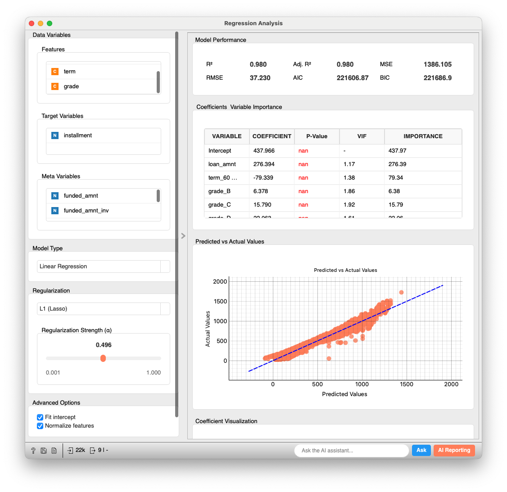
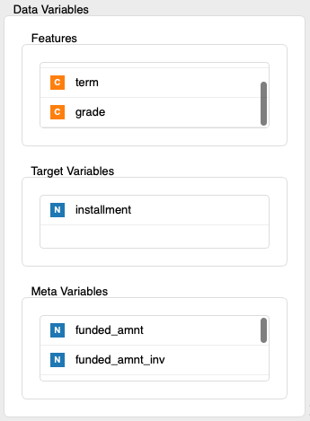
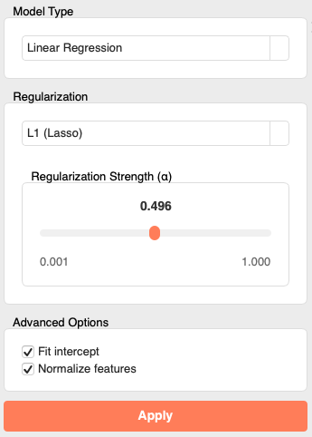
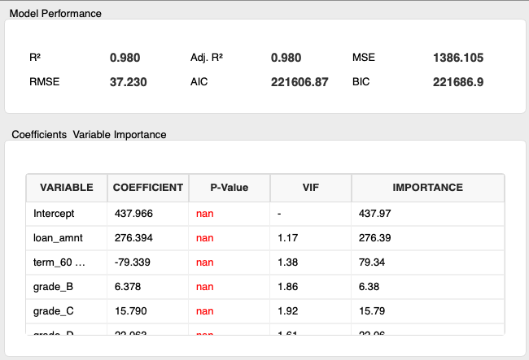
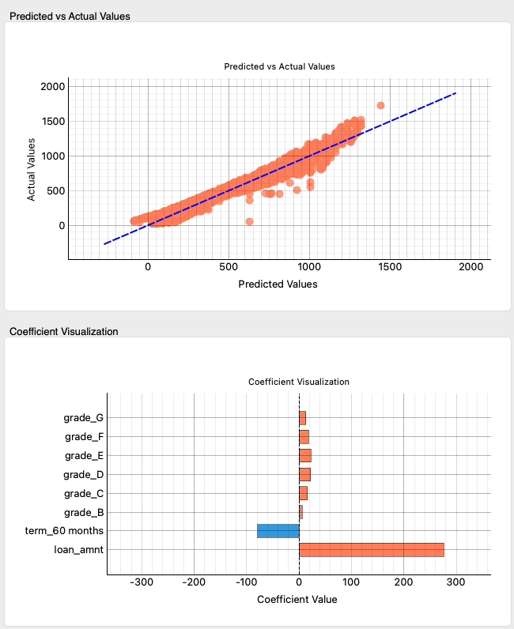
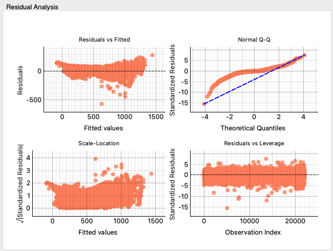
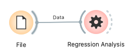

# Regression Analysis

Performs interactive linear regression analysis and visually evaluates its results.

## Input

1.  **Data**: Input dataset (`Orange.data.Table`)
    *   The target variable must be continuous.
    *   Explanatory variables can be numerical or categorical. Categorical variables are automatically one-hot encoded within the widget.

    **Example Input Data (format like `housing.csv`):**

    | CRIM    | ZN   | INDUS | CHAS | NOX   | RM    | AGE  | DIS  | RAD | TAX | PTRATIO | B     | LSTAT | MEDV (Target) |
    | :------ | :--- | :---- | :--- | :---- | :---- | :--- | :--- | :-- | :-- | :------ | :---- | :---- | :------------ |
    | 0.00632 | 18.0 | 2.31  | 0    | 0.538 | 6.575 | 65.2 | 4.09 | 1   | 296 | 15.3    | 396.9 | 4.98  | 24.0          |
    | 0.02731 | 0.0  | 7.07  | 0    | 0.469 | 6.421 | 78.9 | 4.96 | 2   | 242 | 17.8    | 396.9 | 9.14  | 21.6          |
    | ...     | ...  | ...   | ...  | ...   | ...   | ...  | ...  | ... | ... | ...     | ...   | ...   | ...           |

## Output

1.  **Coefficients**: Coefficient table (`Orange.data.Table`).
    *   Includes coefficient values, standard errors, t-values, P-values, VIF (Variance Inflation Factor), and importance (absolute value of coefficients) for each explanatory variable.

    **Example Coefficients Output Data:**

    | variable | COEFFICIENT | P-Value | VIF   | IMPORTANCE |
    | :------- | :---------- | :------ | :---- | :--------- |
    | const    | 36.459      | 0.000   | NaN   | 36.46      |
    | LSTAT    | -0.950      | 0.000   | 2.942 | 0.95       |
    | RM       | 3.809       | 0.000   | 1.935 | 3.81       |
    | ...      | ...         | ...     | ...   | ...        |

2.  **Predictions**: Prediction results table (`Orange.data.Table`).
    *   The input data table with an added column for predicted values (e.g., `predicted_MEDV`) and a residuals column.

    **Example Predictions Output Data (with `predicted_MEDV` etc. added to input):**

    | CRIM    | ...  | LSTAT | MEDV | predicted_MEDV |
    | :------ | :--- | :---- | :--- | :------------- |
    | 0.00632 | ...  | 4.98  | 24.0 | 28.6           |
    | 0.02731 | ...  | 9.14  | 21.6 | 25.0           |
    | ...     | ...  | ...   | ...  | ...            |

## Feature Description

The Regression Analysis widget is a tool for users to interactively select and modify explanatory variables and model parameters, build and evaluate linear regression models, and visualize the results.

### Control Area (Left Panel)

In the control area, users set the data and model parameters for the analysis.

1.  **Data Variables**:
    *   **Features**: Select variables from the list to be used as explanatory variables for the model. Variables in the list can be dragged and dropped to "Target Variables" or "Meta Variables".
    *   **Target Variables**: Select the variable to be used as the target variable for the model. Currently, only one continuous variable is supported.
    *   **Meta Variables**: Select meta variables that are not directly used in model training but should be included in the analysis results (especially the `Predictions` output).
2.  **Model Type**:
    *   Select the type of regression model to use. In the current version, only **Linear Regression** is available.
3.  **Regularization**:
    *   Select the type of regularization to apply to the model.
        *   **None**: No regularization.
        *   **L1 (Lasso)**: Applies L1 regularization (Lasso regression). It has the effect of shrinking coefficients of unnecessary features to zero and can be used for variable selection.
        *   **L2 (Ridge)**: Applies L2 regularization (Ridge regression). It generally suppresses the magnitude of coefficients and mitigates the impact of multicollinearity.
    *   **Regularization Strength (α)**: Adjusts the strength of regularization. Can be set within a range of 0.001 to 1.000 using a slider or numerical input. Active when L1 or L2 regularization is selected. A larger value means stronger regularization.
4.  **Advanced Options**:
    *   **Fit intercept**: Specifies whether to include an intercept (constant term) in the model. If checked, an intercept is included.
    *   **Normalize features**: Specifies whether to normalize (standardize) explanatory variables. If checked, each explanatory variable is transformed to have a mean of 0 and a variance of 1. This is particularly useful when variables have vastly different scales or when applying regularization.
5.  **Apply**:
    *   Analysis is automatically performed when the widget loads or when new data is input. If settings in the control panel are changed, the "Apply" button becomes active; clicking it applies the changes to the model, triggering recalculation and redrawing.

### Main Area (Right Panel)

The main area visually displays the evaluation results of the trained model and detailed analysis information regarding coefficients and residuals. This area is scrollable.

1.  **Model Performance**:
    *   Displays key metrics for evaluating model performance.
        *   **R² (Coefficient of Determination)**: Indicates how much of the variability (variance) in the data the model can explain. Takes values from 0 to 1, with values closer to 1 indicating a better fit.
        *   **Adj. R² (Adjusted R-squared)**: Corrects for the tendency of R² to increase as more explanatory variables are added. Useful for comparing models with different numbers of explanatory variables.
        *   **MSE (Mean Squared Error)**: The average of the squared differences (errors) between predicted and actual values. Smaller values indicate higher prediction accuracy.
        *   **RMSE (Root Mean Squared Error)**: The square root of MSE. It has the advantage of being interpretable in the same units as the target variable. Smaller values indicate higher prediction accuracy.
        *   **AIC (Akaike Information Criterion)**: Evaluates the balance between the goodness of fit of the model and its complexity (number of parameters). Smaller values indicate a better model.
        *   **BIC (Bayesian Information Criterion)**: Used for similar purposes as AIC but tends to impose a larger penalty for the number of parameters. Smaller values indicate a better model.
2.  **Coefficients & Variable Importance**:
    *   Detailed information about the model's coefficients is displayed in a table format.
        *   **VARIABLE**: Variable name (intercept is displayed as `const` or `Intercept`).
        *   **COEFFICIENT**: The regression coefficient value for each variable. This value indicates how much the target variable changes when that variable changes by one unit, holding other variables constant.
        *   **P-Value**: The P-value indicating whether the coefficient is statistically significant. Generally, if less than 0.05, it is considered significant, suggesting the variable affects the target variable (P-values <= 0.05 are displayed in blue).
        *   **VIF (Variance Inflation Factor)**: Indicates the strength of multicollinearity among explanatory variables. Generally, if VIF is 10 or higher, multicollinearity may be a problem, and it is displayed in red. VIF for the intercept is not calculated (NaN).
        *   **IMPORTANCE**: The absolute value of the coefficient. A measure of the magnitude of the variable's impact on the target variable.
3.  **Predicted vs Actual Values**:
    *   A scatter plot with model-predicted values on the horizontal axis and actual target variable values on the vertical axis.
    *   Points on the plot represent individual data samples. The closer the points cluster around the blue dashed line (the ideal y=x line), the higher the model's prediction accuracy.
4.  **Coefficient Visualization**:
    *   A bar plot visualizing the magnitude and sign of each explanatory variable's coefficient. The intercept (constant term) is not included in this plot.
    *   The length of the bar represents the absolute magnitude of the coefficient, and the color of the bar indicates the sign (e.g., orange for positive coefficients, blue for negative). This allows for an intuitive understanding of which variables have a positive or negative impact on the target variable and to what extent.
5.  **Residual Analysis**:
    *   Displays four standard diagnostic plots for analyzing patterns in residuals (actual values - predicted values). These help to check if the model's assumptions are met.
        *   **Residuals vs Fitted**: A plot with predicted values on the horizontal axis and residuals on the vertical axis. Ideally, residuals should be randomly scattered around the zero line without any specific pattern (e.g., fan shape or curve). This checks the assumptions of homoscedasticity (equal variance of errors) and linearity.
        *   **Normal Q-Q (Normal Quantile-Quantile Plot)**: A plot to visually check if the standardized residuals follow a normal distribution. The closer the points align along a straight line, the closer the residuals are to a normal distribution.
        *   **Scale-Location (Spread-Location Plot)**: A plot with predicted values on the horizontal axis and the square root of the absolute standardized residuals on the vertical axis. Checks if the variance of residuals is constant across all levels of predicted values (homoscedasticity). Ideally, points should be uniformly scattered horizontally.
        *   **Residuals vs Leverage Plot**: A plot with leverage (the influence of individual data points on regression coefficients) on the horizontal axis and standardized residuals on the vertical axis. Helps identify outliers (points with large residuals) and influential data points (points with high leverage).

## Usage Example

The following is a basic workflow for performing linear regression analysis using the `housing` dataset, which is standardly included in Allye.

1.  Place a **File** widget in the workflow and load `housing.tab` (or another appropriate dataset).
2.  Connect the output of the **File** widget to the `Data` input of the **Regression Analysis** widget.
3.  Open the **Regression Analysis** widget and, in the left control panel, move `MEDV` (median value of owner-occupied homes) to the "Target Variables" list as the target variable.
4.  Select variables like `LSTAT` (% lower status of the population) and `RM` (average number of rooms per dwelling) and place them in the "Features" list.
5.  If necessary, configure "Regularization" type, "Regularization Strength (α)", and "Advanced Options" like "Fit intercept" or "Normalize features".
6.  In the right main area, review the "Model Performance" metrics, coefficient table, and various plots to evaluate the model's validity and the impact of variables.
7.  Connect the `Coefficients` output of the **Regression Analysis** widget to a **Data Table** widget to view detailed coefficient information in tabular form.
8.  Similarly, connect the `Predictions` output to a **Data Table** widget to see actual values, predicted values, and residuals for each data point.
9.  It is also possible to connect the `Model` output to a **Predictions** widget and input another dataset to make predictions using the trained model.

## Detailed Logic

### Data Preprocessing

The Regression Analysis widget internally performs the following preprocessing steps on the input data:

1.  **Domain Reconstruction**: Based on the features, target variables, and meta variables selected by the user in the "Data Variables" section of the UI, the domain (variable set) of the input data is reconstructed.
2.  **Categorical Variable Encoding**:
    *   If categorical variables are included in the explanatory variables, one-hot encoding is applied.
    *   The `pandas.get_dummies` function is used with the `drop_first=True` option, which removes the first category of each categorical variable as a reference category. This helps avoid multicollinearity. Encoded variable names combine the original variable name and the category value (e.g., `grade_B`).
3.  **Missing Value Handling**:
    *   Rows containing missing values (NaN) in either features or the target variable are excluded from the analysis.
4.  **Feature Normalization**:
    *   If the "Normalize features" option in the control panel is enabled, explanatory variables are standardized using `sklearn.preprocessing.StandardScaler` (each feature is transformed to have a mean of 0 and a standard deviation of 1).

### Model Training

Depending on the selected model type and regularization options, one of the following models is used (implemented in the `LinearRegressionModel` class within `glm_models.py`):

*   **Linear Regression (No Regularization)**: Uses `sklearn.linear_model.LinearRegression` to train the model. `statsmodels.api.OLS` is also used internally to calculate statistical details like P-values.
*   **L1 Regularization (Lasso)**: Uses `sklearn.linear_model.Lasso`. The strength of regularization is controlled by the `alpha` parameter (Regularization Strength in the UI).
*   **L2 Regularization (Ridge)**: Uses `sklearn.linear_model.Ridge`. The strength of regularization is controlled by the `alpha` parameter.

### Evaluation Metrics and Statistics

*   **R², MSE, RMSE**: Calculated using functions from `sklearn.metrics` (`r2_score`, `mean_squared_error`) and standard formulas.
*   **Adjusted R² (Adj. R²)**: Calculated based on R², sample size, and the number of explanatory variables: `1 - (1 - R²) * (n - 1) / (n - p - 1)` (where n: sample size, p: number of explanatory variables).
*   **AIC, BIC**: Obtained from `statsmodels` results if no regularization is applied. If regularization is applied or `statsmodels` is not available, they are calculated from the Residual Sum of Squares (RSS) and the number of parameters.
    *   Log-Likelihood (approximate): `L ≈ -n/2 * (log(2π) + log(RSS/n) + 1)`
    *   AIC: `-2L + 2k`
    *   BIC: `-2L + log(n)k` (where k is the number of estimated parameters = number of explanatory variables + intercept (1 if present) + error variance (1))
*   **P-values**: Obtained from the results of `statsmodels.api.OLS` when no regularization is applied. For regularized models (Lasso, Ridge), P-values are generally not directly calculated and are therefore not displayed (shown as N/A or `-`).
*   **VIF (Variance Inflation Factor)**: For each explanatory variable `X_i`, an auxiliary linear regression model is built with `X_i` as the target variable and all other explanatory variables as predictors. Using the R-squared (`R_i²`) of this auxiliary regression, VIF is calculated as `1 / (1 - R_i²)`. This calculation is implemented in the `calculate_vif` function within `glm_models.py`.

### Plots

All graphs displayed within the widget are drawn using the `pyqtgraph` library.

*   **Predicted vs Actual Values**: Scatter plot of actual vs. predicted values.
*   **Coefficient Visualization**: Bar plot of coefficients for each explanatory variable (excluding the intercept).
*   **Residual Analysis**: A set of four plots: residuals vs. fitted, Normal Q-Q plot, scale-location plot, and residuals vs. leverage plot.