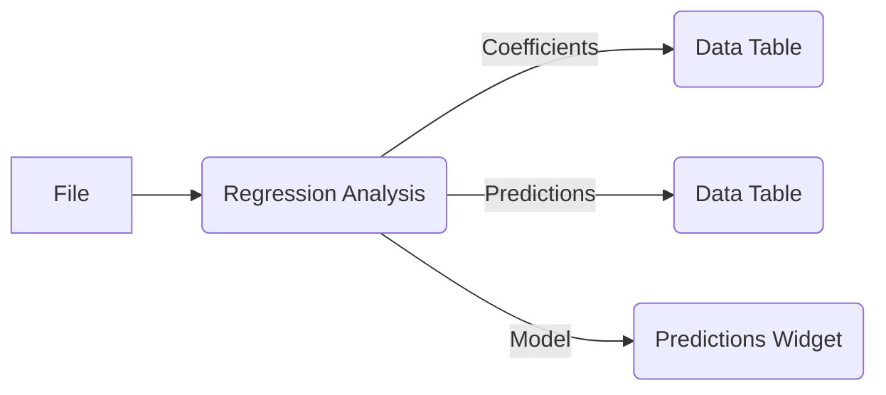

# Regression Analysis

インタラクティブな線形回帰分析を実行し、その結果を視覚的に評価します。

| アイコン                                      |
| :-------------------------------------------- |
|  (プレースホルダ) |

## 入力

1.  **Data**: 入力データセット (`Orange.data.Table`)
    *   目的変数は連続値である必要があります。
    *   説明変数は数値型またはカテゴリ型です。カテゴリ型の変数は、ウィジェット内部で自動的にワンホットエンコーディングされます。

    **入力データ例 (`housing.csv` のような形式):**

    | CRIM    | ZN   | INDUS | CHAS | NOX   | RM    | AGE  | DIS  | RAD | TAX | PTRATIO | B     | LSTAT | MEDV (目的変数) |
    | :------ | :--- | :---- | :--- | :---- | :---- | :--- | :--- | :-- | :-- | :------ | :---- | :---- | :-------------- |
    | 0.00632 | 18.0 | 2.31  | 0    | 0.538 | 6.575 | 65.2 | 4.09 | 1   | 296 | 15.3    | 396.9 | 4.98  | 24.0            |
    | 0.02731 | 0.0  | 7.07  | 0    | 0.469 | 6.421 | 78.9 | 4.96 | 2   | 242 | 17.8    | 396.9 | 9.14  | 21.6            |
    | ...     | ...  | ...   | ...  | ...   | ...   | ...  | ...  | ... | ... | ...     | ...   | ...   | ...             |

## 出力

1.  **Coefficients**: 係数テーブル (`Orange.data.Table`)。
    *   各説明変数の係数値、標準誤差、t値、P値、VIF (Variance Inflation Factor)、重要度（係数の絶対値）などが含まれます。

    **Coefficients出力データ例:**

    | variable | COEFFICIENT | P-Value | VIF   | IMPORTANCE |
    | :------- | :---------- | :------ | :---- | :--------- |
    | const    | 36.459      | 0.000   | NaN   | 36.46      |
    | LSTAT    | -0.950      | 0.000   | 2.942 | 0.95       |
    | RM       | 3.809       | 0.000   | 1.935 | 3.81       |
    | ...      | ...         | ...     | ...   | ...        |

2.  **Predictions**: 予測結果テーブル (`Orange.data.Table`)。
    *   入力データに予測値のカラム (例: `predicted_MEDV`) と残差のカラムが追加されたテーブルです。

    **Predictions出力データ例 (入力に `predicted_MEDV` 等が追加):**

    | CRIM    | ...  | LSTAT | MEDV | predicted_MEDV |
    | :------ | :--- | :---- | :--- | :------------- |
    | 0.00632 | ...  | 4.98  | 24.0 | 28.6           |
    | 0.02731 | ...  | 9.14  | 21.6 | 25.0           |
    | ...     | ...  | ...   | ...  | ...            |

## 機能の説明

Regression Analysisウィジェットは、ユーザーがインタラクティブに説明変数やモデルのパラメータを選択・変更し、線形回帰モデルの構築、評価、結果の可視化を行うためのツールです。

### コントロールエリア (左パネル)

コントロールエリアでは、分析に使用するデータとモデルのパラメータを設定します。

1.  **Data Variables**:
    *   **Features**: モデルの説明変数として使用する変数をリストから選択します。リスト内の変数はドラッグ＆ドロップで「Target Variables」や「Meta Variables」に移動できます。
    *   **Target Variables**: モデルの目的変数として使用する変数を選択します。現在は1つの連続値変数のみサポートしています。
    *   **Meta Variables**: モデル学習には直接使用されませんが、分析結果（特に `Predictions` 出力）に含めたいメタ変数を選択します。
2.  **Model Type**:
    *   使用する回帰モデルのタイプを選択します。現在のバージョンでは **Linear Regression (線形回帰)** のみが利用可能です。
3.  **Regularization**:
    *   モデルに適用する正則化の種類を選択します。
        *   **None**: 正則化を行いません。
        *   **L1 (Lasso)**: L1正則化（Lasso回帰）を適用します。不要な特徴量の係数を0にする効果があり、変数選択にも利用されます。
        *   **L2 (Ridge)**: L2正則化（Ridge回帰）を適用します。係数の大きさを全体的に抑え、多重共線性の影響を緩和する効果があります。
    *   **Regularization Strength (α)**: 正則化の強さを調整します。スライダーまたは数値入力で0.001から1.000の範囲で設定できます。L1またはL2正則化を選択した場合に有効になります。値が大きいほど正則化の効果が強くなります。
4.  **Advanced Options**:
    *   **Fit intercept**: モデルに切片（定数項）を含めるかどうかを指定します。チェックを入れると切片がモデルに含まれます。
    *   **Normalize features**: 説明変数を正規化（標準化）するかどうかを指定します。チェックを入れると、各説明変数が平均0、分散1になるように変換されます。これは、変数のスケールが大きく異なる場合や、正則化を適用する場合に特に有効です。
5.  **Apply**:
    *   ウィジェットロード時やデータが新たに入力された際は自動的に分析が実行されます。コントロールパネルで設定を変更した場合は、「Apply」ボタンが有効化されるので、クリックすることで変更をモデルに反映し、再計算・再描画を行います。

### メインエリア (右パネル)

メインエリアには、学習済みモデルの評価結果や、係数・残差に関する詳細な分析情報が視覚的に表示されます。このエリアはスクロール可能です。

1.  **Model Performance**:
    *   モデルの性能を評価するための主要な指標が表示されます。
        *   **R² (決定係数)**: モデルがデータのばらつき（分散）をどれだけ説明できているかを示す指標です。0から1の値をとり、1に近いほど当てはまりが良いことを意味します。
        *   **Adj. R² (自由度調整済み決定係数)**: 説明変数の数が増えるとR²が上昇する傾向を補正した指標です。異なる数の説明変数を持つモデル同士を比較する際に有用です。
        *   **MSE (Mean Squared Error, 平均二乗誤差)**: 予測値と実測値の差（誤差）の二乗の平均値です。値が小さいほど予測精度が高いことを示します。
        *   **RMSE (Root Mean Squared Error, 二乗平均平方根誤差)**: MSEの平方根です。目的変数と同じ単位で評価できるため解釈しやすい利点があります。値が小さいほど予測精度が高いです。
        *   **AIC (Akaike Information Criterion, 赤池情報量規準)**: モデルの当てはまりの良さとモデルの複雑さ（パラメータ数）のバランスを評価する指標です。値が小さいほど良いモデルとされます。
        *   **BIC (Bayesian Information Criterion, ベイズ情報量規準)**: AICと同様の目的で使われますが、パラメータ数に対してより大きなペナルティを課す傾向があります。値が小さいほど良いモデルとされます。
2.  **Coefficients & Variable Importance**:
    *   モデルの係数に関する詳細な情報がテーブル形式で表示されます。
        *   **VARIABLE**: 変数名（切片は `const` または `Intercept` として表示されます）。
        *   **COEFFICIENT**: 各変数の回帰係数値。この値は、他の変数が一定の時、その変数が1単位変化すると目的変数がどれだけ変化するかを示します。
        *   **P-Value**: 係数が統計的に有意かどうかを示すP値。一般的に0.05未満であれば有意と判断され、その変数が目的変数に影響を与えていると考えられます（P値が0.05以下の場合は青色で表示）。
        *   **VIF (Variance Inflation Factor)**: 分散拡大要因。説明変数間の多重共線性の強さを示します。一般的にVIFが10以上の場合、多重共線性が問題となる可能性があり、赤色で表示されます。切片のVIFは計算されません (NaN)。
        *   **IMPORTANCE**: 係数の絶対値。目的変数への影響の大きさの目安となります。
3.  **Predicted vs Actual Values**:
    *   横軸にモデルによる予測値、縦軸に実際の目的変数の値を取った散布図です。
    *   プロット上の点は個々のデータサンプルを表します。点が青い破線（y=xの理想線）の近くに集まるほど、モデルの予測精度が高いことを示します。
4.  **Coefficient Visualization**:
    *   各説明変数の係数の大きさと符号をバープロットで視覚化したものです。切片（定数項）はこのプロットには含まれません。
    *   バーの長さが係数の絶対値の大きさを、バーの色が符号（例：正の係数はオレンジ、負の係数は青）を示します。これにより、どの変数がどの程度、目的変数に正または負の影響を与えているかを直感的に把握できます。
5.  **Residual Analysis**:
    *   残差（実測値 - 予測値）のパターンを分析するための4つの標準的な診断プロットが表示されます。これらはモデルの仮定が満たされているかを確認するのに役立ちます。
        *   **Residuals vs Fitted**: 横軸に予測値、縦軸に残差を取ったプロット。残差が0の線を中心にランダムに散布しており、特定のパターン（例：扇形や曲線）が見られないのが理想的です。これは誤差の等分散性や線形性の仮定を確認します。
        *   **Normal Q-Q (正規Q-Qプロット)**: 標準化された残差が正規分布に従っているかを視覚的に確認するプロット。点が直線状に並ぶほど、残差が正規分布に近いことを示します。
        *   **Scale-Location (スケール-位置プロット)**: 横軸に予測値、縦軸に標準化残差の絶対値の平方根を取ったプロット。予測値の水準によらず残差のばらつきが一定（等分散性）であるかを確認します。点が水平方向に均一に散らばるのが理想的です。
        *   **Residuals vs Leverage (残差 vs レバレッジプロット)**: 横軸にレバレッジ（個々のデータ点が回帰係数に与える影響の大きさ）、縦軸に標準化残差を取ったプロット。外れ値（残差が大きい点）や影響の大きいデータ点（レバレッジが高い点）を特定するのに役立ちます。

## 使用例

以下は、Allyeに標準で含まれる `housing` データセットを用いて線形回帰分析を行う基本的なワークフローです。

1.  ワークフローに **File** ウィジェットを配置し、`housing.tab` (または他の適切なデータセット) を読み込みます。
2.  **File** ウィジェットの出力を **Regression Analysis** ウィジェットの `Data` 入力に接続します。
3.  **Regression Analysis** ウィジェットを開き、左側のコントロールパネルで目的変数として `MEDV` (住宅価格の中央値) を「Target Variables」リストに移動します。
4.  `LSTAT` (% 低所得者層の割合)、`RM` (平均部屋数) などの変数を選択し、「Features」リストに配置します。
5.  必要に応じて、「Regularization」の種類や「Regularization Strength (α)」、「Advanced Options」の「Fit intercept」や「Normalize features」を設定します。
6.  右側のメインエリアで、「Model Performance」の指標、係数テーブル、各種プロットを確認し、モデルの妥当性や変数の影響を評価します。
7.  **Regression Analysis** ウィジェットの `Coefficients` 出力を **Data Table** ウィジェットに接続すると、係数の詳細を表形式で確認できます。
8.  同様に、`Predictions` 出力を **Data Table** ウィジェットに接続すると、各データポイントの実測値と予測値、残差などを確認できます。
9.  `Model` 出力を **Predictions** ウィジェットに接続し、さらに別のデータセットを入力することで、学習済みモデルを用いた予測を行うことも可能です。

## 詳細なロジック

### データ前処理

Regression Analysisウィジェットは、入力データに対して以下の前処理を内部的に行います。

1.  **ドメイン再構築**: ユーザーがUIの「Data Variables」セクションで選択した特徴量 (Features)、目的変数 (Target Variables)、メタ変数 (Meta Variables) に基づいて、入力データのドメイン（変数セット）が再構築されます。
2.  **カテゴリカル変数のエンコーディング**:
    *   説明変数にカテゴリカル変数が含まれる場合、ワンホットエンコーディングが適用されます。
    *   `pandas.get_dummies`関数が使用され、`drop_first=True`オプションにより、各カテゴリ変数の最初のカテゴリは参照カテゴリとして削除されます。これにより、多重共線性を避けることができます。エンコード後の変数名は元の変数名とカテゴリ値を組み合わせたものになります (例: `grade_B`)。
3.  **欠損値の処理**:
    *   特徴量または目的変数に欠損値 (NaN) が含まれる行は、分析から除外されます。
4.  **特徴量の正規化**:
    *   コントロールパネルの「Normalize features」オプションが有効な場合、`sklearn.preprocessing.StandardScaler` を用いて説明変数が標準化されます（各特徴量の平均が0、標準偏差が1になるように変換されます）。

### モデル学習

選択されたモデルタイプと正則化オプションに応じて、以下のいずれかのモデルが使用されます (`glm_models.py`内の`LinearRegressionModel`クラスで実装)。

*   **線形回帰 (正則化なし)**: `sklearn.linear_model.LinearRegression` を使用してモデルを学習します。P値などの統計的詳細情報を計算するために、内部的に `statsmodels.api.OLS` も併用されます。
*   **L1正則化 (Lasso)**: `sklearn.linear_model.Lasso` を使用します。正則化の強度は `alpha` パラメータ（UIのRegularization Strength）で制御されます。
*   **L2正則化 (Ridge)**: `sklearn.linear_model.Ridge` を使用します。正則化の強度は `alpha` パラメータで制御されます。

### 評価指標と統計量

*   **R², MSE, RMSE**: `sklearn.metrics`の関数 (`r2_score`, `mean_squared_error`) および標準的な数式を用いて計算されます。
*   **調整済みR² (Adj. R²)**: R²、サンプルサイズ、説明変数の数に基づいて計算されます: `1 - (1 - R²) * (n - 1) / (n - p - 1)` (n: サンプルサイズ, p: 説明変数の数)。
*   **AIC, BIC**: 正則化なしの場合は`statsmodels`の結果から取得されます。正則化ありの場合や`statsmodels`が利用できない場合は、残差平方和 (RSS) とパラメータ数から計算されます。
    *   対数尤度 (概算): `L ≈ -n/2 * (log(2π) + log(RSS/n) + 1)`
    *   AIC: `-2L + 2k`
    *   BIC: `-2L + log(n)k` (kは推定パラメータ数 = 説明変数の数 + 切片(あれば1) + 誤差分散(1))
*   **P値**: 正則化なしの場合、`statsmodels.api.OLS` の結果から取得されます。正則化モデル（Lasso, Ridge）の場合、P値は一般的に直接計算されないため、表示されません (N/A または `-` と表示)。
*   **VIF (Variance Inflation Factor)**: 各説明変数 `X_i` について、`X_i` を目的変数とし、他の全ての説明変数を説明変数とする補助的な線形回帰モデルを構築します。この補助回帰の決定係数 `R_i²` を用いて、VIF = `1 / (1 - R_i²)` として計算されます。この計算は `glm_models.py` 内の `calculate_vif` 関数で実装されています。

### プロット

ウィジェット内に表示される全てのグラフは `pyqtgraph` ライブラリを使用して描画されています (`plotting.py`で定義)。

*   **Predicted vs Actual Values**: 実測値と予測値の散布図。
*   **Coefficient Visualization**: 各説明変数の係数（切片を除く）のバープロット。
*   **Residual Analysis**: 残差プロット、正規Q-Qプロット、スケール-位置プロット、残差vsレバレッジプロットの4点セット。
