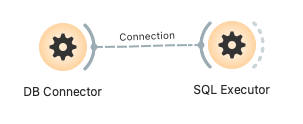
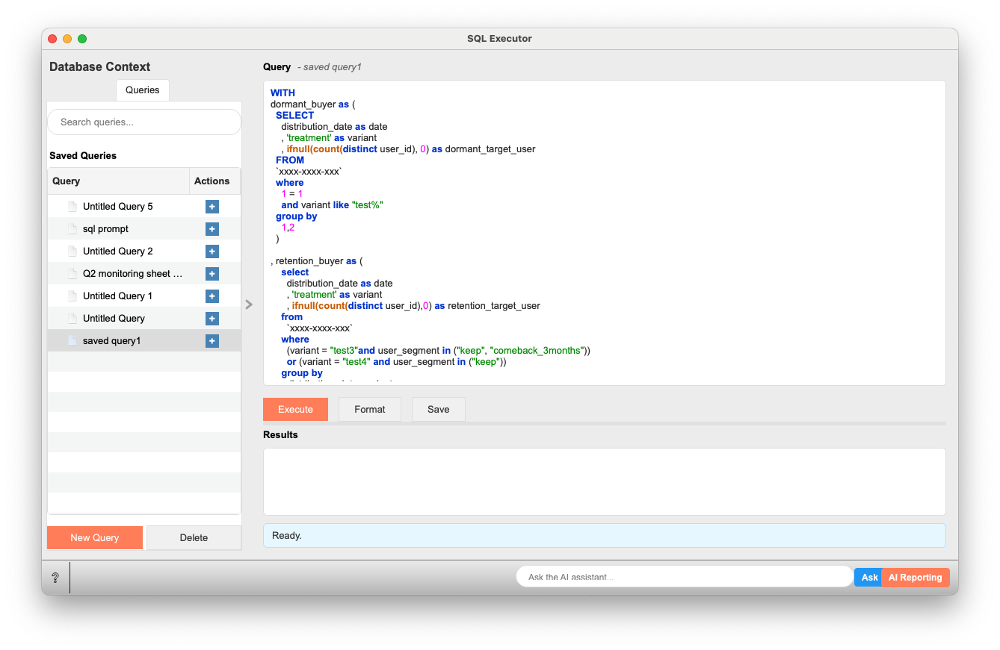

# SQL Executor

Executes SQL queries on a specified database connection and outputs the results as a data table.

## Overview

The SQL Executor widget is a core tool for executing SQL queries using a provided database connection object. Users can create, edit, save, load, and execute SQL queries, and view their results in tabular form. The results of SELECT statements are outputted as Orange data tables, which can be further analyzed by other widgets.

## Input

-   **Connection**
    -   **Specification**: An Orange database connection object, typically provided by a widget like "DB Connector" (formerly "Database Connection"). This connection object contains the engine and configuration information necessary to connect to the database.
    -   **Example Input Data**: A valid connection to any SQLAlchemy-supported database, such as PostgreSQL, MySQL, BigQuery, or SQLite, configured in the "DB Connector" widget.

## Output

-   **Data**
    -   **Specification**:
        -   If a SELECT query is successful and returns rows: An Orange data table object (`Orange.data.Table`) containing the result set.
        -   If a non-SELECT query (e.g., INSERT, UPDATE, CREATE TABLE) is successful: `None`.
        -   If an error occurs during query execution: `None`.
    -   **Example Output Data**: An Orange data table converted from a `pandas.DataFrame`. For example, the result of `SELECT column1, column2 FROM my_table` would be a data table like this:

        | column1 | column2 |
        | :------ | :------ |
        | ValueA1 | ValueB1 |
        | ValueA2 | ValueB2 |
        | ...     | ...     |

## Feature Description

It primarily consists of three areas.

1.  **Database Context (Left Pane)**:
    *   **Queries Tab**:
        *   **Search queries...**: Filters saved queries by name.
        *   **Saved Queries**:
            *   Double-clicking a query name loads that query into the central query editor.
            *   Right-clicking displays a context menu with "Rename" and "Delete" options.
        *   **New Query Button**: Creates a new empty query (`Untitled Query X`) and adds it to the list.
        *   **Delete Button**: Deletes the query selected in the "Saved Queries" list (also deletes the file).

2.  **Query Execution Area (Central Pane)**:
    *   **Query Header**:
        *   Displays the "Query" label and the name of the currently edited query (e.g., `- saved query1`).
    *   **Query Editor**:
        *   A text area for entering and editing SQL queries.
        *   Features SQL syntax highlighting.
        *   Placeholder text: `Enter your SQL query here...`
    *   **Action Buttons**:
        *   **Execute**: Executes the SQL query currently entered in the editor.
        *   **Format**: Formats the SQL query in the editor (capitalizes keywords, adjusts indentation, etc.).
        *   **Save**: Saves the SQL query in the editor under the current query name. If the query name is not set, it saves it similarly to "New Query". Can also be saved with `Ctrl+S` (Windows/Linux) or `Cmd+S` (MacOS) shortcut.
    *   **Progress Bar**: Displays progress during query execution (usually hidden).
    *   **Results Area**:
        *   **Results Header**: Displays the "Results" label, row count information (e.g., `100 of 1000 rows`), and execution time (e.g., `Execution time: 00:05`).
        *   **Results Table**: Displays the execution results of SELECT queries in tabular form.
            *   Columns can be sorted by clicking their headers.
            *   Right-clicking displays a context menu with "Copy selected cells" and "Copy all data" options.
            *   The maximum number of rows displayed can be changed in settings (default 1000 rows).
        *   **Error Display Area**: If an error occurs during query execution, the error message and traceback are displayed here (usually hidden).
    *   **Status Label**: Displays the current state of the widget or operation results (e.g., `Ready. Connect a database to execute queries.`, `Query executed successfully.`).

3.  **Settings**:
    Widget settings are saved with the Orange workflow. These include:
    *   `saved_queries`: (Currently, its role here is limited as queries are mainly loaded from the file system)
    *   `current_query_name`: The name of the query currently open in the editor.
    *   `query`: The query text currently entered in the editor.
    *   `max_rows_display`: The maximum number of rows to display in the results table.

## Usage Example

1.  **Prepare Database Connection**:
    *   Place a "DB Connector" widget (or an equivalent widget providing a connection) on the Orange canvas.
    *   Open the "DB Connector" widget and configure the connection information to the target database (e.g., PostgreSQL, BigQuery).

2.  **Place and Connect SQL Executor**:
    *   Place the "SQL Executor" widget on the canvas.
    *   Draw a line from the output connector of the "DB Connector" widget to the input connector (`Connection`) of the "SQL Executor" widget.
    *   If the connection is successful, the SQL Executor's status label will display something like "Connected to database: [Connection Name]".

3.  **Create and Execute Query**:
    *   Open the SQL Executor widget.
    *   Enter an SQL query in the central query editor. Example: `SELECT * FROM customers LIMIT 10;`
    *   If necessary, format the query using the "Format" button.
    *   Click the "Execute" button to run the query.
    *   A progress bar will be displayed during execution, and upon completion, data will appear in the results table, or an error message will be shown.

4.  **Save and Manage Queries**:
    *   If you want to reuse the created query, click the "Save" button.
        *   If it doesn't have a name yet or is newly created, it will be saved as an `.sql` file with a name like "Untitled Query X".
        *   In the "Saved Queries" list under the "Queries" tab in the left pane, you can right-click the saved query and select "Rename" to change its name (e.g., `GetCustomerList`).
    *   To load a previously saved query, double-click the corresponding query in the "Saved Queries" list.

5.  **Utilize Results**:
    *   The results of SELECT queries are outputted from the widget's `Data` output as an Orange data table.
    *   For example, by connecting a "Data Table" widget to the output of the SQL Executor, you can view the results in Orange's standard table viewer or pass them to other analysis widgets.