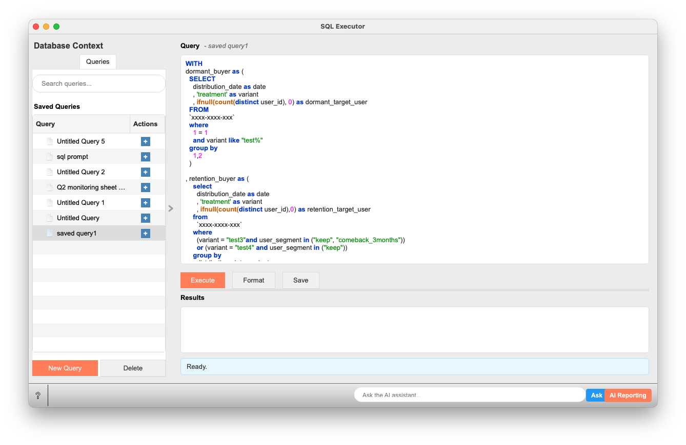

# SQL Executor

SQLクエリを指定されたデータベース接続上で実行し、結果をデータテーブルとして出力します。

## 概要

SQL Executorウィジェットは、提供されたデータベース接続オブジェクトを使用してSQLクエリを実行するための中核的なツールです。ユーザーはSQLクエリを作成、編集、保存、読み込み、実行し、その結果を表形式で確認できます。SELECT文の結果はOrangeのデータテーブルとして出力され、他のウィジェットでさらに分析することができます。

## 入力

-   **Connection (接続)**
    -   **仕様**: Orangeのデータベース接続オブジェクト。通常は「Database Connection」ウィジェットなどから提供されます。この接続オブジェクトには、データベースへの接続に必要なエンジンや設定情報が含まれています。
    -   **入力データ例**: 「Database Connection」ウィジェットで設定された、PostgreSQL、MySQL、BigQuery、SQLiteなど、SQLAlchemyがサポートする任意のデータベースへの有効な接続。

## 出力

-   **Data (データ)**
    -   **仕様**:
        -   SELECTクエリが成功し、行が返された場合: 結果セットを含むOrangeのデータテーブルオブジェクト (`Orange.data.Table`)。
        -   SELECTクエリ以外のクエリ（例: INSERT, UPDATE, CREATE TABLEなど）が成功した場合: `None`。
        -   クエリ実行中にエラーが発生した場合: `None`。
    -   **出力データ例**: `pandas.DataFrame`から変換されたOrangeのデータテーブル。例えば、`SELECT column1, column2 FROM my_table` の結果が以下のようなデータテーブルになります。

        | column1 | column2 |
        | :------ | :------ |
        | 値A1    | 値B1    |
        | 値A2    | 値B2    |
        | ...     | ...     |

## 機能の説明

主に3つの領域で構成されています。

1.  **データベースコンテキスト (左ペイン)**:
    *   **クエリ (Queries) タブ**:
        *   **クエリ検索 (Search queries...)**: 保存されたクエリを名前でフィルタリングします。
        *   **保存されたクエリ (Saved Queries)**:
            *   クエリ名をダブルクリックすると、そのクエリが中央のクエリエディタに読み込まれます。
            *   右クリックでコンテキストメニューが表示され、「名前の変更(Rename)」「削除(Delete)」が可能です。
        *   **新規クエリ (New Query) ボタン**: 新しい空のクエリ (`Untitled Query X`) を作成し、リストに追加します。
        *   **削除 (Delete) ボタン**: 「保存されたクエリ」リストで選択されているクエリを削除します（ファイルも削除されます）。

2.  **クエリ実行エリア (中央ペイン)**:
    *   **クエリヘッダー**:
        *   「Query」ラベルと、現在編集中のクエリ名 (例: `- saved query1`) が表示されます。
    *   **クエリエディタ**:
        *   SQLクエリを入力・編集するためのテキストエリアです。
        *   SQL構文のハイライト機能が備わっています。
        *   プレースホルダーテキスト: `Enter your SQL query here...`
    *   **操作ボタン**:
        *   **Execute (実行)**: 現在エディタに入力されているSQLクエリを実行します。
        *   **Format (フォーマット)**: エディタ内のSQLクエリを整形します（キーワード大文字化、インデント調整など）。
        *   **Save (保存)**: エディタ内のSQLクエリを現在のクエリ名で保存します。クエリ名が未設定の場合は、「新規クエリ」と同様の動作で保存されます。`Ctrl+S` (Windows/Linux) または `Cmd+S` (MacOS) ショートカットでも保存可能です。
    *   **プログレスバー**: クエリ実行中に進行状況を表示します (通常は非表示)。
    *   **結果エリア**:
        *   **結果ヘッダー**: 「Results」ラベルと、結果の行数情報 (例: `100 of 1000 rows`)、実行時間 (例: `Execution time: 00:05`) が表示されます。
        *   **結果テーブル**: SELECTクエリの実行結果が表形式で表示されます。
            *   列ヘッダーをクリックしてソート可能です。
            *   右クリックでコンテキストメニューが表示され、「選択セルをコピー」「全データをコピー」が可能です。
            *   表示される最大行数は設定で変更可能です (デフォルト1000行)。
        *   **エラー表示エリア**: クエリ実行時にエラーが発生した場合、ここにエラーメッセージとトレースバックが表示されます (通常は非表示)。
    *   **ステータスラベル**: ウィジェットの現在の状態や操作結果 (例: `Ready. Connect a database to execute queries.`, `Query executed successfully.`) を表示します。

3.  **設定 (Settings)**:
    ウィジェットの設定はOrangeのワークフローと共に保存されます。これには以下のものが含まれます。
    *   `saved_queries`: (現在は主にファイルシステムからロードされるため、ここでの役割は限定的)
    *   `current_query_name`: 現在エディタで開いているクエリの名前。
    *   `query`: 現在エディタに入力されているクエリテキスト。
    *   `max_rows_display`: 結果テーブルに表示する最大行数。

## 使用例

1.  **データベース接続の準備**:
    *   Orangeのキャンバスに「Database Connection」ウィジェット（または同等の接続を提供するウィジェット）を配置します。
    *   「Database Connection」ウィジェットを開き、対象のデータベース（例: PostgreSQL, BigQuery）への接続情報を設定します。

2.  **SQL Executorの配置と接続**:
    *   「SQL Executor」ウィジェットをキャンバスに配置します。
    *   「Database Connection」ウィジェットの出力コネクタから「SQL Executor」ウィジェットの入力コネクタ (`Connection`) へと線を引いて接続します。
    *   接続が成功すると、SQL Executorのステータスラベルに「Connected to database: [接続名]」のように表示されます。

3.  **クエリの作成と実行**:
    *   SQL Executorウィジェットを開きます。
    *   中央のクエリエディタにSQLクエリを入力します。例: `SELECT * FROM customers LIMIT 10;`
    *   必要であれば、「Format」ボタンでクエリを整形します。
    *   「Execute」ボタンをクリックしてクエリを実行します。
    *   実行中はプログレスバーが表示され、完了すると結果テーブルにデータが表示されるか、エラーメッセージが表示されます。

4.  **クエリの保存と管理**:
    *   作成したクエリを再利用したい場合は、「Save」ボタンをクリックします。
        *   まだ名前がついていない場合や新規作成時は、「Untitled Query X」のような名前で `.sql` ファイルとして保存されます。
        *   左ペインの「Queries」タブの「Saved Queries」リストで、保存したクエリを右クリックし「Rename」で名前を変更できます (例: `顧客リスト取得`)。
    *   過去に保存したクエリを読み込むには、「Saved Queries」リストから該当クエリをダブルクリックします。

5.  **結果の活用**:
    *   SELECTクエリの結果は、ウィジェットの `Data` 出力からOrangeのデータテーブルとして出力されます。
    *   例えば、「Data Table」ウィジェットをSQL Executorの出力に接続することで、結果をOrange標準のテーブルビューアで確認したり、さらに他の分析ウィジェットに渡したりすることができます。
