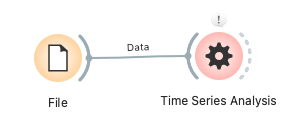

# Time Series Plot

A widget for visualizing time series data and performing analyses such as trends, seasonality, and forecasting.

## Inputs

-   `Data`: An Orange Table object containing time series data.
    -   **Specifications**:
        -   Requires at least one time variable. Orange's `TimeVariable` type is recommended, but `ContinuousVariable` (numerical, assumed internally as a timestamp) or `StringVariable` (string type with common date/datetime formats like `%Y-%m-%d` or `%Y-%m-%d %H:%M:%S`) will also be attempted to be interpreted as time.
        -   Requires at least one numerical variable (`ContinuousVariable`) as values.
    -   **Example Input Data**:
        The following is an example of a table containing daily sales and inventory data.

        | Date (TimeVariable) | Sales (ContinuousVariable) | Inventory (ContinuousVariable) |
        | :------------------ | :------------------------- | :----------------------------- |
        | 2023-01-01          | 120.5                      | 300                            |
        | 2023-01-02          | 122.3                      | 295                            |
        | 2023-01-03          | 118.0                      | 310                            |
        | ...                 | ...                        | ...                            |

## Outputs

-   `Selected Data`: Data points selected by a drag operation on the graph. The data within the selected range is outputted as an Orange Table object.
-   `Forecast Data`: A Table object containing the forecast results from Prophet. In addition to the original data columns, the following columns are added for each forecasted target variable (if they exist). It also includes the timestamp and a readable datetime for the forecast points.
    -   `time`: Timestamp of the original and forecast data (in milliseconds).
    -   `time_readable`: The `time` column converted to a human-readable datetime format (`YYYY-MM-DD HH:MM:SS`).
    -   `[Original Variable Name]`: Values of the original time series data.
    -   `[Original Variable Name]_forecast`: Forecasted value by Prophet (yhat).
    -   `[Original Variable Name]_forecast_lower`: Lower bound of the confidence interval for the forecast value (yhat_lower).
    -   `[Original Variable Name]_forecast_upper`: Upper bound of the confidence interval for the forecast value (yhat_upper).

## Feature Description

The Time Series Plot widget consists of two main parts: the control area and the graph display area.

### Control Area

In the control area, you specify data, display methods, and analysis tool settings.

#### 1. Data Settings

-   **Time Column**: Select the column to be used as the time axis for the plot. Choose the appropriate time variable from your dataset from the dropdown list.
-   **Value Column(s)**: Select the numerical data column(s) to plot. You can select one or more numerical variables from the list (multiple selections allowed).

#### 2. Display Settings

-   **Graph Type**:
    -   `Line Chart`: Displays time series data connected by lines (default).
    -   `Scatter Plot`: Displays time series data as individual points.
-   **Aggregation Period**: Select the aggregation unit for the data.
    -   Options: `Second`, `Minute`, `Hour`, `Daily` (default), `Weekly`, `Monthly`, `Quarterly`, `Yearly`.
    -   Data is aggregated by the average value for the selected period and displayed.
-   **Show Tooltips and Grid Lines**:
    -   If checked, detailed information (date, value, etc.) is displayed when hovering over data points on the graph, and grid lines are shown on the graph (on by default).
-   **Zoom with Scroll**:
    -   If checked, allows zooming in and out by operating the mouse wheel on the graph (off by default).
-   **Enable Selection**:
    -   If checked, allows selecting a data range by dragging the mouse on the graph and sending that data through the `Selected Data` output (on by default).
-   **Graph Style**:
    -   **Line Width**: Adjust the line width for line charts using a slider (1-10, default 2).
    -   **Point Size**: Adjust the point size for scatter plots using a slider (2-20, default 8).

#### 3. Analysis Tools

-   **Show Trendline**:
    -   If checked, a trendline based on linear regression is displayed as a dashed line for each selected value column.
-   **Moving Average**:
    -   If checked, a moving average line is displayed.
    -   **Window Size**: Specify the period (window) for calculating the moving average numerically (2-30, default 7).
    -   **Unit**: The unit for the window size (e.g., `days`) is displayed in conjunction with the "Aggregation Period".
-   **Seasonality Decomposition**:
    -   If checked, decomposes the time series data into trend, seasonality, and residual components, and displays each as a separate graph below the main plot.
    -   **Period**: Specify the period of seasonality numerically (2-365, default 7). For example, for daily data with weekly seasonality, specify 7. The unit is the number of steps of the "Aggregation Period".
-   **Prophet Forecasting**: Performs time series forecasting using the Prophet library developed by Facebook.
    -   If checked, forecast-related settings become active.
    -   **Training period**:
        -   `Auto (use all data)`: Uses the entire period of the input data for model training (default).
        -   `Custom`: Specify the start and end dates for the data used for training using sliders.
    -   **Forecast horizon (steps)**: Specify how many steps ahead to forecast numerically (1-1825 (equivalent to 5 years), default 30). The unit of steps will be what is selected in "Aggregation Period" (e.g., 30 days ahead if aggregation period is daily, 30 weeks ahead if weekly).
    -   **Show confidence interval**:
        -   If checked, the confidence interval for the forecast values is displayed on the graph (on by default).
        -   Select the confidence level from the dropdown list (`80%`, `90%`, `95%` (default), `99%`).
    -   **Show changepoints**:
        -   If checked, changepoints in the trend detected by Prophet are displayed on the graph (on by default).
        -   **Prior scale**: Adjusts the sensitivity of changepoint detection (0.001-0.5, default 0.05). Larger values make it easier to detect more changepoints.
    -   **Seasonality Details**:
        -   **Yearly Seasonality**: Whether to consider yearly seasonality (`True`, `False`, `Auto` (default)). `False` or `Auto` may be recommended for data in hour/minute/second units.
        -   **Weekly Seasonality**: Whether to consider weekly seasonality (`True`, `False`, `Auto` (default)). `False` or `Auto` may be appropriate for very short-term data (e.g., second-level data over a few hours).
        -   **Daily Seasonality**: Whether to consider daily seasonality (`True`, `False`, `Auto` (default)). Relevant for data spanning multiple days, especially hour/minute unit data.
    -   **Custom Seasonalities**:
        -   Add custom seasonality patterns with the `Add Custom Seasonality` button.
            -   **Name**: Name of the seasonality (e.g., `monthly`).
            -   **Period**: Period of the seasonality (number of steps). Unit depends on "Aggregation Period".
            -   **Fourier Order**: Order of the Fourier series for modeling seasonality.
            -   **Prior Scale**: Scale of the prior distribution for seasonality strength (default 10.0).
            -   **Mode**: Type of seasonality (`additive` (default) or `multiplicative`).
    -   **Outliers and Growth Model**:
        -   **Enable Outlier Capping (Logistic Growth only)**: When using logistic growth model, enables outlier handling by capping values exceeding the specified Cap/Floor (off by default).
        -   **Growth Model**: Select the growth model for the trend (`linear` (default) or `logistic`).
        -   **Cap (Upper limit for logistic growth)**: Upper limit for logistic growth model. Active if `Enable Outlier Capping` is on and `Growth Model` is `logistic`.
        -   **Floor (Lower limit for logistic growth, optional)**: Lower limit for logistic growth model. Active if `Enable Outlier Capping` is on and `Growth Model` is `logistic`.
    -   **Run Forecast**:
        -   Trains the forecast model based on the above settings and displays the forecast results on the graph and sends them from the `Forecast Data` output.

### Graph Display Area

-   **Main Plot**:
    -   Displays selected time series data, trendlines, moving average lines, Prophet forecast results, etc.
    -   If multiple value columns are selected, they are plotted in different colors.
    -   A legend is displayed in the upper right, allowing identification of each series.
-   **Seasonality Decomposition Plots** (displayed only if "Seasonality Decomposition" is enabled):
    -   Below the main plot, trend, seasonality, and residual components are displayed as individual graphs.
    -   This allows for a detailed understanding of the data's structure.

    

-   **Tooltips**:
    -   If "Show Tooltips and Grid Lines" is enabled, hovering the mouse cursor over a data point on the graph displays the date (or time) and value of that point, as well as moving average or forecast values if displayed. Simultaneously, a red vertical dashed line following the mouse position is shown.
-   **Interactions**:
    -   Zoom: If "Zoom with Scroll" is enabled, mouse wheel can be used for zooming. If disabled, zoom operations are done via the graph's right-click menu.
    -   Pan: The graph can be moved by dragging with the left mouse button (if "Enable Selection" is disabled or not in selection mode).
    -   Data Selection: If "Enable Selection" is enabled, a rectangular range can be selected by dragging with the left mouse button, and data points within the range can be outputted as `Selected Data`. Selected points are highlighted on the graph.

## Usage Example

1.  **Basic Time Series Data Visualization**:
    -   Load time series data (e.g., `air_quality.csv`) using the `File` widget.
    -   Connect the output of the `File` widget to the `Data` input of the `Time Series Plot` widget.
    -   Open the `Time Series Plot` widget and select the appropriate "Time Column" and one or more "Value Column(s)" in "Data Settings".
    -   Adjust "Graph Type" or "Aggregation Period" in "Display Settings" to view the data.

2.  **Seasonality Analysis**:
    -   With the setup from step 1, check "Seasonality Decomposition" in "Analysis Tools".
    -   Set the "Period" according to the data's characteristics (e.g., 7 for daily data with weekly seasonality, 12 for monthly data with yearly seasonality).
    -   Graphs for trend, seasonality, and residuals will be displayed below the main plot, allowing you to examine periodic variations in the data.
        (Image reference: `../../_images/TimeSeriesPlot-Seasonality.png` - Image of seasonality decomposition display)

3.  **Future Forecasting**:
    -   With the setup from step 1, check "Prophet Forecasting" in "Analysis Tools".
    -   Set parameters such as "Forecast horizon" and "confidence interval". Seasonality patterns and growth models can also be adjusted in advanced settings.
    -   Click the "Run Forecast" button. Future forecast values based on the training data will be drawn on the graph, and the forecast results will be outputted from the `Forecast Data` port.
    -   This `Forecast Data` can also be connected to another `Data Table` widget to view specific numerical values.

## Detailed Logic

-   **Data Processing**:
    -   Extracts the specified time and value variables from the input Orange Table (`extract_time_series_data`). The time variable is internally treated as a timestamp in milliseconds.
    -   Aggregates the data based on the selected "Aggregation Period" (`aggregate_time_series_data`). The pandas library is used internally for aggregation.
-   **Seasonality Decomposition**:
    -   Uses the `statsmodels.tsa.seasonal.seasonal_decompose` function to additively decompose the time series data into trend, seasonality, and residuals (`decompose_time_series`).
-   **Prophet Forecasting**:
    -   Uses Facebook's `prophet` library to build a time series forecasting model and make predictions (`run_prophet_forecast`). Parameters set by the user, such as training period, forecast horizon, confidence interval, changepoint sensitivity, seasonality details, growth model, and custom seasonalities, are passed to the model.
-   **Graph Drawing**:
    -   The `pyqtgraph` library is used for drawing graphs.
    -   A `DateAxisItem` is used for the time axis to display dates and times appropriately.
    -   Interactive elements such as tooltips, legends, and selection rectangles are also implemented using `pyqtgraph` features.
    -   The results of seasonality decomposition are displayed as multiple subplots dynamically added below the main plot.