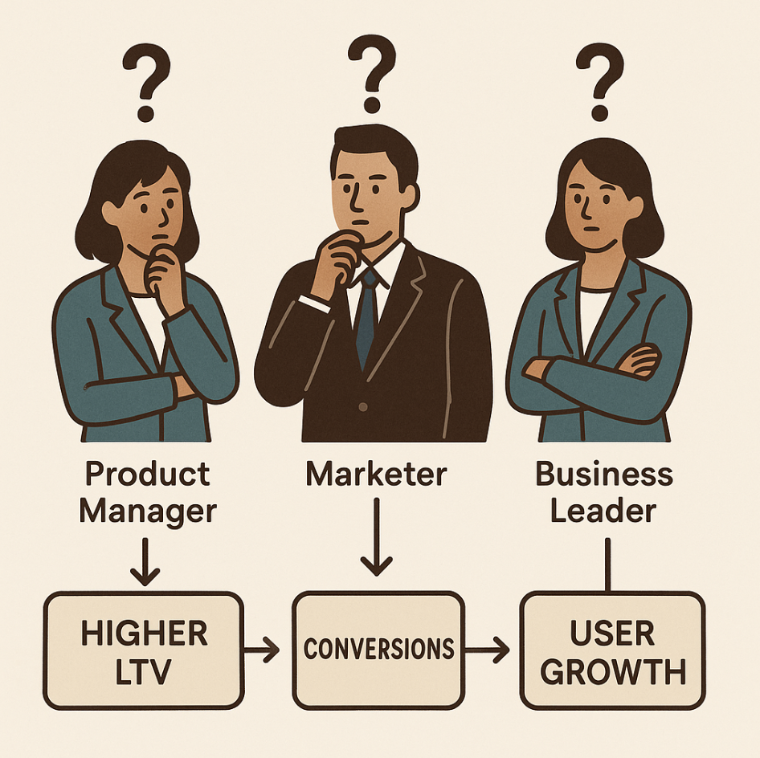
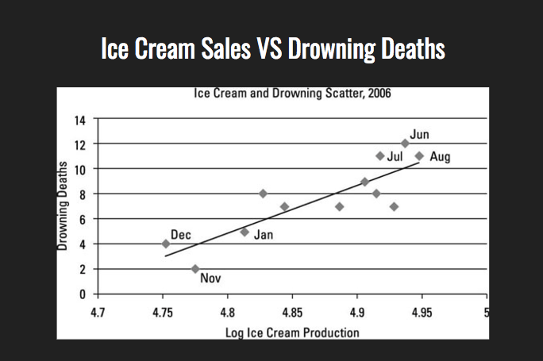
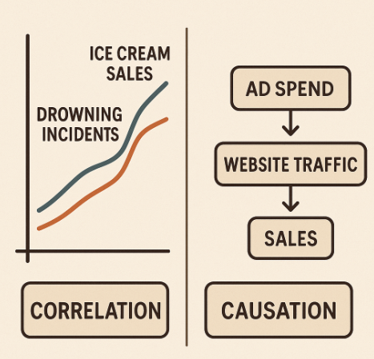
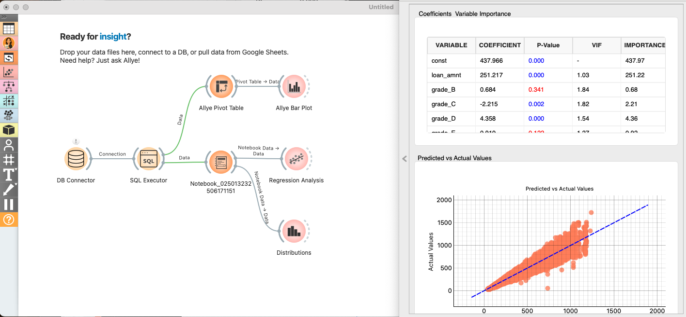

# Introduction to Causal Inference: Unlocking the "Why" Behind Your Data

## What is Causal Inference, and Why Do You Need It?

Your work is filled with questions of cause and effect. Whether you're a product manager, a marketer, a researcher, or a business leader, you constantly grapple with understanding the impact of your decisions.

-   **Product managers** wonder: "How can we design a feature that truly improves user satisfaction and Lifetime Value (LTV)?"
-   **Marketers** ask: "Which campaign is most effective at driving conversions, and why?"
-   **Business leaders** need to know: "What strategies will lead to sustainable growth?"

You want to understand your customers to find inspiration that makes an impact. What causes users to grow? What pain points lead them to churn? How can you build genuine loyalty?

All these are questions about causality. Your professional life is a continuous quest to find clear answers to these causal questions. Modern data analysis, specifically the field of **Causal Inference**, sheds light on these very challenges. While it's not a magic wand, it's a powerful framework that can bring evidence and confidence to your ideas.

  

## Beyond Correlation: The Power of Causal Inference

You've probably heard the phrase "correlation does not imply causation." It's easy to find patterns in data, but it's much harder—and much more valuable—to determine which patterns represent true cause-and-effect relationships.

A classic example is the correlation between ice cream sales and drowning incidents. The data shows a strong positive correlation: as ice cream sales increase, so do drowning deaths. But does eating ice cream cause people to drown? Of course not. The real cause is a lurking variable: hot weather. High temperatures lead to both more people buying ice cream and more people swimming, which in turn leads to a higher number of drowning incidents.

  

Now, let's bring this back to your business. That correlation between marketing spend and sales? It could be a genuine causal link, but it could also be a spurious correlation driven by a seasonal peak, just like the ice cream example. **Are you certain you can tell the difference for your key business questions?**

Answering this is the key to making better decisions and avoiding costly mistakes.

Causal inference provides the tools to move beyond simple correlations and investigate the underlying mechanisms that drive your business outcomes. It helps you distinguish between a coincidental relationship and a genuine causal link.

  

## What You'll Learn in This Course

This course is a practical guide to applying causal inference to your daily work. Using **Allye**, a no-code analytics platform, you'll learn by doing, working through five real-world case studies that progressively build your skills.

### Course Syllabus: From Theory to Practice

- **[Case Study 1: Validating a New Feature's Impact with A/B Testing (RCT)](./case_study_1_rct.md)**  
  *Topic: Testing the effect of a new feature on user engagement.*  
  Learn to design, execute, and analyze a Randomized Controlled Trial (RCT) to uncover the true causal impact of your product decisions.

- **[Case Study 2: Improving Newsletter Performance with Propensity Score Matching](./case_study_2_propensity_score.md)**  
  *Topic: Improving a marketing newsletter.*  
  Estimate the causal effect of a newsletter subscription on user behavior by using propensity score matching to create a fair comparison.

- **[Case Study 3: Understanding User Retention with Causal Forests](./case_study_3_causal_forests.md)**  
  *Topic: Unpacking the mechanics of "come back" user retention.*  
  Go beyond average effects and use Causal Forests to discover what drives retention for different user segments.

- **Case Study 4: Evaluating Store Layout Changes with Difference-in-Differences (DID)**  
  *Topic: Measuring the impact of a new store layout.*  
  Assess the impact of a store redesign by applying the DID method to compare outcomes before and after the change.

- **Case Study 5: Measuring Campaign Impact with Causal Impact**  
  *Topic: Analyzing the effect of a large-scale marketing campaign.*  
  Isolate the true effect of a major marketing campaign from market trends using the Causal Impact method.

By the end of this course, you will have hands-on experience with key causal inference techniques and the confidence to apply them to your own business challenges, turning data into decisive action.

Our goal is to empower you to use causal inference as a reliable tool in your business and research, enabling you to uncover the "why" behind your data and drive meaningful results.

  

