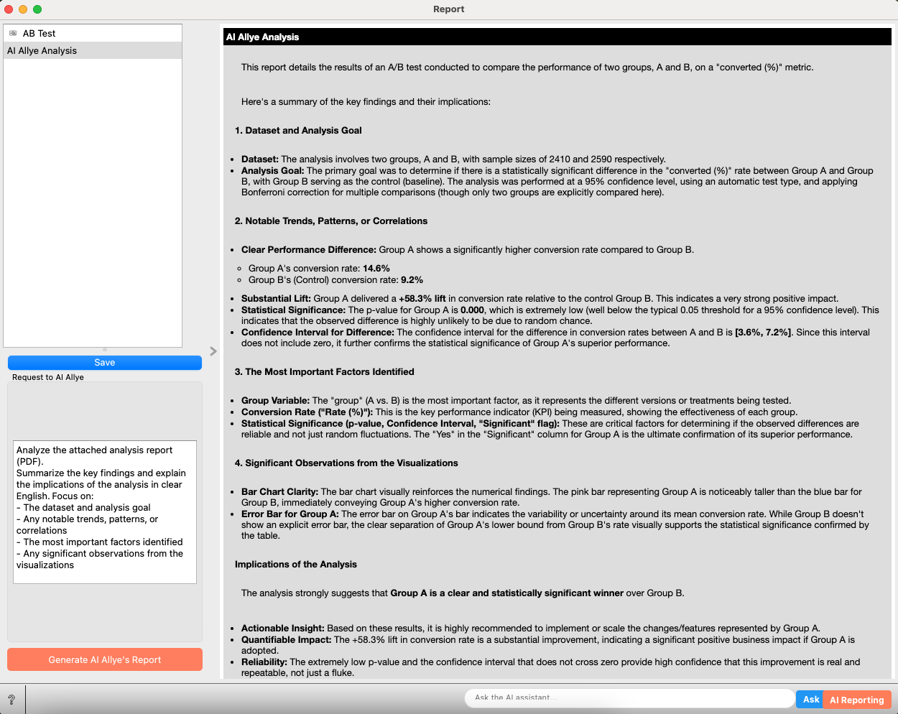

# Case Study 1: Validating a New Feature's Impact with A/B Testing (RCT)

## What You'll Learn in This Case Study

You are a product manager aiming to improve the conversion rate of your website's sign-up page. Inspired by a success story at another company, you have an idea for a new button design that you think will lead to more sign-ups. However, you know that what works elsewhere isn't guaranteed to work for your own users. Before implementing the change for everyone, you want to test it on a small group to see how they react and confirm its effect. A wrong move could hurt your conversion rate and set back your goals.

In this case study, you'll learn how to use **A/B Testing (Randomized Controlled Trial, RCT)**, the "gold standard" in causal inference, to scientifically validate the true effect of a design change on user conversion.

Specifically, you will practice the following steps:

-   Understand what an RCT is and why it's a reliable method.
-   **Design an RCT** to measure the impact of a new button design.
-   **Analyze the result** using statistical tests to determine if the difference is significant.
-   **Use Allye** to implement the analysis and interpret the results.
-   Learn the **real-world challenges** of RCTs and bridge to the next steps.

By the end of this session, you will have a powerful tool to make data-driven decisions with confidence.

 

## What is an A/B Test (RCT)?

An A/B Test, known in scientific fields as a Randomized Controlled Trial (RCT), is an experimental method used to compare two or more versions of something to see which one performs better. The core principle is **random assignment**.

Imagine you have two versions of a webpage (Version A and Version B). You randomly show Version A to one group of users and Version B to another. Then, you measure which version was more effective in achieving a specific goal, such as getting users to click a button.

  

By assigning users randomly, you ensure that the groups are, on average, identical in all aspects—age, location, interests, etc. This means that any difference in their behavior (like the click-through rate) can be attributed directly to the change you made between Version A and Version B. It's a simple yet powerful way to establish a cause-and-effect relationship.

 

## Why is A/B Testing (RCT) Reliable?

As we've just seen, the power of RCT lies in **randomization**. Let's revisit the concept from the [Introduction](Introduction.md) that "correlation does not imply causation."

A common mistake is to observe a correlation and assume causation. For example, you might see that users who use a certain feature have a lower churn rate. It's tempting to conclude the feature prevents churn. However, those users might just be more loyal or engaged from the start. This pre-existing characteristic is a **confounding factor**.

  

RCTs solve this problem. By randomly assigning users to a "treatment group" (who see the new version) and a "control group" (who see the old version), you balance out all confounding factors, both known and unknown.

  

If a difference in outcomes emerges between the groups, you can be confident that it was caused by the change you introduced. This is why RCT is considered the most reliable method for establishing causality.

 

## How to Analyze A/B Testing Result

Once an A/B test concludes, you have the data. But simply comparing the raw numbers—say, Group A had a 10% conversion rate while Group B had 8%—isn't enough. Is that 2% difference a real improvement, or just random luck?

This is the question that **statistical testing** answers. By applying tests like the t-test or chi-squared test, we can determine the probability that the observed difference happened by chance alone. This probability is called the **p-value**.

A low p-value (typically < 0.05) indicates the result is **statistically significant**. This gives you confidence that your change actually caused the outcome, allowing you to make a data-driven decision instead of just guessing.

## Designing an RCT: Will a New Button Design Improve CVR?

You are a product manager for an e-commerce site, and you hypothesize that changing the design of the "Sign Up" button on your landing page will increase the number of new user registrations. Let's design an RCT to test this.

**1. Clarifying the Hypothesis**
- **Hypothesis**: A new, more prominent "Sign Up" button will increase the user conversion rate.
- **Causal Relationship to Verify**: Does the new button design (cause) lead to a higher sign-up rate (effect)?

**2. Defining Target Users and Key Performance Indicator (KPI)**
- **Target**: All new visitors to the landing page.
- **Key Performance Indicator (KPI)**: Conversion Rate (CVR), defined as the percentage of users who click the "Sign Up" button.

**3. Group Assignment (Randomization)**
- **Treatment Group (A)**: Sees the landing page with the **new** button design.
- **Control Group (B)**: Sees the landing page with the **existing** button design.

*Important: The assignment to either group must be completely random for every new visitor.*

**4. Experimental Period**
- To get reliable results without slowing down decision-making, you need to choose the right duration. For a high-traffic page, a shorter period might be enough. Let's set the experiment to run for **two weeks**.

 

## Analyzing with Allye

After two weeks, you have collected data on which version each user saw and whether they converted (clicked "Sign Up").

[Download the sample data here](./sample_data/rct_cvr_data.csv)

Now, let's use Allye to analyze if there is a statistically significant difference in CVR between the two groups.

**Analysis Steps**

1.  **Load Data**: First, we need to bring our collected data into the analysis environment.
  - Drag & Drop your `rct_cvr_data.csv` file to the canvas.

  

  - By connecting to `Data` widget, you can see the raw data.

  

2.  **EDA: Confirming Randomization Worked**: Before we compare the outcomes, we must verify that the random assignment was successful. This means checking if the two groups are balanced on key characteristics (e.g., age, region). If the groups are similar, we can be confident that any difference in conversion rates is due to our change, not pre-existing differences between the groups.
  - Create and connect to `Distribution` widget and check Age distribution.
    - Select `age` in *Variable*
    - Select `Normal` in *Fitted Distribution*
    - Select `group` in *Split by*
    - You can see that the blue and red distributions completely overlap, indicating there is no difference in age distribution between the two groups. This confirms that the assignment is fair with respect to user age.

  

  - Create and connect to `Box Plot` widget to check Region and Acceess Time difference. 
    - Select `access_time` in *Variable*
    - Select `group` in *Subgroups*
    - The box plot shows that the distribution of access_time is similar between the two groups. To statistically confirm this, we performed a chi-squared test, which resulted in a p-value of 0.74 (much greater than 0.05). This indicates that there is no significant difference in access_time between the groups, confirming that the randomization was successful with respect to this variable.

  

3.  **Analyze A/B Test Result**: Now for the core of our analysis. We need to use a statistical test to determine whether the observed difference in conversion rates is significant or if it could have simply occurred by chance.
  - Create and connect to the `AB Test` widget.
    -   Select `group` as the `Treatment Variable`.
    -   Select `B` as the `Control Group`.
    -   Select `converted` as the `Target Variable` (1 if the user signed up, 0 otherwise).

  

4.  **Check the Results**: The widget automatically runs the appropriate statistical test (in this case, a Chi-square test) and displays the results. Here's how to interpret them based on the output in the image:
  -   **Lift**: This shows a **relative lift** of +58.3%, meaning the new design improved the conversion rate by 58.3% compared to the control group.
  -   **p-value**: The p-value is 5.16e-09, which is much smaller than the standard 0.05 threshold. This indicates that the observed difference is statistically significant and not just due to random chance.
  -   **Significant**: The checkmark in the `Significant` column gives you an at-a-glance confirmation that the result is significant.
  -   **Confidence Interval**: The confidence interval for the improvement is [3.6%, 7.2%]. This means we can be 95% confident that the new design increases the conversion rate by an amount in this range.

  

5. (optional) Add **AI Report**: 
If you are uncertain about interpreting the statistical analysis or need to share the results with non-technical people, the AI Report feature can help. It uses AI to analyze the findings and generate a report with clear explanations. You can export this report as a PDF, HTML, or Markdown file for easy sharing.
  - Click the `AI Reporting` button and edit the `Request to AI Allye` prompt in the `Report` widget.

  

  - Check `AI Allye's Report`. Click `Save` button if necessary.

  

## Making Decisions

With the analysis complete, we have several key findings that lead to a clear decision:

1.  **Randomization was Successful**: Our exploratory data analysis (EDA) confirmed that users were correctly assigned to each group at random, ensuring a fair comparison.
2.  **The New Design Won**: The A/B test showed a clear, statistically significant increase in the conversion rate for the new button design. This lift was not a result of random chance.
3.  **AI Confirms the Decision**: The AI Allye report interpreted these results and also recommended rolling out the feature, giving us a final layer of confidence.

From these results, you can conclude:

"The new button design increased the conversion rate by 5.4 percentage points, a 58.3% lift. This result is statistically significant (p < 0.05) and is highly unlikely to be due to random chance. We can confidently decide to **roll out the new button design to all users**."

 

## Real-World Hurdles and Beyond

While powerful, RCT is not a panacea.

-   **Cost and Resources**: Running experiments requires engineering effort to build and maintain different versions of your product.
-   **Time**: While we used a two-week period, some experiments need to run longer to collect enough data, especially for subtle effects. This can **slow down the speed of business decision-making**, creating a trade-off between confidence and agility.
-   **Ethical Issues**: It can be unethical to withhold a potentially beneficial treatment (like in medicine) from a control group.
-   **Business Constraints**: Sometimes it's not feasible or fair to offer different experiences to users, such as with pricing.

So, what should we do when an RCT is not an option? We often have to rely on **observational data**—the data generated from users' everyday interactions with a product. Can we still estimate causal effects from this data?

**Yes, we can.** The next case studies will introduce you to powerful techniques for doing just that, starting with **Propensity Score Matching**.

---
> [Next: Case Study 2: Measuring the Impact of a Newsletter with Propensity Score Matching](./case_study_2_propensity_score.md)
