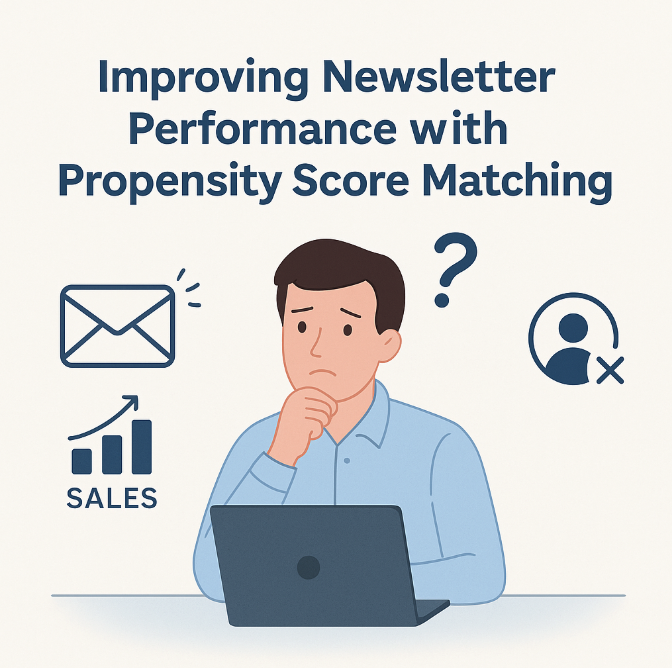
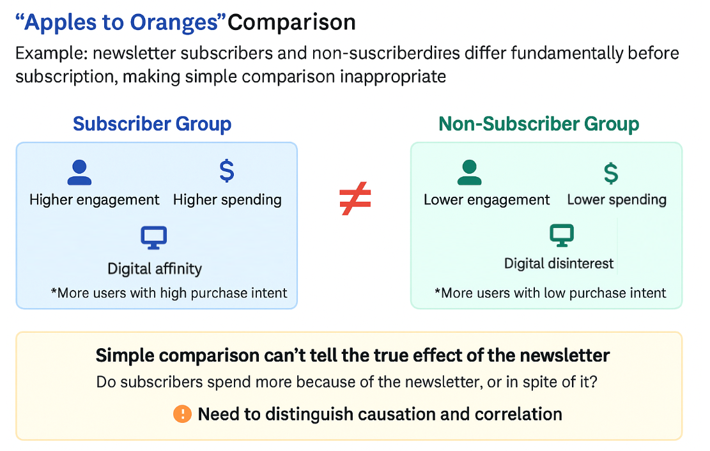
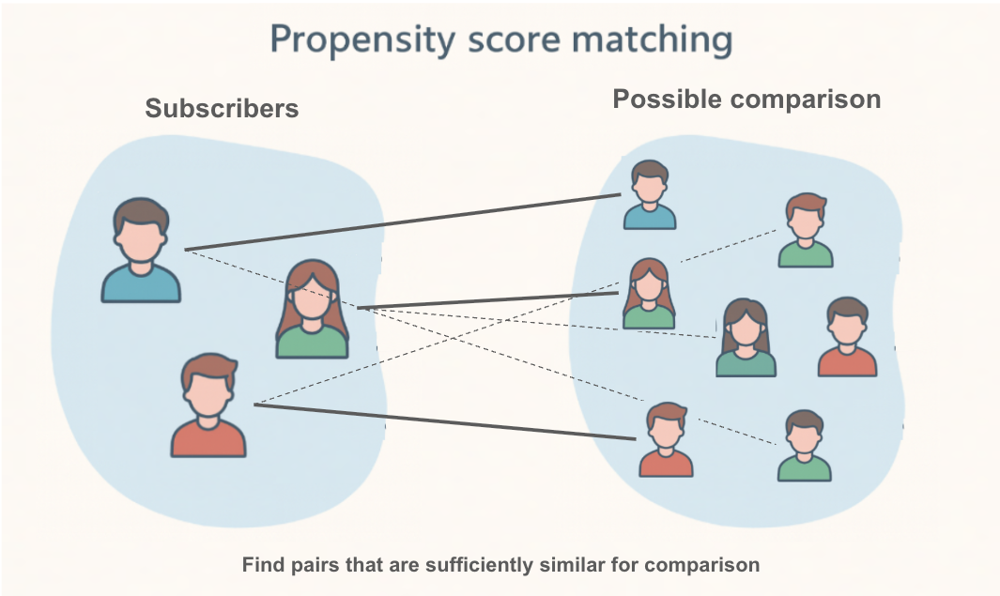
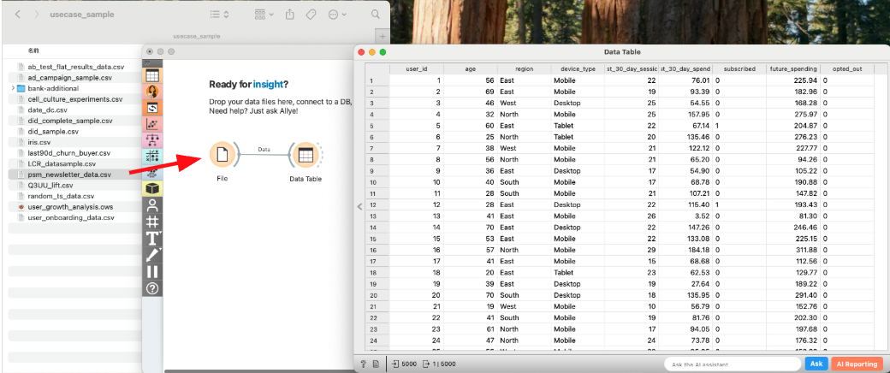
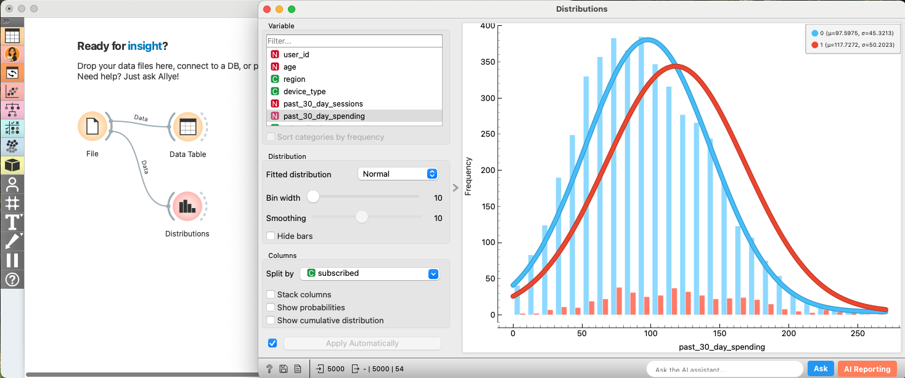
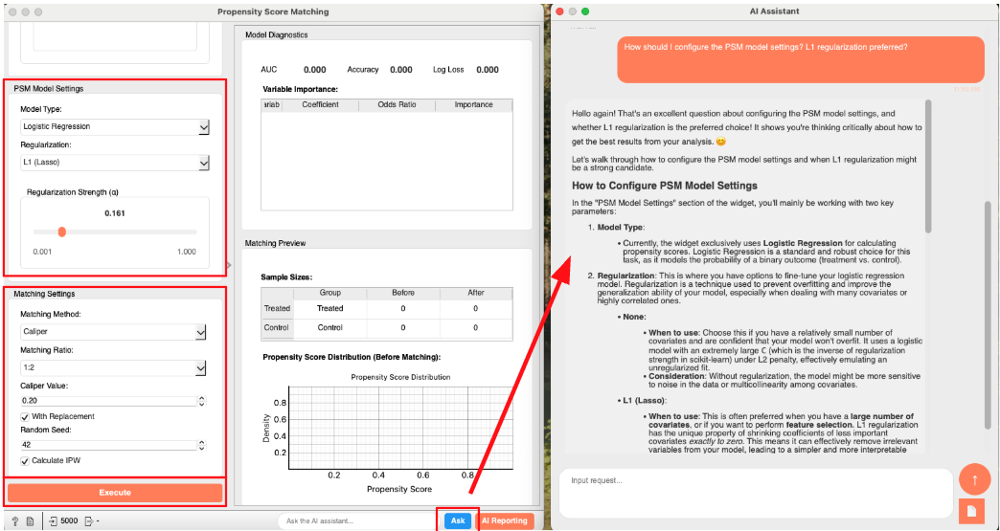
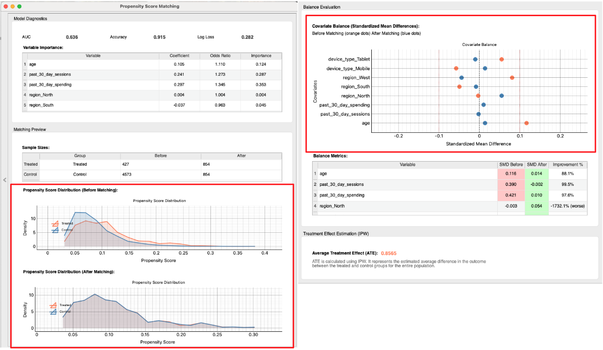
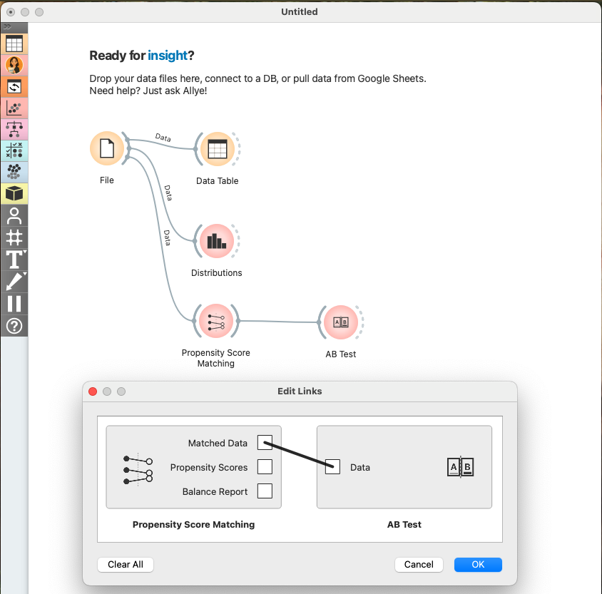
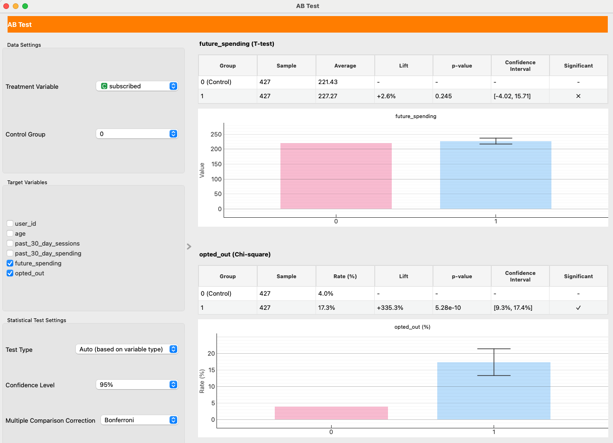

# Case Study 2: Improving Newsletter Performance with Propensity Score Matching

## What You'll Learn in This Case Study

In the [previous case study](./case_study_1_rct.md), we saw how A/B testing (RCT) is the gold standard for establishing causality. However, running an RCT isn't always possible. So, what happens when you can't run an experiment but still need to understand the impact of your actions?

Imagine you're a marketer who launched a newsletter. While it's a great tool for engagement, you're aware that sending it too frequently can bother users and harm the overall experience. You see that subscribers tend to buy more products, but you can't be sure if the newsletter is *causing* this increase. Is it driving sales, or just annoying your customers and leading to opt-outs? This is a classic problem that arises from using **observational data**.

  

In this case study, you'll learn how to use **Propensity Score Matching (PSM)**, a powerful technique to untangle these effects and estimate the true causal impact when an RCT isn't an option.

Specifically, you will practice the following steps:

-   Understand the challenge of **selection bias** in observational data.
-   Learn the intuition behind **Propensity Score Matching (PSM)** and how it creates a "fair" comparison.
-   **Design an analysis** to measure the impact of a newsletter on user spending and opt-out rates.
-   **Use Allye** to implement PSM and interpret the results.
-   Learn the **real-world limitations** of PSM.

By the end of this session, you'll have a method to find causal insights from the data you already have.

 

## The Challenge: Apples to Oranges Comparison

The biggest hurdle with observational data is **selection bias**. Unlike in an RCT where users are randomly assigned to groups, in the real world, users *select themselves* into groups.

For example, users who choose to subscribe to a newsletter are likely different from those who don't. They might be more interested in your brand, more tech-savvy, or have higher incomes. These underlying differences are **confounding factors**.

  

If you simply compare the average spending of subscribers and non-subscribers, you're making an "apples to oranges" comparison. You can't tell if a difference in spending is due to the newsletter itself or due to these pre-existing differences. Your conclusion will be biased and unreliable.

 

## The Solution: Propensity Score Matching (PSM)

So how can we create a fair comparison? This is where Propensity Score Matching comes in.

The core idea of PSM is to find, for every subscriber (the "treatment group"), a non-subscriber (the "control group") who looked **almost identical** *before* they decided to subscribe. If we can create a control group that is perfectly comparable to our treatment group across all key characteristics (like age, past purchases, browsing activity), then any difference in their future outcomes can be more confidently attributed to the newsletter.

  

**How does it work?**

1.  **Calculate the Propensity Score**: First, we build a statistical model (usually logistic regression) to calculate the "propensity score" for every single user. The propensity score is the probability of a user subscribing to the newsletter, given their characteristics (e.g., age, region, past behavior).
    - *A user with a high score is someone who, based on their profile, was very likely to subscribe.*
    - *A user with a low score was unlikely to subscribe.*

2.  **Match Users**: Next, PSM takes each user in the treatment group (subscribers) and finds a user in the control group (non-subscribers) who has a very similar propensity score. It's like finding a "statistical twin."

By doing this for everyone in the treatment group, we create a new, smaller control group that is well-balanced with the treatment group. We have turned an "apples to oranges" comparison into a much fairer "apples to apples" comparison. Now, we can analyze the difference in outcomes between these two matched groups to estimate the causal effect of the newsletter.

 

## Designing the Analysis: Does a Newsletter Increase Sales or Just Annoy Users?

You are a marketer for an e-commerce site. You want to know if subscribing to your weekly newsletter causes an increase in customer spending, or if it's actually driving users away.

**1. Clarifying the Hypothesis**
- **Hypothesis**: Subscribing to the newsletter does not significantly increase user spending but does increase the rate at which users opt-out of communications.
- **Causal Relationships to Verify**: 
    1. Does subscribing to the newsletter (cause) lead to higher spending (effect)?
    2. Does subscribing to the newsletter (cause) lead to a higher opt-out rate (effect)?

**2. Defining Target Users and Key Performance Indicators (KPIs)**
- **Target**: All active users.
- **Key Performance Indicators (KPIs)**: 
    1. Total user spending in the 90 days following the observation period.
    2. Newsletter opt-out rate.

**3. Data for Propensity Score Calculation (Covariates)**
- To create a fair comparison, we need to account for factors that might influence both the decision to subscribe and the outcomes.
- **Covariates**: `age`, `region`, `device_type`, `past_30_day_sessions`, `past_30_day_spending`.

 

## Analyzing with Allye

You have collected data on your users, including their characteristics, whether they subscribed, their subsequent spending, and if they opted out.

[Download the sample data here](https://raw.githubusercontent.com/Llenar70/allye-doc/main/course/sample_data/psm_newsletter_data.csv)

Let's use Allye to see what the true impact of the newsletter was.

**Analysis Steps**

1.  **Load Data**: Drag & Drop your `psm_newsletter_data.csv` file to the canvas and view it with a `Data` widget.

  

2.  **EDA: Confirming Selection Bias (Before Matching)**: Let's first confirm that subscribers and non-subscribers are different.
  - Connect a `Distribution` widget. Select `past_30_day_spending` as the *Variable* and `subscribed` as *Split by*.
  - You'll likely see that the "Subscribed" group already had higher spending in the past. This is the selection bias we need to fix.

  

3.  **Apply Propensity Score Matching**: Now, let's use PSM to create balanced groups.
  - Create and connect to the `Propensity Score Matching` widget.
    - Select `subscribed` as the `Treatment Variable` and `0` as the `Control Group`.
    - Select `age`, `region`, `device_type`, `past_30_day_sessions`, and `past_30_day_spending` as the `Covariates`.

  

  - Select `Logistic Regression` and `L1 (Lasso)` in both `Model Type` and `Regularization`.
  - You can proceed with the default settings in the `Matching Settings` area.
  - (optional) If you are unsure about the meaning of any option, click the "Ask" button at the bottom right of the widget to ask AI Allye. She not only understands the widget's spec but also has deep expertise in statistical analysis.

  

4.  **Check the Matching Results**: The widget performs the matching and provides several diagnostic tools to assess the quality of the match. A good match is crucial for a reliable causal estimate.
    - **Propensity Score Distribution**: First, examine the "Propensity Score Distribution" plots.
        - *Before Matching*: You can see two distinct distributions. The subscribers (Treated) and non-subscribers (Control) have different profiles, confirming the initial selection bias.
        - *After Matching*: The two distributions now almost completely overlap. This is strong visual evidence that we have created a control group that is very similar to the treatment group in terms of their likelihood to subscribe.
    - **Covariate Balance (Love Plot)**: Next, look at the "Covariate Balance" plot (often called a Love Plot). This plot shows the "Standardized Mean Difference" (SMD) for each covariate before and after matching. A smaller SMD means the groups are more similar.
        - *Before Matching (Orange Dots)*: You can see that variables like `past_30_day_spending` and `past_30_day_sessions` have a large SMD, indicating significant imbalance.
        - *After Matching (Blue Dots)*: All dots are now very close to the zero line. This confirms that the matching process has successfully balanced the characteristics between the treatment and control groups. PSM was successful!

  

5. **Estimate Causal Effect**: Now that we are confident in our matched groups, we can proceed to estimate the causal effect.
  - Create and connect to the `AB Test` widget. Select `Matched Data` in `Edit Links` dialog.

  

  - Configure AB Test widget as shown in the image below and check the results.

  

  - **Causal Effect on Spending**: We set `future_spending` as the `Target Variable`. The result shows an **ATT (Average Treatment Effect on the Treated)** of +2.6%. This small effect, combined with a high p-value of 0.25, indicates there is **no statistically significant impact** on user spending. The newsletter does not cause users to spend more.
  - **Causal Effect on Opt-Out Rate**: We also set `opted_out`. Here, the result is starkly different. The p-value far below 0.05. This is a statistically significant result, indicating that subscribing to the newsletter *increases* the probability of a user opting out.

## Making Decisions

Our analysis provides a clear, data-driven story:

1.  **Selection Bias Was Present**: We confirmed that subscribers were initially different from non-subscribers. A naive comparison would have been misleading.
2.  **PSM Created a Fair Comparison**: The matching process successfully created a balanced control group.
3.  **The Newsletter Failed**: After balancing the groups, we found two key results:
  - It has **no causal impact on sales**.
  - It causes a **statistically significant increase in opt-outs**.

With this evidence, you can confidently state:

"After correcting for selection bias, our analysis shows the newsletter has no impact on user spending. Worse, it directly causes a 9–17% increase in the opt-out rate, meaning we are actively driving users away. The current strategy is not working. The decision is to **halt the current newsletter campaign and re-evaluate its content and frequency** to provide more value and reduce user churn."

 

## Real-World Hurdles and Beyond

PSM is a fantastic tool, but it's not magic. It has one major limitation:

-   **Unobserved Confounding**: PSM can only balance the variables you *observe*. If there's a critical, unobserved factor that influences both subscribing and the outcomes (e.g., a user's underlying "brand loyalty"), your results could still be biased. This is the key advantage of an RCT, which balances *both known and unknown* confounders.

Our analysis of the *average* effect led us to pause the campaign. But what if the newsletter was actually very effective for a small segment of users, while being ineffective or annoying for the majority? If we could identify that successful segment, we could create a more targeted, valuable campaign. To answer this, we need to understand the **heterogeneous effect**—how the impact varies across different users. This is where we move beyond average impacts.

In the next case study, we'll explore **Causal Forests**, a machine learning-based method that can uncover how treatment effects vary across different user segments.

---
> [Next: Case Study 3: Understanding User Retention with Causal Forests](./case_study_3_causal_forests.md)
