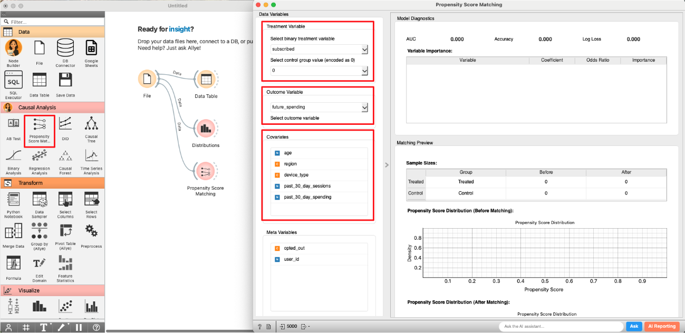

# Case Study 2: Improving Newsletter Performance with Propensity Score Matching

## What You'll Learn in This Case Study

In the [previous case study](./case_study_1_rct.md), we saw how A/B testing (RCT) is the gold standard for establishing causality. However, as we discussed, running an RCT isn't always possible due to cost, time, or ethical constraints. So, what happens when you can't run an experiment but still need to understand the impact of your actions?

Imagine you're a marketer who launched a newsletter. You see that subscribers tend to buy more products, but you can't be sure if the newsletter is *causing* this increase. Are the subscribers more engaged simply because they were already your most loyal customers to begin with? This is a classic "chicken or egg" problem that arises from using **observational data** (data you collect without a controlled experiment).

In this case study, you'll learn how to use **Propensity Score Matching (PSM)**, a powerful technique to analyze observational data and estimate causal effects when an RCT is not an option.

Specifically, you will practice the following steps:

-   Understand the challenge of **selection bias** in observational data.
-   Learn the intuition behind **Propensity Score Matching (PSM)** and how it creates a "fair" comparison.
-   **Design an analysis** to measure the impact of a newsletter on user spending.
-   **Use Allye** to implement PSM and interpret the results.
-   Learn the **real-world limitations** of PSM.

By the end of this session, you'll have a method to find causal insights from the data you already have.

 

## The Challenge: Apples to Oranges Comparison

The biggest hurdle with observational data is **selection bias**. Unlike in an RCT where users are randomly assigned to groups, in the real world, users *select themselves* into groups.

For example, users who choose to subscribe to a newsletter are likely different from those who don't. They might be more interested in your brand, more tech-savvy, or have higher incomes. These underlying differences are **confounding factors**.

  

If you simply compare the average spending of subscribers and non-subscribers, you're making an "apples to oranges" comparison. You can't tell if a difference in spending is due to the newsletter itself or due to these pre-existing differences. Your conclusion will be biased and unreliable.

 

## The Solution: Propensity Score Matching (PSM)

So how can we create a fair comparison? This is where Propensity Score Matching comes in.

The core idea of PSM is to find, for every subscriber (the "treatment group"), a non-subscriber (the "control group") who looked **almost identical** *before* they decided to subscribe. If we can create a control group that is perfectly comparable to our treatment group across all key characteristics (like age, past purchases, browsing activity), then any difference in their future spending can be more confidently attributed to the newsletter.

**How does it work?**

1.  **Calculate the Propensity Score**: First, we build a statistical model (usually logistic regression) to calculate the "propensity score" for every single user. The propensity score is the probability of a user subscribing to the newsletter, given their characteristics (e.g., age, region, past behavior).
    - *A user with a high score is someone who, based on their profile, was very likely to subscribe.*
    - *A user with a low score was unlikely to subscribe.*

2.  **Match Users**: Next, PSM takes each user in the treatment group (subscribers) and finds a user in the control group (non-subscribers) who has a very similar propensity score. It's like finding a "statistical twin."

  

By doing this for everyone in the treatment group, we create a new, smaller control group that is well-balanced with the treatment group. We have turned an "apples to oranges" comparison into a much fairer "apples to apples" comparison. Now, we can analyze the difference in outcomes between these two matched groups to estimate the causal effect of the newsletter.

 

## Designing the Analysis: Does a Newsletter Increase Sales?

You are a marketer for an e-commerce site. You want to know if subscribing to your weekly newsletter causes an increase in customer spending.

**1. Clarifying the Hypothesis**
- **Hypothesis**: Subscribing to the newsletter increases the total amount a user spends.
- **Causal Relationship to Verify**: Does subscribing to the newsletter (cause) lead to higher spending (effect)?

**2. Defining Target Users and Key Performance Indicator (KPI)**
- **Target**: All active users.
- **Key Performance Indicator (KPI)**: Total user spending in the 90 days following the observation period.

**3. Data for Propensity Score Calculation (Covariates)**
- To create a fair comparison, we need to account for factors that might influence both the decision to subscribe and the amount spent.
- **Covariates**: `age`, `region`, `device_type`, `past_30_day_sessions`, `past_30_day_spending`.

 

## Analyzing with Allye

You have collected data on your users, including their characteristics, whether they subscribed to the newsletter, and their spending over the next 3 months.

[Download the sample data here](./sample_data/psm_newsletter_data.csv)

Let's use Allye to see if the newsletter had a real impact on sales.

**Analysis Steps**

1.  **Load Data**: Drag & Drop your `psm_newsletter_data.csv` file to the canvas and view it with a `Data` widget. The data contains user characteristics and our key variables: `subscribed` (our treatment) and `future_spending` (our outcome).

2.  **EDA: Confirming Selection Bias (Before Matching)**: Let's first confirm our suspicion that subscribers and non-subscribers are different.
    - Connect a `Distribution` widget. Select `past_30_day_spending` as the *Variable* and `subscribed` as *Split by*.
    - You'll likely see that the "Subscribed" group already had higher spending *before* the period we are measuring. This is the selection bias we need to fix.

  

3.  **Apply Propensity Score Matching**: Now, let's use PSM to create balanced groups.
    - Create and connect to the `Propensity Score Matching` widget.
    -   Select `subscribed` as the `Treatment Variable`.
    -   Select `1` as the `Treated Group`.
    -   Select `future_spending` as the `Target Variable`.
    -   Select `age`, `region`, `device_type`, `past_30_day_sessions`, and `past_30_day_spending` as the `Confounding Variables`. These are the characteristics the model will use to find matches.

  

4.  **Check the Results**: The widget performs the matching and calculates the causal effect.
    - **Balance Check**: First, look at the "Covariate Balance" plot. Before matching (blue dots), many variables are far from the center line, indicating imbalance. After matching (orange dots), they are all very close to the center, meaning our new groups are well-balanced. PSM was successful!

  

    - **Causal Effect**: Now, look at the main result.
      -   **ATE (Average Treatment Effect)**: This shows the estimated causal impact. For example, an ATE of +$25.7 means that, on average, subscribing to the newsletter caused users to spend $25.7 more.
      -   **p-value**: A p-value less than 0.05 indicates the result is statistically significant.
      -   **Confidence Interval**: This gives us a range for the true effect.

  

## Making Decisions

Our analysis provides a clear, data-driven story:

1.  **Selection Bias Was Present**: We confirmed that subscribers were initially higher spenders than non-subscribers. A naive comparison would have been misleading.
2.  **PSM Created a Fair Comparison**: The matching process successfully created a control group of non-subscribers that was statistically similar to the subscriber group across key characteristics.
3.  **The Newsletter Has a Causal Impact**: After balancing the groups, we found that the newsletter led to a statistically significant increase in user spending of approximately $25.7 per subscriber.

With this evidence, you can confidently state:

"After accounting for pre-existing differences in user behavior, our analysis shows that the newsletter has a direct causal impact on sales, increasing average user spending by about $25.7. We should continue investing in and promoting the newsletter."

 

## Real-World Hurdles and Beyond

PSM is a fantastic tool, but it's not magic. It has one major limitation:

-   **Unobserved Confounding**: PSM can only balance the groups on the variables you *observe* and include in the model (the `Confounding Variables`). If there's a critical, unobserved factor that influences both subscribing and spending (e.g., a user's underlying "brand loyalty" that you don't have data for), your results could still be biased. This is the key advantage of an RCT, which balances *both known and unknown* confounders.

Our analysis so far has focused on the *average* effect. But what if the newsletter is highly effective for some users but has no effect on others? To understand this **heterogeneous effect**, we need to move beyond average impacts.

In the next case study, we'll explore **Causal Forests**, a machine learning-based method that can uncover how treatment effects vary across different user segments.

---
> [Next: Case Study 3: Understanding User Retention with Causal Forests](./case_study_3_causal_forests.md)
