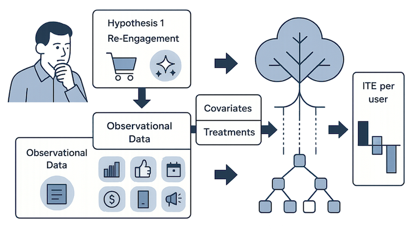

# Case Study 3: From Comeback to Loyalty: Using Causal Forests to Discover the Right User Experience

## What You'll Learn in This Case Study

You're a product manager focused on increasing user retention and Lifetime Value (LTV). You've noticed a recurring pattern: users who were inactive for months sometimes return to your service—a "comeback." While this is great, you see that many of them quickly become inactive again, or "re-churn."

You might have a few ideas for re-engaging them, like offering a discount coupon or a tour of new features. However, these are just hypotheses. You're concerned that you might be overlooking other, more critical actions, and you lack the confidence to act on these hunches. Simply giving everyone the same offer feels inefficient and risks annoying users for whom the offer is irrelevant. Rather than testing random ideas, you want to first analyze your observational data to discover what organic behaviors *actually* lead to long-term retention. The key challenge is to understand **which user actions drive loyalty for which users** during that critical comeback moment.

  

In this case study, you'll learn how to use **Causal Forest**, a powerful machine learning method, to move beyond one-size-fits-all solutions and design a personalized retention strategy.

Specifically, you will practice the following steps:

-   Frame the business problem of reducing re-churn as a causal inference question.
-   Understand the intuition behind **Causal Forest** and how it estimates the *Conditional Average Treatment Effect (CATE)* and uses it as an individualized effect (ITE approximation).
-   Design an analysis to discover if a spontaneous user action has a causal impact on retention, and for which user segments.
-   Use the discovered insights to create a data-driven, personalized CRM strategy for different user segments.

 

## Beyond Average Effects: What is a Causal Forest?

In our previous case studies, we focused on the *Average Treatment Effect on Treated* (ATT)—the overall impact of an action across an treated population. But in the real world, a marketing campaign or a new feature rarely affects everyone in the same way. A discount that excites one user might be ignored by another who is more interested in new functionality.

Relying only on the average effect can be misleading. A strategy that is a huge success for one segment could be a complete failure for another. The average would just show a mediocre result, potentially leading you to abandon a great, targeted idea. This is the challenge of **heterogeneous effects**.

This is where **Causal Forest** comes in. It's a machine learning method that moves beyond averages to estimate the **Conditional Average Treatment Effect (CATE)**—the expected causal effect conditional on user features. In practice, we interpret this as the best available individualized effect (an approximation to the ITE) for each user. It helps you answer the crucial question: *"Who does my feature work for?"*

### How Does It Work Intuitively?

Imagine a single **Causal Tree**. It's like a regular decision tree, but instead of predicting *if* a user will churn, it predicts how much a treatment *changes their probability of churning*. It works by repeatedly splitting your users into smaller groups based on their characteristics (e.g., "Were they a paying user before?" or "Did they use feature X a lot?").

A **Causal Forest** is simply an "ensemble" of hundreds or thousands of these Causal Trees. By averaging the predictions of all the trees, it provides a much more robust and reliable estimate of the treatment effect for every single user. It allows you to find hidden patterns and identify the specific user segments that respond most positively (or negatively) to your intervention.

  

 

## Designing the Analysis: What User Actions Drive Retention?

As a product manager, you need to understand the *'why'* behind user retention. Instead of testing pre-defined ideas like "Does a coupon work?", a more powerful approach is to first identify the organic user behaviors that causally lead to long-term engagement. Once you know *what actions* are critical, you can then design features and campaigns to encourage them.

You have two core hypotheses about these critical actions:

### 1. Clarifying Behavioral Hypotheses

-   **Hypothesis 1 (Re-Engagement Hypothesis)**: Users who spontaneously engage with a core feature (e.g., make a repeat purchase) shortly after coming back are re-establishing a habit and are more likely to be retained.
-   **Hypothesis 2 (Discovery Hypothesis)**: Users who explore new features after coming back are re-discovering the product's value and are more likely to be retained.

Your goal is to use Causal Forest on your existing **observational data** to test both hypotheses and see which spontaneous actions have a causal impact on retention, after accounting for user self-selection. This will require running two separate analyses.

  

### 2. Defining the Analysis from Observational Data

-   **Target**: Users who were inactive for 90+ days and returned in the last 14 days.
-   **Key Performance Indicator (KPI)**: Re-churn within 30 days (binary, 1 = churned again).
-   **"Treatment" Variables (User's Spontaneous Actions)**:
    -   Analysis 1 (Re-Engagement): `made_repeat_purchase_in_7d` (1 if the user made any purchase within 7 days of returning, 0 otherwise).
    -   Analysis 2 (Discovery): `used_new_feature_in_7d` (1 if the user tried a recently launched feature within 7 days of returning, 0 otherwise).
-   **Covariates (User Features)**: To account for the severe self-selection bias (e.g., enthusiastic users are more likely to re-purchase *and* try new things), we must use historical data as controls:
    -   `total_sessions_before_idle`: User's historical engagement (overall).
    -   `sessions_in_last_30d_before_idle`: User's engagement in the last 30 days before going idle.
    -   `days_idle`: Number of days the user was inactive before coming back.
    -   `last_paid_plan`: Was the user a paying customer?
    -   `favorite_category`: User's content preferences.
    -   `account_age_years`: User's tenure.
    -   `device_type`: What device do they use?
    -   `acquisition_channel`: How did we first acquire them?

 

## Analyzing with Allye

You have collected data on your users. Let's use Allye to investigate the true impact of your hypotheses.

> [Download the sample data here](https://raw.githubusercontent.com/Llenar70/allye-doc/main/course/sample_data/causal_forest_retention_data.csv)

### 1. Load Data

Drag & drop your `causal_forest_retention_data.csv` file to the canvas and view it with a `Data` widget. This dataset contains all the variables needed for both of your analyses.

  

### 2. EDA: From Intuition to Insight

Before building causal models, it's crucial to perform Exploratory Data Analysis (EDA). This isn't just a technical prerequisite; it's a vital process for aligning your own intuition / understanding with the reality of the data. By carefully examining what seem like "obvious" patterns, you deepen your understanding of customer behavior. This iterative process of questioning and verifying is what transforms an analyst into a domain expert, sparking new ideas and building a solid foundation for more advanced analysis.

Let's start by exploring some fundamental intuitions about user behavior.

**1. Validating Basic Intuitions about Re-Churn**

What kind of comeback user is more likely to stick around? Our intuition suggests:
-   Users who were highly engaged *before* they became inactive might have a stronger underlying connection to the product.
  - Connect a `Box Plot` widget. Select `sessions_in_last_30d_before_idle` as the *Variable* and `churn_within_30d` as *Subgroups*. 
  - You should observe that users who re-churned have fewer sessions, confirming the expected correlation. The p-value from a t-test is p < 0.001, indicating this difference is statistically significant and aligns with intuition.

  

-   Conversely, users who were inactive for a very long time might find it harder to re-engage.
  - Now, change the *Variable* to `days_idle`. You'll observe that users with a longer idle period before returning are more likely to re-churn. While this is a correlation, when combined with domain knowledge, it suggests a causal relationship.

  

-   **Hypothesis 1 (Re-Engagement)** 
  - Use a `Bar Plot (Allye)` to compare `churn_within_30d` between users who did and did not `made_repeat_purchase_in_7d`. You'll likely see a lower re-churn rate for purchasers. 

  

-   **Hypothesis 2 (Discovery)** 
  - Repeat the process for `used_new_feature_in_7d`. You will probably confirm these users are highly engaged. You may notice many are on the free plan.

  

Validating these basic patterns not only strengthens your trust in the data and your intuition, but also opens up exciting opportunities for discovery. If you encounter results that *contradict* your expectations, see it as a valuable chance to dig deeper—such surprises can spark new questions, reveal hidden data issues, or inspire fresh perspectives that lead to breakthrough insights.

**Why This Isn't Enough: The Limits of Correlation**

The patterns you've uncovered are insightful and align with our hypotheses. However, they only show **correlations**. Are people staying *because* they made a repeat purchase, or were they already more loyal and thus more likely to make a purchase anyway? This is the classic problem of **selection bias**, as we learned in Case Study 2.
To move from correlation to causation and get a true estimate of the impact of these actions for *different types* of users, we need a more powerful tool that can account for these underlying differences. This is why we'll use the `Causal Forest` widget next.

---

(optional)💡 **Advanced EDA: Deep Dive into Repeat Purchasers**

We've confirmed that repeat purchasers are less likely to re-churn. But who *are* these users?
Here, let's take a deeper dive into the data to further enhance your customer understanding. 
For example, you could investigate:

-   **Favorite Category**: Do users who make repeat purchases tend to have a clear preference for certain product categories?
  - You can use `Select Rows` to extract repeat purchase users.
-   **Acquisition Channel**: Are users acquired through `organic_search` more likely to make a repeat purchase than those from `paid_social`?
-   **Device Type**: Does `device_type` influence purchasing behavior?
-   **Account Age**: Do users with a longer history (`account_age_years`) show different purchasing patterns?

This kind of deep dive is where true domain expertise is built. By continuously questioning, exploring, and understanding the nuances of your user base, you move beyond surface-level metrics to uncover actionable insights.

### 3. Set Up and Compare Two Causal Forest Models

To test both of your hypotheses, you will create two parallel `Causal Forest` widgets.

1.  **Model 1 (Re-Engagement Analysis)**:
    -   Connect a `Causal Forest` widget to your data.
    -   Set **Treatment Variable** to `made_repeat_purchase_in_7d`.
    -   Set **Outcome Variable** to `churn_within_30d`.
    -   Set **Meta Variables** to `user_id`.
    -   Include `used_new_feature_in_7d` as a **Covariate** to control for exploration behavior.    
    -   Select all other relevant user features as **Covariates**.
    -   You can proceed with the default settings in the `Forest Hyperparameters` area.

  

2.  **Model 2 (Discovery Analysis)**:
    -   Create a second `Causal Forest` widget.
    -   Set **Treatment Variable** to `used_new_feature_in_7d`.
    -   Keep the **Outcome Variable** and **Covariates** the same as in Model 1.
    -   Set **Meta Variables** to `user_id`.
    -   Include `made_repeat_purchase_in_7d` as a **Covariate** to control for purchase behavior.
    -   Select all other relevant user features as **Covariates**.
    -   You can proceed with the default settings in the `Forest Hyperparameters` area.

  

### 4. Diagnose and Interpret Each Model

For each of the two models, investigate the diagnostic plots to understand the results:

-   **Distribution of CATEs**: Causal Forest predicts the expected treatment effect based on each user's covariates (features), which is known as the **Conditional Average Treatment Effect (CATE)**. In observational settings, CATE is often used as the best available approximation to the **Individual Treatment Effect (ITE)** for each user. In this plot, look at the overall distribution of the predicted CATEs for both "repeat purchase" and "new feature usage." This gives you a high-level view of how impactful each action is across the entire user base.
-   **Feature Importance**: Compare which user features are most important for predicting the effect in each model. Do the same user characteristics drive the effectiveness of both actions, or are they different? This is a crucial step for uncovering deeper insights.
-   **SHAP Values**: Explain how each feature shifts the predicted CATE for an individual. Positive SHAP means the feature increases the (beneficial) treatment effect; negative means it decreases it. Use this to understand which attributes amplify or dampen the effect within key segments.

  

 **How to Read the Two Models (What, Why, So‑What)** 

- **Start with the CATE distributions (What)**: Compare the centers and spreads.
  - In the Re‑Engagement model (repeat purchase), the distribution is shifted further below zero and is relatively compact. This means the expected treatment effect is more consistently negative on churn (i.e., a larger, more reliable reduction in re‑churn) across many users.
  - In the Discovery model (new feature use), the center is closer to zero and the spread is wider. This indicates a smaller average effect with stronger heterogeneity; some users gain a lot, others very little.
  

    
  

- **Check Feature Importance (Why)**: Which covariates govern where the effect is large?
  - Re‑Engagement: Historical engagement (e.g., `total_sessions_before_idle` or `sessions_in_last_30d_before_idle`, `days_idle`) and preference signals (e.g., `favorite_category`) are prominent. This suggests the benefit of making a repeat purchase depends strongly on prior habit and affinity.
  - Discovery: Plan status (`last_paid_plan`), tenure (`account_age_years`), and engagement dominate. This points to user maturity and prior monetization as the key gatekeepers for whether “trying something new” turns into retention value.
  

    
  

- **Use SHAP to read directionality (Why, precisely)**: Look at how high vs. low values move the predicted CATE.
  - Re‑Engagement: Higher historical engagement and shorter `days_idle` push CATE further negative (bigger churn‑reduction). `last_paid_plan` being paid and strong `favorite_category` affinity often amplify the benefit—consistent with a “habit re‑activation” story.
  - Discovery: High engagement combined with `last_paid_plan` = free tends to push CATE more negative; for users with higher `account_age_years` or `last_paid_plan` = paid, the effect is weaker or nearer zero—consistent with “novelty matters most for explorers.”
  

    
  

## Making Decisions: From Behavioral Insights to Actionable Strategy

By running two separate Causal Forest analyses, you move beyond a single insight and can now develop a much more nuanced understanding of your comeback users. You're not just asking "what works?" but "what works for whom?" The diagnostics show that a repeat purchase within 7 days delivers a stronger and more stable reduction in re‑churn overall—particularly for users with prior monetization and clear affinity—whereas trying a new feature has a smaller average impact but yields outsized gains for specific subgroups, especially historically engaged users on the free plan. Use these complementary insights to target “habit‑driven buyers” with purchase nudges and “curious explorers” with guided discovery.

-   **Key Insight: Different Actions Matter to Different Users**: Your analysis reveals two distinct user personas with different drivers of retention:

  

    
  

-   **Persona A: The "Habit-Driven Buyer"**:
-   **Behavior**: For users with `last_paid_plan` = paid and clear `favorite_category` affinity (e.g., "Fashion"), making a *repeat purchase* within 7 days tends to produce a more consistently negative CATE (larger reduction in re‑churn).
    -   **Interpretation**: The diagnostics indicate that stronger historical engagement and prior monetization push the CATE more negative in the Re‑Engagement model—consistent with re‑activating an existing habit.
    -   **Action Driver**: Prioritize `made_repeat_purchase_in_7d`; new‑feature prompts are secondary for this group.
    -   **Strategy & Targeted experiments**: Offer a time‑sensitive coupon in the user’s preferred category vs. no offer (control). Expect higher repeat purchases and lower re‑churn for this segment.

-   **Persona B: The "Curious Explorer"**:
-   **Behavior**: For users who are historically **highly engaged** (`total_sessions_before_idle`) and have `last_paid_plan` = free, *using a new feature* within 7 days shows a more negative CATE in the Discovery model, while the incremental effect of a repeat purchase is comparatively smaller.
    -   **Interpretation**: SHAP indicates that free status and high engagement push the Discovery CATE downward (more benefit), whereas paid/long‑tenured users see effects closer to zero—consistent with novelty creating value for explorers.
    -   **Action Driver**: Prioritize `used_new_feature_in_7d`; purchase incentives play a supporting role.
    -   **Strategy & Targeted experiments**: On return, trigger a guided tour/tooltip for a major new feature vs. standard welcome (control). Expect higher new‑feature adoption and lower re‑churn for this segment.

By first using Causal Forest to identify *which behaviors matter to whom*, you can design smarter, more targeted, and more effective experiments. You're no longer guessing what might work; you're building a causal chain from persona to action to outcome.

 

## Real-World Hurdles and Beyond

-   **Combining with Online Experiments**: The best practice is to use Causal Forest to *generate hypotheses* about segments, and then run new, targeted A/B tests on those segments to confirm the effect.

### When Causal Forest or PSM Are Not the Right Tool (and DID Might Be)

While Causal Forest and Propensity Score Matching (PSM) are powerful when you can credibly assume selection-on-observables (no unobserved confounding conditional on covariates) and have sufficient overlap, they are not always the best fit. Consider using Difference-in-Differences (DID) instead when the setting is closer to a quasi-experiment in time.

-   When to prefer DID:
    -   **Group-level, time-bound intervention**: The intervention happens to a defined group at a specific start date (e.g., policy change, UI redesign for a subset, store layout rollout). DID naturally models pre/post changes vs. a contemporaneous control group.
    -   **Plausible Parallel Trends (PT)**: You can defend that in the absence of the intervention, treated and control groups would have followed parallel trends. Under PT, DID can difference out **time-invariant unobservables**, something PSM/CF cannot do.
    -   **Hard-to-match scenarios**: Treated users are systematically different and **overlap/positivity is weak**, making PSM matching or CF counterfactual prediction unreliable.
    -   **Stable units, limited spillovers**: Interference across units is minimal in the pre/post window (SUTVA is more plausible at the group/time level).

-   When Causal Forest/PSM may be inappropriate or fragile:
    -   **Unobserved Confounding**: Causal Forest/PSM can only account for the features you provide it. If a critical unobserved factor exists (e.g., the user's *reason* for coming back), the ITE estimates could be biased.
    -   **Strong selection on unobservables** that are time-invariant (e.g., latent loyalty) and drive both treatment and outcome.
    -   **Simultaneous, coordinated interventions** where the counterfactual for treated users is difficult to learn from untreated users (little support/overlap).
    -   **Severe covariate shift** or **limited common support** between treated and control populations.
    -   **Dynamic, time-structured effects** that require pre-trend checks or event-study views; DID provides built-in diagnostics for these.

-   When to stay with Causal Forest/PSM:
    -   **No clear intervention date** or treatments occur idiosyncratically per user without a common start time.
    -   **Rich covariates and strong overlap** support selection-on-observables and individualized effect learning.
    -   Your goal is **individual-level targeting** and uplift discovery, not just an average policy effect.

In our next case study, we will explore **Difference-in-Differences (DID)**, a powerful method for measuring the impact of large-scale changes, like a new store layout.

---
> [Next: Case Study 4: Evaluating Store Layout Changes with Difference-in-Differences](./case_study_4_difference_in_differences.md)
