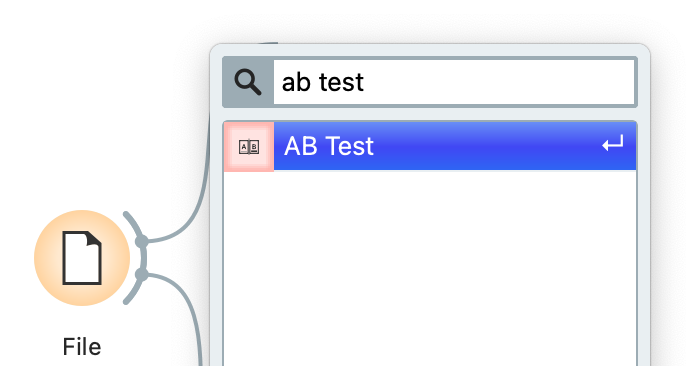
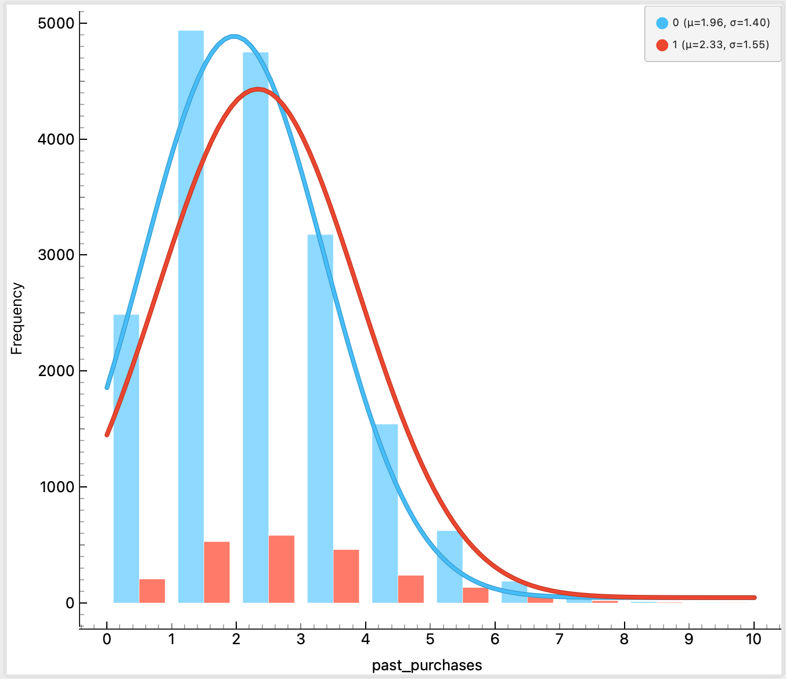

# Tutorial: Unveiling the "True" Impact of Advertising with Allye

This tutorial explores one of the most critical business challenges: "Web advertising campaigns." Using Allye's causal inference capabilities, we'll experience the process of correctly measuring effects that are often misunderstood in simple A/B testing.

## What You'll Learn

- Basic Allye operations (data loading, widget placement and connection)
- How to discover "Selection Bias" hidden in simple A/B tests
- **Propensity Score Matching** for bias correction
- The complete process of correctly measuring the pure effect (causal effect) of interventions

## Prerequisites

- Sample data: `ad_campaign_sample.csv`
  - This file can be simply downloaded from the link below
- Data fields:
  - `age`: Customer age
  - `past_purchases`: Number of past purchases
  - `time_on_site`: Time spent on site
  - `saw_ad`: Whether they saw the ad (1: Yes, 0: No) - Treatment
  - `converted`: Whether they made a purchase (1: Yes, 0: No) - Outcome

## Tutorial Steps

### Introduction: The Question - Did This Ad Really Work?

You are a marketer at an e-commerce site. After implementing a new web advertising campaign, users who saw the ad appear to have a significantly higher conversion rate than those who didn't.

However, your boss asks: "Wasn't that ad only shown to customers with high purchasing intent? What's the pure effect of the ad itself?"

To answer this question, let's use Allye to measure the "true" effect of the advertising.

### Step 1: Data Loading and Confirming the Apparent Effect

#### Data Loading
1. Download the CSV file from the link below
[ Download link ]
2. Drag and drop the downloaded CSV file onto the canvas - this will automatically create a **File** widget

<p align="center">
  
</p>

#### Confirming Data Content
1. Connect a **Data Table** widget to the File widget
2. Open the Data Table and confirm the data content (age, past_purchases, etc.)

<p align="center">
  
</p>
<p align="center">
  
</p>

#### Conducting a Simple A/B Test
1. Connect an **AB Test** widget to the File widget

<p align="center">
  
</p>


2. Double-click the widget and configure as follows:
   - **Treatment Variable**: `saw_ad`
   - **Control Group**: `0`
   - **Outcome Variable**: `converted`

<p align="center">
  
</p>

3. **Review Results**: "Looking at the results, there's a large difference in conversion rates. Users who saw the ad appear to have a 19.3% higher conversion rate than those who didn't. But is this really just the effect of the ad?"

<p align="center">
  
</p>

### Step 2: Discovering Bias - Why Did the Difference Occur?

Let's determine whether it's the ad that's excellent or the "people" who saw the ad.

#### Visualizing Distributions
1. Connect a **Distributions** widget to the first File widget
2. Open the Distributions widget and configure as follows to compare groups:
   - **Variable**: `past_purchases`
   - **Split by**: `saw_ad`

<p align="center">
  
</p>

#### Discovering Bias
"Look at the graph. Users in the group who saw the ad (saw_ad=1) clearly have more past purchases than those who didn't (saw_ad=0). This isn't a fair comparison."

<p align="center">
  
</p>

#### Checking Other Variables
Similarly, switch the Variable in the Distributions widget to `time_on_site` and `age`. You'll see that `time_on_site` also shows a bias between groups, while `age` appears to be more evenly distributed.

**Conclusion**: "These background factors (which we call covariates) are creating the apparent effect. Let's remove this bias."

### Step 3: Bias Correction and Measuring the True Effect

Now it's time for Allye's true strength - causal inference.

#### Executing Propensity Score Matching
1. Connect a **Propensity Score Matching** widget to the first File widget
2. Double-click the widget and configure as follows:
   - **Treatment**: `saw_ad`
   - **Outcome**: `converted`
   - **Covariates**: Select `past_purchases`, `time_on_site`, `age`

**Explanation**: "Here, we pair users who have similar age, site time, and past purchases, but one saw the ad and the other didn't, creating fair comparison groups."

### Step 4: Verifying Results and Confirming the Correct Effect

Let's verify that the bias has been properly corrected and reveal the "true" effect of the advertising.

#### Confirming Bias Correction
1. Connect a **Distributions** widget to the **Matched Data** output port of the Propensity Score Matching widget
2. Open the widget and, as in Step 2, display `past_purchases` grouped by `saw_ad`

**Results**: "Excellent! After matching, the distribution of past purchases for both groups is almost the same. You can also confirm that the distributions of `time_on_site` and `age` are similarly aligned. Now we have a fair comparison foundation."

#### Measuring the "True" Effect
1. Connect a new **AB Test** widget to the **Matched Data** output port of the Propensity Score Matching widget
2. Configure the widget the same as in Step 1:
   - **Treatment Variable**: `saw_ad`
   - **Outcome Variable**: `converted`

**Final Conclusion**: "This is the 'true' effect of the ad after removing bias. You should see a more realistic, yet statistically significant conversion rate improvement compared to the apparent number from Step 1. Now you can confidently report to your boss!"

### Step 5: AI Reporting for Professional Documentation

Let's create a professional report using Allye's AI Reporting feature.

#### Generating AI Report
1. In the AB Test widget from Step 4, click the **AI Reporting** button (located in the bottom-right corner of the widget)
2. The report generation screen will appear
3. Click the **Generate AI Allye's Report** button without making any changes
4. Wait for the report to be generated
5. Click the **[Save]** button in the same screen to save in HTML, PDF, md, or .report format

**Note**: The AI Reporting button is available in the bottom-right corner of each widget. This feature automatically analyzes the widget's results and generates comprehensive reports with explanations, visualizations, and insights.

## Summary

Through this tutorial, we learned:

1. **Simple A/B test results may contain "Selection Bias"** - apparent effects can be misleading
2. **The Distributions widget can visualize biases** in background information between groups
3. **The Propensity Score Matching widget can correct these biases** and create fair comparison groups
4. **Re-running A/B tests on bias-corrected data** allows measurement of the "pure causal effect" of interventions
5. **AI Reporting provides professional documentation** of your analysis results

With Allye, you can discover the "true" answers hidden in your data with your own hands. Now try it with your own business challenges!

## Sample Data Structure

The `ad_campaign_sample.csv` file contains approximately 20,000 rows with the following structure:

```csv
age,past_purchases,time_on_site,saw_ad,converted
43,0,522.7485769832383,0,0
47,2,459.4606868792679,0,0
33,4,70.15918338087148,0,0
50,1,468.6542038812802,1,0
18,1,576.8504836869364,0,0
24,1,103.46339345516007,0,0
32,1,151.10758317275975,0,0
51,2,235.92419767064098,0,0
63,1,117.3635264157953,0,0
34,2,323.11883573848917,1,1
...
```

## Key Widgets Used

- **File**: Data loading
- **Data Table**: Data inspection
- **AB Test**: Statistical comparison between groups
- **Distributions**: Visualizing variable distributions and group comparisons
- **Propensity Score Matching**: Bias correction using causal inference
- **AI Reporting**: Professional report generation

This tutorial demonstrates how Allye transforms complex causal inference into an accessible, visual workflow that anyone can use to make data-driven decisions with confidence. 