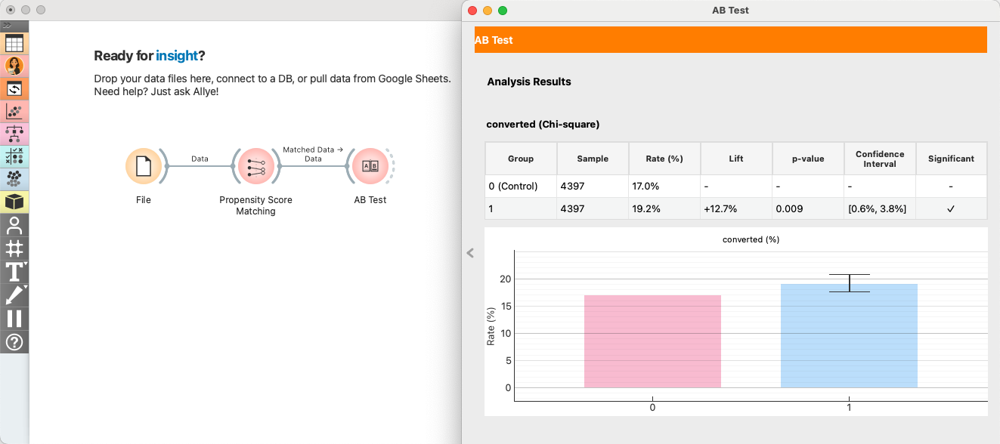

# How to Measure the True ROI of Your Digital Ad Campaign with Allye

Every marketer faces a fundamental question: is my advertising *actually* working? You see the numbers on your dashboard, but a nagging doubt remains. Are those conversions happening *because* of your ads, or would they have happened anyway?


<p align="center">
  
</p>


Today, we'll show you how to move beyond correlation and find the true causal impact of your campaigns, turning that doubt into data-driven confidence.

## 1. The Challenge: Organic vs. Uplift

Let's paint a picture. You just spent **$50,000** on a major Facebook ad campaign. You open the campaign dashboard, and it proudly displays **1,000 conversions**. Success?

Maybe. But consider this:
*   How many of those 1,000 users were already loyal customers planning to buy something?
*   How many were already deep in your sales funnel and would have converted *anyway*?
*   Are you sure your ad wasn’t just an unnecessary intervention for conversions that would have happened organically anyway?

Answering this question is crucial for your next budget decision. You can't afford to reinvest in a campaign based on misleading data. You need to know the true, incremental lift your ads generated.

## 2. The Old Way: A Data Scientist's Task

Traditionally, answering this question was a complex, time-consuming task reserved for data scientists. It involved a significant amount of coding and statistical knowledge.

To give you a taste, here's what the process might look like in Python using popular libraries:

```python
import pandas as pd
import numpy as np
from sklearn.linear_model import LogisticRegression
from causalinference import CausalModel
import matplotlib.pyplot as plt
import seaborn as sns

# 1. read data
df = pd.read_csv('data.csv')
df.dropna(inplace=True)

# 2. Variable settings
treatment = df['saw_ad'].values
outcome = df['converted'].values
covariates = df[['age', 'past_purchases', 'time_on_site']].values
covariate_names = ['age', 'past_purchases', 'time_on_site']

# 3. PSM modeling
propensity_model = LogisticRegression()
propensity_model.fit(covariates, treatment)
propensity_scores = propensity_model.predict_proba(covariates)[:, 1]

# 4. Visualize pre-matching distribution
plt.figure(figsize=(8, 5))
sns.histplot(propensity_scores[treatment == 1], color='blue', label='Treated', kde=True, stat="density", bins=20)
sns.histplot(propensity_scores[treatment == 0], color='orange', label='Control', kde=True, stat="density", bins=20)
plt.legend()
plt.show()

# 5. Perform Matching
causal = CausalModel(Y=outcome, D=treatment, X=covariates)
causal.est_propensity_s(propensity_scores)
causal.est_via_matching(bias_adj=True)

# 6. Check result
...

# 7. Love plot
...

# 8. check result
print(causal.estimates)

# ...and this is just a simplified version.
```

> This typically requires significant coding knowledge and time for setup and execution.

Seeing this, most marketers would simply say, "I'll just trust the dashboard." It’s complicated, slow, and inaccessible to most business users.

### Before We Show You the Easy Way: What is Propensity Score Matching?

The magic behind solving this problem is a technique called **Propensity Score Matching (PSM)**.

Think of it like this: To test a new fertilizer, you can't just compare a plant that got it with any random plant that didn't. You need to compare it to a *similar* plant—one with the same amount of sunlight, water, and soil type. You need an "apples to apples" comparison.


<p align="center">
  
</p>

PSM does this for people. It calculates a "propensity score" for every user—the probability they would have been exposed to your ad based on their characteristics (like age, location, browsing history). Then, it finds pairs of users—one who saw the ad and one who didn't—that have a nearly identical propensity score. By comparing the conversion rates of these matched pairs, you can isolate the true effect of the ad itself.

## 3. The Allye Way: 3 Simple Steps

Allye takes the complexity of Propensity Score Matching and turns it into a simple, no-code workflow. Here’s how you can find your true ROI in minutes.

### Step 1: Connect to Your Spreadsheet
Just input URL and connect to your ad performance data. This should contain user attributes (age, past purchases, etc.), a column indicating who saw the ad (the treatment group), and a column for the outcome (e.g., conversion).

<p align="center">
  
</p>

### Step 2: Use & Configure the Propensity Score Matching Node
In Allye's visual canvas, you build your analysis by connecting nodes. Simply select the "Propensity Score Matching" node from the analysis library and place it on your canvas. This tells Allye exactly what kind of causal analysis you want to perform.

<p align="center">
  
</p>

Click on the PSM node to open its configuration panel. Define your treatment (the "saw_ad" column), your outcome (the "converted" column), and the user demographics you want to use for matching.

<p align="center">
  
</p>


### Step 3: Execute matching & Confirm results

Then, just click "Execute" and confirm results. No code, no formulas.　Allye instantly runs the complex analysis and presents a detailed report. While it looks advanced, **you only need to check one thing** to understand the story.

#### Did We Create a Fair "Apples-to-Apples" Comparison?

First, we need to confirm that we are comparing similar groups of people. The initial data is often biased. For instance, users who saw your ad might have already been more loyal customers with more `past_purchases`.

<p align="center">
  
</p>


Look at the **Propensity Score Distribution** chart.

Before matching, you can see the two distributions (the lighter-colored areas) are not aligned. The group that saw the ad (Treated) was different from the group that didn't (Control).

But **after matching, the two dark lines overlap almost perfectly.** This is the proof: Allye has successfully created two identical groups for a fair comparison, removing the bias that loyal customers were more likely to see the ad.

<p align="center">
  
</p>


### Step 3: Understand the True Impact
Finally, use the AB Test widget to check the difference in conversion rates between the matched user groups. This result shows the additional conversions—i.e., the uplift—achieved by your advertisement.


<p align="center">
  
</p>


## 4. The Result: Confident, Actionable Insights

So, what does this all mean for your $50,000 campaign?

Instead of just a correlation (1,000 total conversions), you now have a **causal number**. The analysis reveals that your ad campaign generated **+12.7% additional conversions** that would not have happened otherwise.

Now you can confidently report:
> "Our $50,000 campaign generated +12.7% incremental conversions at a cost of $111 per true conversion. This resulted in a **true ROI of 150%**."

This insight is a game-changer. It allows you to stop guessing and start making strategic decisions. You can now effectively optimize your future ad spend, reallocating budget from low-impact campaigns to high-impact ones, backed by causal evidence.

With Allye, measuring the true impact of your work is no longer a one-week data science project. It's a five-minute task that empowers you to prove your value and drive real business growth.