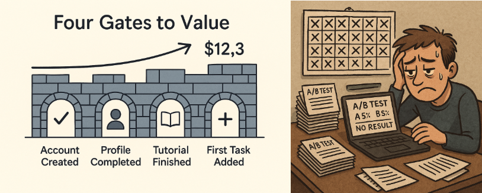
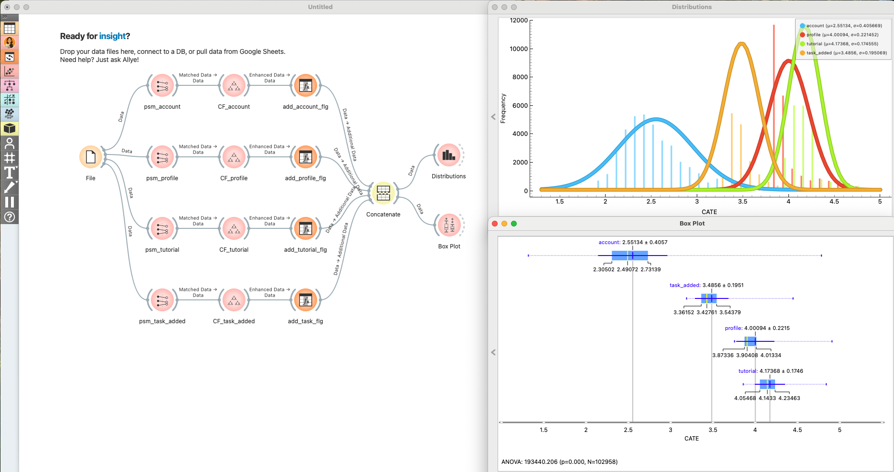
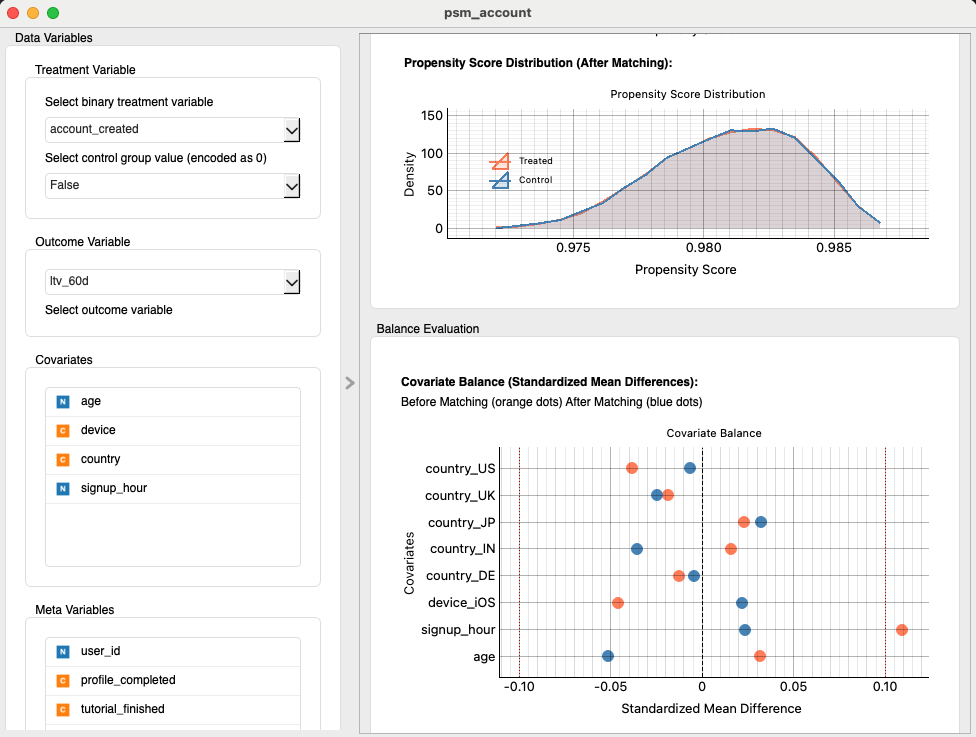
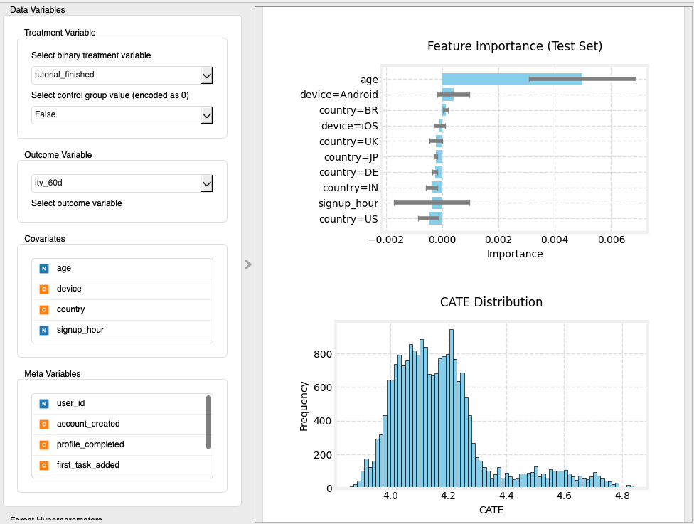

# The Growth Team's Dilemma: From Guesswork to Glory with Allye

Every product manager, every analyst, every data scientist knows the feeling. It’s the ghost in the machine, the question that haunts every growth meeting:

*“We see the drop-off. We have the funnel charts. But where, in this entire user journey, is the **one change** that will actually make the LTV curve bend upwards?”*

Meet **Maya**, our PM. It’s Monday morning. The air in the conference room is thick with the smell of stale coffee and unspoken pressure. On the screen is the slide everyone dreads: “60-Day LTV: Flat for Q3.” The analyst nervously scrolls through a labyrinth of dashboards. The data scientist, buried in a Jupyter notebook, mutters, *“Just give me one more week to let the model converge.”* And the engineering lead just wants to know which fire to put out first.


<p align="center">
  
</p>


Funnels show us *where* we lose users. Dashboards tell us *what* the conversion rate is. But when you only have the budget for one smart move, picking where to place your bet feels less like data-driven strategy and more like a spin of the roulette wheel.

Maya needs a decision. Not in two weeks, after another costly A/B test. **Today.**

This is the story of how Allye transforms that messy, high-stakes guesswork into a clear, ranked-to-win battle plan. All without writing a single line of Python.

---

## 1. The Wall: Four Gates to Value

In our mobile productivity app, the path to an active user is a treacherous, four-step journey.

1.  **Account Created:** The first handshake.
2.  **Profile Completed:** The first commitment.
3.  **Tutorial Finished:** The first taste of power.
4.  **First Task Added:** The moment of truth.

Our 60-day Lifetime Value (LTV) is stubbornly stuck at **$12.3**. We’re bleeding potential, but we don’t know which of these four gates is the bottleneck strangling our growth.

---

## 2. The Old Way: A Nightmare of A/B Tests and Gut Feelings

The traditional playbook? Ship four different A/B tests—one for each gate—and pray. Wait weeks for the p-value to dip below 0.05, all while confounding variables muddy the waters. Was it the new marketing campaign? The holiday season? The fact that Android users outnumbered iOS users this week? The causal story becomes a tangled mess.


You know the scene. The 11 PM Slack notification that everyone dreads: *“Test is still underpowered. Can we extend for another week?”*

<p align="center">
  
</p>


Engineering lets out a collective groan. Marketing loses momentum. And Maya’s beautifully crafted roadmap slips, yet again, to the right.

---

## 3. Forging the Weapons: Your Causal Toolkit

Most tutorials throw models at you and hope for the best. Let's be real. Growth is a team sport, and each player has a different need:

*   The **Product Manager** needs a compelling story for the C-suite.
*   The **Analyst** needs numbers that are defensible and true.
*   The **Data Scientist** needs to slay the dragon of hidden bias.

Allye unites this trio with two battle-hardened causal inference techniques.

> **Think of it this way:** PSM is like a Vegas card dealer, ensuring every player (user) gets a fair hand. Causal Forest is the seasoned pro who can look at any hand and tell you exactly how much it's worth, and under what conditions it will win big.

*   **Propensity Score Matching (PSM):** This is our bias-killer. It meticulously matches users who completed a step with nearly identical users who didn't, ensuring we're comparing apples to apples, not apples to oranges.
*   **Causal Forest:** This is our opportunity-finder. It goes beyond the "average" effect to reveal the rich, heterogeneous truth: *for whom* does this change matter most? And *by how much*?

Together, they deliver not just the **average LTV uplift** of fixing a step, but the **hidden pockets of users** where the ROI is explosive.

---

## 4. The Allye Way: From Chaos to Clarity — No Code, Just a Few Clicks

| # | What You Do | Allye's Node |
|---|---|---|
| 1 | Drag and drop your csv data. | **File** |
| 2 | Create a fair fight for each step. <br/>• Treatment = `stepX_completed` <br/>• Outcome = `ltv_60d` | **Propensity Score Matching × 4** |
| 3 | Find the hidden gold. <br/>• Feed balanced data into a forest. <br/>• Features: device, country, age, signup_hour… | **Causal Forest × 4** |
| 4 | Visualize result. <br/>• Allye’s ROI Matrix automatically ranks your options. <br/>• `ATE × completion_rate ÷ dev_cost` | **Distributions, Box Plot** |

<p align="center">
  
</p>


*(Duplicating a node is a single click. Your canvas stays clean, your mind stays clear.)*

<p align="center">
  
</p>
<small><i>Propensity Score Matching — One dropdown per column. The heavy lifting happens in seconds, not sprints.</i></small>

<p align="center">
  
</p>
<small><i>Causal Forest— This isn't just a tree. It's a treasure map. Hover to see where the gold is buried.</i></small>

---

## 5. The Moment of Truth: One Chart to Rule Them All

Allye condenses weeks of analysis into a single、no-nonsense table:

```
Step               Avg LTV ↑        Priority
─────────────────────────────────────────────
Tutorial (3)       +$4.17 ± 0.17    ★★★★☆
Profile  (2)       +$4.00 ± 0.22    ★★★☆☆
First Task (4)     +$3.49 ± 0.20    ★★☆☆☆
Account  (1)       +$2.55 ± 0.41    ★☆☆☆☆
```

Hover over any bar and Allye surfaces the CATE. For Android users aged 18-24、the tutorial overhaul is worth a jaw-dropping **+$3.80** per head. Maya now knows not just *what* to tackle、but *who* will benefit most.

---

## 6. The Battle Plan: From Insight to Action

* **Primary Move — Slash the Tutorial:** Cut the flow from six screens to three. For Gen-Z Android users still hesitating、send a targeted push. Expected lift from a **+20 pp** completion boost: **+$1.1** LTV on average、a **9 %** bump overall.
* **Secondary Move — Smooth the Profile:** Once the tutorial win is banked、polish the profile setup to capture the next wave of value.
* **On Hold — Registration Polish:** The ROI is too small; save the engineering hours for bigger wins.

---

## 7. The Victory Lap: One Sprint、9 % LTV Growth

The team executed、fast.

1. **Action:** Tutorial shortened、push notification live for the high-value segment.
2. **Follow-up:** “First Task” experiment queued up next.

**The Results**
* Tutorial completion: 54 % → **71 %**
* 60-day LTV: $12.3 → **$13.4 (+9 %)**
* Payback period: **One sprint.**
