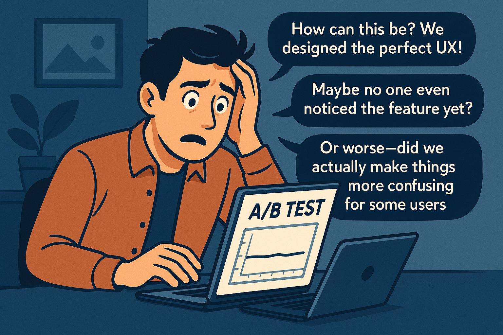
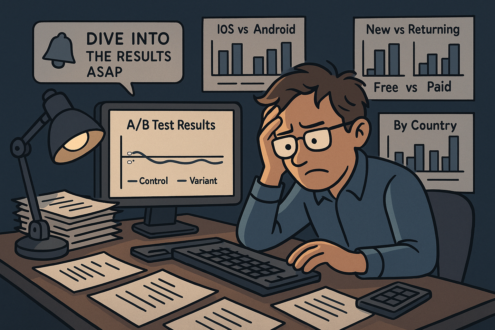
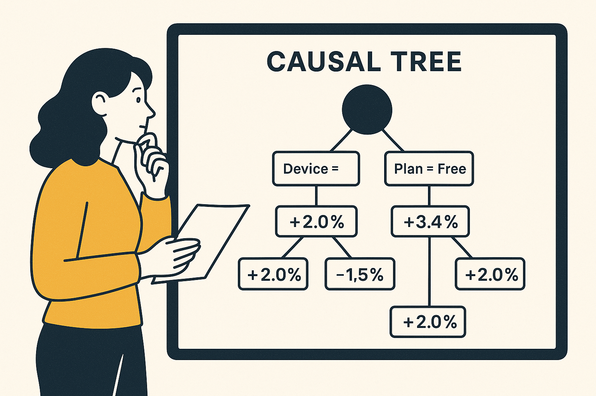
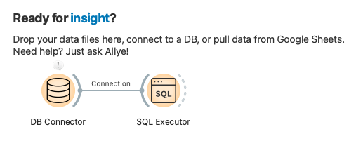
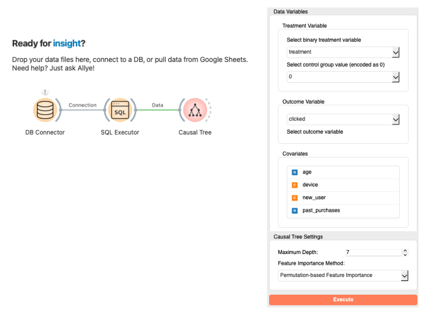
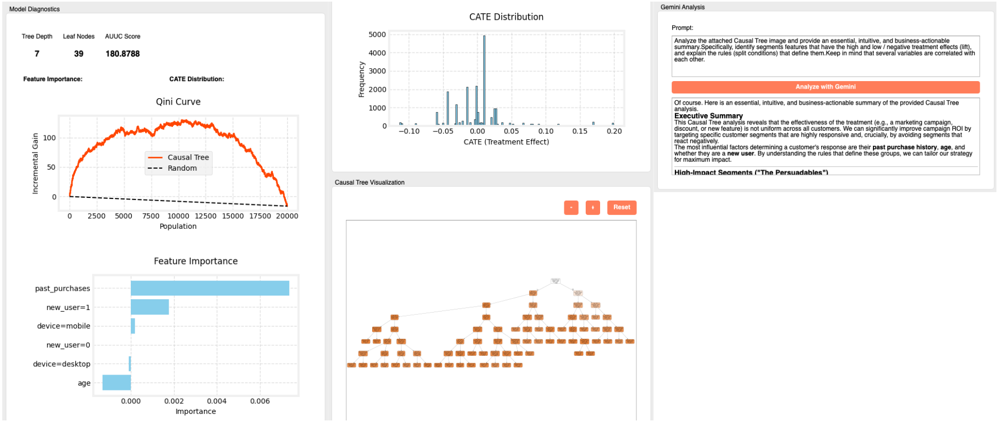

# New Feature Launch — Deep-Diving an A/B Test with Allye

## Introduction — A Product Manager’s Nightmare: The New Feature Launch That Fell *Flat*

The feature was supposed to be a game-changer. After months of painstaking user interviews, wireframes, and late-night sprints, you finally shipped. You crack open the A/B test dashboard with equal parts excitement and dread… only to see the primary KPI as **flat as a mill-pond**.

  

Your team’s months of effort risks being dismissed with a single verdict: *no impact*. Without clear learnings, there’s no steering wheel for the next iteration. The questions in your head multiply with no obvious answers.

---

## The Old Way — A Data Analyst's Grind: Endless *Slice-and-Dice* Hell

This is where the data-analysis team gets the late-night Slack ping: **“Please dive into the results and find *something* we can act on.”**

Traditional analysis is basically a manual cycle of hypothesize-slice-test-repeat:

*   *“Let’s split by device (iOS vs. Android).”*
*   *“What about new users versus returning users?”*
*   *“Maybe free vs. paid plans?”*
*   *“How does it look country-by-country?”*

  

It’s like searching for a single needle in a stack of haystacks. Occasionally you stumble on a *statistically significant* difference, but is it real signal or a false positive from peeking at too many segments? And discovering complex intersections—say, **“new iOS users on the free plan who logged in within the last 30 days”**—is nearly impossible by human intuition alone.

---

## The Allye Way — Causal Inference for *Who* and *Why* It Works

To escape the tyranny of averages, we turn to **Causal Inference**. For this use case, our secret weapon is the **Causal Tree**.

  

Put simply, a Causal Tree **automatically surfaces segments where the treatment effect—your KPI lift—differs the most, and visualizes them as an intuitive decision tree**. Instead of manually slicing, you let the data *tell you* where performance diverges.

---

## Practical Walk-Through — From “Flat” to Strategy in Three Steps

Allye packages Causal Trees into a no-code, visual workflow. Here’s all you need to do:

### 1. Connect to Your Database
Use the **DB Connector** node to connect to your database, then add the **SQL Executor** node to query your A/B test data. Make sure your data includes user attributes, a `treatment` column (1 = exposed to the feature), and an `outcome` column (e.g., `clicked`, `converted`).

  

### 2. Drag-and-Drop the **Causal Tree** Node
In Allye’s canvas, drag the Causal Tree node into place and open its config panel:

*   **Treatment column**: `treatment`
*   **Outcome column**: `clicked`
*   **Splitting features**: age, country, device, past_sessions, …

  

### 3. Run — Then Read the Auto-Generated Summary
Hit **Run**. Allye trains the Causal Tree and instantly delivers:

1. **Model Diagnostics** — instant snapshot of tree depth, leaf count, AUUC score, and the Qini curve to verify overall lift  
2. **Feature Importance** — bar chart ranking which attributes drive the splits  
3. **CATE Distribution** — histogram of unit-level treatment effects that uncovers outliers and tail risk  
4. **Causal Tree Visualization** — interactive tree where you can zoom, pan, and click nodes to inspect segment-level lift  
5. **Gemini Summary** — plain-English insights highlighting the highest-positive and most at-risk segments

  

---

## Sample Insights — Turning Zero Lift into Actionable Wins

Gemini might summarize findings like:

> **Segments with a strong *positive* lift**  
> • Existing users aged 25-34 on mobile, 3+ sessions/week: CTR +11.2%  
> • Loyal buyers (≥ 5 past purchases): CTR +9.5%
>
> **Segments with a *negative* lift**  
> • New desktop users: CTR −4.8%  
> • Users 65+: CTR −3.2%

Armed with this, you can craft the next sprint:

1. **Double-down on mobile power users** — in-app tutorials, targeted push.
2. **Fix onboarding friction for new desktop users** — streamline flows, surface help links.
3. **Offer video guidance for seniors** — reclaim lost engagement.

---

## Outcome — Data-Driven Decision-Making, Fast

What looked like a neutral test hides stark contrasts:

*   The overall KPI is ±0%, *yet* key segments gain up to **+11% CTR**.
*   A blanket rollout would actually hurt negative segments.

In five minutes, Allye transforms a “failed” test into a roadmap for growth. No more guesswork—your next strategy is literally highlighted.

---

### TL;DR

* Flat KPIs can mask pockets of big wins or losses.
* Causal Trees uncover heterogeneous treatment effects without tedious manual slicing.
* Allye makes it one-click, and Gemini explains the ‘why’ in seconds.

**Stop running A/B tests that teach you nothing. Use Allye to turn data into direction.** 