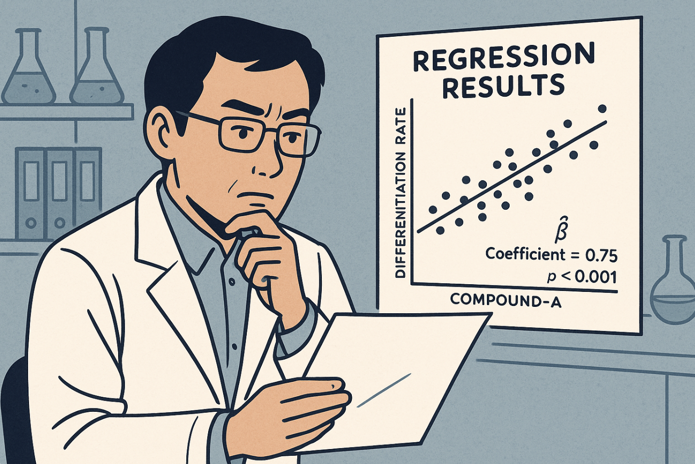
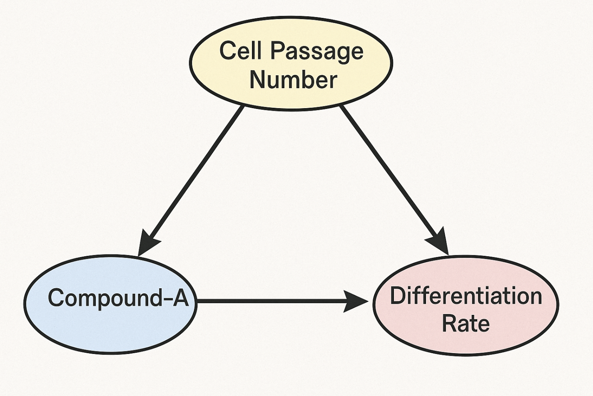
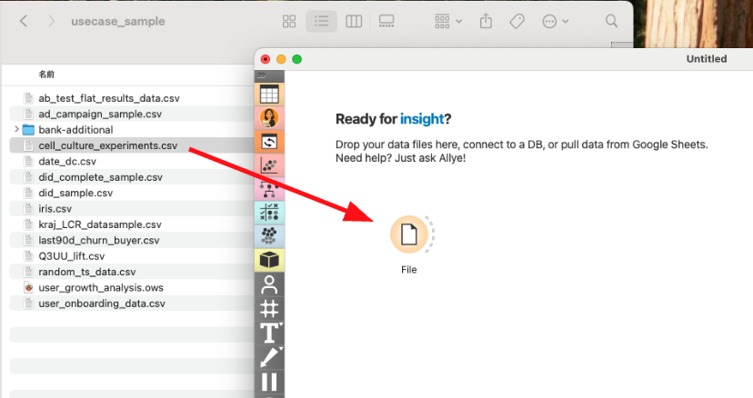
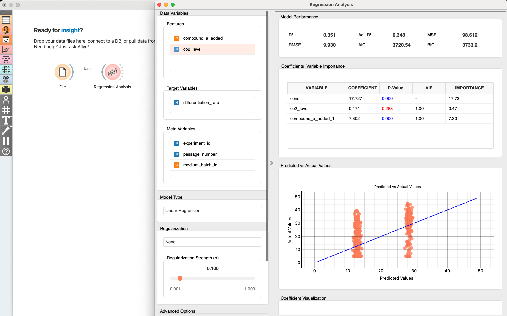
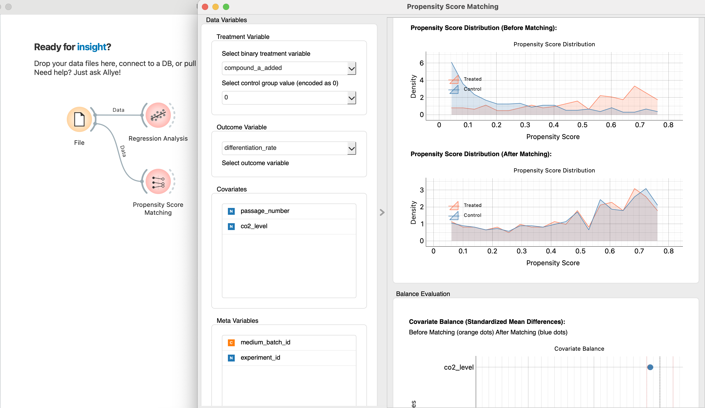
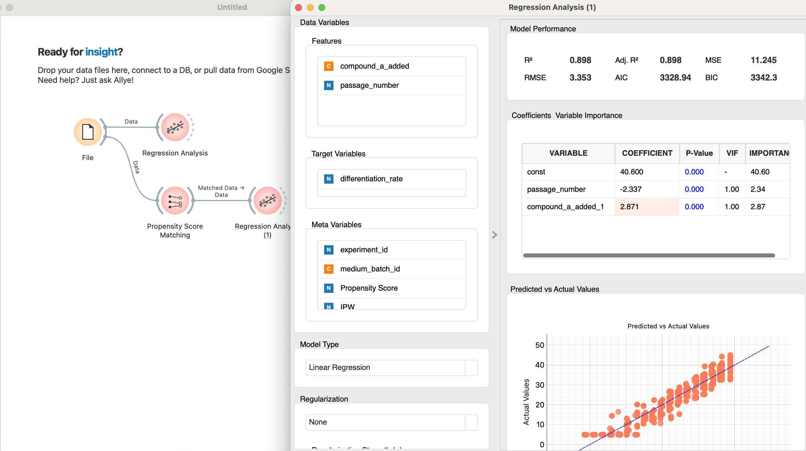

# Unlocking R&D Breakthroughs with Causal Inference: From Correlation to "Why"

Every researcher knows the cycle. You run an experiment, collect the data, and search for the signal in the noise. The goal isn't just to find what works, but to understand *why* it works. But what if the data itself is leading you astray?

Meet **Dr. Kenji**, a cell biologist working to improve the differentiation efficiency of stem cells into cardiac muscle cells. He has data from hundreds of experiments, each with different conditions: CO2 levels, culture medium batches, and the application of a new proprietary growth factor, **Compound-A**.

His first step, like any good researcher, is to run a regression model to see what factors are driving the differentiation rate. The results are electrifying.

 

  

The model shows a strong, positive correlation between the amount of Compound-A applied and the final differentiation rate. The coefficient is large and statistically significant. It seems like he's found the silver bullet.

*“This is it!”* he thinks. *“The key to higher efficiency is Compound-A. We just need to increase the dosage.”*

Excited, he presents his findings to his lead researcher, Professor Sato. She looks over the charts and asks a simple, devastating question:

*“That’s an interesting correlation, Kenji. But which cell batches did we use for the Compound-A experiments? Weren’t they the early-passage cells, the ones that are generally more robust? Are you sure you’re seeing the effect of the compound, or are you just measuring the inherent viability of younger cells?”*

And with that one question, the clean, simple correlation begins to unravel.

---

## 1. The Devil in the Data: Confounding

Professor Sato’s question points directly to the most dangerous trap in observational data analysis: **Confounding**.

A confounder is a variable that influences both the "treatment" (Compound-A) and the "outcome" (Differentiation Rate), creating a spurious association between them. In this case, `Cell Passage Number` is a classic confounder.

  

<i>(The Confounding Triangle: Cell Passage Number affects both which experiments got the compound and how well they differentiated.)</i>

A simple regression can't untangle these effects. It incorrectly attributes the benefits of the healthy, young cells to Compound-A, because the two are correlated in the historical data.

The real question Kenji needs to answer is: **“If we could compare cells from the exact same passage number, what would be the *true* effect of adding Compound-A?”**

---

## 2. The Traditional Way: The Code-Heavy Approach

Traditionally, isolating this true effect requires deep statistical knowledge and a lot of coding. A data scientist might use a method like Propensity Score Matching (PSM), but the process is cumbersome and opaque to the subject matter expert, Dr. Kenji. It would involve complex scripts in Python or R, checking for variable balance, and manually interpreting dense statistical outputs. For most domain experts, this is a black box.

## 3. The Allye Way: Causal Insight in 4 Steps

Allye puts these powerful causal methods into the hands of the researcher. Here’s how Dr. Kenji can build from his initial correlation analysis and uncover the true causal effect of Compound-A—no code required.

### Step 1: Connect the Data
Dr. Kenji drags his CSV file onto the canvas. It contains all the variables from his experiments: `differentiation_rate`, `compound_a_added`, `passage_number`, `co2_level`, `medium_batch_id`, etc.

  

### Step 2: Confirm the Correlation with a Quick Regression

Before diving into causal adjustments, Allye lets Dr. Kenji run a simple linear regression with just a drag-and-drop.

  

The coefficient is positive and the p-value is **< 0.001** – statistically convincing evidence that Compound-A is associated with higher differentiation.

This deepens Dr. Kenji’s confidence in his discovery, but remembering Professor Sato’s warning about confounding, he moves on to a more rigorous causal approach.

### Step 3: Use Propensity Score Matching to Create a Fair Comparison

He adds the **Propensity Score Matching** node. The goal of PSM is to create an "apples-to-apples" comparison by finding pairs of experiments—one that used Compound-A and one that didn't—that were otherwise conducted under nearly identical conditions (especially the same cell passage number).

He configures the node:
*   **Treatment:** `compound_a_added` (Did the experiment use the compound?)
*   **Outcome:** `differentiation_rate` (What was the result?)
*   **Covariates (Confounders):** `passage_number`, `co2_level`

  

After running the node, Allye provides clear, visual diagnostics. The most important is the **Propensity Score Distribution** chart.

Before matching (the lighter background distributions), the two groups were clearly different. The "Treated" group (which used Compound-A) had a very different profile from the "Control" group, likely biased towards lower passage numbers.

**But after matching, the dark lines overlap almost perfectly.** This is visual proof that Allye has successfully created two virtual groups that are balanced across all the confounding factors. It has created the fair, "apples-to-apples" comparison that science demands.

### Step 4: Estimate the True Effect with a Regression on the Matched Data

With the matched dataset in hand, Allye now re-runs the same simple regression—but this time only on the balanced sample produced by PSM.

* **Model:** `differentiation_rate ~ compound_a_added` *(matched data)*
* **Result:** Coefficient **+2.9%**, **p < 0.01**

  

Because the covariates are now evenly distributed between treated and control groups, this coefficient represents the **causal treatment effect** rather than a mere correlation. Dr. Kenji can finally answer Professor Sato’s question with statistical confidence.

---

## 4. The Insight: From a Silver Bullet to a Deeper Understanding

With the confounding effect of cell passage number statistically removed, Dr. Kenji can now measure the *true* impact of his compound.

*   **Initial Regression Finding:** Compound-A increases differentiation rate by **+15.7%%**.
*   **Causal Inference Finding:** The true, unconfounded effect of Compound-A is an increase of **+2.9%**

The effect is still positive and real, but it's much smaller than he originally thought. The majority of the initial "lift" was actually just the effect of using healthier, younger cells.

This isn't a failure; it's a breakthrough. Dr. Kenji now understands the system at a much deeper level.
1.  He has a **reliable estimate** of the compound's true effect, allowing for accurate cost-benefit analysis for scaling up.
2.  He has **quantified the impact of passage number**, confirming that it's a critical factor to control for in all future experiments.
3.  He can now design his **next round of experiments** far more effectively, ensuring that treatments are balanced across cells of different passages to isolate the effects of new variables.

## Conclusion: A Framework for Discovery

In R&D, the goal is not just to get a single answer. It's to build a mental model of the world that gets progressively more accurate. Causal inference is the ultimate tool for this journey.

It provides a framework to move beyond chasing spurious correlations in a spreadsheet and toward a deep, robust understanding of the mechanisms you are studying. By making these tools accessible, Allye empowers researchers to have a richer dialogue with their data, challenging assumptions and accelerating the pace of true scientific discovery. 