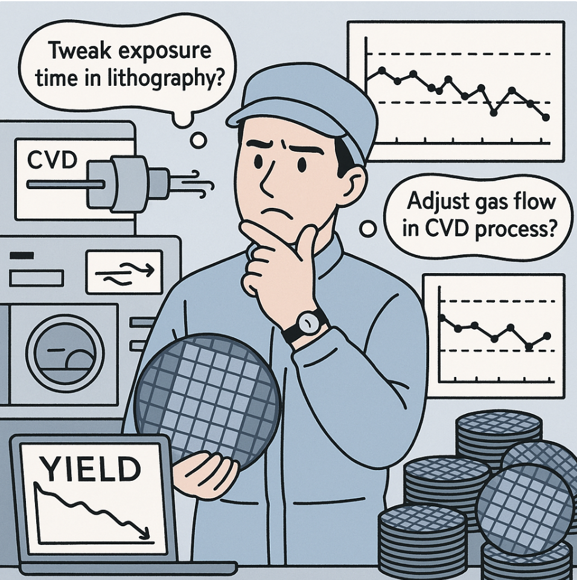
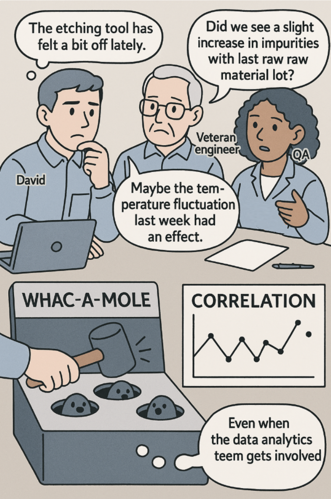

# Boosting Semiconductor Yield: From Guesswork to Guaranteed Wins with Allye

The world of semiconductor manufacturing is a relentless battle fought on a micron scale, where a 0.1% yield improvement can mean millions in revenue.

Meet David, a process engineer staring down a familiar problem. The yield for a flagship product is stuck, stubbornly refusing to hit its 95% target. For the past week, it's been trending downwards, and the root cause is a mystery. Spread before him are endless sensor data logs from dozens of process steps and a tangled web of Statistical Process Control (SPC) charts. There’s a mountain of data, but no clear, confident answer on where to intervene.

<p align="center">
  
</p>

"Should we tweak the exposure time in lithography?" "Or maybe it's the gas flow in the CVD process, like the senior tech suggested..."

Testing each hypothesis means altering a live production line and waiting days for results, all while defective wafers continue to pile up. It's a costly process of fumbling in the dark.

---

## The Old Way: The Whac-A-Mole of Tuning and the Correlation Trap

When a problem arises, the traditional playbook kicks in.

David, quality assurance, and veteran engineers from each process stage gather for a marathon meeting. The discussion is driven by decades of collective experience and gut feeling.

*   "The etching tool has felt a bit off lately."
*   "Did we see a slight increase in impurities with the last raw material lot?"
*   "Maybe the temperature fluctuation in Cleanroom A last week had an effect."

These hypotheses are valuable, but they're just educated guesses. The team is forced into a slow, expensive game of "whac-a-mole," testing the "most likely" culprit first.

<p align="center">
  
</p>

Even when the data analytics team gets involved, traditional correlation analysis falls short. A report might show a correlation between "exposure time and defect rate," but is that the true *cause*? Or is it merely a "spurious correlation," where a third factor (like ambient temperature) is influencing both?

Correlation provides clues, but it's too weak a foundation to confidently commit engineering resources.

---

## The Allye Way: Illuminating the Bottleneck with Causal AI

Causal Inference is the technology that ends this cycle of guesswork. Allye puts this powerful analytical method into a no-code, intuitive workflow.

It provides a clear answer to the most critical question in a complex manufacturing process: "Which parameter, in which process step, will deliver the biggest boost to our yield?"

In this scenario, we use **Causal Forest**, a machine learning model, to identify the true bottleneck from a list of potential improvement initiatives.

| # | What You Do | Allye's Node |
|---|---|---|
| 1 | Load process and yield data. | **File** |
| 2 | Isolate the true impact of each process change. <br/>• Treatment = `Process_Change_X` <br/>• Outcome = `yield_rate` | **Causal Forest × 4** |
| 3 | Compare the impact of all initiatives to find the winner. | **Distributions, Box Plot** |

<p align="center">
  
</p>

*(Each Causal Forest analysis statistically removes the noise from other process and environmental factors, isolating the pure, causal effect of that one intervention.)*

---

## Practical Walk-Through: Finding Your Golden Parameter in 3 Steps

With Allye, this complex analysis takes just a few clicks.

### 1. Connect Your Data
First, drag and drop your CSV file containing data from the manufacturing line (process parameters, material lots, final yield rates, etc.) onto the Allye canvas using the **File** widget.

<p align="center">
  
</p>

### 2. Measure Causal Impact with Causal Forest
Next, place a **Causal Forest** node for each improvement idea you want to compare. Let’s compare four: Lithography, Etching, CVD, and Wafer Cleaning.

For each node, configure the following:
*   **Treatment**: The column indicating if the process change was applied (e.g., `etching_condition_A`)
*   **Outcome**: `yield_rate`
*   **Covariates**: All other factors that could influence the outcome (other key process parameters, temperature, humidity, material lot info, etc.)

<p align="center">
  
</p>
<small><i>Causal Forest — With this simple setup, Allye automatically controls for the effects of dozens of other variables to extract the *true impact* of your intervention.</i></small>

### 3. Compare Results, Pinpoint the Bottleneck
Finally, connect the output from the four Causal Forest nodes to a **Distributions** or **Box Plot** widget and hit "Execute."

---

## The Moment of Truth: One Chart to Light the Way

In minutes, Allye completes the analysis and delivers a stunningly simple answer.

```
Process Tweak          Avg. Yield Uplift      Priority
───────────────────────────────────────────────────────
Etching (Condition A)    +2.1% ± 0.2%         ★★★★☆
CVD (Condition B)        +1.5% ± 0.3%         ★★★☆☆
Lithography (Cond. C)    +0.4% ± 0.5%         ★☆☆☆☆
Cleaning (Condition D)   -0.2% ± 0.4%         ☆☆☆☆☆
```

The result is undeniable. **Etching Condition A** is the key to unlocking the current yield bottleneck. The lithography tweak, once a primary suspect, has a negligible impact. Worse, the proposed change to the cleaning process could actually *hurt* the yield.

David no longer has to guess. The data has illuminated the path forward.

---

## The Action Plan: The Data-Driven Path to Improvement

Armed with this clear insight, the team builds a swift action plan.

*   **Top Priority:** Concentrate engineering resources on rolling out "Etching Condition A" across all relevant production lines.
*   **Next in Line:** Plan a limited trial for "CVD Condition B" on specific product lots where it's predicted to be most effective, scheduling it for the next improvement cycle.
*   **On Hold:** Shelve the lithography and cleaning initiatives, saving valuable engineering hours and preventing a potential drop in yield.

---

## The Win: 2% Yield Growth in a Single Sprint

The results were immediate.

1.  **Action:** The new etching process was implemented.
2.  **Result:** In just one week, the fab's average yield jumped from 93.5% to **95.6%**, finally hitting the target.
3.  **Payback:** A root-cause analysis cycle that used to take months of trial-and-error was completed in a matter of days.

David and his team didn't just rely on experience; they used data-driven causality as a weapon to achieve results in the most efficient way possible.

---

### TL;DR

*   In complex process manufacturing, identifying "causation," not just "correlation," is the key to success.
*   Causal inference methods like Causal Forest can objectively identify the highest-impact bottleneck among many competing options.
*   Allye democratizes this advanced analysis with a no-code platform, empowering every engineer to make fast, confident, data-driven decisions.

**Stop wasting resources on guesswork. Find your next big win, hidden in your data, with Allye.** 