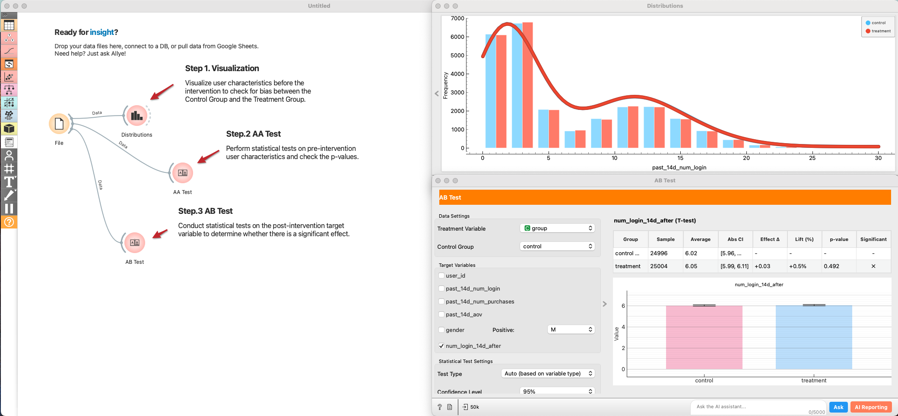
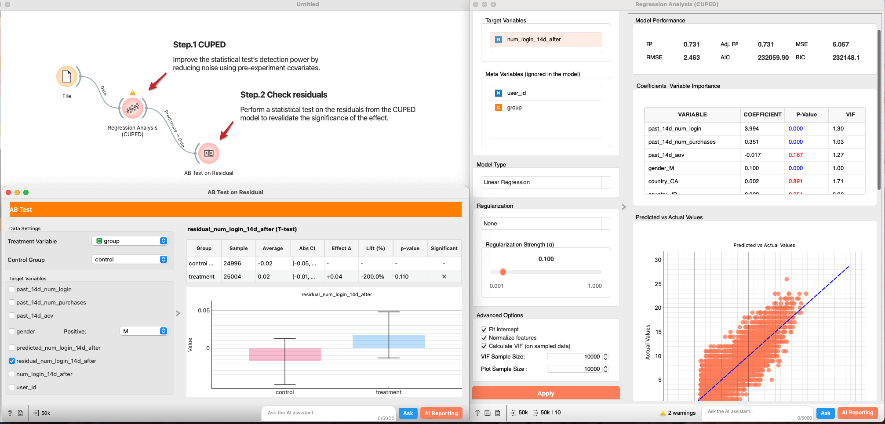
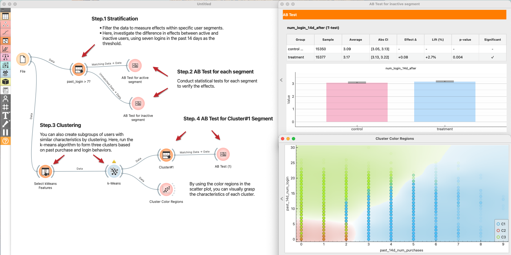

# AB Test Result Analysis

> _Your A/B test for the new product feature has concluded. Let’s analyze the data to determine whether there was a statistically significant effect._

最もよくある分析の１つが実験結果のデータ分析です。テクノロジー企業や研究機関では数多くの実験が行われます。
1回のトライアルですぐに想定した通りの結果が得られることはほとんどありません。多くの結果は"flat result"で思ったような結果が得られないものです。ただそんな時にこそ、データ分析の価値が発揮されます。
実験結果から新しい学び、ヒント、インスピレーションを得て、アイデアを推敲して初めて新しい発見やビジネスバリューが創造できます。
ここでは実験結果のデータをAllyeを使って、break downしていくフレームワークを学びましょう。

This tutorial walks through a full experiment analysis in Allye. You will:
- Validate randomization with an AA test and visual checks.
- Run the AB test, interpret effect size and p-values.
- Apply CUPED to reduce variance and increase power.
- Segment users via stratification and clustering to find heterogeneous effects.
- Use causal inference (Causal Tree and Causal Forest) to predict individual treatment effects (ITE or CATE: conditional average treatment effect) and explore drivers.

The examples below use the bundled synthetic AB/CUPED dataset (pre-period behavior and post-period outcome). Replace it with your own experiment data by pointing the `File` widget to your csv.

### Tutorial overview

Four workflows illustrate the analysis path:
1. **AA and AB tests** (visual balance check + hypothesis testing)
2. **CUPED** (variance reduction using pre-period covariates)
3. **Stratification and Clustering** (segment-level effects)
4. **Causal Tree and Forest** (heterogeneous treatment effect estimation)

You can recreate each flow with the widgets listed, or import the provided `.ows` examples if available.

### 1) AA Test (randomization check) & AB Test (hypothesis testing)

_First, perform an A/A test to visualize and statistically verify that there is no bias between the Control Group and the Treatment Group. Then, conduct statistical tests on the outcome variable to evaluate the effect size and check the p-value._

  

1. Add a `File` widget and load the experiment dataset.
2. Connect `File → Distributions` to visualize baseline variables (e.g., past logins, purchases, demographics). Look for overlap between control and treatment.
3. Connect `File → AB Test` and set it to an **AA Test** (test type = Auto/AA). Select several pre-period metrics as targets. Review:
   - Effect size (should be near zero if randomized well).
   - p-value (should be non-significant; a small p-value hints at allocation bias).
   If you see systematic differences, investigate assignment logic before trusting AB results.

4. Add another `AB Test` widget connected to `File`.
5. Pick the post-period target metric (e.g., num_login).
6. Interpret:
   - **Effect size** and confidence interval.
   - **p-value** and power. If p-value is borderline and power is low, consider variance reduction (next section).

### 2) CUPED (variance reduction)

_The A/B test results are flat! The team is disappointed. Here’s the first thing you should do to break through this situation: Try CUPED (Controlled Experiments Using Pre-Existing Data) to reduce variance and improve the statistical test’s detection power. CUPED is a method proposed by Meta researchers to reduce variance in A/B tests and improve statistical power (Deng et al., 2013). In a standard A/B test, even with random assignment, individual behavioral variability can be large, requiring a substantial sample size to detect experimental effects. CUPED addresses this issue by using pre-experiment data as covariates, based on the idea of reducing noise._

  

1. Connect `File → Regression Analysis`.
2. In `Features`, select pre-experiment covariates (e.g., past 14d logins/purchases). Set the post-period outcome as the target. Regularization: None (for a plain CUPED baseline), or add if you have many covariates.
3. From the regression output, send **Predictions → AB Test**.
4. Re-run the AB test on **residuals**. A smaller standard error and lower p-value indicates CUPED successfully reduced variance.

P-value was reduced but still not statistically significant. Let's move on to the next analysis.

### 3) Stratification and Clustering (segment effects)

_Unfortunately, the treatment effect is smaller than expected. Why is that? Where should we go next? It’s possible that the overall effect appears small because user segments that love the new feature and those that dislike it are mixed together. Let’s explore the data and identify differences in effect size across segments. Here, we stratify or cluster the data to segment users and estimate the effect size for each segment._

  

#### Stratification
1. `File → Select Rows` to create a segment, e.g., **active users** with `past_login_14d > 7`.
2. Send **Matching Data → AB Test** for the active segment.
3. Send **Unmatched Data → AB Test** for the inactive segment.
4. Compare effect sizes and p-values across segments.

#### Clustering
1. `File → Select Columns` to choose clustering features (e.g., past logins, purchases).
2. `Select Columns → k-Means` (k=3 as a start; normalize features).
3. `k-Means → Scatter Plot` to color users by cluster and understand their profiles.
4. `k-Means → Select Rows (Cluster#1) → AB Test` to estimate effects per cluster. Repeat for other clusters.
5. Summarize which clusters respond positively and which do not.

### 4) Causal inference for CATEs

_Is it difficult to find supporters of your new feature? It’s time to leverage the power of Causal AI. Causal Tree automatically identifies segments of supporters and haters from the given data. With Causal Forest, you can estimate the treatment effect for each individual user. Use these prediction results to gain a deeper understanding of your supporters’ personas._

  

1. **Causal Tree**: `File → Causal Tree`. The tree surfaces segments with high/low treatment effects automatically. Use splits to learn which attributes best separate responders and non-responders.
2. **Causal Forest**: `File → Causal Forest`. This estimates an CATE for each user. Send **Enhanced Data → Distributions** to visualize the CATE distribution and to `Regression Analysis` to relate CATEs to covariates.
3. Inspect:
   - Distribution of CATEs (how many users benefit vs. are harmed).
   - Top features associated with higher CATEs (personalization levers).
4. Use these insights to target future rollouts (e.g., enable the feature only for high-CATE segments).

### Tips and Good practice
- Keep the AA test and balance visualizations in your report to establish experiment validity.
- When applying CUPED, ensure pre-period covariates are measured **before** randomization and correlate with the outcome.
- For clustering, try several `k` values; pick one that is stable and interpretable.
- Always report sample sizes per segment/cluster to avoid over-interpreting small groups.
- For causal models, cross-check with simpler stratifications to confirm patterns are robust.
