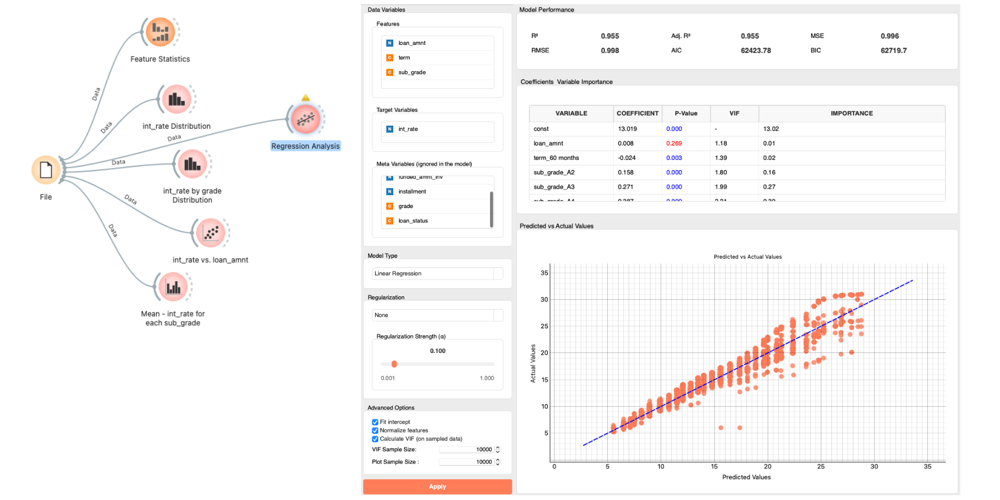

# Exploratory data analysis

> _Due to a system issue, there is a possibility that interest rates were incorrectly assigned for some customers. We need to identify which customers were affected and calculate the correct interest rate for each of them._

データサイエンティストになるとこのような分析の依頼をよく受けます。この問題の難しさは「correct interest rateというのが明確には定義されていない」という曖昧性によってもたらされます。
適切な金利の定義は何ですか？とstakeholderに聞くことは可能ですが、非技術者の彼らは（仮に彼らがそれを直感的には理解していたとしても）うまく言語化できないでしょう。だからこそあなたに依頼が来るのです。あなた自身がデータに基づいて、妥当でシンプルな論理を作り「適切な金利」を定義してStakeholderをconvinceする必要があります。
チュートリアルを進める前に自分だったらどう分析するか考えてみてください。

This guide walks through a practical EDA workflow in Allye using the sample LendingClub loan data. Below is a table summarizing the key variables and their meanings:

| Variable         | Description                                                                 |
|------------------|-----------------------------------------------------------------------------|
| loan_amnt        | Amount of loan requested by the customer                                    |
| term             | Loan term length (e.g., 36 or 60 months)                                    |
| int_rate         | Interest rate assigned to the loan                                          |
| installment      | Fixed monthly payment amount for the loan                                   |
| grade            | Creditworthiness category (A = best, G = worst)                             |
| sub_grade        | Sub-category of credit grade (e.g., A1, B2)                                 |
| loan_status      | Current status of the loan (e.g., fully paid, charged off, late)            |
| funding amounts  | Amount of loan actually funded or received                                  |

## 1. Understand the overall structure

1. Connect `File → Feature Statistics` to summarize missing values, min/max, and outliers. Confirm there are no impossible values (negative amounts, rates above 100, etc.).  
2. Add `Distributions` to view the shape of `int_rate` overall, split by `grade` and `term`; you should see lower rates for better grades. 
3. Use `Scatter Plot` to view `int_rate` vs. `loan_amnt`, coloring by `term`. Within each grade segment, there is no clear correlation between `loan_amnt` and `int_rate`.
4. Use `Bar Plot` to view `Mean - int_rate` for each `sub_grade`; you should see monotonic increase in rates from grade `A1` to `G5`.
5. Take notes on the pattern you found.

  

## 2. Define a fair interest rate model

金利が絶対値として30%を超えるものがあるが、どうやらこれは低い信頼グレード、長い返済期間に起因するものであるから、不適切な金利であると断定はできない。
金利は明らかに複数の要因によって決められているので、金利の適切性もまた複合的な要因の中で総合的に評価されなければならない。A1グレードの顧客が短い返済期間で契約しているのにも関わらず、高い金利がassignされているなどの「相関の崩れ」が解決の糸口になる可能性がある。
まずは、金利の決定要因について仮説を整理してからデータによる検証を行おう。

1. 金利の決定要因についてノートにdiagramを書こう。正の相関と思われる関係について緑のedge, 負の相関と思われる関係について赤のedgeでノードを繋ぐ。

  

2. 低いグレードの顧客に対して高い金利を付与することは直感的・常識的に自然であるし、長い返済期間は貸し手側のリスクを増大させるから、金利が上がることも直感的である。ローン金額と金利については明確な関係は確認できなかったが、直感的な仮説としては金額が大きければ、貸し倒れリスクは大きいから高い金利を付与したくなると予想される。
3. 当然他の要因も想像できるが、いくつかの要因、例えば借り手の雇用形態、年収などはsub_gradeで説明されているようにも思える。一方でマーケットの経済状況などの要因（例：FRBの金利など）は今のデータでは説明されていない。これらは未観測の要因として定義しよう。

## 3. Build a regression model and test your hypothesis

先ほど想定した仮説は、線形回帰モデルといって、統計的解析の最も実践的かつ代表的なフレームワークです。Allyeでは`Regression Analysis` widgetで分析が実行できます。早速モデルを作って先ほどのモデルの妥当性を検証しましょう。

1. Send the data to `Regression Analysis` with `int_rate` as the target and features such as `loan_amnt`, `term`, and `sub_grade`. Start with no regularization.

  

2. Review model output to test your hypothesis (better grades → lower predicted rate; longer terms → higher predicted rate).
 - 各変数のp値を確認する。先ほど想定した相関関係が統計的に有意かどうか確認しよう。
 - gradeはそれぞれで有意な相関を持っており、グレードが悪くなると金利が上がる関係性が確認できます。loan_amntはp-value > 0.05で有意な相関を持っていません。termは予想に反して負の相関を持っていますが影響としては小さく、gradeが支配的な要因です。
 - R2とPrediction vs Actual Scatter plotを確認する。 - あなたの仮説が十分金利を説明できているのか確認しよう。R2が0.955の時、金利の決定要因の95%は、今の説明変数から説明できていると解釈して良い。残りの4.5%は今の説明変数で説明できない他の要因によって決定されている。ただしgradeとtermでその大半が説明されていると言って良い。
3. p値を確認すると共に、先ほどのダイアグラムをアップデートしましょう。loan_amntは金利に対して有意な関係を持っていないので、ダイアグラムから削除しよう。

## 4. Residual Analysis & List customers likely affected

  

1. Add `Select Rows` with a rule like `abs(rate_gap) > 1.5` or `abs(residual) > 1.5` (percentage points) to isolate suspicious records.
2. Pipe the filtered data to `Sort` by descending `abs(rate_gap)` so the biggest issues surface first.
3. Keep columns that matter for remediation: `grade`, `sub_grade`, `term`, `loan_amnt`, `int_rate`, `expected_rate`, `rate_gap`, `residual`, `loan_status`.
4. Export the result with `Save` or `Report` so operations can correct rates and contact affected customers.
5. Repeat after adjustments to confirm the distribution of `rate_gap` collapses around zero and no new anomalies appear.

## 5. Conclusion & Proposal

